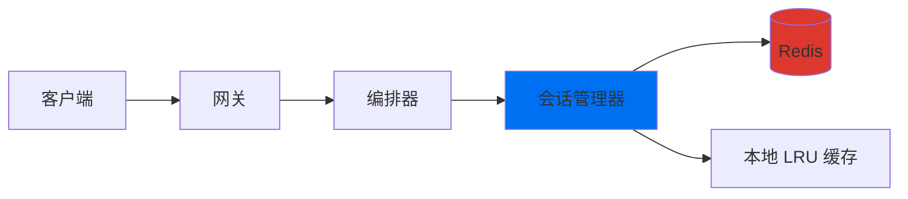
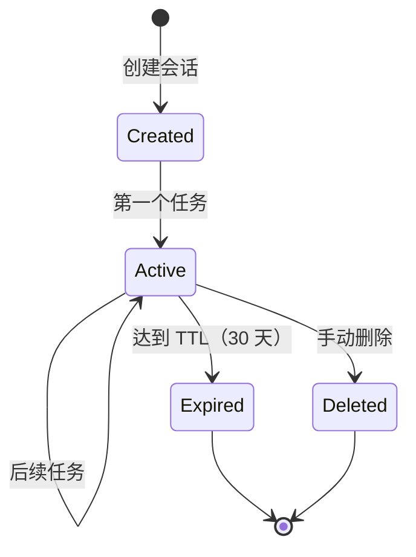

## 概述

Shannon 中的会话支持**上下文连续性**跨多个任务提交，允许智能体：
- 记住之前的对话
- 基于早期结果构建
- 维护工作状态
- 跟踪累积成本
- 保留智能体特定记忆

会话存储在 **Redis** 中，具有自动过期和 LRU 缓存以提高性能。

## 架构



**关键特性**：
- **Redis 支持**：持久化存储，带熔断器保护
- **本地缓存**：本地缓存 10,000 个会话以提高性能
- **TTL 管理**：默认 30 天过期（可配置）
- **历史修剪**：每个会话保留最近的 500 条消息
- **多租户**：按租户 ID 隔离会话
- **安全性**：防止跨用户会话劫持

## 会话结构

```json
{
  "id": "sess-550e8400-e29b-41d4-a716-446655440000",
  "user_id": "user-123",
  "tenant_id": "tenant-abc",
  "created_at": "2024-10-27T10:00:00Z",
  "updated_at": "2024-10-27T10:15:00Z",
  "expires_at": "2024-11-26T10:00:00Z",
  "metadata": {
    "name": "Q4 分析",
    "project": "quarterly-review",
    "tags": ["finance", "reporting"]
  },
  "context": {
    "loaded_datasets": ["sales_q4.csv"],
    "current_analysis": "revenue_trends",
    "preferences": {
      "output_format": "markdown"
    }
  },
  "history": [
    {
      "id": "msg-001",
      "role": "user",
      "content": "加载 Q4 销售数据",
      "timestamp": "2024-10-27T10:00:00Z",
      "tokens_used": 120,
      "cost_usd": 0.0018
    },
    {
      "id": "msg-002",
      "role": "assistant",
      "content": "已加载 Q4 销售数据，包含 15,000 条记录...",
      "timestamp": "2024-10-27T10:00:15Z",
      "tokens_used": 450,
      "cost_usd": 0.0068
    }
  ],
  "agent_states": {
    "data-analyst": {
      "agent_id": "data-analyst",
      "last_active": "2024-10-27T10:15:00Z",
      "state": "analyzing",
      "memory": {
        "current_dataset": "sales_q4",
        "filters_applied": ["region:west"]
      },
      "tools_used": ["csv_loader", "pandas_query"],
      "tokens_used": 3200
    }
  },
  "total_tokens_used": 5420,
  "total_cost_usd": 0.0814
}
```

## API 端点

### 创建会话

**端点**：`POST /api/v1/sessions`（实现时）

**请求**：
```json
{
  "metadata": {
    "name": "数据分析会话",
    "project": "Q4 分析",
    "tags": ["finance"]
  }
}
```

**响应**：
```json
{
  "session_id": "sess-550e8400-e29b-41d4-a716-446655440000",
  "user_id": "user-123",
  "created_at": "2024-10-27T10:00:00Z",
  "expires_at": "2024-11-26T10:00:00Z"
}
```

### 使用会话提交任务

在提交任务时使用 `session_id` 参数：

```bash
curl -X POST http://localhost:8080/api/v1/tasks \
  -H "Content-Type: application/json" \
  -H "X-API-Key: sk_test_123456" \
  -d '{
    "query": "分析 Q4 销售趋势",
    "session_id": "sess-550e8400-e29b-41d4-a716-446655440000",
    "context": {
      "dataset": "sales_q4.csv"
    }
  }'
```

**自动会话创建**：
如果未提供 `session_id`，Shannon 会自动创建新会话。

### 获取会话上下文

会话自动从任务执行中累积上下文：
- 任务查询和响应
- 工具调用和结果
- 智能体推理步骤
- 累积 token 使用和成本

## 会话生命周期



**状态**：
1. **Created**：会话已初始化，尚无任务
2. **Active**：会话有任务，上下文正在累积
3. **Expired**：达到 TTL（默认 30 天），自动删除
4. **Deleted**：手动删除

**TTL 配置**：
```yaml
# config/shannon.yaml
session:
  ttl: 720h  # 30 天（默认）
  max_history: 500  # 每个会话的消息数
  cache_size: 10000  # 本地缓存大小
```

## 使用会话

### Python SDK

```python
from shannon import ShannonClient

client = ShannonClient(http_endpoint="http://localhost:8080")

# 自动会话创建
handle1 = client.submit_task(
    query="加载 Q4 销售数据",
    # 无 session_id - Shannon 自动创建一个
)

# 重用第一个任务的会话 ID
session_id = handle1.session_id

# 后续任务使用同一会话
handle2 = client.submit_task(
    query="收入最高的月份是什么？",  # 具有先前任务的上下文
    session_id=session_id
)

handle3 = client.submit_task(
    query="创建摘要报告",  # 基于所有先前的任务构建
    session_id=session_id
)
```

### 多轮对话

```python
# 数据分析工作流
session_id = None

# 步骤 1：加载数据
result1 = client.submit_and_wait(
    query="加载 Q4 销售 CSV 并描述其结构"
)
session_id = result1['session_id']

# 步骤 2：分析（智能体记住数据）
result2 = client.submit_and_wait(
    query="按地区计算总收入",
    session_id=session_id
)

# 步骤 3：可视化（智能体记住数据和分析）
result3 = client.submit_and_wait(
    query="创建按地区收入的条形图",
    session_id=session_id
)

# 步骤 4：生成报告（智能体拥有完整上下文）
result4 = client.submit_and_wait(
    query="基于分析编写执行摘要",
    session_id=session_id
)
```

## 会话上下文

### 存储的内容

**对话历史**（最多 500 条消息）：
```python
{
  "history": [
    {"role": "user", "content": "加载 Q4 数据", "tokens_used": 120},
    {"role": "assistant", "content": "已加载 15,000 条记录...", "tokens_used": 450},
    {"role": "user", "content": "显示热门产品", "tokens_used": 80},
    {"role": "assistant", "content": "前 10 个产品...", "tokens_used": 620}
  ]
}
```

**工作上下文**：
```python
{
  "context": {
    "loaded_files": ["sales_q4.csv"],
    "current_analysis": "revenue_by_region",
    "intermediate_results": {
      "total_revenue": 1250000.50,
      "top_region": "west"
    },
    "user_preferences": {
      "format": "markdown",
      "verbosity": "detailed"
    }
  }
}
```

**智能体记忆**（每个智能体）：
```python
{
  "agent_states": {
    "data-analyst": {
      "state": "analyzing",
      "memory": {
        "dataset_schema": {...},
        "applied_filters": ["region:west"],
        "cached_results": {...}
      },
      "tools_used": ["csv_loader", "pandas", "matplotlib"]
    }
  }
}
```

### 上下文限制

- **最大历史**：500 条消息（自动修剪最旧的）
- **会话 TTL**：30 天（可配置）
- **缓存大小**：内存中 10,000 个会话
- **存储**：Redis，带自动清理

**历史修剪**：
当添加第 501 条消息时，删除最旧的消息（FIFO 队列）。

## 最佳实践

### 1. 为多步骤工作流使用会话

```python
# 好：相同会话中的相关任务
session_id = "sess-analysis-001"

client.submit_task("加载数据", session_id=session_id)
client.submit_task("计算统计", session_id=session_id)
client.submit_task("生成报告", session_id=session_id)
```

```python
# 坏：同一会话中的不相关任务
client.submit_task("分析销售", session_id=session_id)
client.submit_task("写一首诗", session_id=session_id)  # ❌ 污染上下文
```

### 2. 提供描述性元数据

```python
# 好：描述性元数据
client.create_session(metadata={
    "name": "Q4 财务分析",
    "project": "quarterly-review",
    "department": "finance",
    "tags": ["sales", "reporting", "q4-2024"]
})
```

### 3. 处理会话过期

```python
try:
    result = client.submit_task(
        query="继续分析",
        session_id=old_session_id
    )
except SessionExpiredError:
    # 会话已过期（>30 天），创建新会话
    new_session = client.create_session(
        metadata={"resumed_from": old_session_id}
    )
    result = client.submit_task(
        query="开始新分析",
        session_id=new_session.id
    )
```

### 4. 成本跟踪

```python
# 获取会话以检查累积成本
session = client.get_session(session_id)

print(f"总 token: {session['total_tokens_used']}")
print(f"总成本: ${session['total_cost_usd']:.4f}")

if session['total_cost_usd'] > 1.0:
    print("警告: 会话成本超过预算")
```

## 用例

### 1. 数据分析工作流

```python
session = client.create_session(name="销售分析")

# 加载和探索
client.submit_task("从 Q4 加载销售数据", session_id=session.id)
client.submit_task("显示列名和数据类型", session_id=session.id)

# 分析
client.submit_task("按产品类别计算收入", session_id=session.id)
client.submit_task("查找收入前 10 的产品", session_id=session.id)

# 可视化
client.submit_task("创建热门产品条形图", session_id=session.id)

# 报告
client.submit_task("编写执行摘要", session_id=session.id)
```

### 2. 研究助手

```python
session = client.create_session(name="AI 研究")

# 渐进式研究
client.submit_task("什么是 GPT-4？", session_id=session.id)
client.submit_task("它与 Claude 相比如何？", session_id=session.id)
client.submit_task("定价差异是什么？", session_id=session.id)
client.submit_task("哪个更适合代码生成？", session_id=session.id)
```

### 3. 代码审查会话

```python
session = client.create_session(name="PR 审查")

# 审查组件
client.submit_task("审查 authentication.py 的安全问题", session_id=session.id)
client.submit_task("检查是否符合我们的安全指南", session_id=session.id)
client.submit_task("建议改进", session_id=session.id)
client.submit_task("生成审查摘要", session_id=session.id)
```

## 性能考虑

- **本地缓存**：前 10,000 个会话缓存在内存中
- **缓存命中率**：活跃会话通常为 85-95%
- **Redis 延迟**：缓存未命中时为 1-5ms
- **历史修剪**：自动，无性能影响
- **过期**：每 5 分钟后台清理一次

**指标**：
```
sessions_created_total            # 计数器
sessions_cache_hits_total        # 计数器
sessions_cache_misses_total      # 计数器
sessions_cache_size              # 仪表
sessions_expired_total           # 计数器
```

## 安全性

### 会话隔离

- **用户作用域**：用户只能访问自己的会话
- **租户作用域**：强制执行多租户隔离
- **劫持防护**：无法跨用户重用会话 ID

```go
// 自动安全检查
if existingSession.UserID != requestingUser {
    // 改为生成新会话 ID
    return createNewSession()
}
```

### 认证

会话遵循与任务相同的认证：
- API 密钥认证
- JWT bearer token
- 每用户授权

## 故障排除

### 会话未找到

**错误**：`session not found`

**原因**：
- 会话已过期（>30 天）
- 会话被手动删除
- 无效的会话 ID

**解决方案**：
```python
# 使用前检查会话是否存在
try:
    session = client.get_session(session_id)
except SessionNotFoundError:
    # 创建新会话
    session = client.create_session(name="新会话")
```

### 上下文未保留

**问题**：智能体不记得之前的任务

**原因**：
- 使用了不同的会话 ID
- 会话已过期
- 历史被修剪（>500 条消息）

**解决方案**：
```python
# 验证会话 ID 一致性
print(f"使用会话: {session_id}")

# 检查历史长度
session = client.get_session(session_id)
print(f"历史长度: {len(session['history'])}")
```

### 高内存使用

**问题**：会话管理器使用过多内存

**原因**：
- 缓存了太多会话
- 大型元数据对象
- 长对话历史

**解决方案**：
```yaml
# config/shannon.yaml
session:
  cache_size: 5000  # 从 10000 减少
  max_history: 250   # 从 500 减少
```

## 相关主题

<CardGroup cols={2}>
  <Card title="提交任务" icon="plus" href="/cn/api/endpoints/submit-task">
    使用会话提交任务
  </Card>
  <Card title="列出任务" icon="list" href="/cn/api/endpoints/list-tasks">
    按会话查看任务
  </Card>
  <Card title="成本控制" icon="dollar" href="/cn/quickstart/concepts/cost-control">
    跟踪会话成本
  </Card>
  <Card title="流式传输" icon="stream" href="/cn/quickstart/concepts/streaming">
    流式传输会话事件
  </Card>
</CardGroup>
