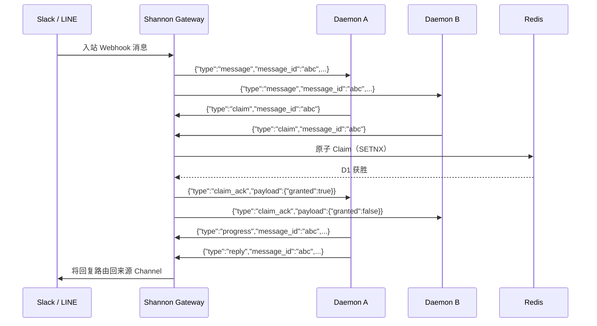

## 概述

Daemon WebSocket API 为 Daemon 客户端提供持久的双向连接，用于实时接收和处理消息。与 REST API 的轮询模式不同，WebSocket 连接允许 Shannon 将传入消息（来自 Slack、LINE 或系统事件）直接推送到已连接的 Daemon。

该协议的核心是**基于 Claim 的消息分发**模型：Shannon 将消息广播到所有符合条件的连接，Daemon 竞争获取独占处理权后再进行回复。

## Endpoint

```
GET /v1/ws/messages
```

使用标准认证 Header 升级为 WebSocket 连接。

## 认证

认证在 WebSocket 升级**之前**执行，使用与 REST Endpoint 相同的中间件。

| 方式 | Header |
|------|--------|
| JWT Bearer | `Authorization: Bearer <token>` |
| API Key | `X-API-Key: <key>` |

<CodeGroup>
```bash websocat
websocat "ws://localhost:8080/v1/ws/messages" \
  -H "Authorization: Bearer <token>"
```

```javascript JavaScript
const ws = new WebSocket("ws://localhost:8080/v1/ws/messages", {
  headers: {
    "Authorization": "Bearer <token>"
  }
});
```

```python Python
import websockets

async with websockets.connect(
    "ws://localhost:8080/v1/ws/messages",
    additional_headers={"Authorization": "Bearer <token>"}
) as ws:
    async for message in ws:
        print(message)
```
</CodeGroup>

## 连接生命周期

<Steps>
  <Step title="HTTP 升级">
    客户端发送 `GET /v1/ws/messages` 并携带认证 Header。服务端验证凭据后进行协议升级。
  </Step>
  <Step title="WebSocket 建立">
    服务端升级为 WebSocket 连接（gorilla/websocket，4KB 读写缓冲区，CheckOrigin 允许所有来源）。
  </Step>
  <Step title="连接确认">
    服务端发送 `connected` 消息确认连接就绪。
    ```json
    {"type": "connected"}
    ```
  </Step>
  <Step title="双向消息通信">
    双方交换 JSON 消息。服务端分发传入消息；客户端执行 Claim、处理并回复。
  </Step>
  <Step title="心跳保活">
    服务端每 **20 秒**发送 WebSocket Ping。客户端必须在 **60 秒**内响应 Pong，否则连接将被关闭。
  </Step>
</Steps>

### 连接参数

| 参数 | 值 |
|------|-----|
| Ping 间隔 | 20s |
| Pong 超时 | 60s |
| 最大消息大小 | 64 KB |
| 写入超时 | 10s |
| 读写缓冲区 | 4 KB |

## 消息信封

所有消息（双向）遵循统一的信封格式：

```json
{
  "type": "<message_type>",
  "message_id": "<uuid>",
  "payload": {}
}
```

| 字段 | 类型 | 描述 |
|------|------|------|
| `type` | string | 消息类型标识符 |
| `message_id` | string (UUID) | 唯一消息标识符（`connected` 和 `disconnect` 消息中省略） |
| `payload` | object | 特定类型的数据 |

## 服务端到客户端消息

### `connected`

WebSocket 连接建立后立即发送。

```json
{
  "type": "connected"
}
```

### `message`

分发给客户端处理的入站消息。这是主要的消息类型，携带来自 Channel Webhook（Slack、LINE）或系统事件的消息。

```json
{
  "type": "message",
  "message_id": "a1b2c3d4-e5f6-7890-abcd-ef1234567890",
  "payload": {
    "channel": "slack",
    "thread_id": "C07ABCDEF-1234567890.123456",
    "sender": "user@example.com",
    "text": "Hello, can you help me?",
    "agent_name": "research-agent",
    "timestamp": "2026-03-10T10:00:00Z"
  }
}
```

#### MessagePayload 字段

| 字段 | 类型 | 描述 |
|------|------|------|
| `channel` | string | 来源 Channel 类型：`"slack"`、`"line"` 等 |
| `thread_id` | string | 会话线程标识符 |
| `sender` | string | 发送者标识（邮箱、用户 ID 等） |
| `text` | string | 消息内容 |
| `agent_name` | string | 处理消息的目标 Agent |
| `timestamp` | string (ISO 8601) | 消息接收时间 |

### `system`

来自 Shannon 的系统级通知。

```json
{
  "type": "system",
  "message_id": "f7e8d9c0-b1a2-3456-7890-abcdef123456",
  "payload": {
    "text": "Agent research-agent is now available"
  }
}
```

### `claim_ack`

对客户端 `claim` 请求的响应，指示 Claim 是否成功。

```json
{
  "type": "claim_ack",
  "message_id": "a1b2c3d4-e5f6-7890-abcd-ef1234567890",
  "payload": {
    "granted": true
  }
}
```

| 字段 | 类型 | 描述 |
|------|------|------|
| `granted` | boolean | `true` 表示该客户端获得了独占处理权 |

## 客户端到服务端消息

### `claim`

请求独占处理某条消息。同一消息只有一个客户端能成功 Claim。

```json
{
  "type": "claim",
  "message_id": "a1b2c3d4-e5f6-7890-abcd-ef1234567890"
}
```

### `progress`

在处理已 Claim 的消息时发送心跳/进度更新。这会延长 Claim 的有效期，防止超时。

```json
{
  "type": "progress",
  "message_id": "a1b2c3d4-e5f6-7890-abcd-ef1234567890",
  "payload": {
    "status": "processing",
    "percent": 50
  }
}
```

### `reply`

发送已 Claim 消息的处理结果。Shannon 会将其路由回来源 Channel（Slack、LINE 等）。

```json
{
  "type": "reply",
  "message_id": "a1b2c3d4-e5f6-7890-abcd-ef1234567890",
  "payload": {
    "channel": "slack",
    "thread_id": "C07ABCDEF-1234567890.123456",
    "text": "Here is my response...",
    "format": "text"
  }
}
```

#### ReplyPayload 字段

| 字段 | 类型 | 描述 |
|------|------|------|
| `channel` | string | 目标 Channel 类型 |
| `thread_id` | string | 回复的会话线程 |
| `text` | string | 响应内容 |
| `format` | string | 输出格式：`"text"` 或 `"markdown"` |

### `disconnect`

优雅地关闭连接。

```json
{
  "type": "disconnect"
}
```

## Claim 流程

Claim 流程是分布式消息处理的核心协议。它确保即使多个 Daemon 同时连接，每条消息也只由一个 Daemon 处理。



<Steps>
  <Step title="消息分发">
    当消息到达时（通过 Channel Webhook 或系统），Gateway 将其分发给按 `tenant:user` 索引的**所有**符合条件的 WebSocket 连接。
  </Step>
  <Step title="Claim 竞争">
    每个想要处理该消息的 Daemon 发送包含 `message_id` 的 `claim` 请求。
  </Step>
  <Step title="原子决议">
    Gateway 在 Redis 中原子地执行 Claim（`SETNX`）。第一个客户端获胜；其他客户端收到 `{"granted": false}`。
  </Step>
  <Step title="消息处理">
    获胜的 Daemon 处理消息。可以选择发送 `progress` 消息来延长 Claim 有效期并报告处理进度。
  </Step>
  <Step title="发送回复">
    Daemon 发送包含处理结果的 `reply`。Shannon 将其路由回来源 Channel。
  </Step>
</Steps>

### Claim 元数据

当消息被 Claim 时，Gateway 在 Redis 中存储元数据，**TTL 为 60 秒**：

| 字段 | 描述 |
|------|------|
| `conn_id` | WebSocket 连接标识符 |
| `channel_id` | 来源 Channel ID |
| `channel_type` | Channel 类型（`slack`、`line` 等） |
| `thread_id` | 会话线程 ID |
| `reply_token` | 平台特定的回复 Token（如适用） |
| `timestamp` | Claim 时间戳 |
| `workflow_id` | 关联的 Temporal Workflow ID（如适用） |
| `workflow_run_id` | 关联的 Temporal Workflow Run ID（如适用） |

<Note>
待处理消息元数据的 **TTL 为 90 秒**。如果已 Claim 的消息在 60 秒内未回复，Claim 将过期，消息可被重新分发。
</Note>

## Hub 架构

WebSocket Hub 管理所有活跃连接，采用以下路由策略：

- **Tenant-User 索引** — 连接按 `"tenant:user"` 键索引，实现定向分发
- **线程粘性路由** — 来自同一线程（`"channel_type:thread_id"`）的消息尽可能路由到同一连接
- **Redis 支持的 Claim** — 分布式 Claim 决议确保多个 Gateway 实例间的一致性

## 回复路由

当 Gateway 收到 Daemon 的 `reply` 时，根据 Claim 元数据路由响应：

1. **Workflow 回复** — 如果 Claim 元数据中存在 `workflow_id`，Gateway 会通过 Signal 通知关联的 Temporal Workflow
2. **Channel 回复** — 否则，回复被路由回来源 Channel（Slack 消息、LINE Push 消息等）

## 错误处理

| 场景 | 行为 |
|------|------|
| 升级时认证失败 | 返回 HTTP 401，WebSocket 未建立 |
| 消息超过 64 KB | 连接关闭 |
| Pong 超时（60s） | 服务端关闭连接 |
| 写入超时（10s） | 消息丢弃，连接可能关闭 |
| Claim 过期（60s TTL） | 消息可被重新分发 |
| 无效 JSON | 消息被忽略 |

## 下一步

<CardGroup cols={2}>
  <Card title="Channels API" icon="plug" href="/cn/api/rest/channels">
    管理 Slack 和 LINE 的 Channel 集成
  </Card>
  <Card title="流式" icon="wave-pulse" href="/cn/api/rest/streaming">
    通过 Server-Sent Events 进行任务流式传输
  </Card>
</CardGroup>
