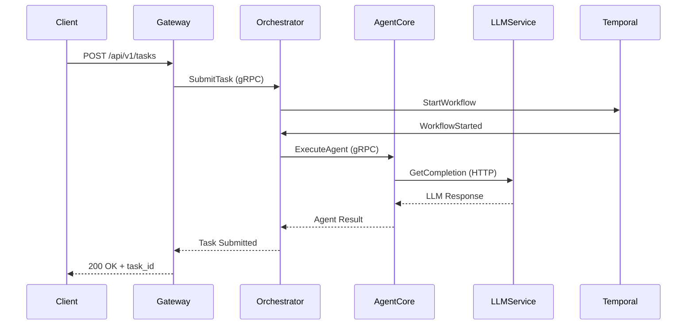

## 系统组件

<Note>
本页面作为第二阶段文档扩展的一部分正在建设中。
</Note>

Shannon 作为分布式系统构建，包含多个专业化组件：

## 核心服务

### Gateway (Go)
- **端口**: 8080
- **角色**: REST API 网关、身份验证、速率限制
- **技术栈**: Go, Chi router
- **扩展方式**: 无状态，水平扩展

### Orchestrator (Go)
- **端口**: 50052 (gRPC), 8081 (admin)
- **角色**: 任务协调、工作流管理
- **技术栈**: Go, Temporal, gRPC
- **扩展方式**: 通过 Temporal 工作流实现有状态扩展

### Agent Core (Rust)
- **端口**: 50051 (gRPC)
- **角色**: Agent 执行、工具调用、WASI 沙箱
- **技术栈**: Rust, Wasmtime, gRPC
- **扩展方式**: 水平扩展

### LLM Service (Python)
- **端口**: 8000
- **角色**: LLM 提供商网关、提示词管理
- **技术栈**: Python, FastAPI, litellm
- **扩展方式**: 水平扩展

<Note>
LLM Service 注意事项:

- GPT‑5 模型通过 OpenAI Responses API 进行路由，服务器优先使用 `output_text`（如果存在）。这可以避免聊天响应返回结构化内容时出现空结果。
- `/agent/query` HTTP 端点需要 `allowed_tools`:
  - 忽略/`null`: 角色预设可能会启用工具
  - `[]`: 禁用工具
  - `["name", …]`: 只有列出的工具可用（内置、OpenAPI、按注册表名称的 MCP）
</Note>

### Desktop App (Tauri + Next.js)
- **端口**: —（原生应用，通过 Gateway :8080 访问后端）
- **角色**: 实时监控界面（任务、运行、事件）
- **技术栈**: Next.js、Tauri、SSE/WebSocket
- **扩展方式**: 客户端侧；后端服务独立扩展

## 数据存储

### PostgreSQL
- **端口**: 5432
- **用途**: 任务元数据、事件、会话、用户
- **架构**: 约 15 个表（task_executions, event_logs, sessions 等）

### Redis
- **端口**: 6379
- **用途**: 会话缓存、发布/订阅、速率限制
- **持久化**: 可选（RDB/AOF）

### Qdrant
- **端口**: 6333
- **用途**: 向量嵌入、语义内存
- **集合**: 按租户隔离

### Temporal
- **端口**: 7233 (gRPC), 8088 (UI)
- **用途**: 持久化工作流执行
- **持久化**: PostgreSQL 后端

## 组件交互

## 即将推出

每个组件的详细文档，包括：
- 架构图
- API 接口
- 配置选项
- 扩展指南
- 故障排除提示

查看[架构概览](/cn/architecture/overview)了解高层系统设计。
