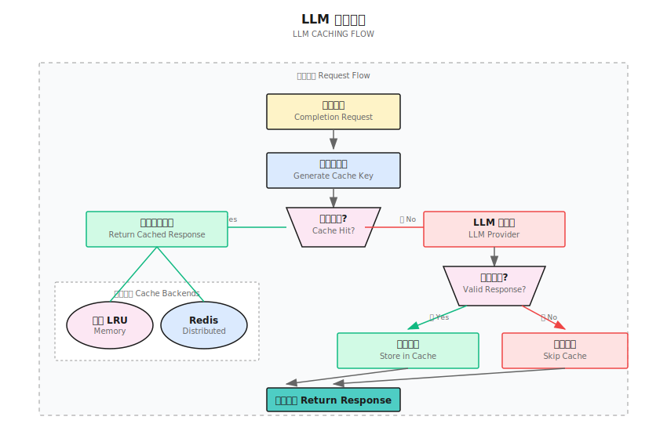

## 概述

Shannon 实现了多层 LLM 响应缓存系统，为重复或相似的查询提供显著的成本节省和延迟降低。缓存系统支持内存和 Redis 两种后端。

## 架构



## 缓存后端

### 内存缓存（默认）

默认缓存后端使用带自动淘汰的 LRU（最近最少使用）字典。

**特性：**
- 零外部依赖
- 快速查找（平均 O(1)）
- 容量达到上限时自动淘汰
- 命中率跟踪

**限制：**
- 不跨实例共享
- 服务重启时丢失

### Redis 缓存

对于生产部署，Redis 提供跨多个实例的分布式缓存。

**特性：**
- 跨所有 LLM 服务实例分布
- 持久化存储
- 自动 TTL 过期
- 支持 Redis Sentinel/Cluster 高可用

**配置：**
```bash
# 方式 1：完整 URL
export REDIS_URL="redis://localhost:6379"

# 方式 2：单独组件
export REDIS_HOST="redis"
export REDIS_PORT="6379"
export REDIS_PASSWORD="your-password"  # 可选
```

## 配置

### 全局设置

在 `config/models.yaml` 中配置缓存：

```yaml
prompt_cache:
  enabled: true
  ttl_seconds: 3600           # 默认 1 小时
  max_cache_size_mb: 2048     # 内存限制
  similarity_threshold: 0.95   # 语义相似度阈值
```

| 参数 | 默认值 | 描述 |
|-----------|---------|-------------|
| `enabled` | `true` | 缓存主开关 |
| `ttl_seconds` | `3600` | 默认缓存条目生存时间 |
| `max_cache_size_mb` | `2048` | 最大缓存大小（MB） |
| `similarity_threshold` | `0.95` | 语义匹配阈值 |

### 按请求覆盖

在单个请求上覆盖缓存行为：

```python
from shannon import Client

client = Client()
response = client.complete(
    messages=[{"role": "user", "content": "解释量子计算"}],
    cache_key="quantum-intro-cn",  # 自定义缓存键
    cache_ttl=7200                  # 此请求 2 小时
)

# 检查响应是否来自缓存
if response.cached:
    print("响应来自缓存")
```

## 缓存键生成

缓存键根据请求参数确定性生成：

```python
key_data = {
    "messages": messages,
    "model_tier": model_tier,
    "model": model,
    "temperature": temperature,
    "max_tokens": max_tokens,
    "functions": functions,
    "seed": seed,
}
# 排序后 JSON 的 SHA-256 哈希
```

### 包含的参数
- 消息内容和角色
- 模型层级和具体模型
- 温度和 max_tokens
- 函数定义
- 随机种子

### 排除的参数
- 流式标志（流式不缓存）
- 会话/任务 ID（缓存基于请求）

## 缓存规则

### 何时缓存响应

响应在以下情况被缓存：
- 全局启用缓存
- 请求为非流式
- 响应有非空内容或有 function_call
- 完成原因不是 "length"（截断）或 "content_filter"
- JSON 模式下：内容是有效的 JSON 对象

### 何时不缓存响应

<Warning>
以下响应永远不会被缓存以确保质量：
- 流式响应
- 截断的响应（finish_reason: "length"）
- 被内容过滤的响应
- 没有 function call 的空响应
- 严格 JSON 模式下的无效 JSON
</Warning>

## 缓存验证

在返回缓存响应之前，Shannon 会验证：

1. **完成原因检查**：跳过截断或过滤的响应
2. **JSON 模式验证**：确保 JSON 模式下是有效的 JSON 对象
3. **内容存在性**：要求非空内容或 function_call

```python
def _should_cache_response(self, request, response) -> bool:
    # 检查 finish_reason
    fr = (response.finish_reason or "").lower()
    if fr in {"length", "content_filter"}:
        return False

    # 严格 JSON 模式
    if is_strict_json_mode(request):
        try:
            obj = json.loads(response.content or "")
            if not isinstance(obj, dict):
                return False
        except:
            return False

    # 要求内容或 function_call
    if not response.content.strip() and not response.function_call:
        return False

    return True
```

## 环境变量

| 变量 | 默认值 | 描述 |
|----------|---------|-------------|
| `REDIS_URL` | - | 完整 Redis 连接 URL |
| `LLM_REDIS_URL` | - | 备选 Redis URL |
| `REDIS_HOST` | `redis` | Redis 主机名 |
| `REDIS_PORT` | `6379` | Redis 端口 |
| `REDIS_PASSWORD` | - | 可选的 Redis 密码 |

## 性能影响

### 延迟降低

| 场景 | 延迟 |
|----------|---------|
| 缓存命中 | 1-5ms |
| 缓存未命中（小模型） | 500-2000ms |
| 缓存未命中（大模型） | 2000-10000ms |

### 成本节省

缓存命中完全消除 LLM 提供商成本：
- 典型命中率：多样化工作负载 20-40%
- 高命中率：重复查询 60-80%
- 潜在成本降低：根据工作负载 20-80%

## 监控

### 缓存指标

LLM 服务暴露缓存指标：

```python
# 访问命中率
cache_hit_rate = manager.cache.hit_rate

# 响应包含缓存状态
response = await manager.complete(...)
print(f"缓存: {response.cached}")
```

### API 响应字段

```json
{
  "content": "...",
  "cached": true,
  "finish_reason": "stop",
  "usage": {
    "prompt_tokens": 50,
    "completion_tokens": 100
  }
}
```

## 最佳实践

### 最大化缓存命中

1. **规范化提示**：一致的格式提高命中率
2. **使用确定性种子**：设置 `seed` 以获得可复现输出
3. **标准化温度**：使用一致的温度值
4. **复用系统提示**：保持系统消息一致

### 缓存键策略

```python
# 好：具体、可复用的缓存键
cache_key="product-summary-v1-{product_id}"

# 避免：可能冲突的通用键
cache_key="summary"
```

### Redis 配置

生产环境：
```yaml
# 带持久化的 Redis
redis:
  appendonly: yes
  maxmemory: 2gb
  maxmemory-policy: allkeys-lru
```

## 故障排除

### 低命中率

- 检查提示规范化
- 验证温度一致性
- 检查缓存 TTL 设置
- 监控缓存淘汰率

### 缓存不工作

1. 验证配置中 `prompt_cache.enabled: true`
2. 检查 Redis 连接（如使用 Redis）
3. 确保请求是非流式的
4. 验证响应没有被过滤

### 内存问题

- 减少 `max_cache_size_mb`
- 大规模部署使用 Redis
- 按租户实现缓存分区

## 下一步

<CardGroup cols={2}>
  <Card title="模型选择" icon="microchip" href="/cn/tutorials/model-selection">
    配置模型层级和路由
  </Card>
  <Card title="成本控制" icon="dollar-sign" href="/cn/quickstart/concepts/cost-control">
    了解预算管理
  </Card>
</CardGroup>
