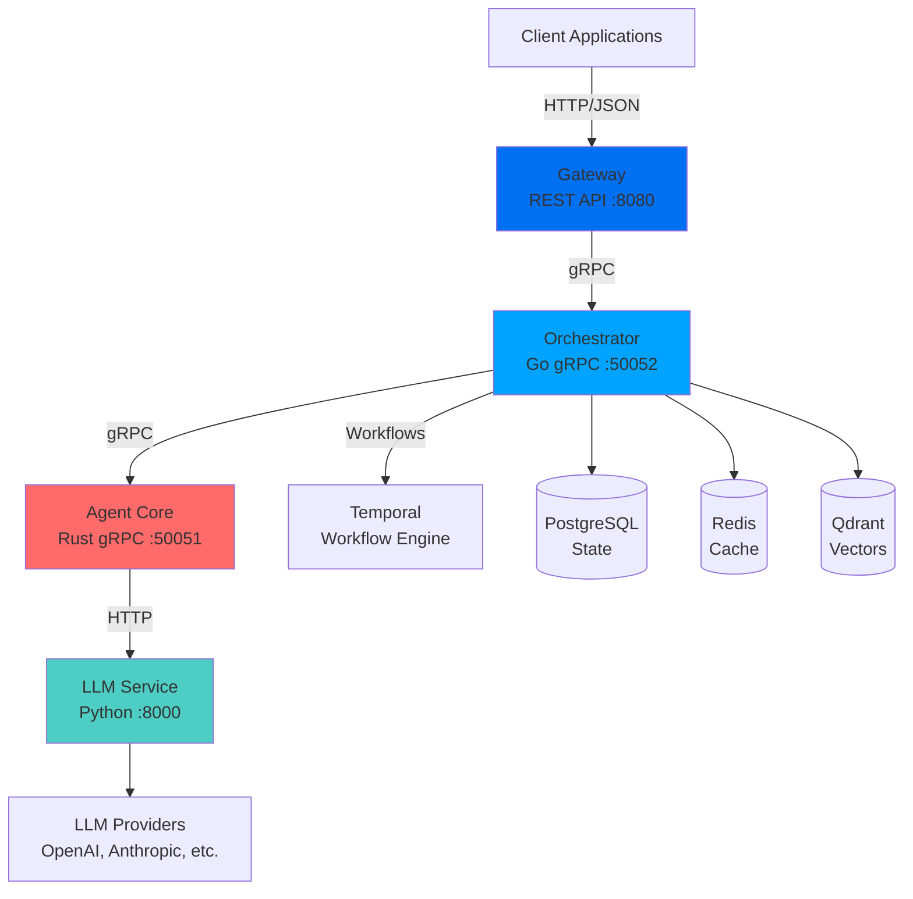

## 系统架构

Shannon 是一个为生产环境AI代理编排而设计的分布式微服务系统：

## 核心组件

### Gateway（端口 8080）

**技术栈**: Go
**用途**: 面向外部客户端的REST API层

Gateway 提供：
- HTTP/JSON API 接口
- 身份验证和授权（API密钥）
- 按用户限流
- 幂等性支持
- SSE 和 WebSocket 流式传输
- OpenAPI 规范

<Card title="关键特性" icon="shield">
  身份验证**默认禁用**以便于采用。生产环境中使用 `GATEWAY_SKIP_AUTH=0` 启用。
</Card>

### Orchestrator（端口 50052）

**技术栈**: Go + Temporal
**用途**: 中央工作流协调

Orchestrator 处理：
- 任务路由和分解
- 认知模式选择（CoT、ToT、ReAct）
- 预算和token使用限制
- 会话管理
- OPA 策略评估
- 多代理协调

**关键技术**: [Temporal](https://temporal.io) - 提供持久化、确定性的工作流，可重放以便调试。

### Agent Core（端口 50051）

**技术栈**: Rust
**用途**: 安全执行层

Agent Core 提供：
- WASI（WebAssembly 系统接口）沙箱
- 安全的 Python 代码执行（WASI 中的 CPython 3.11）
- 工具注册和执行
- 结果缓存（带TTL的LRU）
- 熔断器和限流

<Card title="安全优先" icon="lock">
  所有代码执行都在 WASI 沙箱中进行，**无网络访问**和**只读文件系统**。
</Card>

### LLM Service（端口 8000）

**技术栈**: Python + FastAPI
**用途**: 多提供商 LLM 网关

LLM Service 处理：
- 多提供商抽象（OpenAI、Anthropic、Google 等）
- 基于 SHA256 的智能缓存去重
- MCP（模型上下文协议）工具集成
- 网络搜索集成（Exa、Perplexity 等）
- 嵌入和文档分块

## 数据流

以下是任务在 Shannon 中的流转过程：

<Steps>
  <Step title="任务提交">
    客户端通过 REST API 向 Gateway 提交任务
  </Step>
  <Step title="工作流创建">
    Gateway 转发到 Orchestrator，后者创建 Temporal 工作流
  </Step>
  <Step title="模式选择">
    Orchestrator 分析任务复杂度并选择认知模式
  </Step>
  <Step title="任务分解">
    对于复杂任务，分解为子任务并创建 DAG（有向无环图）
  </Step>
  <Step title="代理执行">
    Orchestrator 为每个子任务调用 Agent Core
  </Step>
  <Step title="LLM 调用">
    Agent Core 调用 LLM Service，后者路由到相应提供商
  </Step>
  <Step title="工具执行">
    如需要，在 WASI 沙箱中执行工具或调用外部 API
  </Step>
  <Step title="结果综合">
    Orchestrator 合并所有代理的结果
  </Step>
  <Step title="响应">
    最终结果通过 Gateway 返回给客户端
  </Step>
</Steps>

## 持久化层

### PostgreSQL

存储：
- 任务元数据和执行历史
- 会话状态和上下文
- 用户和 API 密钥数据
- 工作流历史

**模式**: 包含用于向量操作的 pgvector 扩展

### Redis

提供：
- 会话缓存（TTL: 3600秒）
- LLM 响应缓存
- 限流器状态
- 事件发布/订阅

### Qdrant

向量数据库用于：
- 语义记忆检索
- 会话作用域的向量集合
- MMR（最大边际相关性）以实现多样性

## 可观测性

Shannon 包含全面的可观测性：

### 指标（Prometheus）

每个服务都暴露指标：
- **Orchestrator**: `:2112/metrics`
- **Agent Core**: `:2113/metrics`
- **LLM Service**: `:8000/metrics`

指标包括：
- 请求速率和延迟
- Token 使用量和成本
- 缓存命中/未命中率
- 按类型分类的错误率
- 熔断器状态

### 追踪（OpenTelemetry）

通过 `traceparent` 头进行上下文传播的跨所有服务的分布式追踪。

### Dashboard（端口 2111）

实时 React/Next.js 仪表板显示：
- 活动任务和工作流
- 事件流
- 系统指标
- Token 使用图表

### Temporal UI（端口 8088）

原生 Temporal 界面用于：
- 工作流可视化
- 执行历史
- 重放调试
- Worker 状态

## 设计原则

### 1. 可靠性

- **Temporal 工作流**确保持久性 - 工作流可在服务重启后继续
- **熔断器**防止级联故障
- 服务不可用时**优雅降级**

### 2. 安全性

- **WASI 沙箱**隔离不受信任的代码执行
- **OPA 策略**实施细粒度访问控制
- **多租户**与租户隔离

### 3. 成本控制

- **Token 预算**防止成本失控
- 在适当时**智能路由**到更便宜的模型
- **学习路由器**随时间提高成本效率（节省85-95%）

### 4. 可观测性

- **Prometheus 指标**用于监控
- **OpenTelemetry 追踪**用于调试
- 通过 Temporal 实现**确定性重放**

## 可扩展性

Shannon 可水平扩展：

- **无状态服务**: Gateway、Orchestrator、Agent Core 可独立扩展
- **Temporal workers**: 添加更多 worker 以增加吞吐量
- **数据库**: PostgreSQL 读副本、Redis 集群、Qdrant 分布式模式

## 下一步

<CardGroup cols={2}>
  <Card
    title="核心概念"
    icon="book"
    href="/cn/quickstart/concepts/agents"
  >
    深入了解代理和工作流
  </Card>
  <Card
    title="API 参考"
    icon="terminal"
    href="/cn/api/overview"
  >
    探索完整的 API
  </Card>
  <Card
    title="成本控制"
    icon="dollar"
    href="/cn/quickstart/concepts/cost-control"
  >
    管理和优化成本
  </Card>
  <Card
    title="Python SDK"
    icon="code"
    href="/cn/sdk/python/quickstart"
  >
    开始使用 SDK
  </Card>
</CardGroup>
