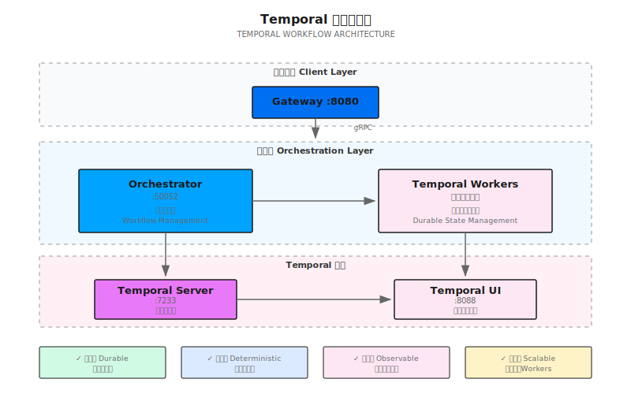

## 概述

Shannon 使用 [Temporal](https://temporal.io) 作为工作流引擎，提供持久化、确定性的执行，可在服务重启后继续运行，并支持回放调试。

## 架构

## 工作流类型

Shannon 实现了多种工作流类型以适应不同场景：

### OrchestratorWorkflow
主入口点，根据复杂度分析将查询路由到适当的策略工作流。

### 策略工作流

| 工作流 | 适用场景 | 使用的模式 |
|----------|----------|---------------|
| **DAGWorkflow** | 具有明确子任务的多步骤任务 | 并行/顺序 + 反思 |
| **ReactWorkflow** | 使用工具的任务、迭代求解 | 推理-行动-观察循环 |
| **ResearchWorkflow** | 信息收集、综合 | React 或并行 + 反思 |
| **ExploratoryWorkflow** | 开放式探索 | 思维树 + 辩论 |
| **ScientificWorkflow** | 假设检验 | CoT + 辩论 + ToT + 反思 |

### SupervisorWorkflow
支持动态团队管理的高级工作流，包括智能体招募和退役。

### ScheduledTaskWorkflow
用于通过 cron 调度执行周期性任务的包装工作流。

## 工作流选择逻辑

## 推理模式

Shannon 在工作流中组合这些模式：

### 思维链（CoT）
带置信度跟踪的逐步推理，适用于复杂问题。

### 思维树（ToT）
系统性探索，支持分支和剪枝，适用于有多种解决路径的问题。

### ReAct
推理-行动-观察循环，集成工具进行迭代问题求解。

### 辩论
多智能体辩论，探索不同视角并加强答案。

### 反思
通过自我评估进行迭代质量改进。

## 执行模式

### 并行执行
- 使用信号量控制的并发智能体执行
- 可配置的并发限制
- 结果聚合

### 顺序执行
- 逐步执行并传递结果
- 步骤间的上下文累积

### 混合（DAG）执行
- 使用拓扑排序的依赖图执行
- 根据依赖关系组合并行和顺序执行

## 配置

### 环境变量

| 变量 | 默认值 | 描述 |
|----------|---------|-------------|
| `TEMPORAL_HOST` | `temporal:7233` | Temporal 服务器地址 |
| `AGENT_TIMEOUT_SECONDS` | `600` | 智能体执行超时 |
| `DECOMPOSE_TIMEOUT_SECONDS` | `30` | 任务分解超时 |

## Temporal UI

访问 `http://localhost:8088` 的 Temporal UI 可以：

- **工作流可视化**：查看工作流执行图
- **执行历史**：每个工作流的完整事件历史
- **回放调试**：逐步执行工作流
- **Worker 状态**：监控 worker 健康状态和任务队列

## 确定性回放

Temporal 确保工作流是确定性的：

<Note>
所有工作流代码必须是确定性的 - 工作流代码中不能直接使用随机数、当前时间或外部调用。对于非确定性操作，请使用 activities。
</Note>

## 令牌预算管理

所有工作流通过以下方式遵守令牌预算：
1. **中间件**：工作流入口处的预算强制执行
2. **模式选项**：`BudgetAgentMax` 字段限制每个智能体的令牌
3. **Activity 预算**：带预算跟踪的受控执行

## 最佳实践

### 何时使用每种模式

| 模式 | 用例 | 示例 |
|------|----------|---------|
| `simple` | 直接问题 | "2+2 等于多少？" |
| `standard` | 多步骤任务 | "总结这份文档" |
| `complex` | 深度分析 | "比较各个框架" |
| `supervisor` | 动态团队 | "研究并实现" |

## 监控

### Prometheus 指标

- `shannon_workflow_duration_seconds` - 工作流执行时间
- `shannon_workflow_status` - 成功/失败计数
- `shannon_activity_duration_seconds` - Activity 执行时间

### OpenTelemetry 追踪

分布式追踪跨越：
- 工作流执行
- Activity 调用
- 智能体调用
- LLM 请求

## 下一步

<CardGroup cols={2}>
  <Card title="工作流概念" icon="diagram-project" href="/cn/quickstart/concepts/workflows">
    了解认知模式
  </Card>
  <Card title="架构概览" icon="sitemap" href="/cn/architecture/overview">
    系统架构
  </Card>
</CardGroup>
