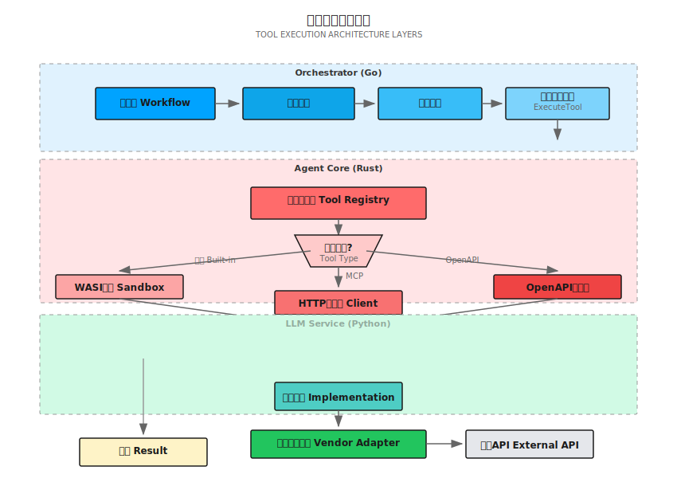
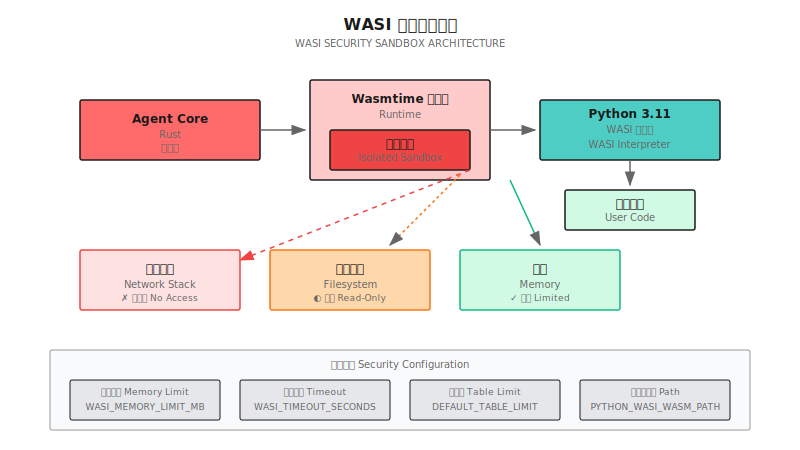
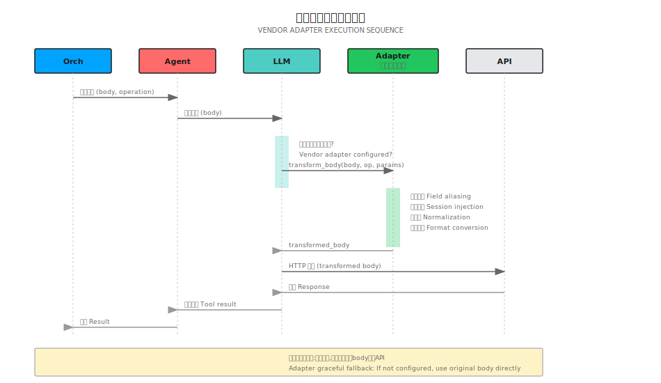
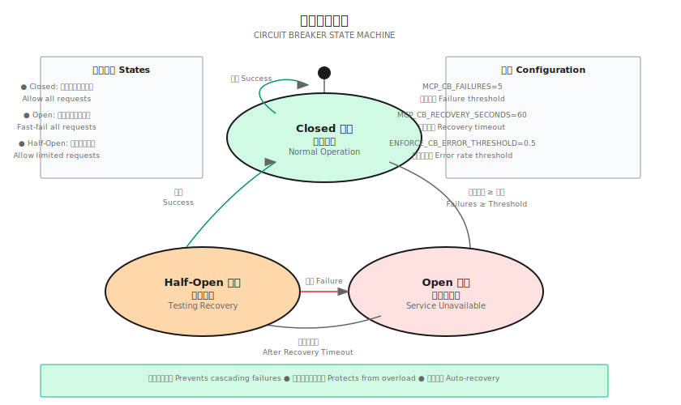

## 概述

Shannon 的工具执行系统提供了一个安全、可扩展的框架，用于将外部功能集成到 AI 代理中。该架构支持三种工具类型，具有统一的执行语义。

## 工具类型

<CardGroup cols={3}>
  <Card title="MCP 工具" icon="cloud">
    遵循模型上下文协议的外部 HTTP API
  </Card>
  <Card title="OpenAPI 工具" icon="file-code">
    从 OpenAPI 3.x 规范自动生成
  </Card>
  <Card title="内置工具" icon="code">
    具有直接服务访问权限的 Python 工具
  </Card>
</CardGroup>

所有工具类型共享：
- 统一的 JSON 模式参数
- 一致的错误处理
- 速率限制和熔断器
- 成本跟踪和预算执行
- 安全验证

## 架构分层



## 工具注册表

### 注册

工具在服务启动时注册元数据：

```python
# python/llm-service/llm_service/tools/base.py
class ToolMetadata:
    name: str                    # 唯一标识符
    version: str                 # 语义版本
    description: str             # LLM 可见的描述
    category: str                # 搜索、数据、分析、代码等
    parameters: List[ToolParameter]  # JSON 模式

    # 执行约束
    timeout_seconds: int = 30
    memory_limit_mb: int = 128
    rate_limit: int = 60        # 每分钟请求数
    cost_per_use: float = 0.0   # 美元

    # 安全标志
    dangerous: bool = False      # 文件写入、代码执行
    requires_auth: bool = False
    sandboxed: bool = False
    session_aware: bool = False
```

### 发现

工具通过 HTTP API 暴露以供运行时发现：

```bash
# 列出所有工具
GET /tools/list

# 获取工具模式
GET /tools/{name}/schema

# 获取工具元数据
GET /tools/{name}/metadata

# 按类别列出
GET /tools/list?category=data
```

## WASI 沙箱

Python 代码在 WebAssembly 系统接口 (WASI) 沙箱中执行，以实现安全隔离。

### 架构



### 安全边界

<AccordionGroup>
  <Accordion title="无网络访问">
    WASI 沙箱没有网络堆栈：

    - ✅ 可以计算、解析、转换数据
    - ❌ 不能发出 HTTP 请求
    - ❌ 不能打开套接字
    - ❌ 不能访问外部资源

    **用例**: 安全执行用户提供的 Python 代码
  </Accordion>

  <Accordion title="只读文件系统">
    文件系统以只读方式挂载：

    - ✅ 可以读取 Python 标准库
    - ✅ 可以读取允许的数据文件
    - ❌ 不能写入文件
    - ❌ 不能修改系统文件

    **用例**: 防止数据泄露和篡改
  </Accordion>

  <Accordion title="内存限制">
    每次执行的内存使用都有限制：

    ```rust
    // rust/agent-core/src/wasi_sandbox.rs
    const DEFAULT_MEMORY_LIMIT_MB: usize = 512;
    const DEFAULT_TABLE_LIMIT: u32 = 10000;  // Python 需要
    ```

    **用例**: 防止资源耗尽攻击
  </Accordion>

  <Accordion title="执行超时">
    每次执行都有严格的时间限制：

    ```yaml
    # 默认超时
    timeout_seconds: 60

    # 可按工具配置
    WASI_TIMEOUT_SECONDS=30
    ```

    **用例**: 防止无限循环和挂起进程
  </Accordion>
</AccordionGroup>

### 设置

```bash
# 下载 Python WASI 解释器 (20MB)
./scripts/setup_python_wasi.sh

# 验证安装
ls -lh wasm-interpreters/python-3.11.4.wasm

# 配置
PYTHON_WASI_WASM_PATH=./wasm-interpreters/python-3.11.4.wasm
WASI_MEMORY_LIMIT_MB=512
WASI_TIMEOUT_SECONDS=60
```

## OpenAPI 工具加载器

Shannon 从 OpenAPI 规范动态生成工具。

### 规范处理

<Steps>
  <Step title="获取规范">
    从 URL 或内联 YAML 检索 OpenAPI 规范：

    ```python
    spec_url = "https://api.example.com/openapi.json"
    spec = fetch_openapi_spec(spec_url)
    ```
  </Step>

  <Step title="验证与解析">
    验证 OpenAPI 版本和结构：

    ```python
    # 支持 OpenAPI 3.0 和 3.1
    assert spec["openapi"].startswith("3.")

    # 提取操作
    operations = extract_operations(spec)
    ```
  </Step>

  <Step title="生成工具">
    为每个操作创建工具：

    ```python
    for operation in operations:
        tool = Tool(
            name=operation["operationId"],
            description=operation["summary"],
            parameters=convert_schema(operation["parameters"]),
            execute=lambda params: call_api(operation, params)
        )
        registry.register(tool)
    ```
  </Step>

  <Step title="应用供应商适配器">
    如果已配置，加载特定于供应商的转换：

    ```python
    if auth_config.get("vendor"):
        adapter = get_vendor_adapter(auth_config["vendor"])
        if adapter:
            body = adapter.transform_body(body, operation_id, prompt_params)
    ```
  </Step>
</Steps>

### 模式解析

```python
# 解析本地 $ref 引用
# #/components/schemas/Pet → Pet 模式定义
def resolve_ref(ref: str, spec: dict) -> dict:
    path = ref.lstrip("#/").split("/")
    schema = spec
    for key in path:
        schema = schema[key]
    return schema
```

<Warning>
不支持远程 `$ref` 解析（例如 `https://example.com/schemas/Pet.json`）。请将外部模式合并到单个规范文件中。
</Warning>

## 供应商适配器集成

供应商适配器为特定领域的 API 转换请求/响应，而无需修改 Shannon 的核心。

### 执行流程



### 适配器加载

```python
# python/llm-service/llm_service/tools/vendor_adapters/__init__.py
def get_vendor_adapter(name: str):
    """按名称返回适配器实例，如果不可用则返回 None。"""
    if not name:
        return None

    try:
        if name.lower() == "datainsight":
            from .datainsight import DataInsightAdapter
            return DataInsightAdapter()
        # 优雅地回退缺失的供应商模块
    except ImportError:
        logger.warning(f"供应商适配器 '{name}' 不可用")
        return None
    except Exception as e:
        logger.error(f"加载供应商适配器 '{name}' 失败: {e}")
        return None

    return None
```

### 转换示例

**字段别名:**
```python
# 转换: "users" → "di:unique_users"
metric_aliases = {
    "users": "di:unique_users",
    "sessions": "di:total_sessions",
}
body["metrics"] = [metric_aliases.get(m, m) for m in body["metrics"]]
```

**会话上下文注入:**
```python
# 从 prompt_params 注入 account_id
if prompt_params and "account_id" in prompt_params:
    body["account_id"] = prompt_params["account_id"]
```

**时间范围规范化:**
```python
# 转换: {start, end} → {startTime, endTime}
if "start" in body["timeRange"]:
    body["timeRange"]["startTime"] = body["timeRange"].pop("start")
if "end" in body["timeRange"]:
    body["timeRange"]["endTime"] = body["timeRange"].pop("end")
```

## 速率限制

### 按工具速率限制

```python
class ToolMetadata:
    rate_limit: int = 60  # 每分钟请求数 (默认)
```

使用令牌桶算法实现：

```python
class RateLimiter:
    def __init__(self, rate_limit: int):
        self.rate = rate_limit
        self.tokens = rate_limit
        self.last_update = time.time()

    def allow(self) -> bool:
        now = time.time()
        elapsed = now - self.last_update

        # 补充令牌
        self.tokens = min(
            self.rate,
            self.tokens + elapsed * (self.rate / 60.0)
        )
        self.last_update = now

        if self.tokens >= 1:
            self.tokens -= 1
            return True
        return False
```

### 全局速率限制

```bash
# 环境变量
MCP_RATE_LIMIT_DEFAULT=60              # MCP 工具的默认值
WEB_SEARCH_RATE_LIMIT=120              # 网页搜索特定
CALCULATOR_RATE_LIMIT=2000             # 计算器特定
PYTHON_EXECUTOR_RATE_LIMIT=60          # Python 执行
```

## 熔断器

防止外部服务不可用时发生级联故障。

### 配置

```bash
# MCP 熔断器
MCP_CB_FAILURES=5                      # 5 次失败后打开
MCP_CB_RECOVERY_SECONDS=60             # 保持打开 60 秒

# Agent Core 强制执行
ENFORCE_CB_ERROR_THRESHOLD=0.5         # 打开的错误率 (50%)
ENFORCE_CB_WINDOW_SECONDS=30           # 滑动窗口
ENFORCE_CB_MIN_REQUESTS=20             # 激活前的最小请求数
```

### 状态



**Closed**: 正常操作，允许所有请求

**Open**: 服务不可用，所有请求快速失败

**Half-Open**: 测试恢复，允许有限的请求

## 成本跟踪

每个工具执行都会跟踪成本以强制执行预算。

### 按工具成本

```python
class ToolMetadata:
    cost_per_use: float = 0.001  # 每次调用的美元成本
```

### 预算执行

```go
// go/orchestrator/internal/budget/manager.go
type BudgetManager struct {
    maxCostPerRequest float64
    maxTokensPerRequest int
}

func (bm *BudgetManager) CheckBudget(currentCost, currentTokens float64) error {
    if currentCost >= bm.maxCostPerRequest {
        return ErrBudgetExceeded
    }
    if currentTokens >= bm.maxTokensPerRequest {
        return ErrTokenLimitExceeded
    }
    return nil
}
```

### 配置

```bash
MAX_COST_PER_REQUEST=0.50              # 美元
MAX_TOKENS_PER_REQUEST=10000
TOKEN_BUDGET_PER_AGENT=5000
TOKEN_BUDGET_PER_TASK=20000
```

## 错误处理

### 错误类别

<Tabs>
  <Tab title="验证错误">
    ```python
    class ValidationError(Exception):
        """参数验证失败。"""
        pass

    # 缺少必需参数
    # 无效的参数类型
    # 值超出范围
    # 枚举约束冲突
    ```
  </Tab>

  <Tab title="执行错误">
    ```python
    class ExecutionError(Exception):
        """工具执行失败。"""
        pass

    # 超时
    # 超出内存限制
    # 沙箱冲突
    # 特定于工具的错误
    ```
  </Tab>

  <Tab title="网络错误">
    ```python
    class NetworkError(Exception):
        """外部 API 调用失败。"""
        pass

    # 连接超时
    # DNS 解析失败
    # TLS 握手失败
    # HTTP 错误代码 (4xx, 5xx)
    ```
  </Tab>

  <Tab title="熔断器错误">
    ```python
    class CircuitBreakerError(Exception):
        """熔断器已打开。"""
        pass

    # 失败次数过多
    # 服务不可用
    # 自动重试被阻止
    ```
  </Tab>
</Tabs>

### 重试逻辑

```python
# 带抖动的指数退避
@retry(
    retries=3,
    backoff=exponential_backoff(base=1.0, max_delay=10.0),
    on_exception=(NetworkError, TimeoutError)
)
def execute_tool(tool_name, parameters):
    return registry.execute(tool_name, parameters)
```

## 性能优化

### 连接池

```python
# 外部 API 的 HTTP 连接池
session = aiohttp.ClientSession(
    connector=aiohttp.TCPConnector(
        limit=100,              # 最大总连接数
        limit_per_host=10,      # 每台主机的最大连接数
        ttl_dns_cache=300,      # DNS 缓存 TTL
    )
)
```

### 响应缓存

```python
# 缓存 OpenAPI 规范
@lru_cache(maxsize=100)
def load_openapi_spec(spec_url: str) -> dict:
    return fetch_and_parse(spec_url)
```

### 并行执行

```go
// 并行执行多个工具
func ExecuteToolsParallel(tools []Tool, parallelism int) []Result {
    sem := make(chan struct{}, parallelism)  // 信号量
    results := make([]Result, len(tools))

    var wg sync.WaitGroup
    for i, tool := range tools {
        wg.Add(1)
        go func(idx int, t Tool) {
            defer wg.Done()
            sem <- struct{}{}        // 获取
            defer func() { <-sem }() // 释放

            results[idx] = t.Execute()
        }(i, tool)
    }
    wg.Wait()
    return results
}
```

配置:
```bash
TOOL_PARALLELISM=5  # 最多同时执行 5 个工具
```

## 安全考虑

<Warning>
始终验证工具输入并根据用户权限限制执行。
</Warning>

### 域名白名单

```bash
# 限制外部 API 访问
MCP_ALLOWED_DOMAINS=api.example.com,api.partner.com
OPENAPI_ALLOWED_DOMAINS=api.github.com,api.stripe.com

# 仅限开发环境
MCP_ALLOWED_DOMAINS=*  # 允许所有 (⚠️ 不适用于生产环境)
```

### 工具权限

```python
class ToolMetadata:
    dangerous: bool = False      # 文件写入、代码执行
    requires_auth: bool = False  # 需要用户认证
```

OPA 策略可以控制访问：
```rego
# config/opa/policies/tools.rego
package tools

deny[msg] {
    input.tool == "file_write"
    not is_admin(input.user)
    msg := "file_write 需要管理员角色"
}
```

### API 密钥管理

<Tabs>
  <Tab title="环境变量">
    ```bash
    # .env (不提交到 git)
    WEATHER_API_KEY=sk-xxx
    GITHUB_TOKEN=ghp_xxx
    STRIPE_API_KEY=sk_live_xxx
    ```
  </Tab>

  <Tab title="Docker Secrets">
    ```yaml
    # docker-compose.yml
    services:
      llm-service:
        secrets:
          - weather_api_key
          - github_token

    secrets:
      weather_api_key:
        external: true
      github_token:
        external: true
    ```
  </Tab>

  <Tab title="Kubernetes Secrets">
    ```yaml
    apiVersion: v1
    kind: Secret
    metadata:
      name: api-keys
    type: Opaque
    data:
      weather-api-key: <base64-encoded>
      github-token: <base64-encoded>
    ```
  </Tab>
</Tabs>

## 监控与可观察性

### 指标

```prometheus
# 工具执行指标
shannon_tool_executions_total{tool_name, status}
shannon_tool_execution_duration_seconds{tool_name}
shannon_tool_errors_total{tool_name, error_type}
shannon_tool_cost_usd{tool_name}

# 熔断器指标
shannon_circuit_breaker_state{base_url}
shannon_circuit_breaker_failures_total{base_url}

# 速率限制器指标
shannon_rate_limit_exceeded_total{tool_name}
shannon_rate_limit_tokens_available{tool_name}
```

### 日志记录

```python
# 工具执行的结构化日志
logger.info(
    "工具执行完成",
    extra={
        "tool_name": tool_name,
        "duration_ms": duration,
        "cost_usd": cost,
        "success": success,
        "error": error_message,
    }
)
```

### 追踪

```python
# OpenTelemetry 追踪
with tracer.start_as_current_span("tool_execution") as span:
    span.set_attribute("tool.name", tool_name)
    span.set_attribute("tool.category", category)

    result = execute_tool(tool_name, parameters)

    span.set_attribute("tool.success", result.success)
    span.set_attribute("tool.cost_usd", result.cost)
```

## 后续步骤

<CardGroup cols={2}>
  <Card title="添加自定义工具" icon="wrench" href="/cn/tutorials/custom-tools">
    了解如何添加 MCP、OpenAPI 和内置工具
  </Card>
  <Card title="供应商适配器" icon="plug" href="/cn/tutorials/vendor-adapters">
    构建特定领域的集成
  </Card>
  <Card title="配置" icon="gear" href="/cn/quickstart/configuration">
    完整的配置参考
  </Card>
  <Card title="安全最佳实践" icon="shield-check" href="/cn/deployment/security">
    加固您的 Shannon 部署
  </Card>
</CardGroup>
