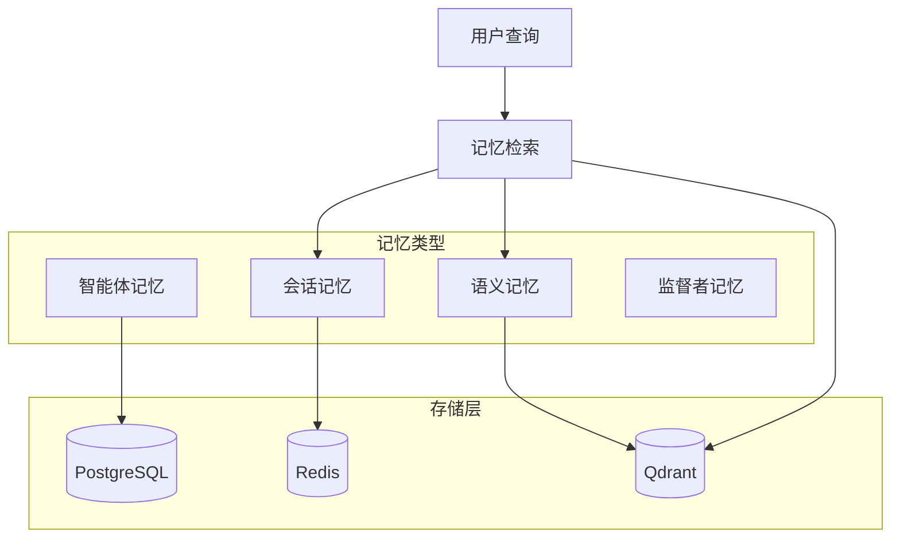

## 概述

Shannon 的记忆系统提供跨用户会话的智能上下文保留和检索，使智能体能够维护对话连续性并利用历史交互来改进响应。

## 架构

## 存储层

### PostgreSQL
- **会话上下文**：会话级状态和元数据
- **执行持久化**：智能体和工具执行历史
- **任务跟踪**：高级任务和工作流元数据

### Redis
- **会话缓存**：快速访问活跃会话数据（TTL: 3600秒）
- **令牌预算**：实时令牌使用跟踪
- **压缩状态**：跟踪上下文压缩状态

### Qdrant（向量存储）
- **语义记忆**：高性能向量相似性搜索
- **集合组织**：task_embeddings、summaries、tool_results、document_chunks
- **混合搜索**：结合时效性和语义相关性

## 记忆类型

### 层级记忆（默认）
结合多种检索策略：
- **近期记忆**：当前会话的最近 N 次交互
- **语义记忆**：基于查询相似性的上下文相关内容
- **压缩摘要**：旧对话的压缩表示

### 会话记忆
会话内最近交互的时间顺序检索。

### 智能体记忆
单个智能体执行记录，包括：
- 输入查询和生成的响应
- 令牌使用和模型信息
- 工具执行和结果

### 监督者记忆
用于智能任务分解的战略记忆：
- **分解模式**：可重用的成功任务分解
- **策略性能**：每种策略类型的聚合指标
- **失败模式**：已知失败及缓解策略

## 配置

### 环境变量

| 变量 | 默认值 | 描述 |
|----------|---------|-------------|
| `QDRANT_HOST` | `qdrant` | Qdrant 服务器主机名 |
| `QDRANT_PORT` | `6333` | Qdrant 服务器端口 |
| `REDIS_TTL_SECONDS` | `3600` | 会话缓存 TTL |

### 嵌入要求

<Warning>
记忆功能需要 OpenAI API 访问权限来生成文本嵌入。
</Warning>

- **默认模型**：`text-embedding-3-small`（1536 维）
- **回退行为**：如果未配置 OpenAI 密钥，记忆操作会静默降级 - 工作流继续执行但不包含历史上下文

## 核心功能

### 智能分块
- 将长回答（>2000 令牌）拆分为可管理的块
- 200 令牌重叠以保留上下文
- 批量嵌入以提高效率

### MMR（最大边际相关性）
- 多样性感知重排序，平衡相关性和信息多样性
- 默认 lambda=0.7，优化相关且多样的上下文选择
- 获取 3 倍请求项，然后重排序以增加多样性

### 上下文压缩
- 基于消息计数和令牌估计的自动触发
- 速率限制防止过度压缩
- 针对不同层级的模型感知阈值

## 记忆检索流程

<Steps>
  <Step title="查询分析">
    分析传入查询的语义内容
  </Step>
  <Step title="近期获取">
    通过 Redis 从当前会话检索最近 N 条消息
  </Step>
  <Step title="语义搜索">
    在 Qdrant 中执行向量相似性搜索
  </Step>
  <Step title="合并去重">
    合并结果并移除重复项
  </Step>
  <Step title="上下文注入">
    将相关记忆注入智能体上下文
  </Step>
</Steps>

## 隐私与数据治理

### PII 保护
- 数据最小化：仅存储必要字段
- 匿名化：使用 UUID 替代真实身份
- 自动 PII 检测和脱敏

### 数据保留
- **对话历史**：默认 30 天保留
- **分解模式**：90 天保留
- **用户偏好**：基于会话，24 小时过期

## 性能优化

- **批量处理**：单次 API 调用处理多个块（快 5 倍）
- **智能缓存**：LRU（2048 条目）+ Redis
- **载荷索引**：session_id、tenant_id、user_id 上的过滤快 50-90%
- **优化的 HNSW**：m=16，ef_construct=100，实现快速相似性搜索

## 限制

- 记忆检索增加延迟（通过缓存缓解）
- 向量相似性可能遗漏精确关键词匹配
- 压缩是有损的（仅保留关键点）
- 跨会话记忆需要显式会话链接

## 下一步

<CardGroup cols={2}>
  <Card title="架构概览" icon="sitemap" href="/cn/architecture/overview">
    系统架构
  </Card>
  <Card title="会话 API" icon="messages" href="/cn/api/rest/sessions">
    会话管理
  </Card>
</CardGroup>
