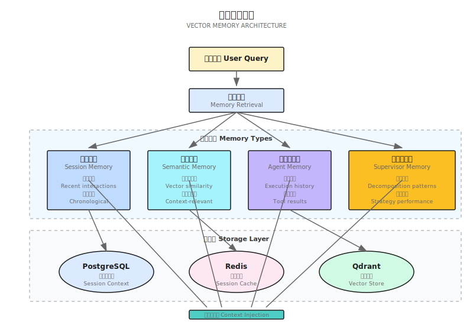

## 概述

Shannon 的记忆系统提供跨用户会话的智能上下文保留和检索，使智能体能够维护对话连续性并利用历史交互来改进响应。

## 架构



## 存储层

### PostgreSQL
- **会话上下文**：会话级状态和元数据
- **执行持久化**：智能体和工具执行历史
- **任务跟踪**：高级任务和工作流元数据

### Redis
- **会话缓存**：快速访问活跃会话数据（TTL: 3600秒）
- **令牌预算**：实时令牌使用跟踪
- **压缩状态**：跟踪上下文压缩状态

### Qdrant（向量存储）
- **语义记忆**：高性能向量相似性搜索
- **集合组织**：task_embeddings、summaries、tool_results、document_chunks
- **混合搜索**：结合时效性和语义相关性

## 记忆类型

### 层级记忆（默认）
结合多种检索策略：
- **近期记忆**：当前会话的最近 N 次交互
- **语义记忆**：基于查询相似性的上下文相关内容
- **压缩摘要**：旧对话的压缩表示

### 会话记忆
会话内最近交互的时间顺序检索。

### 智能体记忆
单个智能体执行记录，包括：
- 输入查询和生成的响应
- 令牌使用和模型信息
- 工具执行和结果

### 监督者记忆
用于智能任务分解的战略记忆：
- **分解模式**：可重用的成功任务分解
- **策略性能**：每种策略类型的聚合指标
- **失败模式**：已知失败及缓解策略

## 配置

### 环境变量

| 变量 | 默认值 | 描述 |
|----------|---------|-------------|
| `QDRANT_HOST` | `qdrant` | Qdrant 服务器主机名 |
| `QDRANT_PORT` | `6333` | Qdrant 服务器端口 |
| `REDIS_TTL_SECONDS` | `3600` | 会话缓存 TTL |

### 嵌入要求

<Warning>
记忆功能需要 OpenAI API 访问权限来生成文本嵌入。
</Warning>

- **默认模型**：`text-embedding-3-small`（1536 维）
- **回退行为**：如果未配置 OpenAI 密钥，记忆操作会静默降级 - 工作流继续执行但不包含历史上下文

## 核心功能

### 智能分块
- 将长回答（>2000 令牌）拆分为可管理的块
- 200 令牌重叠以保留上下文
- 批量嵌入以提高效率

### MMR（最大边际相关性）
- 多样性感知重排序，平衡相关性和信息多样性
- 默认 lambda=0.7，优化相关且多样的上下文选择
- 获取 3 倍请求项，然后重排序以增加多样性

### 上下文压缩
- 基于消息计数和令牌估计的自动触发
- 速率限制防止过度压缩
- 针对不同层级的模型感知阈值

## 记忆检索流程

<Steps>
  <Step title="查询分析">
    分析传入查询的语义内容
  </Step>
  <Step title="近期获取">
    通过 Redis 从当前会话检索最近 N 条消息
  </Step>
  <Step title="语义搜索">
    在 Qdrant 中执行向量相似性搜索
  </Step>
  <Step title="合并去重">
    合并结果并移除重复项
  </Step>
  <Step title="上下文注入">
    将相关记忆注入智能体上下文
  </Step>
</Steps>

## 隐私与数据治理

### PII 保护
- 数据最小化：仅存储必要字段
- 匿名化：使用 UUID 替代真实身份
- 自动 PII 检测和脱敏

### 数据保留
- **对话历史**：默认 30 天保留
- **分解模式**：90 天保留
- **用户偏好**：基于会话，24 小时过期

## 性能优化

- **批量处理**：单次 API 调用处理多个块（快 5 倍）
- **智能缓存**：LRU（2048 条目）+ Redis
- **载荷索引**：session_id、tenant_id、user_id 上的过滤快 50-90%
- **优化的 HNSW**：m=16，ef_construct=100，实现快速相似性搜索

## 限制

- 记忆检索增加延迟（通过缓存缓解）
- 向量相似性可能遗漏精确关键词匹配
- 压缩是有损的（仅保留关键点）
- 跨会话记忆需要显式会话链接

## 启用语义记忆

按照以下步骤启用 Shannon 基于 Qdrant 的语义记忆系统。

### 前置条件

<Note>
在开始之前，请确保以下条件已满足：
- **Qdrant** 正在运行（Shannon 的 `docker-compose.yaml` 中已默认包含）
- 环境中已设置 **`OPENAI_API_KEY`**（`text-embedding-3-small` embedding 模型所需）
</Note>

### 分步配置

<Steps>
  <Step title="在 shannon.yaml 中启用向量记忆">
    在 `shannon.yaml` 配置文件中添加或更新 `vector` 配置块：

    ```yaml shannon.yaml
    vector:
      enabled: true                    # 必须设为 true（默认值: false）
      host: "qdrant"
      port: 6333
      top_k: 10
      threshold: 0.5
      default_model: "text-embedding-3-small"
      cache_ttl: "1h"
      use_redis_cache: true
      expected_embedding_dim: 1536
    ```

    <Warning>
    `vector.enabled` 默认为 `false`。必须显式设为 `true` 才能启用语义记忆功能。
    </Warning>
  </Step>

  <Step title="验证 Qdrant 集合">
    Shannon 会自动创建 5 个集合（均使用 `text-embedding-3-small` 的 1536 维向量）：

    | 集合名称 | 用途 |
    |---|---|
    | `task_embeddings` | 任务结果 embedding，用于语义搜索 |
    | `tool_results` | 工具执行结果 embedding |
    | `cases` | 案例库，用于模式匹配 |
    | `document_chunks` | 文档分块 embedding，用于 RAG |
    | `summaries` | 摘要 embedding |

    可通过查询 Qdrant REST API 来验证集合是否已创建：

    ```bash
    curl http://localhost:6333/collections
    ```
  </Step>

  <Step title="配置 MMR 多样性重排序">
    MMR（Maximal Marginal Relevance，最大边际相关性）在检索结果中平衡相关性和多样性。启用后，Shannon 会获取更大的候选池并重新排序，在保持相关性的同时减少冗余。

    ```yaml shannon.yaml
    mmr_enabled: true
    mmr_lambda: 0.7           # 0 = 纯多样性，1 = 纯相关性
    mmr_pool_multiplier: 3    # 获取 3 倍候选项进行重排序
    ```

    <Note>
    `mmr_lambda` 设为 `0.7` 是一个理想的默认值——在强烈偏向相关性的同时，仍能过滤掉近乎重复的结果。
    </Note>
  </Step>

  <Step title="配置 embeddings 端点">
    如果 LLM Service 运行在非默认地址，或需要调整缓存行为，请更新 `embeddings` 配置块：

    ```yaml shannon.yaml
    embeddings:
      base_url: "http://llm-service:8000"
      default_model: "text-embedding-3-small"
      timeout: "10s"
      cache_ttl: "1h"
      max_lru: 4096
    ```

    - `cache_ttl` 控制 embedding 向量在 Redis 中的缓存时间。
    - `max_lru` 设置内存 LRU 缓存的最大条目数。
  </Step>
</Steps>

## 下一步

<CardGroup cols={2}>
  <Card title="架构概览" icon="sitemap" href="/cn/architecture/overview">
    系统架构
  </Card>
  <Card title="会话 API" icon="messages" href="/cn/api/rest/sessions">
    会话管理
  </Card>
</CardGroup>
