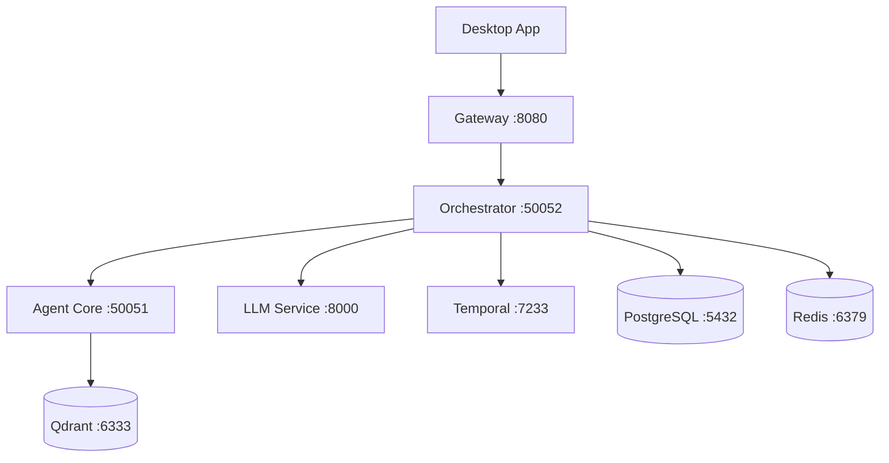

## 生产环境部署指南

自信地将 Shannon 部署到您的基础设施。本节涵盖部署模式、云平台集成和运维最佳实践。

<Warning>
Shannon 目前正在积极开发中。生产环境部署指南正在最后确定。对于生产环境使用,我们建议:
- 在预发布环境中进行充分测试
- 密切监控所有服务
</Warning>

## 部署选项

<CardGroup cols={2}>
  <Card title="Docker Compose" icon="docker" href="/cn/deployment/docker-compose">
    生产就绪的 Docker Compose 配置
    <br/>
    **状态**: 🚧 第三阶段
  </Card>

  <Card title="Kubernetes" icon="dharmachakra" href="/cn/deployment/kubernetes">
    Kubernetes 清单文件和 Helm Charts
    <br/>
    **状态**: 🚧 第三阶段
  </Card>

  <Card title="AWS" icon="aws" href="/cn/deployment/aws">
    部署到 Amazon Web Services (ECS, RDS, ElastiCache)
    <br/>
    **状态**: 🚧 第三阶段
  </Card>

  <Card title="Azure" icon="microsoft" href="/cn/deployment/azure">
    部署到 Microsoft Azure (AKS, PostgreSQL, Redis)
    <br/>
    **状态**: 🚧 第三阶段
  </Card>
</CardGroup>

## 运维

<CardGroup cols={2}>
  <Card title="监控" icon="chart-line" href="/cn/deployment/monitoring">
    Prometheus 指标、Grafana 仪表板和告警
    <br/>
    **状态**: 🚧 第三阶段
  </Card>

  <Card title="性能调优" icon="gauge" href="/cn/deployment/performance-tuning">
    优化吞吐量、延迟和资源使用
    <br/>
    **状态**: 🚧 第三阶段
  </Card>

  <Card title="安全" icon="shield" href="/cn/deployment/security">
    生产环境安全加固和最佳实践
    <br/>
    **状态**: 🚧 第三阶段
  </Card>
</CardGroup>

## 快速开始: 本地开发

对于开发和测试,使用 Docker Compose:

```bash
# 克隆仓库
git clone https://github.com/Kocoro-lab/Shannon.git
cd Shannon

# 设置配置
make setup
echo "OPENAI_API_KEY=sk-your-key-here" >> .env

# 下载 Python WASI 解释器
./scripts/setup_python_wasi.sh

# 启动所有服务
make dev
```

详细的设置说明请参见[安装指南](/cn/quickstart/installation)。

## 架构概览

Shannon 由多个需要部署的服务组成:



### 核心服务

| 服务 | 用途 | 扩展方式 |
|---------|---------|---------|
| **Gateway** | REST API, 身份认证 | 水平扩展 (无状态) |
| **Orchestrator** | 任务协调, gRPC | 水平扩展 (通过 Temporal 有状态) |
| **Agent Core** | Agent 执行, Rust 运行时 | 水平扩展 |
| **LLM Service** | LLM 提供商网关 | 水平扩展 |
| **Desktop App** | 实时监控 UI（原生客户端） | 客户端侧；后端独立扩展 |

### 数据存储

| 存储 | 用途 | 扩展方式 |
|-------|---------|---------|
| **PostgreSQL** | 任务元数据、事件、会话 | 垂直扩展 + 只读副本 |
| **Redis** | 缓存、发布/订阅、会话 | 集群模式 |
| **Qdrant** | 向量嵌入、语义记忆 | 水平扩展 |
| **Temporal** | 工作流状态、持久化执行 | 集群模式 |

## 生产环境检查清单

在部署到生产环境之前:

### 安全性
- [ ] 启用身份认证 (`GATEWAY_SKIP_AUTH=0`)
- [ ] 为所有服务配置 TLS/SSL
- [ ] 定期轮换 API 密钥
- [ ] 设置 OPA 策略进行访问控制
- [ ] 启用审计日志
- [ ] 配置网络策略/防火墙

### 可靠性
- [ ] 设置健康检查和就绪探针
- [ ] 配置自动扩展策略
- [ ] 实现熔断器
- [ ] 设置资源限制 (CPU、内存)
- [ ] 配置备份和灾难恢复
- [ ] 测试故障转移场景

### 可观测性
- [ ] 部署 Prometheus 和 Grafana
- [ ] 配置告警规则
- [ ] 设置日志聚合 (ELK/Loki)
- [ ] 启用分布式追踪 (OpenTelemetry)
- [ ] 为常见问题创建运维手册

### 性能
- [ ] 调优 Temporal worker 并发
- [ ] 优化数据库连接
- [ ] 配置 Redis 缓存
- [ ] 设置适当的资源限制
- [ ] 生产环境启动前进行负载测试

## 资源需求

### 最低配置 (开发环境)

- **CPU**: 4 核
- **RAM**: 8GB
- **存储**: 20GB SSD

### 推荐配置 (生产环境 - 小型)

- **CPU**: 总共 16 核 (分布在各服务中)
- **RAM**: 总共 32GB
- **存储**: 100GB SSD
- **网络**: 1Gbps

### 推荐配置 (生产环境 - 大型)

- **CPU**: 64+ 核
- **RAM**: 128GB+
- **存储**: 500GB+ SSD
- **网络**: 10Gbps
- **负载均衡器**: 必需
- **多可用区**: 推荐

## 下一步

<CardGroup cols={2}>
  <Card title="快速开始" icon="rocket" href="/cn/quickstart/installation">
    首先在本地安装 Shannon
  </Card>

  <Card title="配置" icon="gear" href="/cn/quickstart/configuration">
    了解环境变量
  </Card>

  <Card title="架构" icon="sitemap" href="/cn/architecture/overview">
    学习系统架构
  </Card>

  <Card title="监控" icon="chart-line" href="/cn/quickstart/concepts/monitoring">
    设置监控
  </Card>
</CardGroup>

## 获取帮助

- **GitHub**: 提交部署问题或疑问
- **文档**: 查看[故障排除](/cn/quickstart/troubleshooting)了解常见问题
