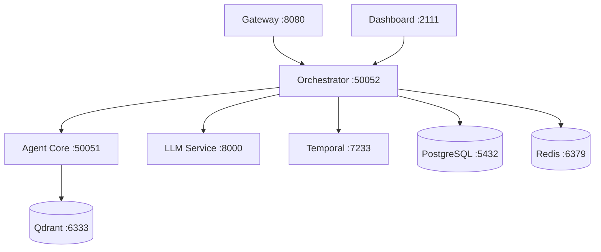

> 🚧 **翻译进行中** - 此文档正在从英文翻译为中文

**原文件**: `deployment/index.mdx`
**英文版本**: [查看英文文档](/en/deployment/index)

---


## Production Deployment Guide

Deploy Shannon to your infrastructure with confidence. This section covers deployment patterns, cloud platform integrations, and operational best practices.

<Warning>
Shannon is currently in active development. Production deployment guides are being finalized. For production use, we recommend:
- Thorough testing in staging environments
- Monitoring all services closely
- Joining our [Discord](https://discord.gg/NB7C2fMcQR) for deployment support
</Warning>

## Deployment Options

<CardGroup cols={2}>
  <Card title="Docker Compose" icon="docker" href="/deployment/docker-compose">
    Production-ready Docker Compose configuration
    <br/>
    **Status**: 🚧 Phase 3
  </Card>

  <Card title="Kubernetes" icon="dharmachakra" href="/deployment/kubernetes">
    Kubernetes manifests and Helm charts
    <br/>
    **Status**: 🚧 Phase 3
  </Card>

  <Card title="AWS" icon="aws" href="/deployment/aws">
    Deploy to Amazon Web Services (ECS, RDS, ElastiCache)
    <br/>
    **Status**: 🚧 Phase 3
  </Card>

  <Card title="Azure" icon="microsoft" href="/deployment/azure">
    Deploy to Microsoft Azure (AKS, PostgreSQL, Redis)
    <br/>
    **Status**: 🚧 Phase 3
  </Card>
</CardGroup>

## Operations

<CardGroup cols={2}>
  <Card title="Monitoring" icon="chart-line" href="/deployment/monitoring">
    Prometheus metrics, Grafana dashboards, and alerting
    <br/>
    **Status**: 🚧 Phase 3
  </Card>

  <Card title="Performance Tuning" icon="gauge" href="/deployment/performance-tuning">
    Optimize throughput, latency, and resource usage
    <br/>
    **Status**: 🚧 Phase 3
  </Card>

  <Card title="Security" icon="shield" href="/deployment/security">
    Production security hardening and best practices
    <br/>
    **Status**: 🚧 Phase 3
  </Card>
</CardGroup>

## Quick Start: Local Development

For development and testing, use Docker Compose:

```bash
# Clone repository
git clone https://github.com/Kocoro-lab/Shannon.git
cd Shannon

# Setup configuration
make setup
echo "OPENAI_API_KEY=sk-your-key-here" >> .env

# Download Python WASI interpreter
./scripts/setup_python_wasi.sh

# Start all services
make dev
```

See [Installation Guide](/quickstart/installation) for detailed setup instructions.

## Architecture Overview

Shannon consists of multiple services that need to be deployed:



### Core Services

| Service | Purpose | Scaling |
|---------|---------|---------|
| **Gateway** | REST API, authentication | Horizontal (stateless) |
| **Orchestrator** | Task coordination, gRPC | Horizontal (stateful via Temporal) |
| **Agent Core** | Agent execution, Rust runtime | Horizontal |
| **LLM Service** | LLM provider gateway | Horizontal |
| **Dashboard** | Real-time monitoring UI | Horizontal (stateless) |

### Data Stores

| Store | Purpose | Scaling |
|-------|---------|---------|
| **PostgreSQL** | Task metadata, events, sessions | Vertical + read replicas |
| **Redis** | Caching, pub/sub, sessions | Cluster mode |
| **Qdrant** | Vector embeddings, semantic memory | Horizontal |
| **Temporal** | Workflow state, durable execution | Cluster mode |

## Production Checklist

Before deploying to production:

### Security
- [ ] Enable authentication (`GATEWAY_SKIP_AUTH=0`)
- [ ] Configure TLS/SSL for all services
- [ ] Rotate API keys regularly
- [ ] Set up OPA policies for access control
- [ ] Enable audit logging
- [ ] Configure network policies/firewalls

### Reliability
- [ ] Set up health checks and readiness probes
- [ ] Configure auto-scaling policies
- [ ] Implement circuit breakers
- [ ] Set resource limits (CPU, memory)
- [ ] Configure backup and disaster recovery
- [ ] Test failover scenarios

### Observability
- [ ] Deploy Prometheus and Grafana
- [ ] Configure alerting rules
- [ ] Set up log aggregation (ELK/Loki)
- [ ] Enable distributed tracing (OpenTelemetry)
- [ ] Create runbooks for common issues

### Performance
- [ ] Tune Temporal worker concurrency
- [ ] Optimize database connections
- [ ] Configure Redis caching
- [ ] Set appropriate resource limits
- [ ] Load test before production launch

## Resource Requirements

### Minimum (Development)

- **CPU**: 4 cores
- **RAM**: 8GB
- **Storage**: 20GB SSD

### Recommended (Production - Small)

- **CPU**: 16 cores total (distributed across services)
- **RAM**: 32GB total
- **Storage**: 100GB SSD
- **Network**: 1Gbps

### Recommended (Production - Large)

- **CPU**: 64+ cores
- **RAM**: 128GB+
- **Storage**: 500GB+ SSD
- **Network**: 10Gbps
- **Load Balancer**: Required
- **Multi-AZ**: Recommended

## What's Next?

<CardGroup cols={2}>
  <Card title="Quick Start" icon="rocket" href="/quickstart/installation">
    Install Shannon locally first
  </Card>

  <Card title="Configuration" icon="gear" href="/quickstart/configuration">
    Understand environment variables
  </Card>

  <Card title="Architecture" icon="sitemap" href="/architecture/overview">
    Learn system architecture
  </Card>

  <Card title="Monitoring" icon="chart-line" href="/quickstart/concepts/monitoring">
    Set up monitoring
  </Card>
</CardGroup>

## Get Help

- **Discord**: Join our [community](https://discord.gg/NB7C2fMcQR) for deployment help
- **GitHub**: File deployment issues or questions
- **Docs**: Check [Troubleshooting](/quickstart/troubleshooting) for common problems


---

## 参与翻译

如果您想帮助翻译此文档，请访问我们的 [GitHub 仓库](https://github.com/Kocoro-lab/Shannon)。
