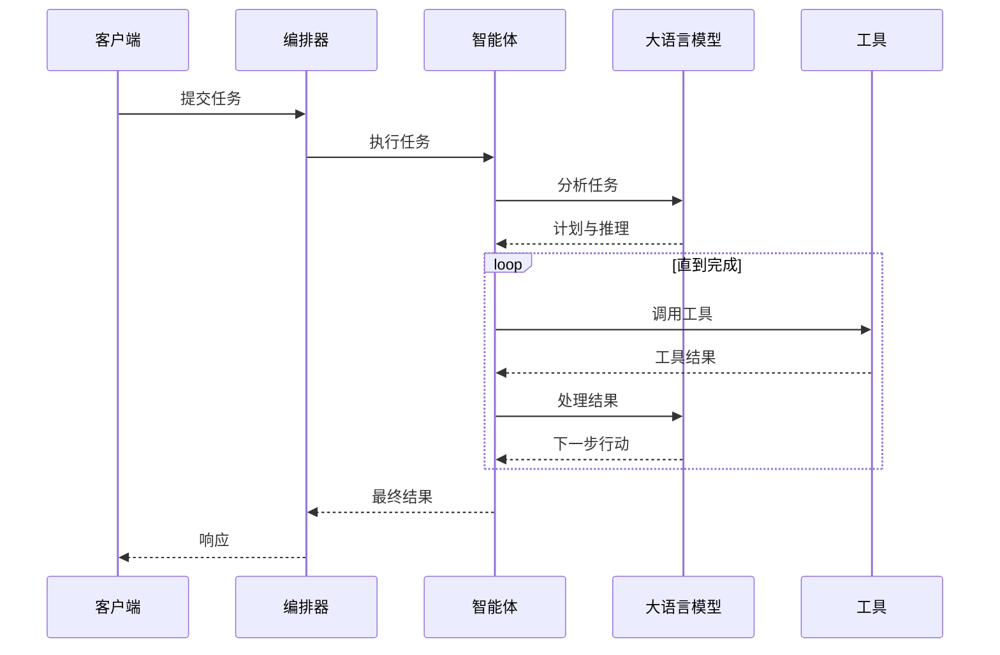

## 简介

**AI 智能体**是一个自主系统，能够感知环境、做出决策并采取行动以实现目标。在 Shannon 中，智能体是使用大型语言模型（LLM）和工具处理任务的基本执行单元。

## 智能体能力

Shannon 智能体可以：

<CardGroup cols={2}>
  <Card title="推理" icon="brain">
    使用 LLM 分析任务、规划解决方案并做出决策
  </Card>
  <Card title="执行工具" icon="wrench">
    调用函数、运行代码、搜索网络并与 API 交互
  </Card>
  <Card title="协作" icon="users">
    与其他智能体协作解决复杂的多步骤问题
  </Card>
  <Card title="学习" icon="graduation-cap">
    通过模式学习和缓存结果不断改进
  </Card>
</CardGroup>

## 智能体生命周期

以下是智能体处理任务的流程：



<Steps>
  <Step title="任务分析">
    智能体接收任务并分析需要完成的工作
  </Step>
  <Step title="规划">
    LLM 创建计划，可能会分解为多个步骤
  </Step>
  <Step title="工具选择">
    智能体识别需要使用哪些工具
  </Step>
  <Step title="执行">
    迭代执行工具并处理结果
  </Step>
  <Step title="综合">
    将结果组合成最终答案
  </Step>
</Steps>

## Shannon 中的智能体类型

### 单智能体（简单模式）

单个智能体处理整个任务而不进行分解。

**最适合：**
- 简单查询
- 事实检索
- 基本计算
- 快速响应

**示例：**
```python
client.submit_task(
    query="法国的首都是什么？"
)
```

<Note>
Shannon 会自动为简单查询选择单智能体模式。
</Note>

### 多智能体（标准/复杂模式）

多个专业智能体协同工作，由 Shannon 的编排器进行协调。

**最适合：**
- 复杂研究
- 多步骤工作流
- 需要不同专业知识的任务
- 需要并行处理的任务

**示例：**
```python
client.submit_task(
    query="研究前 5 大 AI 趋势，分析市场影响，并创建摘要"
)
```

<Note>
Shannon 会根据查询复杂度自动将复杂查询分解为多智能体工作流。
</Note>

## 智能体组件

### 1. LLM 大脑

由语言模型驱动的决策核心：

- **模型选择**：Shannon 根据任务复杂度自动选择模型
  - 小型任务 → `gpt-4o-mini`、`claude-haiku`
  - 复杂任务 → `gpt-4o`、`claude-opus`
- **上下文管理**：自动管理上下文窗口
- **缓存**：在适用时重用之前的 LLM 响应

### 2. 工具系统

智能体可以执行各种工具：

**内置工具：**
- Python 代码执行（WASI 沙箱隔离）
- 网络搜索（Google/Serper/Bing/Exa/Firecrawl）
- 文档检索
- 数学计算

**MCP 工具：**
Shannon 支持[模型上下文协议](https://modelcontextprotocol.io)进行外部工具集成。

**自定义工具：**
通过 OpenAPI 规范或 Python 实现添加您自己的工具。

### 3. 记忆系统

智能体维护两种类型的记忆：

**会话记忆：**
- 对话中的短期上下文
- 存储在 Redis（TTL 可配置，默认 30 天）
- 支持多轮对话

**向量记忆：**
- Qdrant 中的长期语义记忆
- 跨会话检索
- MMR 多样性获取相关上下文

## 平台配置

Shannon 的行为通过环境变量在平台级别进行配置：

```bash
# 在 .env（示例）
DEFAULT_MODEL_TIER=small           # small | medium | large
MAX_TOKENS_PER_REQUEST=10000       # 每次请求的令牌预算（LLM 服务）
MAX_COST_PER_REQUEST=0.50          # 每次请求的成本限制（美元，LLM 服务）
AGENT_TIMEOUT_SECONDS=600          # 代理执行超时（编排器）

# 重启服务以应用更改
docker compose restart
```

### 模型层级

Shannon 根据配置的层级自动选择模型：

| 层级 | 模型 | 用例 | 成本 |
|------|--------|----------|------|
| **SMALL** | gpt-4o-mini、claude-haiku | 简单查询、高容量 | $ |
| **MEDIUM** | gpt-4o、claude-sonnet | 通用目的 | $$ |
| **LARGE** | gpt-4、claude-opus | 复杂推理、关键任务 | $$$ |

<Tip>
Shannon 的智能路由器为每个任务选择最具成本效益的模型，通常可节省 60–90% 的成本（取决于工作负载）。
</Tip>

有关所有可用环境变量，请参阅[配置指南](/cn/quickstart/configuration)。

## 智能体协调模式

Shannon 使用经过验证的认知模式进行多智能体协调：

### 思维链（CoT）

每个步骤都基于前一步构建的顺序推理：

```
任务："计算复利"
步骤 1：确定公式
步骤 2：收集输入
步骤 3：计算结果
步骤 4：格式化输出
```

### 思维树（ToT）

探索性回溯以解决复杂问题：

```
任务："设计系统架构"
分支 1：微服务方法
  ├─ 评估优缺点
  └─ 估算复杂度
分支 2：单体方法
  ├─ 评估优缺点
  └─ 估算复杂度
选择：根据标准选择最佳选项
```

### ReAct（推理 + 行动）

用于动态任务的推理和行动交替：

```
思考："我需要找到最新的股票价格"
行动：在网络上搜索"AAPL 股票价格"
观察："$150.25"
思考："现在计算 10% 的收益"
行动：计算 150.25 * 1.10
结果："$165.28"
```

## 安全性和隔离

Shannon 智能体在安全的环境中运行：

<Card title="WASI 沙箱" icon="lock">
  所有代码执行都在 WebAssembly 系统接口沙箱中进行，具有以下特性：
  - **无网络访问**
  - **只读文件系统**
  - **内存限制**
  - **执行超时**
</Card>

### OPA 策略执行

控制智能体可以做什么：

```rego
# 示例策略：按团队限制模型
package shannon.teams.datascience

allow {
    input.team == "data-science"
    input.model in ["gpt-4o", "claude-sonnet"]
}

max_tokens = 50000 {
    input.team == "data-science"
}
```

## 最佳实践

### 1. 选择正确的模式

- **简单**：单步任务、快速响应
- **标准**：多步任务、中等复杂度
- **复杂**：研究、分析、高级推理

### 2. 设置预算限制

在平台级别配置令牌和成本限制以防止意外费用：

```bash
# 在 .env 文件中
MAX_TOKENS_PER_REQUEST=5000
MAX_COST_PER_REQUEST=1.0
```

通过任务状态监控成本：

```python
status = client.get_status(task_id, include_details=True)
if status.metrics:
    print(f"成本：${status.metrics.cost_usd:.4f}")
    print(f"令牌：{status.metrics.tokens_used}")
```

### 3. 使用会话保持上下文

对于多轮对话，使用一致的 `session_id`：

```python
session_id = "user-123-conversation"
client.submit_task(query="...", session_id=session_id)
```

### 4. 监控性能

检查指标以优化：

```python
# 等待任务完成
status = client.wait(handle.task_id, timeout=300)
if status.metrics:
    print(f"使用的令牌：{status.metrics.tokens_used}")
    print(f"成本：${status.metrics.cost_usd:.4f}")
    print(f"持续时间：{status.metrics.duration_seconds:.2f}秒")
```

## 下一步

<CardGroup cols={2}>
  <Card title="工作流" icon="diagram-project" href="/cn/quickstart/concepts/workflows">
    了解工作流模式
  </Card>
  <Card title="成本控制" icon="dollar-sign" href="/cn/quickstart/concepts/cost-control">
    掌握预算管理
  </Card>
  <Card title="API 参考" icon="code" href="/cn/api/overview">
    探索智能体 API
  </Card>
  <Card title="Python SDK" icon="python" href="/cn/sdk/python/quickstart">
    使用 SDK 构建
  </Card>
</CardGroup>


---

## 参与翻译

如果您想帮助翻译此文档，请访问我们的 [GitHub 仓库](https://github.com/Kocoro-lab/Shannon)。
