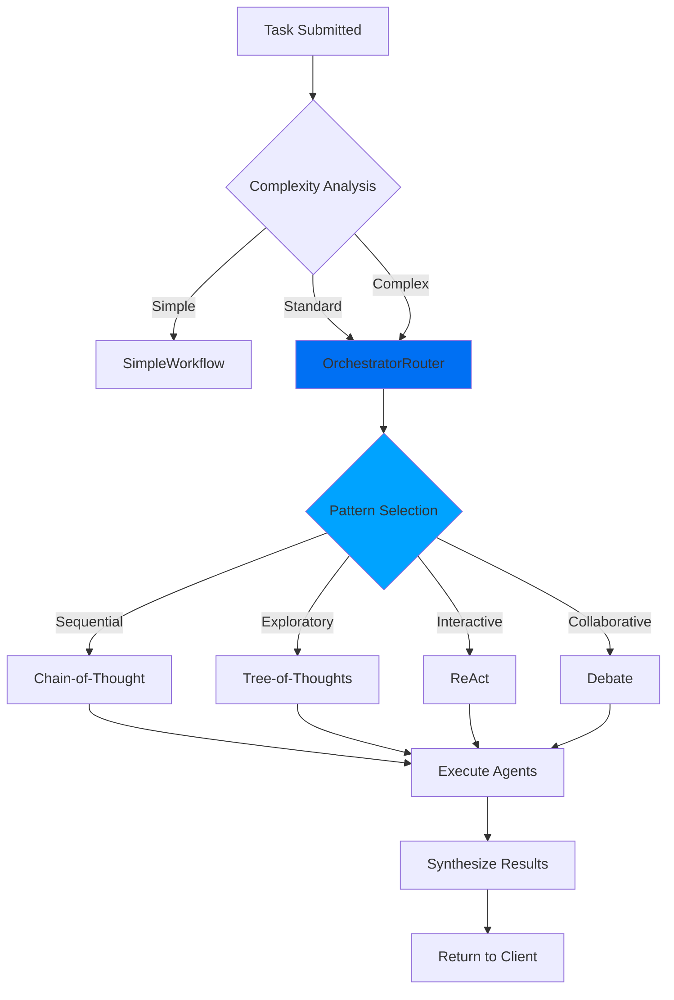
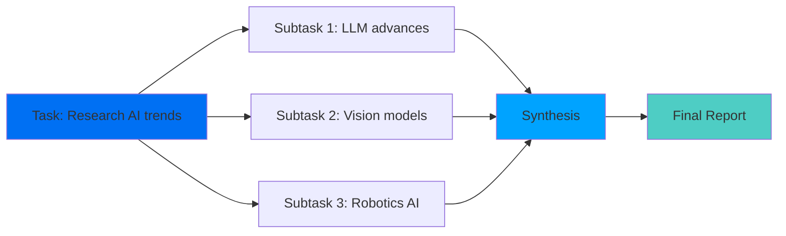

> 🚧 **翻译进行中** - 此文档正在从英文翻译为中文

**原文件**: `quickstart/concepts/workflows.mdx`
**英文版本**: [查看英文文档](/en/quickstart/concepts/workflows)

---


## What are Workflows?

Workflows in Shannon are durable, stateful processes that orchestrate AI agents to complete complex tasks. Built on [Temporal](https://temporal.io), they provide:

- **Durability**: Workflows survive service restarts and failures
- **Determinism**: Can be replayed for debugging
- **Visibility**: Full execution history and state inspection
- **Reliability**: Automatic retries and error handling

## Workflow Architecture



## Cognitive Patterns

Shannon implements several proven cognitive patterns for different task types:

### Chain-of-Thought (CoT)

Sequential reasoning where each step builds logically on the previous one.

**Best for:**
- Mathematical problems
- Step-by-step analysis
- Linear workflows

**Example:**
```python
client.submit_task(
    query="Calculate the ROI of a $100k investment with 8% annual return over 5 years"
)
```

<Note>
Shannon automatically applies Chain-of-Thought reasoning for sequential mathematical and analytical tasks.
</Note>

**Execution:**
```
Step 1: Identify formula (ROI = (Final Value - Initial Value) / Initial Value)
Step 2: Calculate year-by-year growth
Step 3: Compute final value ($146,933)
Step 4: Calculate ROI (46.93%)
```

### Tree-of-Thoughts (ToT)

Explores multiple solution paths simultaneously, evaluates them, and selects the best.

**Best for:**
- Design decisions
- Strategic planning
- Problems with multiple approaches

**Example:**
```python
client.submit_task(
    query="Design a scalable message queue system. Evaluate multiple architectures and recommend the best approach."
)
```

<Note>
Shannon automatically applies Tree-of-Thoughts exploration for design and planning tasks with multiple solution paths.
</Note>

**Execution:**
```
Branch 1: Redis-based solution
  ├─ Pros: Fast, simple, familiar
  ├─ Cons: Limited persistence, memory-bound
  └─ Score: 7/10

Branch 2: Kafka-based solution
  ├─ Pros: High throughput, durable, battle-tested
  ├─ Cons: Operational complexity, resource-heavy
  └─ Score: 9/10

Branch 3: RabbitMQ-based solution
  ├─ Pros: Feature-rich, good balance
  ├─ Cons: Lower throughput than Kafka
  └─ Score: 8/10

Selected: Kafka (highest score for requirements)
```

### ReAct (Reasoning + Acting)

Interleaves thinking and acting in loops, ideal for dynamic problem-solving.

**Best for:**
- Research tasks
- Debugging problems
- Adaptive workflows

**Example:**
```python
client.submit_task(
    query="Find the latest Rust async runtime benchmarks"
)
```

<Note>
Shannon automatically applies ReAct (Reasoning + Acting) for research and iterative discovery tasks.
</Note>

**Execution:**
```
Think: "I need to search for recent benchmarks"
Act: web_search("Rust async runtime benchmarks 2024")
Observe: Found 3 articles from 2024
Think: "Let me get detailed comparison data"
Act: web_search("tokio vs async-std vs smol benchmark comparison")
Observe: Found performance data
Think: "Now I can summarize findings"
Act: Synthesize results into report
```

### Debate Pattern

Multiple agents argue different perspectives, then synthesize consensus.

**Best for:**
- Decision making
- Evaluating trade-offs
- Balanced analysis

**Example:**
```python
client.submit_task(
    query="Should we migrate our monolith to microservices? Provide arguments for and against, then recommend."
)
```

<Note>
Shannon automatically applies the Debate pattern for decision-making tasks requiring multiple perspectives.
</Note>

**Execution:**
```
Agent 1 (Pro-Microservices):
  - Better scalability
  - Independent deployment
  - Technology flexibility

Agent 2 (Pro-Monolith):
  - Simpler operations
  - Easier debugging
  - Lower latency

Agent 3 (Synthesizer):
  - Evaluates both arguments
  - Considers context
  - Provides recommendation
```

## Task Decomposition

For complex tasks, Shannon automatically decomposes them into subtasks:

### DAG (Directed Acyclic Graph) Execution



**Parallel Execution:**
Subtasks without dependencies run in parallel, reducing latency.

**Example:**
```python
# This query will be automatically decomposed into 3 parallel subtasks
client.submit_task(
    query="Research: 1) GPT-4 capabilities, 2) Claude 3 features, 3) Gemini updates"
)
```

### Decomposition Strategy

Shannon analyzes tasks and creates execution plans internally. While the decomposition structure isn't directly exposed in the SDK response, you can observe the workflow execution through events:

```python
# Stream events to see decomposition in action
for event in client.stream(workflow_id):
    if event.type == "TASK_DECOMPOSED":
        print(f"Task decomposed: {event.message}")
    elif event.type == "SUBTASK_STARTED":
        print(f"Subtask started: {event.message}")
    elif event.type == "SUBTASK_COMPLETED":
        print(f"Subtask completed: {event.message}")
```

**Internal Structure** (for understanding, not directly accessible):
- Subtasks run in parallel when no dependencies exist
- Synthesis task waits for all subtasks to complete
- Each subtask is assigned to specialized agents

## Workflow Activities

Temporal workflows are composed of activities - discrete units of work:

| Activity | Purpose |
|----------|---------|
| **DecomposeTask** | Analyzes task and creates subtasks |
| **ExecuteAgent** | Runs a single agent task |
| **SynthesizeResults** | Combines outputs from multiple agents |
| **UpdateSessionResult** | Persists session state |
| **RecordQuery** | Stores in vector memory |
| **FetchSessionMemory** | Retrieves relevant context |

## Monitoring Workflows

### Via Python SDK

```python
# Get task status
status = client.get_status(task_id)

print(f"Status: {status.status}")
print(f"Progress: {status.progress}")
if status.result:
    print(f"Result: {status.result}")
```

<Note>
Task decomposition happens internally in Shannon. Use event streaming to observe workflow execution in real-time.
</Note>

### Via Temporal UI

Visit http://localhost:8088 to see:
- Workflow execution timeline
- Activity statuses
- Input/output payloads
- Error traces
- Replay history

## Deterministic Replay

Shannon workflows are deterministic - they produce the same result when replayed with the same inputs.

**Use cases:**
- **Debugging**: Replay failed workflows to find bugs
- **Testing**: Validate code changes don't break existing workflows
- **Auditing**: Understand exactly what happened

**Example:**
```bash
# Export workflow history
make replay-export WORKFLOW_ID=task-123 OUT=history.json

# Replay against current code
make replay HISTORY=history.json

# If code changed in non-deterministic way, replay fails
```

## Workflow Configuration

Workflow behavior is configured at the platform level via environment variables:

```bash
# In .env file
MAX_AGENTS_PER_TASK=5          # Maximum parallel agents
MAX_TOKENS_PER_REQUEST=50000   # Token budget per task
MAX_COST_PER_REQUEST=5.0       # Cost limit (USD)
WORKFLOW_TIMEOUT_SECONDS=600   # Task timeout
```

Monitor workflow execution via streaming events:

```python
handle = client.submit_task(query="Complex analysis task")

# Stream workflow events
for event in client.stream(handle.workflow_id):
    print(f"[{event.type}] {event.message}")
```

See [Configuration Guide](/cn/quickstart/configuration) for all environment variables.

## Error Handling

Workflows automatically handle failures:

<AccordionGroup>
  <Accordion title="Retries">
    Activities retry automatically with exponential backoff:
    ```
    Attempt 1: Immediate
    Attempt 2: After 1s
    Attempt 3: After 2s
    Attempt 4: After 4s
    ...
    Max: 5 attempts
    ```
  </Accordion>

  <Accordion title="Circuit Breakers">
    If an LLM provider is failing, circuit breaker opens and routes to fallback:
    ```
    Primary: OpenAI (failing)
    Fallback: Anthropic (healthy)
    ```
  </Accordion>

  <Accordion title="Graceful Degradation">
    If complex mode fails, automatically falls back to simpler execution.
  </Accordion>

  <Accordion title="Budget Exceeded">
    Tasks halt immediately when budget limits are reached, preventing cost overruns.
  </Accordion>
</AccordionGroup>

## Best Practices

### 1. Choose the Right Strategy

Match the cognitive strategy to your task:

| Task Type | Recommended Strategy |
|-----------|---------------------|
| Simple Q&A | DIRECT (Single agent) |
| Research | REACT (Web search + synthesis) |
| Analysis | DECOMPOSE (Break into parts) |
| Design | EXPLORATORY (ToT evaluation) |

### 2. Use Appropriate Mode

- **simple**: Direct execution, no overhead
- **standard**: Task decomposition, multi-agent
- **complex**: Full cognitive patterns (CoT, ToT, etc.)

### 3. Monitor Progress

Stream events to track workflow execution:

```python
for event in client.stream(workflow_id):
    if event.type == "AGENT_THINKING":
        print(f"Agent thinking: {event.message}")
    elif event.type == "SUBTASK_COMPLETED":
        print(f"Subtask done: {event.message}")
```

### 4. Set Timeouts

Prevent workflows from running indefinitely via environment variables:

```bash
# In .env file
WORKFLOW_TIMEOUT_SECONDS=300  # 5 minute limit
REQUEST_TIMEOUT_SECONDS=600   # Overall request timeout
```

## Next Steps

<CardGroup cols={2}>
  <Card title="Cost Control" icon="dollar-sign" href="/cn/quickstart/concepts/cost-control">
    Learn budget management
  </Card>
  <Card title="Streaming" icon="stream" href="/cn/quickstart/concepts/streaming">
    Real-time event streaming
  </Card>
  <Card title="Architecture" icon="boxes" href="/cn/architecture/overview">
    System architecture overview
  </Card>
  <Card title="Python SDK" icon="code" href="/cn/sdk/python/quickstart">
    Get started with the SDK
  </Card>
</CardGroup>


---

## 参与翻译

如果您想帮助翻译此文档，请访问我们的 [GitHub 仓库](https://github.com/Kocoro-lab/Shannon)。
