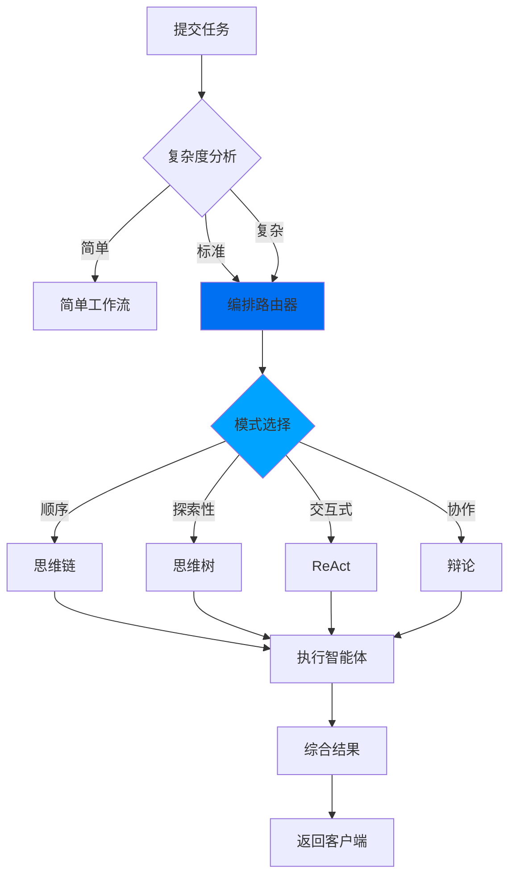
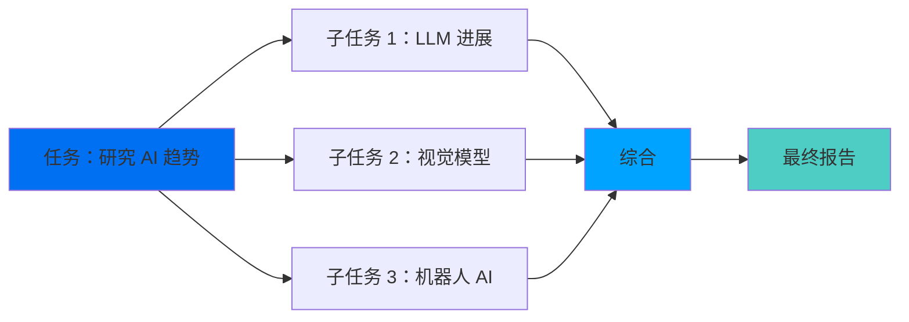

## 什么是工作流？

Shannon 中的工作流是持久的、有状态的流程，用于编排 AI 智能体完成复杂任务。基于 [Temporal](https://temporal.io) 构建，它们提供：

- **持久性**：工作流在服务重启和故障后仍然存活
- **确定性**：可以重放以进行调试
- **可见性**：完整的执行历史和状态检查
- **可靠性**：自动重试和错误处理

## 工作流架构



## 认知模式

Shannon 为不同类型的任务实现了几种经过验证的认知模式：

### 思维链（CoT）

顺序推理，每个步骤在逻辑上建立在前一步之上。

**最适合：**
- 数学问题
- 逐步分析
- 线性工作流

**示例：**
```python
client.submit_task(
    query="计算 10 万美元投资在 8% 年回报率下 5 年的投资回报率"
)
```

<Note>
Shannon 会自动对顺序数学和分析任务应用思维链推理。
</Note>

**执行：**
```
步骤 1：确定公式（ROI = (最终价值 - 初始价值) / 初始价值）
步骤 2：逐年计算增长
步骤 3：计算最终价值（$146,933）
步骤 4：计算 ROI（46.93%）
```

### 思维树（ToT）

同时探索多个解决方案路径，评估它们，并选择最佳方案。

**最适合：**
- 设计决策
- 战略规划
- 有多种方法的问题

**示例：**
```python
client.submit_task(
    query="设计一个可扩展的消息队列系统。评估多个架构并推荐最佳方法。"
)
```

<Note>
Shannon 会自动对具有多个解决方案路径的设计和规划任务应用思维树探索。
</Note>

**执行：**
```
分支 1：基于 Redis 的解决方案
  ├─ 优点：快速、简单、熟悉
  ├─ 缺点：持久性有限、受内存限制
  └─ 评分：7/10

分支 2：基于 Kafka 的解决方案
  ├─ 优点：高吞吐量、持久、经过实战检验
  ├─ 缺点：运维复杂、资源密集
  └─ 评分：9/10

分支 3：基于 RabbitMQ 的解决方案
  ├─ 优点：功能丰富、平衡性好
  ├─ 缺点：吞吐量低于 Kafka
  └─ 评分：8/10

选择：Kafka（对需求评分最高）
```

### ReAct（推理 + 行动）

在循环中交替思考和行动，非常适合动态问题解决。

**最适合：**
- 研究任务
- 调试问题
- 自适应工作流

**示例：**
```python
client.submit_task(
    query="查找最新的 Rust 异步运行时基准测试"
)
```

<Note>
Shannon 会自动对研究和迭代发现任务应用 ReAct（推理 + 行动）模式。
</Note>

**执行：**
```
思考："我需要搜索最近的基准测试"
行动：web_search("Rust 异步运行时基准测试 2024")
观察：找到 3 篇来自 2024 年的文章
思考："让我获取详细的比较数据"
行动：web_search("tokio vs async-std vs smol 基准比较")
观察：找到性能数据
思考："现在我可以总结发现"
行动：将结果综合成报告
```

### 辩论模式

多个智能体争论不同观点，然后综合共识。

**最适合：**
- 决策制定
- 评估权衡
- 平衡分析

**示例：**
```python
client.submit_task(
    query="我们应该将单体架构迁移到微服务吗？提供赞成和反对的论据，然后推荐。"
)
```

<Note>
Shannon 会自动对需要多个视角的决策任务应用辩论模式。
</Note>

**执行：**
```
智能体 1（支持微服务）：
  - 更好的可扩展性
  - 独立部署
  - 技术灵活性

智能体 2（支持单体）：
  - 运维更简单
  - 更容易调试
  - 延迟更低

智能体 3（综合者）：
  - 评估两方论据
  - 考虑上下文
  - 提供推荐
```

## 任务分解

对于复杂任务，Shannon 会自动将它们分解为子任务：

### DAG（有向无环图）执行



**并行执行：**
没有依赖关系的子任务并行运行，减少延迟。

**示例：**
```python
# 此查询将自动分解为 3 个并行子任务
client.submit_task(
    query="研究：1) GPT-4 能力，2) Claude 3 功能，3) Gemini 更新"
)
```

### 分解策略

Shannon 在内部分析任务并创建执行计划。虽然分解结构不会直接在 SDK 响应中暴露，但您可以通过事件观察工作流执行：

```python
# 流式传输事件以查看分解的实际操作
for event in client.stream(workflow_id):
    if event.type == "TASK_DECOMPOSED":
        print(f"任务已分解：{event.message}")
    elif event.type == "SUBTASK_STARTED":
        print(f"子任务已开始：{event.message}")
    elif event.type == "SUBTASK_COMPLETED":
        print(f"子任务已完成：{event.message}")
```

**内部结构**（用于理解，不能直接访问）：
- 当不存在依赖关系时，子任务并行运行
- 综合任务等待所有子任务完成
- 每个子任务分配给专门的智能体

## 工作流活动

Temporal 工作流由活动组成 - 离散的工作单元：

| 活动 | 目的 |
|----------|---------|
| **DecomposeTask** | 分析任务并创建子任务 |
| **ExecuteAgent** | 运行单个智能体任务 |
| **SynthesizeResults** | 组合多个智能体的输出 |
| **UpdateSessionResult** | 持久化会话状态 |
| **RecordQuery** | 存储到向量记忆 |
| **FetchSessionMemory** | 检索相关上下文 |

## 监控工作流

### 通过 Python SDK

```python
# 获取任务状态
status = client.get_status(task_id)

print(f"状态：{status.status}")
print(f"进度：{status.progress}")
if status.result:
    print(f"结果：{status.result}")
```

<Note>
任务分解在 Shannon 内部进行。使用事件流式传输实时观察工作流执行。
</Note>

### 通过 Temporal UI

访问 http://localhost:8088 可以查看：
- 工作流执行时间线
- 活动状态
- 输入/输出载荷
- 错误跟踪
- 重放历史

## 确定性重放

Shannon 工作流是确定性的 - 当使用相同输入重放时，它们会产生相同的结果。

**用例：**
- **调试**：重放失败的工作流以查找错误
- **测试**：验证代码更改不会破坏现有工作流
- **审计**：准确了解发生了什么

**示例：**
```bash
# 导出工作流历史
make replay-export WORKFLOW_ID=task-123 OUT=history.json

# 针对当前代码重放
make replay HISTORY=history.json

# 如果代码以非确定性方式更改，重放失败
```

## 工作流配置

工作流行为通过环境变量在平台级别进行配置：

```bash
# 在 .env 文件中
MAX_AGENTS_PER_TASK=5          # 最大并行智能体数
MAX_TOKENS_PER_REQUEST=50000   # 每个任务的令牌预算
MAX_COST_PER_REQUEST=5.0       # 成本限制（美元）
WORKFLOW_TIMEOUT_SECONDS=600   # 任务超时时间
```

通过流式传输事件监控工作流执行：

```python
handle = client.submit_task(query="复杂分析任务")

# 流式传输工作流事件
for event in client.stream(handle.workflow_id):
    print(f"[{event.type}] {event.message}")
```

有关所有环境变量，请参阅[配置指南](/cn/quickstart/configuration)。

## 错误处理

工作流自动处理故障：

<AccordionGroup>
  <Accordion title="重试">
    活动自动使用指数退避进行重试：
    ```
    尝试 1：立即
    尝试 2：1秒后
    尝试 3：2秒后
    尝试 4：4秒后
    ...
    最多：5次尝试
    ```
  </Accordion>

  <Accordion title="熔断器">
    如果 LLM 提供商失败，熔断器打开并路由到备用：
    ```
    主要：OpenAI（失败）
    备用：Anthropic（健康）
    ```
  </Accordion>

  <Accordion title="优雅降级">
    如果复杂模式失败，自动回退到更简单的执行。
  </Accordion>

  <Accordion title="预算超支">
    当达到预算限制时，任务立即停止，防止成本超支。
  </Accordion>
</AccordionGroup>

## 最佳实践

### 1. 选择正确的策略

将认知策略与您的任务相匹配：

| 任务类型 | 推荐策略 |
|-----------|---------------------|
| 简单问答 | DIRECT（单智能体） |
| 研究 | REACT（网络搜索 + 综合） |
| 分析 | DECOMPOSE（分解为部分） |
| 设计 | EXPLORATORY（ToT 评估） |

### 2. 使用适当的模式

- **simple**：直接执行，无开销
- **standard**：任务分解，多智能体
- **complex**：完整认知模式（CoT、ToT 等）

### 3. 监控进度

流式传输事件以跟踪工作流执行：

```python
for event in client.stream(workflow_id):
    if event.type == "AGENT_THINKING":
        print(f"智能体思考：{event.message}")
    elif event.type == "SUBTASK_COMPLETED":
        print(f"子任务完成：{event.message}")
```

### 4. 设置超时

通过环境变量防止工作流无限运行：

```bash
# 在 .env 文件中
WORKFLOW_TIMEOUT_SECONDS=300  # 5 分钟限制
REQUEST_TIMEOUT_SECONDS=600   # 总请求超时
```

## 下一步

<CardGroup cols={2}>
  <Card title="成本控制" icon="dollar-sign" href="/cn/quickstart/concepts/cost-control">
    学习预算管理
  </Card>
  <Card title="流式传输" icon="stream" href="/cn/quickstart/concepts/streaming">
    实时事件流式传输
  </Card>
  <Card title="架构" icon="boxes" href="/cn/architecture/overview">
    系统架构概述
  </Card>
  <Card title="Python SDK" icon="code" href="/cn/sdk/python/quickstart">
    开始使用 SDK
  </Card>
</CardGroup>


---

## 参与翻译

如果您想帮助翻译此文档，请访问我们的 [GitHub 仓库](https://github.com/Kocoro-lab/Shannon)。
