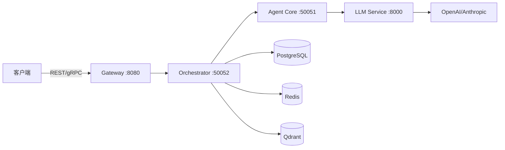

## 什么是 Shannon？

Shannon 是一个生产级 AI 智能体编排平台，旨在解决大规模部署 AI 智能体时的关键挑战：

<CardGroup cols={2}>
  <Card
    title="成本控制"
    icon="dollar-sign"
  >
    硬性预算限制、令牌跟踪和智能模型选择，实现 85-95% 的成本节省
  </Card>
  <Card
    title="可靠性"
    icon="shield-check"
  >
    确定性回放调试、熔断器和自动降级
  </Card>
  <Card
    title="安全性"
    icon="lock"
  >
    WASI 沙箱代码执行、OPA 策略执行、多租户隔离
  </Card>
  <Card
    title="可扩展性"
    icon="chart-line"
  >
    基于 Temporal 的分布式工作流、水平扩展、全面的可观测性
  </Card>
</CardGroup>

## 核心功能

### 多智能体编排
Shannon 使用经过验证的认知模式（如思维链 (CoT)、思维树 (ToT) 和 ReAct）协调多个 AI 智能体，实现复杂的任务分解和并行执行。

### 生产就绪
专为生产工作负载打造：
- **Temporal 工作流**：持久化、确定性执行
- **WASI 沙箱**：安全的 Python 代码执行
- **熔断器**和故障保护
- **全面的可观测性**：Prometheus 指标和 OpenTelemetry 追踪

### 多提供商支持
无缝切换 LLM 提供商：
- OpenAI (GPT-4, GPT-3.5)
- Anthropic (Claude 3 Opus/Sonnet/Haiku)
- Google Gemini
- Groq、Azure OpenAI、Ollama 等

## 快速开始

在 10 分钟内启动 Shannon：

<Card
  title="安装指南"
  icon="rocket"
  href="/cn/quickstart/installation"
>
  使用 Docker Compose 一键设置 Shannon
</Card>

## 架构概览

Shannon 由四个主要组件协同工作：

<CardGroup cols={2}>
  <Card title="Gateway" icon="door-open">
    REST API 层，提供身份验证和速率限制
  </Card>
  <Card title="Orchestrator" icon="diagram-project">
    基于 Temporal 的工作流协调和任务路由
  </Card>
  <Card title="Agent Core" icon="robot">
    具有 WASI 沙箱的安全执行层
  </Card>
  <Card title="LLM Service" icon="brain">
    多提供商 LLM 网关，具有智能缓存
  </Card>
</CardGroup>

## 使用场景

Shannon 擅长于：

- **复杂任务自动化**：将复杂任务分解为可管理的子任务，并自动编排
- **研究与分析**：协调多个智能体进行全面研究和综合
- **代码生成**：在 WASI 沙箱中安全执行 Python 代码
- **多步骤工作流**：能够在故障中存活并可重放用于调试的持久化工作流

## 下一步

<CardGroup cols={2}>
  <Card
    title="快速入门教程"
    icon="play"
    href="/cn/quickstart/quickstart"
  >
    5 分钟内提交您的第一个任务
  </Card>
  <Card
    title="核心概念"
    icon="book"
    href="/cn/quickstart/concepts/agents"
  >
    了解智能体、工作流和模式
  </Card>
  <Card
    title="API 参考"
    icon="code"
    href="/cn/api/overview"
  >
    探索 REST 和 gRPC API
  </Card>
  <Card
    title="Python SDK"
    icon="python"
    href="/cn/sdk/python/quickstart"
  >
    使用 Python SDK 轻松集成
  </Card>
</CardGroup>
