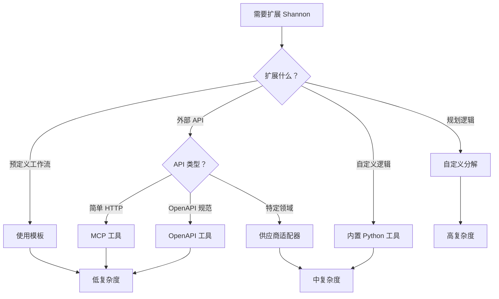

## 概述

本指南概述了自定义 Shannon 的可扩展模式，同时保持升级兼容性和关注点的清晰分离。

<CardGroup cols={2}>
  <Card title="模板" icon="file-code">
    System 1 - 低开销的预构建工作流
  </Card>
  <Card title="工具" icon="wrench">
    通过 MCP、OpenAPI 或 Python 添加功能
  </Card>
  <Card title="供应商适配器" icon="plug">
    特定领域集成，无需更改核心
  </Card>
  <Card title="分解" icon="diagram-project">
    System 2 - 自定义规划和推理逻辑
  </Card>
</CardGroup>

## 扩展方法比较

| 扩展类型 | 复杂度 | 代码更改 | 用例 |
|---------------|------------|--------------|----------|
| **模板** | 低 | 仅 YAML | 可重复的工作流 |
| **MCP/OpenAPI 工具** | 低 | 仅配置 | 外部 API |
| **内置工具** | 中 | 仅 Python | 自定义逻辑 |
| **供应商适配器** | 中 | Python + 配置 | 特定领域集成 |
| **分解** | 高 | Go + Python | 自定义规划逻辑 |

<Tip>
对于大多数用例，**模板**和**供应商适配器**提供了功能和简单性的最佳平衡。
</Tip>

## 扩展分解（System 2）

**用于自定义规划和推理逻辑**

编排器调用 LLM 服务端点 `/agent/decompose` 进行规划。

### 何时使用

- 自定义任务分解策略
- 特定领域的规划启发式
- LLM 请求的前/后处理
- 与外部规划系统集成

### 实现选项

<Tabs>
  <Tab title="轻量级 (Go)">
    最适合：LLM 请求的前/后处理

在 `go/orchestrator/internal/activities/decompose.go` 中添加启发式：

```go
// 示例：分解前预处理查询
func PreprocessQuery(query string) string {
    // 添加特定领域的上下文
    // 规范化输入格式
    // 注入额外的约束
    return enhancedQuery
}

// 示例：后处理分解响应
func PostprocessDecomposition(resp *DecompositionResponse) {
    // 验证子任务
    // 添加回退步骤
    // 优化执行顺序
}
```
  </Tab>

  <Tab title="完全自定义 (Python)">
    最适合：完整的自定义规划逻辑

在 `python/llm-service/llm_service/api/agent.py` 中添加新端点：

```python
@router.post("/agent/decompose/custom")
async def custom_decompose(request: DecomposeRequest):
    """特定领域任务的自定义分解逻辑。"""

    # 你的自定义规划逻辑
    subtasks = custom_planning_algorithm(request.query)

    # 返回兼容的响应
    return DecompositionResponse(
        subtasks=subtasks,
        pattern="custom",
        complexity=calculate_complexity(subtasks)
    )
```

通过特性标志或上下文键路由：

```go
// 在编排器中
if ctx.CustomDecomposition {
    endpoint = "/agent/decompose/custom"
} else {
    endpoint = "/agent/decompose"
}
```
  </Tab>
</Tabs>

<Warning>
保持响应架构与 `DecompositionResponse` 兼容，以避免破坏编排器工作流。
</Warning>

## 添加/自定义模板（System 1）

**用于低开销的可重复工作流**

### 何时使用

- 预定义工作流（数据分析、代码审查等）
- 无需 AI 规划即可快速执行任务
- 常用模式
- 性能关键路径

### 创建模板

<Steps>
  <Step title="创建模板文件">
    将模板放在自己的目录中：

```yaml
# templates/custom/research-workflow.yaml
name: "research_workflow"
description: "多阶段研究和分析工作流"
version: "1.0.0"

extends: []  # 可选：从其他模板继承

defaults:
  model_tier: "medium"
  budget_agent_max: 5000
  require_approval: false

nodes:
  - id: "search"
    type: "simple"
    strategy: "react"
    tools_allowlist: ["web_search", "calculator"]
    budget_max: 1000
    depends_on: []

  - id: "analyze"
    type: "cognitive"
    strategy: "chain_of_thought"
    tools_allowlist: ["python_executor", "calculator"]
    budget_max: 2000
    depends_on: ["search"]

  - id: "synthesize"
    type: "simple"
    strategy: "react"
    tools_allowlist: ["web_search"]
    budget_max: 1000
    depends_on: ["analyze"]

edges:
  - from: "search"
    to: "analyze"
  - from: "analyze"
    to: "synthesize"

metadata:
  category: "research"
  author: "your-team"
```
  </Step>

  <Step title="注册模板">
    使用模板目录初始化注册表：

```go
// 在编排器初始化中
registry := templates.InitTemplateRegistry(
    "./templates/builtin",
    "./templates/custom",  // 你的自定义模板
)

// 验证所有模板
if err := registry.Finalize(); err != nil {
    log.Fatal(err)
}
```
  </Step>

  <Step title="使用模板">
    通过 gRPC API：

```bash
grpcurl -plaintext -d '{
  "query": "对 AI 趋势进行研究",
  "context": {
    "template": "research_workflow",
    "template_version": "1.0.0",
    "disable_ai": true
  }
}' localhost:50052 shannon.orchestrator.OrchestratorService/SubmitTask
```

通过 HTTP 网关：

```bash
curl -X POST http://localhost:8080/api/v1/tasks \
  -H "Content-Type: application/json" \
  -d '{
    "query": "对 AI 趋势进行研究",
    "context": {
      "template": "research_workflow",
      "template_version": "1.0.0"
    }
  }'
```
  </Step>

  <Step title="列出可用模板">
```bash
# 通过 gRPC
grpcurl -plaintext -d '{}' localhost:50052 \
  shannon.orchestrator.OrchestratorService/ListTemplates
```

注意：HTTP 网关的模板列表端点可能尚未实现。请使用 gRPC 进行模板发现。
  </Step>
</Steps>

### 模板最佳实践

<AccordionGroup>
  <Accordion title="使用 extends 获取通用默认值">
```yaml
# 基础模板 (base.yaml)
name: "base_research"
version: "1.0.0"
defaults:
  model_tier: "medium"
  budget_agent_max: 5000
  require_approval: false

# 子模板 (advanced_research.yaml)
name: "advanced_research"
version: "1.0.0"
extends: ["base_research"]  # 继承所有默认值
defaults:
  budget_agent_max: 10000  # 覆盖特定值
```
  </Accordion>

  <Accordion title="使用 registry.Finalize() 验证">
```go
registry := templates.InitTemplateRegistry("./templates")

// 验证：
// - YAML 语法
// - 必需字段
// - 参数类型
// - 工具引用
if err := registry.Finalize(); err != nil {
    log.Fatalf("模板验证失败: %v", err)
}
```
  </Accordion>

  <Accordion title="保持工具白名单">
```yaml
# 为安全起见显式列出允许的工具
tools_allowlist:
  - "web_search"
  - "calculator"
  - "python_executor"

# 不要使用：
# tools_allowlist: ["*"]  # 太宽松
```
  </Accordion>
</AccordionGroup>

## 安全添加工具

**用于扩展 Shannon 的功能**

Shannon 支持三种工具集成方法：

<CardGroup cols={3}>
  <Card title="MCP 工具" icon="cloud">
    零代码更改的外部 HTTP API
  </Card>
  <Card title="OpenAPI 工具" icon="file-code">
    从 OpenAPI 规范自动生成
  </Card>
  <Card title="内置工具" icon="code">
    用于复杂逻辑的 Python 工具
  </Card>
</CardGroup>

### 安全考虑

<Warning>
始终在模板中使用 `tools_allowlist` 来限制可使用的工具。
</Warning>

**好：**
```yaml
# 带限制工具的模板
tools_allowlist:
  - "web_search"
  - "calculator"
  - "my_custom_tool"
```

**坏：**
```yaml
# 不要允许所有工具
tools_allowlist: ["*"]
```

### 在标志后保持实验性工具

```yaml
# config/features.yaml
experimental_tools:
  enabled: false  # 默认禁用

custom_analytics:
  enabled: ${ENABLE_CUSTOM_ANALYTICS}  # 基于环境的切换
```

```python
# 在工具注册中
if config.get("experimental_tools.enabled"):
    registry.register(ExperimentalTool)
```

<Card title="完整工具指南" icon="wrench" href="/cn/tutorials/custom-tools">
  查看添加 MCP、OpenAPI 和内置 Python 工具的完整指南
</Card>

## 供应商扩展

**用于特定领域的代理和 API 集成**

供应商适配器模式允许您集成专有 API 和专门的代理，而无需修改 Shannon 的核心代码。

### 架构

```
通用 Shannon（开源）
├── python/llm-service/llm_service/tools/openapi_tool.py  # 通用加载器
├── python/llm-service/llm_service/roles/presets.py       # 通用角色
├── go/orchestrator/internal/activities/agent.go          # 通用镜像
└── config/shannon.yaml                                    # 基础配置

供应商扩展（私有）
├── config/overlays/shannon.vendor.yaml                    # 供应商配置
├── config/openapi_specs/vendor_api.yaml                   # API 规范
├── python/llm-service/llm_service/tools/vendor_adapters/  # 转换
│   ├── __init__.py                                        # 注册表
│   └── vendor.py                                          # VendorAdapter
└── python/llm-service/llm_service/roles/vendor/           # 代理角色
    ├── __init__.py
    └── custom_agent.py                                    # 系统提示
```

### 何时使用供应商扩展

使用场景：
- 特定领域的 API 集成（分析、CRM、电子商务）
- 自定义字段名称转换
- 具有领域知识的专门代理角色
- 会话上下文注入（账户 ID、租户 ID）
- 私有/专有工具配置

### 快速开始

<Steps>
  <Step title="创建供应商适配器">
```python
# python/llm-service/llm_service/tools/vendor_adapters/myvendor.py
class MyVendorAdapter:
    def transform_body(self, body, operation_id, prompt_params):
        # 字段别名
        if "metrics" in body:
            body["metrics"] = [m.replace("users", "mv:users") for m in body["metrics"]]

        # 注入会话上下文
        if prompt_params:
            body.update(prompt_params)

        return body
```
  </Step>

  <Step title="注册适配器">
```python
# python/llm-service/llm_service/tools/vendor_adapters/__init__.py
def get_vendor_adapter(name: str):
    if name.lower() == "myvendor":
        from .myvendor import MyVendorAdapter
        return MyVendorAdapter()
    return None
```
  </Step>

  <Step title="创建配置覆盖">
```yaml
# config/overlays/shannon.myvendor.yaml
openapi_tools:
  myvendor_api:
    enabled: true
    spec_url: file:///app/config/openapi_specs/myvendor_api.yaml
    auth_type: bearer
    auth_config:
      vendor: myvendor  # 触发适配器加载
      token: "${MYVENDOR_API_TOKEN}"
    category: custom
```
  </Step>

  <Step title="（可选）创建专门的代理">
```python
# python/llm-service/llm_service/roles/myvendor/custom_agent.py
CUSTOM_AGENT_PRESET = {
    "name": "myvendor_agent",
    "system_prompt": "你是一个专门用于...的代理",
    "allowed_tools": ["myvendor_query", "myvendor_analyze"],
    "temperature": 0.7,
}
```

使用优雅降级注册：
```python
# roles/presets.py
try:
    from .myvendor.custom_agent import CUSTOM_AGENT_PRESET
    _PRESETS["myvendor_agent"] = CUSTOM_AGENT_PRESET
except ImportError:
    pass  # 没有供应商模块，Shannon 也能正常工作
```
  </Step>

  <Step title="通过环境使用">
```bash
SHANNON_CONFIG_PATH=config/overlays/shannon.myvendor.yaml
MYVENDOR_API_TOKEN=your_token_here
```
  </Step>
</Steps>

### 优势

- ✅ **零 Shannon 核心更改** - 所有供应商逻辑隔离
- ✅ **清晰分离** - 通用基础设施与供应商特定
- ✅ **条件加载** - 如果供应商模块不可用，优雅降级
- ✅ **易于维护** - 供应商代码在单独的目录中
- ✅ **可隔离测试** - 独立进行单元测试适配器

<Card title="完整供应商适配器指南" icon="plug" href="/cn/tutorials/vendor-adapters">
  包含示例、测试策略和最佳实践的综合指南
</Card>

## 人工批准

**用于控制敏感操作**

通过 SubmitTask 请求传递 `require_approval` 以实现人工参与控制。

### 配置

```yaml
# config/features.yaml
approvals:
  enabled: true
  dangerous_tools:
    - "file_write"
    - "code_execution"
    - "database_query"
  complexity_threshold: 0.7  # 复杂任务需要批准
  timeout_seconds: 7200      # 2 小时批准窗口
```

### API 使用

```bash
curl -X POST http://localhost:8080/api/v1/tasks \
  -H "Content-Type: application/json" \
  -d '{
    "query": "从 users 表删除所有记录",
    "require_approval": true
  }'
```

### 批准流程

1. 任务提交时设置 `require_approval: true`
2. 编排器在执行前暂停
3. 通过 webhook/UI 发送批准请求
4. 用户通过 API 批准/拒绝
5. 工作流继续或终止

**批准门在执行前在路由器中强制执行。**

## 特性标志与配置

**无需代码更改的运行时配置**

许多行为通过 `config/features.yaml` 和环境变量控制，通过 `GetWorkflowConfig` 加载。

### 常见特性标志

```yaml
# config/features.yaml

# 模板回退
template_fallback:
  enabled: true  # 模板失败时回退到 AI

# 工具选择
tool_selection:
  enabled: true  # 根据任务自动选择工具
  max_tools: 5   # 每个任务的最大工具数

# 认知模式
patterns:
  cot_enabled: true   # 思维链
  tot_enabled: true   # 思维树
  react_enabled: true # ReAct

# 预算控制
budgets:
  enforce_token_limits: true
  enforce_cost_limits: true
  default_max_tokens: 10000
  default_max_cost_usd: 0.50

# 流式传输
streaming:
  enabled: true
  buffer_size: 1000
  chunk_size: 512
```

### 环境变量覆盖

```bash
# 通过环境变量覆盖
TEMPLATE_FALLBACK_ENABLED=1
TOOL_SELECTION_MAX_TOOLS=10
DEFAULT_MAX_TOKENS=20000

# 使用覆盖启动服务
docker compose up -d
```

### 动态配置加载

```go
// 在编排器中
config := GetWorkflowConfig()

if config.TemplateFallbackEnabled {
    // 使用 AI 回退
}

if config.BudgetsEnforceTokenLimits {
    // 应用令牌预算
}
```

## 最佳实践总结

<AccordionGroup>
  <Accordion title="关注点分离">
    - 通用基础设施：提交到开源
    - 供应商特定代码：在单独的目录中保持私有
    - 配置覆盖：隔离特定领域的设置
    - 条件导入：可选模块的优雅降级
  </Accordion>

  <Accordion title="升级兼容性">
    - 使用稳定接口（ToolRegistry、TemplateRegistry 等）
    - 避免派生核心子系统
    - 将自定义保留在单独的目录中
    - 对实验性更改使用特性标志
  </Accordion>

  <Accordion title="安全第一">
    - 在模板中白名单工具
    - 为危险操作启用批准
    - 对外部 API 使用域白名单
    - 将密钥保存在环境变量中
  </Accordion>

  <Accordion title="测试">
    - 隔离单元测试供应商适配器
    - 与 Shannon 服务进行集成测试
    - 使用重放测试确保工作流确定性
    - 使用 `registry.Finalize()` 验证模板
  </Accordion>
</AccordionGroup>

## 扩展决策树



## 下一步

<CardGroup cols={2}>
  <Card title="自定义工具" icon="wrench" href="/cn/tutorials/custom-tools">
    添加 MCP、OpenAPI 和内置工具
  </Card>
  <Card title="供应商适配器" icon="plug" href="/cn/tutorials/vendor-adapters">
    构建特定领域的集成
  </Card>
  <Card title="配置" icon="gear" href="/cn/quickstart/configuration">
    完整配置参考
  </Card>
  <Card title="架构" icon="sitemap" href="/cn/architecture/overview">
    了解 Shannon 的架构
  </Card>
</CardGroup>
