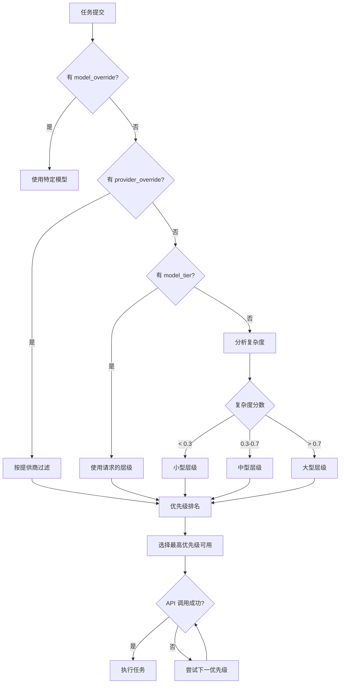

## 概述

Shannon 根据以下因素自动为每个任务选择最佳 LLM 模型：
1. **任务复杂度**（在分解期间分析）
2. **显式层级请求**（`model_tier` 参数）
3. **模型/提供商覆盖**（`model_override`、`provider_override`）
4. **优先级排名**（在 `config/models.yaml` 中定义）
5. **预算约束**和 token 限制

本指南解释模型选择的工作原理以及如何控制它。

## 模型层级

Shannon 将模型组织成三个层级：

| 层级 | 目标使用率 | 特征 | 成本范围 |
|------|-----------|------|---------|
| **Small** | 50% | 快速、成本优化、基础推理 | $0.0001-0.0002/1K 输入 |
| **Medium** | 40% | 平衡能力/成本 | $0.002-0.006/1K 输入 |
| **Large** | 10% | 重度推理、复杂任务 | $0.02-0.025/1K 输入 |

**注意**: 百分比是目标分布，不是强制配额。实际使用取决于您的工作负载。

## 选择流程



## 优先级排名

在每个层级内，模型按优先级排名（数字越小 = 优先级越高）。Shannon 按优先级顺序尝试模型，直到成功。

**来自 `config/models.yaml` 的示例**:
```yaml
model_tiers:
  small:
    providers:
      - provider: openai
        model: gpt-5-nano-2025-08-07
        priority: 1  # 首先尝试
      - provider: anthropic
        model: claude-haiku-4-5-20251001
        priority: 2  # OpenAI 失败时的回退
      - provider: xai
        model: grok-4-fast-non-reasoning
        priority: 3  # 第二回退
```

**回退行为**:
- 如果优先级 1 失败（速率限制、API 错误），Shannon 尝试优先级 2
- 继续直到模型成功或所有选项耗尽
- 失败记录到编排器日志

## 参数优先级

当多个参数指定模型选择时，优先级为：

1. **`model_override`**（最高优先级）→ 强制特定模型
2. **`provider_override`** → 限制为一个提供商的模型
3. **`model_tier`** → 使用请求的层级
4. **自动检测复杂度**（最低优先级）→ 默认行为

### 顶层参数 vs 上下文参数

顶层参数**总是覆盖**上下文参数：

```json
{
  "query": "分析数据",
  "model_tier": "large",           // 顶层（胜出）
  "context": {
    "model_tier": "small"           // 上下文（被忽略）
  }
}
```

## 使用示例

### 自动选择（默认）

```bash
curl -X POST http://localhost:8080/api/v1/tasks \
  -H "X-API-Key: sk_test_123456" \
  -d '{"query": "2+2 是多少？"}'
```

Shannon 分析复杂度 → 选择小型层级 → 使用 `gpt-5-nano-2025-08-07`（优先级 1）

### 强制特定层级

```bash
curl -X POST http://localhost:8080/api/v1/tasks \
  -H "X-API-Key: sk_test_123456" \
  -d '{
    "query": "复杂分析任务",
    "model_tier": "large"
  }'
```

使用大型层级 → `gpt-4.1-2025-04-14`（大型层级中的优先级 1）

### 覆盖到特定模型

```bash
curl -X POST http://localhost:8080/api/v1/tasks \
  -H "X-API-Key: sk_test_123456" \
  -d '{
    "query": "分析",
    "model_override": "claude-sonnet-4-5-20250929"
  }'
```

强制使用 Anthropic Claude Sonnet，忽略层级/优先级。

### 强制提供商

```bash
curl -X POST http://localhost:8080/api/v1/tasks \
  -H "X-API-Key: sk_test_123456" \
  -d '{
    "query": "分析",
    "model_tier": "medium",
    "provider_override": "anthropic"
  }'
```

使用中型层级**但仅 Anthropic 模型** → `claude-sonnet-4-5-20250929`

### Python SDK 示例

```python
from shannon import Shannon

client = Shannon(api_key="sk_test_123456")

# 自动选择
task = client.tasks.submit(query="简单任务")

# 强制层级
task = client.tasks.submit(
    query="复杂分析",
    model_tier="large"
)

# 强制模型
task = client.tasks.submit(
    query="研究任务",
    model_override="gpt-5-2025-08-07"
)

# 强制提供商 + 层级
task = client.tasks.submit(
    query="分析",
    model_tier="medium",
    provider_override="openai"
)
```

## 成本优化策略

### 1. 从小型开始，必要时升级

```python
# 首先尝试小型层级
task = client.tasks.submit(query="分析 Q4 数据", model_tier="small")
status = client.tasks.get(task.task_id)

# 如果结果不满意，使用大型层级重试
if not_satisfactory(status.result):
    task = client.tasks.submit(query="深度分析 Q4 数据", model_tier="large")
```

### 2. 提供商特定优化

```python
# 对批量任务使用更便宜的提供商
for item in bulk_data:
    client.tasks.submit(
        query=f"总结 {item}",
        model_tier="small",
        provider_override="deepseek"  # 比 OpenAI 便宜
    )
```

### 3. 基于会话的升级

```python
session_id = "analysis-session-123"

# 从小型模型开始
client.tasks.submit(
    query="初步分析",
    session_id=session_id,
    model_tier="small"
)

# 使用更大的模型跟进（继承上下文）
client.tasks.submit(
    query="更深入的见解",
    session_id=session_id,
    model_tier="large"
)
```

## 复杂度分析

Shannon 使用多个因素分析任务复杂度：

- **查询长度**和具体性
- 识别的**子任务数量**
- **工具使用**要求
- 所需的**上下文深度**
- **推理强度**（关键词如"分析"、"比较"、"综合"）

**复杂度阈值**（可配置）：
- `< 0.3` → 小型层级（简单问答、基础任务）
- `0.3 - 0.7` → 中型层级（多步骤、中等推理）
- `> 0.7` → 大型层级（复杂研究、重度推理）

## 监控与调试

### 检查使用了哪个模型

```bash
TASK_ID="task-abc123"
curl http://localhost:8080/api/v1/tasks/$TASK_ID \
  -H "X-API-Key: sk_test_123456" | jq '{model_used, provider, usage}'
```

响应：
```json
{
  "model_used": "gpt-5-nano-2025-08-07",
  "provider": "openai",
  "usage": {
    "total_tokens": 245,
    "input_tokens": 150,
    "output_tokens": 95,
    "estimated_cost": 0.000053
  }
}
```

### Prometheus 指标

```bash
# 按层级的模型使用
shannon_llm_requests_total{tier="small"}
shannon_llm_requests_total{tier="medium"}
shannon_llm_requests_total{tier="large"}

# 提供商分布
shannon_llm_requests_total{provider="openai"}
shannon_llm_requests_total{provider="anthropic"}

# 层级漂移（当请求的层级不可用时）
shannon_tier_drift_total{requested="large", actual="medium"}
```

### 编排器日志

```bash
docker compose -f deploy/compose/docker-compose.yml logs orchestrator | grep "Model selected"
```

查找：
- `"Model selected: gpt-5-nano-2025-08-07 (small tier, priority 1)"`
- `"Falling back to priority 2: claude-haiku-4-5-20251001"`
- `"Tier override: user requested large → using gpt-4.1-2025-04-14"`

## 配置

模型层级和优先级在 `config/models.yaml` 中定义：

```yaml
model_tiers:
  small:
    providers:
      - provider: openai
        model: gpt-5-nano-2025-08-07
        priority: 1
      - provider: anthropic
        model: claude-haiku-4-5-20251001
        priority: 2

selection_strategy:
  mode: priority  # priority | round-robin | least-cost
  fallback_enabled: true
  max_retries: 3
```

**选择模式**:
- `priority`（默认）：按优先级顺序尝试模型
- `round-robin`：在相同优先级的模型之间均匀分配负载
- `least-cost`：始终选择层级中最便宜的模型

## 故障排除

### 问题：选择了错误的层级

**症状**: 任务使用中型层级，但您期望小型

**解决方案**:
1. 在请求中显式设置 `model_tier: "small"`
2. 检查编排器日志中的复杂度分数
3. 验证查询未触发复杂度启发式（避免"深度分析"等词）

### 问题：未使用特定模型

**症状**: 请求 `model_override: "gpt-5-pro"` 但获得不同的模型

**解决方案**:
1. 验证模型在 `config/models.yaml` 的 `model_catalog` 下
2. 检查 `.env` 中是否设置了提供商的 API 密钥
3. 验证模型 ID 使用规范名称（非别名）
4. 检查编排器日志中的回退消息

### 问题：成本过高

**症状**: 成本高于预期

**解决方案**:
1. 通过 Prometheus 检查实际层级分布
2. 在请求中添加显式 `model_tier: "small"`
3. 检查 `shannon_tier_drift_total` 是否有不需要的升级
4. 在 `.env` 中设置 `MAX_COST_PER_REQUEST` 以强制预算

### 问题：速率限制

**症状**: 频繁的 429 错误，缓慢的回退级联

**解决方案**:
1. 向层级优先级列表添加更多提供商
2. 启用 `round-robin` 模式以分配负载
3. 增加受影响提供商的 `RATE_LIMIT_WINDOW`
4. 考虑更便宜的提供商（DeepSeek、Groq）作为回退

## 最佳实践

1. **默认自动选择**: 让 Shannon 的复杂度分析工作
2. **谨慎覆盖**: 仅在必要时使用 `model_override`
3. **从小型开始**: 为成本敏感的工作负载设置 `model_tier: "small"`
4. **监控分布**: 通过指标跟踪层级使用情况
5. **配置回退**: 确保每个层级有 3+ 个提供商
6. **测试优先级顺序**: 验证您首选的模型是优先级 1
7. **预算执行**: 设置 `MAX_COST_PER_REQUEST` 以确保安全

## 相关文档

<CardGroup cols={2}>
  <Card title="模型 API" icon="list" href="/cn/api/models/overview">
    列出可用模型和定价
  </Card>
  <Card title="提交任务" icon="paper-plane" href="/cn/api/rest/submit-task">
    使用模型参数提交任务
  </Card>
  <Card title="配置" icon="gear" href="/cn/quickstart/configuration">
    环境变量和 YAML 配置
  </Card>
  <Card title="成本跟踪" icon="dollar-sign" href="/cn/api/rest/get-status">
    查看模型使用和成本
  </Card>
</CardGroup>
