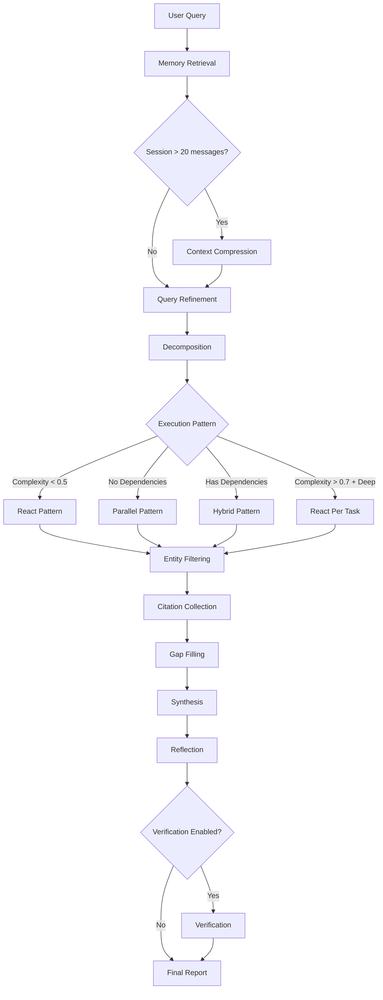

# 深度研究代理

本教程演示如何使用 Shannon 的 **ResearchWorkflow** 产出全面且带有引用的研究报告。

## 你将学到

- 多阶段流程：记忆检索 → 细化 → 分解 → 执行 → 引用收集 → 缺口补全 → 综合 → 校验
- 自适应模式：根据复杂度与依赖选择 React、并行、混合
- 进阶能力：实体过滤、缺口补全、上下文压缩、按任务 React 模式
- 质量控制：引用要求、覆盖率校验、论断校验
- 语言匹配：自动使用与用户查询相同的语言回复

## 前置条件

- 已运行的 Shannon 堆栈（Docker Compose）
- Gateway 可通过 `http://localhost:8080` 访问
- 鉴权默认：
  - Docker Compose：默认关闭鉴权（`GATEWAY_SKIP_AUTH=1`）。
  - 本地构建：默认开启鉴权。可设置 `GATEWAY_SKIP_AUTH=1` 关闭；或在请求中加入 API key 头 `-H "X-API-Key: $API_KEY"`。

## 工作流架构

ResearchWorkflow 通过多个阶段协同，产出高质量且可溯源的研究结果：



**关键特性：**
- 记忆感知：利用会话历史进行上下文研究
- 实体聚焦：检测到实体时对结果进行过滤（如特定公司/产品）
- 自我纠错：缺口补全保障覆盖完整
- 质量约束：每个研究领域均需满足（≥600 字符、每节 ≥2 处内联引用）

## 快速开始（HTTP）

```bash
# 提交研究任务（默认 “standard” 策略）
curl -X POST http://localhost:8080/api/v1/tasks \
  -H "Content-Type: application/json" \
  -d '{
    "query": "Latest breakthroughs in quantum error correction",
    "context": { "force_research": true }
  }'

# 一步提交并返回可用的 SSE 流式地址（推荐）
# 提示：加入 force_research 可确保路由到 ResearchWorkflow（否则路由器可能选择 Supervisor）
curl -s -X POST http://localhost:8080/api/v1/tasks/stream \
  -H "Content-Type: application/json" \
  -d '{
        "query": "What are the main transformer architecture trends in 2025?",
        "context": { "force_research": true }
      }' | jq
```

### 流式事件（SSE）

```bash
# /tasks/stream 返回后，使用响应中的 "stream_url"：
curl -N "http://localhost:8080/api/v1/stream/sse?workflow_id=task-..."
```

关注：
- `LLM_OUTPUT`：最终综合文本
- `DATA_PROCESSING`：进度/用量
- `WORKFLOW_COMPLETED`：完成

## 执行模式

Shannon 会基于任务复杂度与依赖关系，自动选择最优执行模式：

### React 模式（复杂度 < 0.5）
面向简单研究的“思考→行动→观察”循环。

```bash
# 示例：基础概念性问题触发 React
curl -X POST http://localhost:8080/api/v1/tasks \
  -H "Content-Type: application/json" \
  -d '{
    "query": "What is quantum computing?",
    "context": { "force_research": true }
  }'
```

**行为**：单个代理进行迭代推理、网络搜索与观察（默认 5 次迭代）。

---

### 并行模式（无依赖）
用于多维度主题的并发子任务执行。

```bash
# 示例：多维度对比触发并行
curl -X POST http://localhost:8080/api/v1/tasks \
  -H "Content-Type: application/json" \
  -d '{
    "query": "Compare LangChain and AutoGen frameworks: architecture, pricing, community, performance",
    "context": { "force_research": true }
  }'
```

**行为**：分解生成相互独立的子任务（如“分析 LangChain 架构”“分析 AutoGen 定价”），并发执行并注入 `web_search` 以获取引用。

---

### 混合模式（存在依赖）
拓扑排序 + 汇聚/分发，顺序执行带依赖的研究。

```bash
# 示例：具备逻辑依赖的查询触发混合
curl -X POST http://localhost:8080/api/v1/tasks \
  -H "Content-Type: application/json" \
  -d '{
    "query": "Analyze company X market strategy, then evaluate competitive response, then forecast next moves",
    "context": { "force_research": true }
  }'
```

**行为**：按依赖顺序执行子任务，并将前序结果向下游传递。

---

### 按任务 React（深度研究模式）
为高复杂度研究在每个子任务中运行小型 ReAct 循环。

**触发条件：**
1. 手动：`context.react_per_task = true`
2. 自动：复杂度 > 0.7 且策略为 `{deep, academic}`

```bash
# 示例：启用按任务 React 以便每个领域迭代探索
curl -X POST http://localhost:8080/api/v1/tasks \
  -H "Content-Type: application/json" \
  -d '{
    "query": "Comprehensive analysis of transformer architecture evolution 2017-2025",
    "context": {
      "force_research": true,
      "react_per_task": true,
      "react_max_iterations": 6
    },
    "research_strategy": "deep"
  }'
```

**行为**：每个并行子任务各自运行 ReAct 循环（思考→行动→观察），逐步深化；更全面，但代价更高。

---

## 策略预设

预设提供不同研究深度的“意见化”默认值。Gateway 会校验并将其映射到工作流上下文。

```bash
# 快速预设（最少迭代）
curl -X POST http://localhost:8080/api/v1/tasks \
  -H "Content-Type: application/json" \
  -d '{
    "query": "What is quantum error correction?",
    "context": { "force_research": true },
    "research_strategy": "quick"
  }'

# 深度预设（含覆盖项）
curl -X POST http://localhost:8080/api/v1/tasks \
  -H "Content-Type: application/json" \
  -d '{
    "query": "Compare LangChain and AutoGen frameworks",
    "context": {
      "force_research": true,
      "react_per_task": true,
      "react_max_iterations": 6
    },
    "research_strategy": "deep",
    "enable_verification": true
  }'

# 学术预设（复杂度 > 0.7 时自动启用按任务 React）
curl -X POST http://localhost:8080/api/v1/tasks \
  -H "Content-Type: application/json" \
  -d '{
    "query": "Survey of attention mechanisms in modern NLP architectures",
    "context": { "force_research": true },
    "research_strategy": "academic"
  }'
```

**可用预设**：`quick` | `standard` | `deep` | `academic`

| 策略 | react_max_iterations | max_concurrent_agents | verification | gap_filling |
|------|---------------------|----------------------|--------------|-------------|
| quick | 2 | 3 | ✗ | ✗ |
| standard | 3 | 5 | ✓ | ✓ (max_gaps: 3, max_iterations: 2) |
| deep | 4 | 6 | ✓ | ✓ (max_gaps: 2, max_iterations: 2) |
| academic | 5 | 8 | ✓ | ✓ (max_gaps: 3, max_iterations: 2) |

**核心参数**：
- `max_concurrent_agents`（1–20）：控制并行子任务的最大并发数（仅在多子任务执行时生效）
- `react_max_iterations`（2–8，默认 5）：按任务 ReAct 循环的迭代深度（独立参数，无前置要求）

**进阶开关**：
- `react_per_task`（布尔）：为每个子任务启用小型 ReAct 循环（复杂度 > 0.7 且 deep/academic 时自动启用）
- `enable_verification`（布尔）：启用与引用对照的论断校验
- `budget_agent_max`（整数）：可选的单代理 token 预算（带强制）

**缺口补全配置**：
- `gap_filling_enabled`（布尔）：启用/禁用缺口补全
- `gap_filling_max_gaps`（1–20）：最多检测多少个缺口
- `gap_filling_max_iterations`（1–5）：每个缺口的最大重试次数
- `gap_filling_check_citations`（布尔）：检查引用密度作为缺口指标

<Note>
默认预设：`standard`（未指定时）。若上下文已有值，预设不会覆盖。Gateway 在 `/api/v1/tasks` 与 `/api/v1/tasks/stream` 顶层接受 `research_strategy` 并映射到上下文。预设默认值来自 `config/research_strategies.yaml`。
</Note>

## Python SDK

### CLI

```bash
python -m shannon.cli --base-url http://localhost:8080 \
  submit "Latest quantum computing breakthroughs" \
  --force-research \
  --research-strategy deep --enable-verification
```

### 编程方式

```python
from shannon import ShannonClient

client = ShannonClient(base_url="http://localhost:8080")
handle = client.submit_task(
    "Compare LangChain and AutoGen frameworks",
    context={
        "force_research": True,
        "research_strategy": "deep",
        "react_max_iterations": 6,
        "enable_verification": True,
    },
)
final = client.wait(handle.task_id)
print(final.result)
client.close()
```

## 响应格式

`GET /api/v1/tasks/{id}` 的典型状态载荷包含综合结果、元数据（引用、校验）、模型/提供商与时间戳。

```json
{
  "task_id": "task-00000000-0000-0000-0000-000000000000",
  "status": "TASK_STATUS_COMPLETED",
  "result": "... final synthesis text ...",
  "metadata": {
    "citations": [
      {
        "url": "https://example.com/article",
        "title": "Source Title",
        "source": "example.com",
        "quality_score": 0.92,
        "credibility_score": 0.85
      }
    ],
    "verification": {
      "total_claims": 10,
      "overall_confidence": 0.78,
      "supported_claims": 7,
      "unsupported_claims": [
        "Claim text lacking sufficient evidence ..."
      ],
      "claim_details": [
        {
          "claim": "Concrete claim text ...",
          "confidence": 0.81,
          "supporting_citations": [1, 3],
          "conflicting_citations": []
        }
      ]
    }
  },
  "created_at": "2025-11-07T12:00:00Z",
  "updated_at": "2025-11-07T12:02:00Z",
  "usage": {
    "input_tokens": 1234,
    "output_tokens": 5678,
    "total_tokens": 6912,
    "estimated_cost": 0.0234
  },
  "model_used": "gpt-5-mini-2025-08-07",
  "provider": "openai"
}
```

**说明：**
- `result` 为最终综合的 Markdown/文本。
- `metadata.citations` 为已收集来源（所有来源都会出现在结果的“Sources”部分）。
- `metadata.verification` 在启用并完成校验时出现。
- 在 Gateway 的状态响应中，`created_at` / `updated_at` 反映响应时间；权威的运行时间与统计持久化在数据库（可通过事件/时间线查看）。
- `usage` 汇总 token 用量，并可能包含费用。Gateway 状态响应可能使用 `estimated_cost` 字段；工作流元数据中可能包含 `cost_usd`。
- `model_used` 与 `provider` 反映综合阶段使用的模型/提供商。

## 进阶能力

### 记忆检索

**分层记忆（优先）**：

- 结合近期（最近 5 条）与语义检索（Top 5，相似度 ≥ 0.75）
- 支持多轮上下文一致性
- 回退：会话记忆（最近 20 条）

**上下文压缩**：

- 会话消息数 > 20 时自动触发
- 使用 LLM 总结会话（目标：窗口的 ~37.5%）
- 防止长对话导致上下文溢出

---

### 实体过滤

当检测到特定实体（如公司 “Acme Analytics”）时：

**查询细化**：

- 识别规范名称、精确搜索串、官方域、消歧词
- 例：`canonical_name: "Acme Analytics"`, `official_domains: ["acme.com"]`

**引用过滤**：

- 评分：域名匹配 +0.6、URL 含别名 +0.4、标题/摘要/来源含别名 +0.4
- 阈值：0.3（任一命中即可通过）
- 安全底线：minKeep=8（按质量×可信度回填）
- 官方域始终保留（绕过阈值）

**结果修剪**：

- 过滤与实体无关的工具结果（如避免 “Acme Mind” 与 “Mind Inc” 混淆）
- 保留仅推理输出；删除明显偏离实体的工具型结果

---

### 缺口补全

**自动检测**（最多 2 轮）：

- 缺失小节标题（`### 领域名`）
- 缺口提示语（如 “limited information”“insufficient data” 等）
- 引用密度低（每节 < 2 处内联引用）

**解决步骤**：

1. 生成聚焦查询：`"Find detailed information about: <area>"`
2. 执行聚焦型 ReAct 循环（每个缺口最多 3 次迭代）
3. 重新收集引用（与原始引用全局去重）
4. 使用大模型层级重新综合

<Accordion title="缺口示例场景">
```text
Query: "Analyze company X market strategy, competitive landscape, and leadership"

Initial synthesis coverage:
- Market strategy: ✓ 800 chars, 3 citations
- Competitive landscape: ✓ 650 chars, 2 citations
- Leadership: ✗ 200 chars, 0 citations  ← Gap detected

Gap filling triggers:
1. Targeted query: "Find detailed information about: company X leadership"
2. ReAct loop executes focused search
3. Re-synthesize with combined evidence
```
</Accordion>

### 引用

**收集**：

- 来自 `web_search` 与 `web_fetch` 工具的输出
- URL/DOI 规范化与去重
- 评分：质量（时效性+完整性）× 可信度（域名声誉）
- 多样性约束（每个域最多 3 条）

**约束**：

- 每份报告至少 6 处内联引用（受可用数量限制，最低 3）
- 每个领域至少 2 处内联引用
- Sources 部分列出所有收集的引用：
  - “Used inline”（正文中使用）
  - “Additional source”（收集但未在正文使用）

---

### 综合续写

**触发**：模型提前停止且输出不完整

**检测**（`looksComplete` 校验）：

1. 必须以句子标点结尾（`.`, `!`, `?`, `。`）
2. 结尾不得为连接词（`and, but, however, therefore...`）
3. 每个研究领域均有小节，且满足 ≥600 字符与 ≥2 处内联引用

**续写**：

- 自适应余量：`min(有效最大补全的 25%, 300 tokens)`
- 提示：`Continue from last sentence; maintain headings and citation style`
- 使用大模型层级保证质量（如 gpt-4.1/opus）

---

### 论断校验

**论断抽取**：

- 从综合结果中识别事实性陈述
- 与已收集引用进行交叉验证

**置信评分**：

- 按引用可信度加权
- 标记冲突与未支撑项
- 提供逐条论断的支撑/冲突引用明细

**示例输出**：

```json
{
  "verification": {
    "total_claims": 10,
    "overall_confidence": 0.78,
    "supported_claims": 7,
    "unsupported_claims": ["Claim lacking evidence..."],
    "claim_details": [
      {
        "claim": "Transformer architecture introduced in 2017",
        "confidence": 0.95,
        "supporting_citations": [1, 3],
        "conflicting_citations": []
      }
    ]
  }
}
```

**启用方式**：将 `enable_verification: true` 写入上下文。

---

### 语言匹配

- 通过启发式检测用户查询语言
- 综合结果使用相同语言输出
- 覆盖英文、中文、日文、韩文、阿拉伯文、俄文、西班牙文、法文、德文（启发式）
- 使用通用指令以增强跨语言鲁棒性

## 行为保障

<CardGroup cols={2}>
  <Card title="记忆" icon="database">
    可用时注入分层记忆（近期 + 语义）
  </Card>
  <Card title="压缩" icon="compress">
    会话消息超过 20 条时自动压缩，避免上下文溢出
  </Card>
  <Card title="覆盖" icon="check-circle">
    每个研究领域提供专属小节，最低 600 字符与 2 处引用
  </Card>
  <Card title="缺口补全" icon="search">
    自动检测并二次检索覆盖不足区域（最多 2 轮）
  </Card>
  <Card title="语言" icon="globe">
    输出语言与用户查询一致
  </Card>
  <Card title="成本" icon="dollar-sign">
    统计并持久化 token 与成本；可按代理设置预算并强制执行
  </Card>
  <Card title="续写" icon="refresh-cw">
    仅在综合不完整且容量接近耗尽时触发
  </Card>
  <Card title="实体聚焦" icon="filter">
    检测到实体时过滤引用并修剪离题结果
  </Card>
</CardGroup>

## 使用建议

<Tabs>
  <Tab title="入门">

  - 设置 `context.force_research=true` 以确保路由到 ResearchWorkflow
  - 从 `standard` 预设开始，按结果微调
  - 通过 SSE 观察进度与用量

  </Tab>
  <Tab title="优化">

  - 简单问题使用 `quick` 预设（节省成本）
  - 全面研究使用 `deep` 或 `academic`（高复杂度下自动启用按任务 React）
  - 使用 `budget_agent_max` 约束单代理预算
  - 手动启用 `react_per_task` 以便逐领域迭代探索

  </Tab>
  <Tab title="多轮研究">

  - 使用会话以启用记忆检索
  - 长对话将自动触发上下文压缩
  - 追问可受益于分层记忆（近期 + 语义）

  </Tab>
</Tabs>

## 故障排查

<Warning>
**常见问题**：
- 语言默认成英文：请确保查询明确使用目标语言
- 缺少引用：检查是否可用 `web_search`；研究流程会自动注入 `web_search`
- 覆盖不完整：应自动触发缺口补全；确认已启用 `gap_filling_v1`
- 成本偏高：启用 `budget_agent_max` 或使用 `quick` 预设；关闭 `react_per_task`
</Warning>

**校验与守护**：

- 非法 `web_search` 的 `search_type` 会被清洗（回退到 `auto`）
- 重复引用通过 URL/DOI 规范化去重
- 存在实体提及时会进行实体检测与细化

**版本门控**（内部特性开关）：

- 记忆检索：`memory_retrieval_v1`
- 会话记忆回退：`session_memory_v1`
- 上下文压缩：`context_compress_v1`
- 缺口补全：`gap_filling_v1`

## 下一步

<CardGroup cols={3}>
  <Card title="API 参考" icon="book" href="/api/rest/tasks">
    REST API 文档
  </Card>
  <Card title="自定义工具" icon="wrench" href="/tutorials/custom-tools">
    添加自定义工具
  </Card>
  <Card title="厂商适配" icon="plug" href="/tutorials/vendor-adapters">
    厂商适配集成
  </Card>
</CardGroup>

**相关资源**：
- GitHub: https://github.com/Kocoro-lab/Shannon
- 公司: https://kocoro.ai
