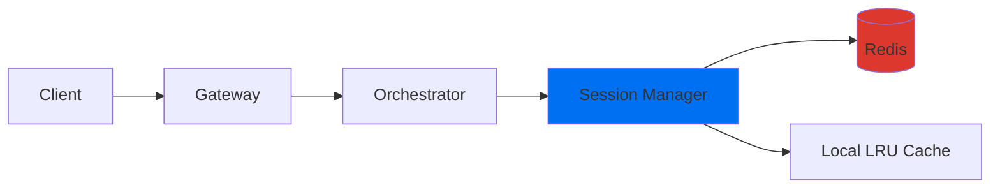
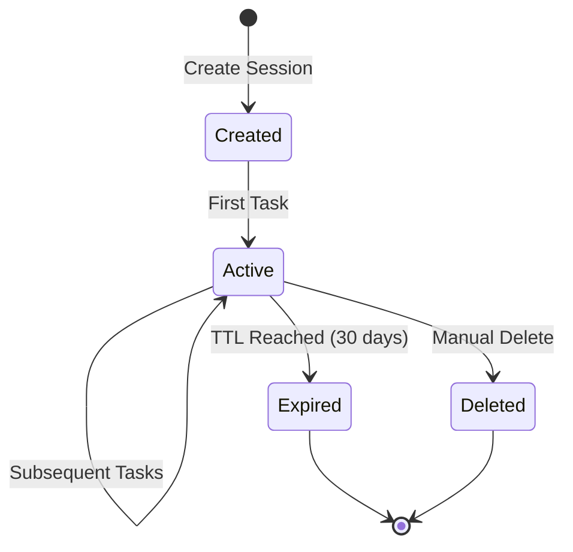

## Overview

Sessions in Shannon enable **context continuity** across multiple task submissions, allowing agents to:
- Remember previous conversations
- Build on earlier results
- Maintain working state
- Track cumulative costs
- Preserve agent-specific memory

Sessions are stored in **Redis** with automatic expiration and LRU caching for performance.

## Architecture



**Key Features**:
- **Redis-backed**: Persistent storage with circuit breaker protection
- **Local caching**: 10,000 sessions cached locally for performance
- **TTL management**: 30-day default expiration (configurable)
- **History pruning**: Keeps most recent 500 messages per session
- **Multi-tenancy**: Sessions isolated by tenant ID
- **Security**: Prevents session hijacking across users

## Session Structure

```json
{
  "id": "sess-550e8400-e29b-41d4-a716-446655440000",
  "user_id": "user-123",
  "tenant_id": "tenant-abc",
  "created_at": "2024-10-27T10:00:00Z",
  "updated_at": "2024-10-27T10:15:00Z",
  "expires_at": "2024-11-26T10:00:00Z",
  "metadata": {
    "name": "Q4 Analysis",
    "project": "quarterly-review",
    "tags": ["finance", "reporting"]
  },
  "context": {
    "loaded_datasets": ["sales_q4.csv"],
    "current_analysis": "revenue_trends",
    "preferences": {
      "output_format": "markdown"
    }
  },
  "history": [
    {
      "id": "msg-001",
      "role": "user",
      "content": "Load Q4 sales data",
      "timestamp": "2024-10-27T10:00:00Z",
      "tokens_used": 120,
      "cost_usd": 0.0018
    },
    {
      "id": "msg-002",
      "role": "assistant",
      "content": "Loaded Q4 sales data with 15,000 records...",
      "timestamp": "2024-10-27T10:00:15Z",
      "tokens_used": 450,
      "cost_usd": 0.0068
    }
  ],
  "agent_states": {
    "data-analyst": {
      "agent_id": "data-analyst",
      "last_active": "2024-10-27T10:15:00Z",
      "state": "analyzing",
      "memory": {
        "current_dataset": "sales_q4",
        "filters_applied": ["region:west"]
      },
      "tools_used": ["csv_loader", "pandas_query"],
      "tokens_used": 3200
    }
  },
  "total_tokens_used": 5420,
  "total_cost_usd": 0.0814
}
```

## API Endpoints

### Create Session

**Endpoint**: `POST /api/v1/sessions` (when implemented)

**Request**:
```json
{
  "metadata": {
    "name": "Data Analysis Session",
    "project": "Q4 Analysis",
    "tags": ["finance"]
  }
}
```

**Response**:
```json
{
  "session_id": "sess-550e8400-e29b-41d4-a716-446655440000",
  "user_id": "user-123",
  "created_at": "2024-10-27T10:00:00Z",
  "expires_at": "2024-11-26T10:00:00Z"
}
```

### Submit Task with Session

Use the `session_id` parameter when submitting tasks:

```bash
curl -X POST http://localhost:8080/api/v1/tasks \
  -H "Content-Type: application/json" \
  -H "X-API-Key: sk_test_123456" \
  -d '{
    "query": "Analyze Q4 sales trends",
    "session_id": "sess-550e8400-e29b-41d4-a716-446655440000",
    "context": {
      "dataset": "sales_q4.csv"
    }
  }'
```

**Automatic Session Creation**:
If no `session_id` is provided, Shannon automatically creates a new session.

### Get Session Context

Sessions automatically accumulate context from task execution:
- Task queries and responses
- Tool invocations and results
- Agent reasoning steps
- Cumulative token usage and costs

## Session Lifecycle



**States**:
1. **Created**: Session initialized, no tasks yet
2. **Active**: Session has tasks, context accumulating
3. **Expired**: TTL reached (30 days default), auto-deleted
4. **Deleted**: Manually removed

**TTL Configuration**:
```yaml
# config/shannon.yaml
session:
  ttl: 720h  # 30 days (default)
  max_history: 500  # messages per session
  cache_size: 10000  # local cache size
```

## Using Sessions

### Python SDK

```python
from shannon import ShannonClient

client = ShannonClient(http_endpoint="http://localhost:8080")

# Automatic session creation
handle1 = client.submit_task(
    query="Load Q4 sales data",
    # No session_id - Shannon creates one automatically
)

# Reuse the session ID from the first task
session_id = handle1.session_id

# Subsequent tasks use the same session
handle2 = client.submit_task(
    query="What was the highest revenue month?",  # Has context from previous task
    session_id=session_id
)

handle3 = client.submit_task(
    query="Create a summary report",  # Builds on all previous tasks
    session_id=session_id
)
```

### Multi-Turn Conversation

```python
# Data analysis workflow
session_id = None

# Step 1: Load data
result1 = client.submit_and_wait(
    query="Load the Q4 sales CSV and describe its structure"
)
session_id = result1['session_id']

# Step 2: Analyze (agent remembers the data)
result2 = client.submit_and_wait(
    query="Calculate total revenue by region",
    session_id=session_id
)

# Step 3: Visualize (agent remembers both data and analysis)
result3 = client.submit_and_wait(
    query="Create a bar chart of the revenue by region",
    session_id=session_id
)

# Step 4: Generate report (agent has full context)
result4 = client.submit_and_wait(
    query="Write an executive summary based on the analysis",
    session_id=session_id
)
```

## Session Context

### What Gets Stored

**Conversation History** (up to 500 messages):
```python
{
  "history": [
    {"role": "user", "content": "Load Q4 data", "tokens_used": 120},
    {"role": "assistant", "content": "Loaded 15,000 records...", "tokens_used": 450},
    {"role": "user", "content": "Show top products", "tokens_used": 80},
    {"role": "assistant", "content": "Top 10 products...", "tokens_used": 620}
  ]
}
```

**Working Context**:
```python
{
  "context": {
    "loaded_files": ["sales_q4.csv"],
    "current_analysis": "revenue_by_region",
    "intermediate_results": {
      "total_revenue": 1250000.50,
      "top_region": "west"
    },
    "user_preferences": {
      "format": "markdown",
      "verbosity": "detailed"
    }
  }
}
```

**Agent Memory** (per agent):
```python
{
  "agent_states": {
    "data-analyst": {
      "state": "analyzing",
      "memory": {
        "dataset_schema": {...},
        "applied_filters": ["region:west"],
        "cached_results": {...}
      },
      "tools_used": ["csv_loader", "pandas", "matplotlib"]
    }
  }
}
```

### Context Limits

- **Max history**: 500 messages (oldest pruned automatically)
- **Session TTL**: 30 days (configurable)
- **Cache size**: 10,000 sessions in memory
- **Storage**: Redis with automatic cleanup

**History Pruning**:
When the 501st message is added, the oldest message is removed (FIFO queue).

## Best Practices

### 1. Use Sessions for Multi-Step Workflows

```python
# Good: Related tasks in same session
session_id = "sess-analysis-001"

client.submit_task("Load data", session_id=session_id)
client.submit_task("Calculate stats", session_id=session_id)
client.submit_task("Generate report", session_id=session_id)
```

```python
# Bad: Unrelated tasks in same session
client.submit_task("Analyze sales", session_id=session_id)
client.submit_task("Write a poem", session_id=session_id)  # ❌ Pollutes context
```

### 2. Provide Descriptive Metadata

```python
# Good: Descriptive metadata
client.create_session(metadata={
    "name": "Q4 Financial Analysis",
    "project": "quarterly-review",
    "department": "finance",
    "tags": ["sales", "reporting", "q4-2024"]
})
```

### 3. Handle Session Expiration

```python
try:
    result = client.submit_task(
        query="Continue analysis",
        session_id=old_session_id
    )
except SessionExpiredError:
    # Session expired (>30 days), create new one
    new_session = client.create_session(
        metadata={"resumed_from": old_session_id}
    )
    result = client.submit_task(
        query="Start fresh analysis",
        session_id=new_session.id
    )
```

### 4. Cost Tracking

```python
# Get session to check cumulative costs
session = client.get_session(session_id)

print(f"Total tokens: {session['total_tokens_used']}")
print(f"Total cost: ${session['total_cost_usd']:.4f}")

if session['total_cost_usd'] > 1.0:
    print("Warning: Session cost exceeded budget")
```

## Use Cases

### 1. Data Analysis Workflow

```python
session = client.create_session(name="Sales Analysis")

# Load and explore
client.submit_task("Load sales data from Q4", session_id=session.id)
client.submit_task("Show column names and data types", session_id=session.id)

# Analyze
client.submit_task("Calculate revenue by product category", session_id=session.id)
client.submit_task("Find top 10 products by revenue", session_id=session.id)

# Visualize
client.submit_task("Create bar chart of top products", session_id=session.id)

# Report
client.submit_task("Write executive summary", session_id=session.id)
```

### 2. Research Assistant

```python
session = client.create_session(name="AI Research")

# Progressive research
client.submit_task("What is GPT-4?", session_id=session.id)
client.submit_task("How does it compare to Claude?", session_id=session.id)
client.submit_task("What are the pricing differences?", session_id=session.id)
client.submit_task("Which is better for code generation?", session_id=session.id)
```

### 3. Code Review Session

```python
session = client.create_session(name="PR Review")

# Review components
client.submit_task("Review authentication.py for security issues", session_id=session.id)
client.submit_task("Check if it follows our security guidelines", session_id=session.id)
client.submit_task("Suggest improvements", session_id=session.id)
client.submit_task("Generate review summary", session_id=session.id)
```

## Performance Considerations

- **Local caching**: First 10,000 sessions cached in memory
- **Cache hit rate**: Typically 85-95% for active sessions
- **Redis latency**: 1-5ms for cache misses
- **History pruning**: Automatic, no performance impact
- **Expiration**: Background cleanup every 5 minutes

**Metrics**:
```
sessions_created_total            # Counter
sessions_cache_hits_total        # Counter
sessions_cache_misses_total      # Counter
sessions_cache_size              # Gauge
sessions_expired_total           # Counter
```

## Security

### Session Isolation

- **User-scoped**: Users can only access their own sessions
- **Tenant-scoped**: Multi-tenant isolation enforced
- **Hijacking prevention**: Cannot reuse session IDs across users

```go
// Automatic security check
if existingSession.UserID != requestingUser {
    // Generate new session ID instead
    return createNewSession()
}
```

### Authentication

Sessions respect the same authentication as tasks:
- API key authentication
- JWT bearer tokens
- Per-user authorization

## Troubleshooting

### Session Not Found

**Error**: `session not found`

**Causes**:
- Session expired (>30 days)
- Session deleted manually
- Invalid session ID

**Solution**:
```python
# Check if session exists before using
try:
    session = client.get_session(session_id)
except SessionNotFoundError:
    # Create new session
    session = client.create_session(name="New Session")
```

### Context Not Preserved

**Issue**: Agent doesn't remember previous tasks

**Causes**:
- Different session IDs used
- Session expired
- History pruned (>500 messages)

**Solution**:
```python
# Verify session ID consistency
print(f"Using session: {session_id}")

# Check history length
session = client.get_session(session_id)
print(f"History length: {len(session['history'])}")
```

### High Memory Usage

**Issue**: Session manager using too much memory

**Causes**:
- Too many cached sessions
- Large metadata objects
- Long conversation histories

**Solution**:
```yaml
# config/shannon.yaml
session:
  cache_size: 5000  # Reduce from 10000
  max_history: 250   # Reduce from 500
```

## Related Topics

<CardGroup cols={2}>
  <Card title="Submit Task" icon="plus" href="/api/endpoints/submit-task">
    Submit tasks with sessions
  </Card>
  <Card title="List Tasks" icon="list" href="/api/endpoints/list-tasks">
    View tasks by session
  </Card>
  <Card title="Cost Control" icon="dollar" href="/quickstart/concepts/cost-control">
    Track session costs
  </Card>
  <Card title="Streaming" icon="stream" href="/quickstart/concepts/streaming">
    Stream session events
  </Card>
</CardGroup>