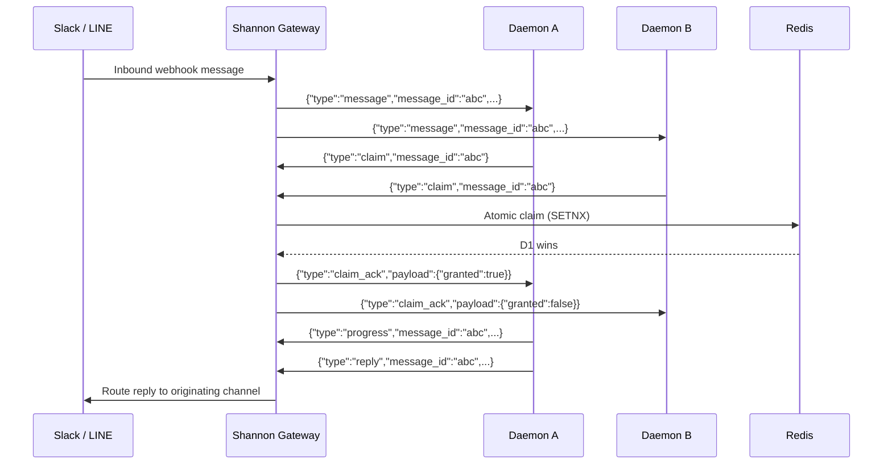

## Overview

The Daemon WebSocket API provides a persistent, bidirectional connection for daemon clients to receive and process messages in real time. Unlike the REST API where clients poll for updates, the WebSocket connection enables Shannon to push incoming messages (from Slack, LINE, or system events) directly to connected daemons.

The core protocol revolves around a **claim-based message dispatch** model: Shannon broadcasts messages to eligible connections, and daemons race to claim exclusive processing rights before replying.

## Endpoint

```
GET /v1/ws/messages
```

Upgrade to WebSocket with standard auth headers.

## Authentication

Authentication is performed **before** the WebSocket upgrade using the same middleware as REST endpoints.

| Method | Header |
|--------|--------|
| JWT Bearer | `Authorization: Bearer <token>` |
| API Key | `X-API-Key: <key>` |

<CodeGroup>
```bash websocat
websocat "ws://localhost:8080/v1/ws/messages" \
  -H "Authorization: Bearer <token>"
```

```javascript JavaScript
const ws = new WebSocket("ws://localhost:8080/v1/ws/messages", {
  headers: {
    "Authorization": "Bearer <token>"
  }
});
```

```python Python
import websockets

async with websockets.connect(
    "ws://localhost:8080/v1/ws/messages",
    additional_headers={"Authorization": "Bearer <token>"}
) as ws:
    async for message in ws:
        print(message)
```
</CodeGroup>

## Connection Lifecycle

<Steps>
  <Step title="HTTP Upgrade">
    Client sends `GET /v1/ws/messages` with authentication headers. The server validates credentials before upgrading.
  </Step>
  <Step title="WebSocket Established">
    Server upgrades to WebSocket (gorilla/websocket, 4KB read/write buffers, CheckOrigin allows all origins).
  </Step>
  <Step title="Connection Confirmed">
    Server sends a `connected` message to confirm the connection is ready.
    ```json
    {"type": "connected"}
    ```
  </Step>
  <Step title="Bidirectional Messaging">
    Both sides exchange JSON messages. The server dispatches incoming messages; the client claims, processes, and replies.
  </Step>
  <Step title="Keep-Alive">
    Server sends WebSocket pings every **20 seconds**. Client must respond with a pong within **60 seconds** or the connection is closed.
  </Step>
</Steps>

### Connection Parameters

| Parameter | Value |
|-----------|-------|
| Ping interval | 20s |
| Pong timeout | 60s |
| Max message size | 64 KB |
| Write timeout | 10s |
| Read/write buffers | 4 KB |

## Message Envelope

All messages (both directions) follow a consistent envelope format:

```json
{
  "type": "<message_type>",
  "message_id": "<uuid>",
  "payload": {}
}
```

| Field | Type | Description |
|-------|------|-------------|
| `type` | string | Message type identifier |
| `message_id` | string (UUID) | Unique message identifier (omitted for `connected` and `disconnect`) |
| `payload` | object | Type-specific data |

## Server-to-Client Messages

### `connected`

Sent once immediately after the WebSocket connection is established.

```json
{
  "type": "connected"
}
```

### `message`

An inbound message dispatched for processing. This is the primary message type — it carries messages from channel webhooks (Slack, LINE) or system events.

```json
{
  "type": "message",
  "message_id": "a1b2c3d4-e5f6-7890-abcd-ef1234567890",
  "payload": {
    "channel": "slack",
    "thread_id": "C07ABCDEF-1234567890.123456",
    "sender": "user@example.com",
    "text": "Hello, can you help me?",
    "agent_name": "research-agent",
    "timestamp": "2026-03-10T10:00:00Z"
  }
}
```

#### MessagePayload Fields

| Field | Type | Description |
|-------|------|-------------|
| `channel` | string | Originating channel type: `"slack"`, `"line"`, etc. |
| `thread_id` | string | Thread identifier for the conversation |
| `sender` | string | Sender identifier (email, user ID, etc.) |
| `text` | string | The message content |
| `agent_name` | string | Target agent for processing |
| `timestamp` | string (ISO 8601) | When the message was received |

### `system`

System-level notification from Shannon.

```json
{
  "type": "system",
  "message_id": "f7e8d9c0-b1a2-3456-7890-abcdef123456",
  "payload": {
    "text": "Agent research-agent is now available"
  }
}
```

### `claim_ack`

Response to a client's `claim` request, indicating whether the claim was granted.

```json
{
  "type": "claim_ack",
  "message_id": "a1b2c3d4-e5f6-7890-abcd-ef1234567890",
  "payload": {
    "granted": true
  }
}
```

| Field | Type | Description |
|-------|------|-------------|
| `granted` | boolean | `true` if this client was granted exclusive processing rights |

## Client-to-Server Messages

### `claim`

Claim exclusive processing rights for a message. Only one client can successfully claim a given message.

```json
{
  "type": "claim",
  "message_id": "a1b2c3d4-e5f6-7890-abcd-ef1234567890"
}
```

### `progress`

Send a heartbeat/progress update while processing a claimed message. This extends the claim lease, preventing timeout.

```json
{
  "type": "progress",
  "message_id": "a1b2c3d4-e5f6-7890-abcd-ef1234567890",
  "payload": {
    "status": "processing",
    "percent": 50
  }
}
```

### `reply`

Send the completed response for a claimed message. Shannon routes this back to the originating channel (Slack, LINE, etc.).

```json
{
  "type": "reply",
  "message_id": "a1b2c3d4-e5f6-7890-abcd-ef1234567890",
  "payload": {
    "channel": "slack",
    "thread_id": "C07ABCDEF-1234567890.123456",
    "text": "Here is my response...",
    "format": "text"
  }
}
```

#### ReplyPayload Fields

| Field | Type | Description |
|-------|------|-------------|
| `channel` | string | Target channel type |
| `thread_id` | string | Thread to reply in |
| `text` | string | Response content |
| `format` | string | Output format: `"text"` or `"markdown"` |

### `disconnect`

Gracefully close the connection.

```json
{
  "type": "disconnect"
}
```

## Claim Flow

The claim flow is the core protocol for distributed message processing. It ensures exactly one daemon processes each message, even when multiple daemons are connected.



<Steps>
  <Step title="Message Dispatch">
    When a message arrives (via channel webhook or system), the Gateway dispatches it to **all** eligible WebSocket connections indexed by `tenant:user`.
  </Step>
  <Step title="Claim Race">
    Each daemon that wants to process the message sends a `claim` request with the `message_id`.
  </Step>
  <Step title="Atomic Resolution">
    The Gateway atomically claims the message in Redis (`SETNX`). The first client wins; all others receive `{"granted": false}`.
  </Step>
  <Step title="Processing">
    The winning daemon processes the message. It can optionally send `progress` messages to extend the claim lease and signal activity.
  </Step>
  <Step title="Reply">
    The daemon sends a `reply` with the completed response. Shannon routes it back to the originating channel.
  </Step>
</Steps>

### Claim Metadata

When a message is claimed, the Gateway stores metadata in Redis with a **60-second TTL**:

| Field | Description |
|-------|-------------|
| `conn_id` | WebSocket connection identifier |
| `channel_id` | Originating channel ID |
| `channel_type` | Channel type (`slack`, `line`, etc.) |
| `thread_id` | Conversation thread ID |
| `reply_token` | Platform-specific reply token (if applicable) |
| `timestamp` | Claim timestamp |
| `workflow_id` | Associated Temporal workflow ID (if applicable) |
| `workflow_run_id` | Associated Temporal workflow run ID (if applicable) |

<Note>
Pending message metadata has a **90-second TTL**. If a claimed message is not replied to within 60 seconds, the claim expires and the message can be re-dispatched.
</Note>

## Hub Architecture

The WebSocket Hub manages all active connections with these routing strategies:

- **Tenant-user indexing** — Connections are indexed by `"tenant:user"` key for targeted dispatch
- **Sticky thread routing** — Messages from the same thread (`"channel_type:thread_id"`) are routed to the same connection when possible
- **Redis-backed claims** — Distributed claim resolution ensures consistency across multiple Gateway instances

## Reply Routing

When the Gateway receives a `reply` from a daemon, it routes the response based on claim metadata:

1. **Workflow reply** — If `workflow_id` exists in claim metadata, the Gateway signals the associated Temporal workflow with the reply content
2. **Channel reply** — Otherwise, the reply is routed back to the originating channel (Slack post, LINE push message, etc.)

## Error Handling

| Scenario | Behavior |
|----------|----------|
| Auth failure on upgrade | HTTP 401 returned, WebSocket not established |
| Message exceeds 64 KB | Connection closed |
| Pong timeout (60s) | Connection closed by server |
| Write timeout (10s) | Message dropped, connection may close |
| Claim expired (60s TTL) | Message eligible for re-dispatch |
| Invalid JSON | Message ignored |

## Next Steps

<CardGroup cols={2}>
  <Card title="Channels API" icon="plug" href="/en/api/rest/channels">
    Manage channel integrations for Slack and LINE
  </Card>
  <Card title="Streaming" icon="wave-pulse" href="/en/api/rest/streaming">
    Server-Sent Events for task streaming
  </Card>
</CardGroup>
