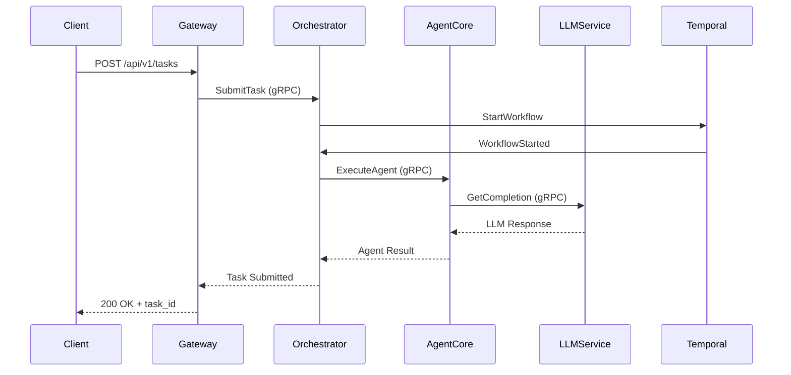

## System Components

<Note>
This page is under construction as part of Phase 2 documentation expansion.
</Note>

Shannon is built as a distributed system with multiple specialized components:

## Core Services

### Gateway (Go)
- **Port**: 8080
- **Role**: REST API gateway, authentication, rate limiting
- **Technology**: Go, Chi router
- **Scaling**: Stateless, horizontal

### Orchestrator (Go)
- **Port**: 50052 (gRPC), 8081 (admin)
- **Role**: Task coordination, workflow management
- **Technology**: Go, Temporal, gRPC
- **Scaling**: Stateful via Temporal workflows

### Agent Core (Rust)
- **Port**: 50051 (gRPC)
- **Role**: Agent execution, tool invocation, WASI sandboxing
- **Technology**: Rust, Wasmtime, gRPC
- **Scaling**: Horizontal

### LLM Service (Python)
- **Port**: 8000
- **Role**: LLM provider gateway, prompt management
- **Technology**: Python, FastAPI, litellm
- **Scaling**: Horizontal

<Note>
LLM Service notes:

- GPT‑5 models are routed via the OpenAI Responses API, and the server prefers `output_text` when present. This avoids empty results when chat responses return structured content.
- The `/agent/query` HTTP endpoint expects `allowed_tools`:
  - Omit/`null`: role presets may enable tools
  - `[]`: tools disabled
  - `["name", …]`: only listed tools available (built‑in, OpenAPI, MCP by registry name)
</Note>

### Desktop App (Tauri + Next.js)
- **Port**: — (native app, connects to Gateway :8080)
- **Role**: Real-time monitoring UI (tasks, runs, events)
- **Technology**: Next.js, Tauri, SSE/WebSocket
- **Scaling**: Client-side; backend services scale independently

## Data Stores

### PostgreSQL
- **Port**: 5432
- **Purpose**: Task metadata, events, sessions, users
- **Schema**: ~15 tables (task_executions, event_logs, sessions, etc.)

### Redis
- **Port**: 6379
- **Purpose**: Session cache, pub/sub, rate limiting
- **Persistence**: Optional (RDB/AOF)

### Qdrant
- **Port**: 6333
- **Purpose**: Vector embeddings, semantic memory
- **Collections**: Per-tenant isolation

### Temporal
- **Port**: 7233 (gRPC), 8088 (UI)
- **Purpose**: Durable workflow execution
- **Persistence**: PostgreSQL backend

## Component Interactions

## Coming Soon

Detailed documentation for each component including:
- Architecture diagrams
- API interfaces
- Configuration options
- Scaling guidelines
- Troubleshooting tips

See [Architecture Overview](/en/architecture/overview) for high-level system design.
