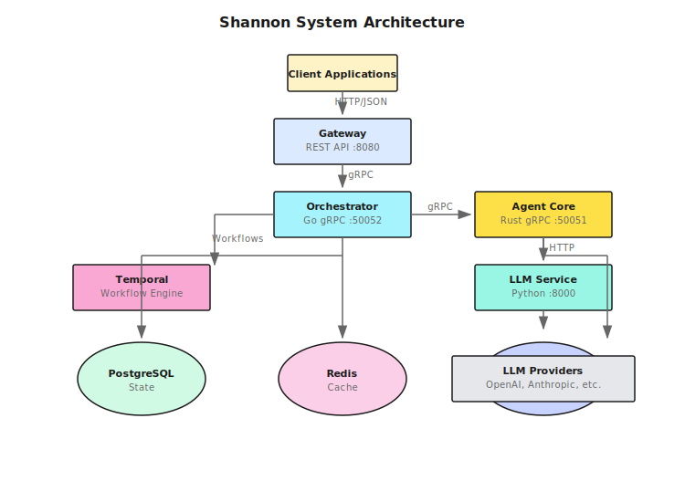

## System Architecture

Shannon is built as a distributed microservices system designed for production AI agent orchestration:

## Core Components

### Gateway (Port 8080)

**Technology**: Go
**Purpose**: REST API layer for external clients

The Gateway provides:
- HTTP/JSON API interface
- Authentication and authorization (API keys)
- Rate limiting per user
- Idempotency support
- SSE and WebSocket streaming
- OpenAPI specification

<Card title="Key Feature" icon="shield">
  Authentication is **disabled by default** for easy adoption. Enable it in production with `GATEWAY_SKIP_AUTH=0`.
</Card>

### Orchestrator (Port 50052)

**Technology**: Go + Temporal
**Purpose**: Central workflow coordination

The Orchestrator handles:
- Task routing and decomposition
- Cognitive pattern selection (CoT, ToT, ReAct)
- Budget and token usage enforcement
- Session management
- OPA policy evaluation
- Multi-agent coordination

**Key Technology**: [Temporal](https://temporal.io) - Provides durable, deterministic workflows that can be replayed for debugging.

### Agent Core (Port 50051)

**Technology**: Rust
**Purpose**: Secure execution layer

The Agent Core provides:
- WASI (WebAssembly System Interface) sandboxing
- Secure Python code execution (CPython 3.11 in WASI)
- Tool registry and execution
- Result caching (LRU with TTL)
- Circuit breakers and rate limiting

<Card title="Security First" icon="lock">
  All code execution happens in a WASI sandbox with **no network access** and **read-only filesystem**.
</Card>

### LLM Service (Port 8000)

**Technology**: Python + FastAPI
**Purpose**: Multi-provider LLM gateway

The LLM Service handles:
- Multi-provider abstraction (OpenAI, Anthropic, Google, etc.)
- Intelligent caching with SHA256-based deduplication
- MCP (Model Context Protocol) tool integration
- Web search integration (Exa, Perplexity, etc.)
- Embeddings and document chunking

## Data Flow

Here's how a task flows through Shannon:

<Steps>
  <Step title="Task Submission">
    Client submits task via REST API to Gateway
  </Step>
  <Step title="Workflow Creation">
    Gateway forwards to Orchestrator, which creates a Temporal workflow
  </Step>
  <Step title="Pattern Selection">
    Orchestrator analyzes task complexity and selects cognitive pattern
  </Step>
  <Step title="Task Decomposition">
    For complex tasks, breaks into subtasks and creates DAG (Directed Acyclic Graph)
  </Step>
  <Step title="Agent Execution">
    Orchestrator invokes Agent Core for each subtask
  </Step>
  <Step title="LLM Calls">
    Agent Core calls LLM Service, which routes to appropriate provider
  </Step>
  <Step title="Tool Execution">
    If needed, executes tools in WASI sandbox or calls external APIs
  </Step>
  <Step title="Result Synthesis">
    Orchestrator combines results from all agents
  </Step>
  <Step title="Response">
    Final result returned to client via Gateway
  </Step>
</Steps>

## Persistence Layer

### PostgreSQL

Stores:
- Task metadata and execution history
- Session state and context
- User and API key data
- Workflow history

**Schema**: Relational storage for tasks, sessions, and agent metadata

### Redis

Provides:
- Session caching (TTL: 3600s)
- LLM response caching
- Rate limiter state
- Pub/sub for events

### Qdrant

Vector database for:
- Semantic memory retrieval
- Session-scoped vector collections
- MMR (Maximal Marginal Relevance) for diversity

## Observability

Shannon includes comprehensive observability:

### Metrics (Prometheus)

Each service exposes metrics:
- **Orchestrator**: `:2112/metrics`
- **Agent Core**: `:2113/metrics`
- **LLM Service**: `:8000/metrics`

Metrics include:
- Request rates and latency
- Token usage and costs
- Cache hit/miss rates
- Error rates by type
- Circuit breaker status

### Tracing (OpenTelemetry)

Distributed tracing across all services with context propagation via `traceparent` headers.

### Desktop Application

Native Tauri/Next.js desktop client providing:
- Active tasks and workflows (Runs view)
- Event streams (Run Details)
- Basic system and task-level insights

### Temporal UI (Port 8088)

Native Temporal interface for:
- Workflow visualization
- Execution history
- Replay debugging
- Worker status

## Design Principles

### 1. Reliability

- **Temporal workflows** ensure durability - workflows survive service restarts
- **Circuit breakers** prevent cascading failures
- **Graceful degradation** when services are unavailable

### 2. Security

- **WASI sandboxing** isolates untrusted code execution
- **OPA policies** enforce fine-grained access control
- **Multi-tenancy** with tenant isolation

### 3. Cost Control

- **Token budgets** prevent runaway costs
- **Intelligent routing** to cheaper models when appropriate
- **Learning router** improves cost efficiency over time (85-95% savings)

### 4. Observability

- **Prometheus metrics** for monitoring
- **OpenTelemetry tracing** for debugging
- **Deterministic replay** via Temporal

## Scalability

Shannon scales horizontally:

- **Stateless services**: Gateway, Orchestrator, Agent Core can scale independently
- **Temporal workers**: Add more workers to increase throughput
- **Database**: PostgreSQL with read replicas, Redis cluster, Qdrant distributed mode

## Next Steps

<CardGroup cols={2}>
  <Card
    title="Core Concepts"
    icon="book"
    href="/en/quickstart/concepts/agents"
  >
    Deep dive into agents and workflows
  </Card>
  <Card
    title="API Reference"
    icon="terminal"
    href="/en/api/overview"
  >
    Explore the complete API
  </Card>
  <Card
    title="Cost Control"
    icon="dollar"
    href="/en/quickstart/concepts/cost-control"
  >
    Manage and optimize costs
  </Card>
  <Card
    title="Python SDK"
    icon="code"
    href="/en/sdk/python/quickstart"
  >
    Get started with the SDK
  </Card>
</CardGroup>
