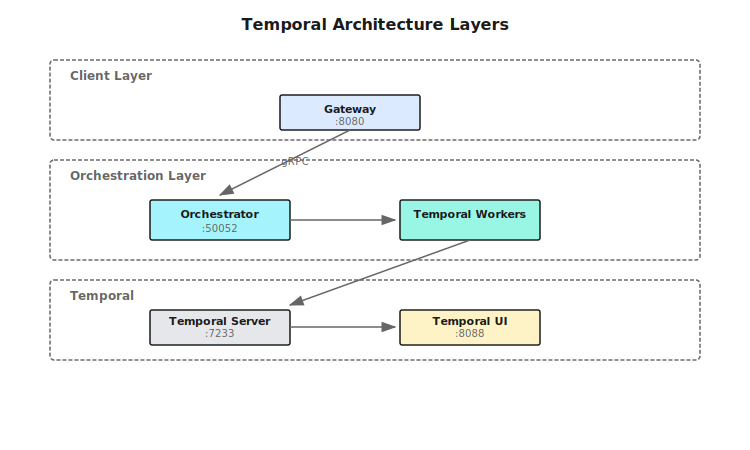

## Overview

Shannon uses [Temporal](https://temporal.io) as its workflow engine, providing durable, deterministic execution that survives service restarts and can be replayed for debugging.

## Architecture



## Workflow Types

Shannon implements several workflow types for different use cases:

### OrchestratorWorkflow
The main entry point that routes queries to appropriate strategy workflows based on complexity analysis.

### Strategy Workflows

| Workflow | Best For | Patterns Used |
|----------|----------|---------------|
| **DAGWorkflow** | Multi-step tasks with clear subtasks | Parallel/Sequential + Reflection |
| **ReactWorkflow** | Tool-using tasks, iterative solving | Reason-Act-Observe loops |
| **ResearchWorkflow** | Information gathering, synthesis | React or Parallel + Reflection |
| **ExploratoryWorkflow** | Open-ended discovery | Tree-of-Thoughts + Debate |
| **ScientificWorkflow** | Hypothesis testing | CoT + Debate + ToT + Reflection |

### SupervisorWorkflow
Advanced workflow for dynamic team management with agent recruitment and retirement.

### ScheduledTaskWorkflow
Wrapper workflow for recurring task execution via cron schedules.

## Workflow Selection Logic


## Reasoning Patterns

Shannon composes these patterns within workflows:

### Chain-of-Thought (CoT)
Step-by-step reasoning with confidence tracking for complex problems.

### Tree-of-Thoughts (ToT)
Systematic exploration with branching and pruning for problems with multiple solution paths.

### ReAct
Reason-Act-Observe loops with tool integration for iterative problem solving.

### Debate
Multi-agent debate for exploring perspectives and strengthening answers.

### Reflection
Iterative quality improvement through self-evaluation.

## Execution Patterns

### Parallel Execution
- Concurrent agent execution with semaphore control
- Configurable concurrency limits
- Result aggregation

### Sequential Execution
- Step-by-step execution with result passing
- Context accumulation between steps

### Hybrid (DAG) Execution
- Dependency graph execution with topological sorting
- Combines parallel and sequential based on dependencies

## Configuration

### Workflow Options

```go
type WorkflowConfig struct {
    ExploratoryMaxIterations        int     // Max exploration rounds
    ExploratoryConfidenceThreshold  float64 // Confidence target
    ScientificMaxHypotheses         int     // Number of hypotheses
    ScientificMaxIterations         int     // Max testing rounds
}
```

### Environment Variables

| Variable | Default | Description |
|----------|---------|-------------|
| `TEMPORAL_HOST` | `temporal:7233` | Temporal server address |
| `AGENT_TIMEOUT_SECONDS` | `600` | Agent execution timeout |
| `DECOMPOSE_TIMEOUT_SECONDS` | `30` | Task decomposition timeout |

## Temporal UI

Access the Temporal UI at `http://localhost:8088` for:

- **Workflow Visualization**: See workflow execution graphs
- **Execution History**: Full event history for each workflow
- **Replay Debugging**: Step through workflow execution
- **Worker Status**: Monitor worker health and task queues

## Deterministic Replay

Temporal ensures workflows are deterministic:

<Note>
All workflow code must be deterministic - no random numbers, current time, or external calls directly in workflow code. Use activities for non-deterministic operations.
</Note>

### Version Gates
Shannon uses version gates for backward-compatible changes:

```go
v := workflow.GetVersion(ctx, "memory_retrieval_v1", workflow.DefaultVersion, 1)
if v >= 1 {
    // New memory retrieval logic
}
```

## Token Budget Management

All workflows respect token budgets through:
1. **Middleware**: Budget enforcement at workflow entry
2. **Pattern Options**: `BudgetAgentMax` field limits per-agent tokens
3. **Activity Budgets**: Controlled execution with budget tracking

## Best Practices

### When to Use Each Mode

| Mode | Use Case | Example |
|------|----------|---------|
| `simple` | Direct questions | "What is 2+2?" |
| `standard` | Multi-step tasks | "Summarize this document" |
| `complex` | Deep analysis | "Compare frameworks" |
| `supervisor` | Dynamic teams | "Research and implement" |

### Pattern Selection

1. **Use Reflection** when quality matters more than speed
2. **Use Chain-of-Thought** for explicit reasoning steps
3. **Use Debate** when multiple perspectives strengthen answers
4. **Use Tree-of-Thoughts** for complex problems with multiple paths
5. **Use React** when environmental feedback is needed

## Monitoring

### Prometheus Metrics

- `shannon_workflow_duration_seconds` - Workflow execution time
- `shannon_workflow_status` - Success/failure counts
- `shannon_activity_duration_seconds` - Activity execution time

### OpenTelemetry Tracing

Distributed tracing spans across:
- Workflow execution
- Activity calls
- Agent invocations
- LLM requests

## Next Steps

<CardGroup cols={2}>
  <Card title="Workflows Concepts" icon="diagram-project" href="/en/quickstart/concepts/workflows">
    Learn about cognitive patterns
  </Card>
  <Card title="Architecture Overview" icon="sitemap" href="/en/architecture/overview">
    System architecture
  </Card>
</CardGroup>
