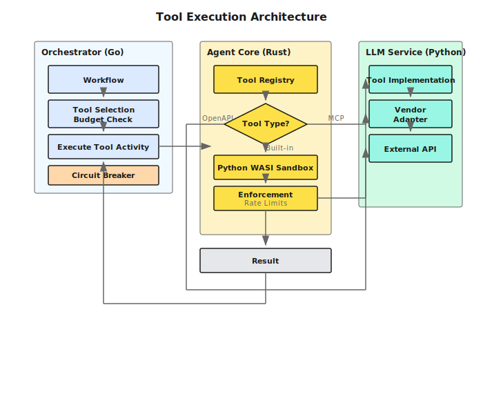
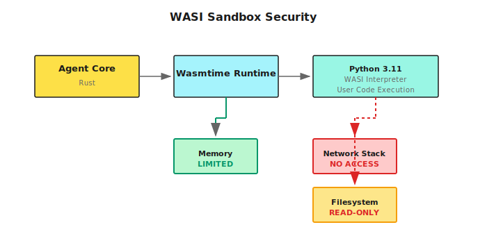
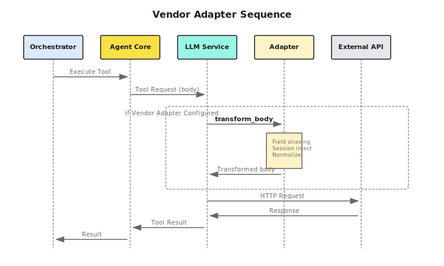
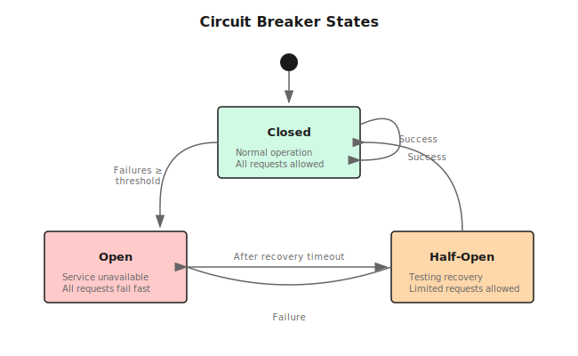

## Overview

Shannon's tool execution system provides a secure, extensible framework for integrating external capabilities into AI agents. The architecture supports three tool types with unified execution semantics.

## Tool Types

<CardGroup cols={3}>
  <Card title="MCP Tools" icon="cloud">
    External HTTP APIs following Model Context Protocol
  </Card>
  <Card title="OpenAPI Tools" icon="file-code">
    Auto-generated from OpenAPI 3.x specifications
  </Card>
  <Card title="Built-in Tools" icon="code">
    Python tools with direct service access
  </Card>
</CardGroup>

All tool types share:
- Unified JSON schema for parameters
- Consistent error handling
- Rate limiting and circuit breakers
- Cost tracking and budget enforcement
- Security validation

## Architecture Layers



## Tool Registry

### Registration

Tools are registered at service startup with metadata:

```python
# python/llm-service/llm_service/tools/base.py
class ToolMetadata:
    name: str                    # Unique identifier
    version: str                 # Semantic version
    description: str             # LLM-visible description
    category: str                # search, data, analytics, code, etc.
    parameters: List[ToolParameter]  # JSON schema

    # Execution constraints
    timeout_seconds: int = 30
    memory_limit_mb: int = 128
    rate_limit: int = 60        # requests per minute
    cost_per_use: float = 0.0   # USD

    # Security flags
    dangerous: bool = False      # File writes, code exec
    requires_auth: bool = False
    sandboxed: bool = False
    session_aware: bool = False
```

### Discovery

Tools are exposed via HTTP API for runtime discovery:

```bash
# List all tools
GET /tools/list

# Get tool schema
GET /tools/{name}/schema

# Get tool metadata
GET /tools/{name}/metadata

# List by category
GET /tools/list?category=data
```

## WASI Sandboxing

Python code execution happens in WebAssembly System Interface (WASI) sandboxes for security isolation.

### Architecture



### Security Boundaries

<AccordionGroup>
  <Accordion title="No Network Access">
    WASI sandboxes have no network stack:

- ✅ Can compute, parse, transform data
- ❌ Cannot make HTTP requests
- ❌ Cannot open sockets
- ❌ Cannot access external resources

**Use case**: Safe execution of user-provided Python code
  </Accordion>

  <Accordion title="Read-Only Filesystem">
    Filesystem is mounted read-only:

- ✅ Can read Python standard library
- ✅ Can read allowed data files
- ❌ Cannot write files
- ❌ Cannot modify system files

**Use case**: Prevent data exfiltration and tampering
  </Accordion>

  <Accordion title="Memory Limits">
    Memory usage is capped per execution:

```rust
// rust/agent-core/src/wasi_sandbox.rs
const DEFAULT_MEMORY_LIMIT_MB: usize = 512;
const DEFAULT_TABLE_LIMIT: u32 = 10000;  // Required for Python
```

**Use case**: Prevent resource exhaustion attacks
  </Accordion>

  <Accordion title="Execution Timeouts">
    Each execution has strict time limits:

```yaml
# Default timeout
timeout_seconds: 60

# Configurable per tool
WASI_TIMEOUT_SECONDS=30
```

**Use case**: Prevent infinite loops and hanging processes
  </Accordion>
</AccordionGroup>

### Setup

```bash
# Download Python WASI interpreter (20MB)
./scripts/setup_python_wasi.sh

# Verify installation
ls -lh wasm-interpreters/python-3.11.4.wasm

# Configuration
PYTHON_WASI_WASM_PATH=./wasm-interpreters/python-3.11.4.wasm
WASI_MEMORY_LIMIT_MB=512
WASI_TIMEOUT_SECONDS=60
```

## OpenAPI Tool Loader

Shannon dynamically generates tools from OpenAPI specifications.

### Spec Processing

<Steps>
  <Step title="Fetch Spec">
    Retrieve OpenAPI spec from URL or inline YAML:

```python
spec_url = "https://api.example.com/openapi.json"
spec = fetch_openapi_spec(spec_url)
```
  </Step>

  <Step title="Validate & Parse">
    Validate OpenAPI version and structure:

```python
# Supports OpenAPI 3.0 and 3.1
assert spec["openapi"].startswith("3.")

# Extract operations
operations = extract_operations(spec)
```
  </Step>

  <Step title="Generate Tools">
    Create tool for each operation:

```python
for operation in operations:
    tool = Tool(
        name=operation["operationId"],
        description=operation["summary"],
        parameters=convert_schema(operation["parameters"]),
        execute=lambda params: call_api(operation, params)
    )
    registry.register(tool)
```
  </Step>

  <Step title="Apply Vendor Adapter">
    If configured, load vendor-specific transformations:

```python
if auth_config.get("vendor"):
    adapter = get_vendor_adapter(auth_config["vendor"])
    if adapter:
        body = adapter.transform_body(body, operation_id, prompt_params)
```
  </Step>
</Steps>

### Schema Resolution

```python
# Resolve local $ref references
# #/components/schemas/Pet → Pet schema definition
def resolve_ref(ref: str, spec: dict) -> dict:
    path = ref.lstrip("#/").split("/")
    schema = spec
    for key in path:
        schema = schema[key]
    return schema
```

<Warning>
Remote `$ref` resolution (e.g., `https://example.com/schemas/Pet.json`) is not supported. Merge external schemas into a single spec file.
</Warning>

## Vendor Adapter Integration

Vendor adapters transform requests/responses for domain-specific APIs without modifying Shannon's core.

### Execution Flow



### Adapter Loading

```python
# python/llm-service/llm_service/tools/vendor_adapters/__init__.py
def get_vendor_adapter(name: str):
    """Return adapter instance by name, or None if not available."""
    if not name:
        return None

    try:
        if name.lower() == "datainsight":
            from .datainsight import DataInsightAdapter
            return DataInsightAdapter()
        # Graceful fallback for missing vendor modules
    except ImportError:
        logger.warning(f"Vendor adapter '{name}' not available")
        return None
    except Exception as e:
        logger.error(f"Failed to load vendor adapter '{name}': {e}")
        return None

    return None
```

### Transformation Examples

**Field Aliasing:**
```python
# Transform: "users" → "di:unique_users"
metric_aliases = {
    "users": "di:unique_users",
    "sessions": "di:total_sessions",
}
body["metrics"] = [metric_aliases.get(m, m) for m in body["metrics"]]
```

**Session Context Injection:**
```python
# Inject account_id from prompt_params
if prompt_params and "account_id" in prompt_params:
    body["account_id"] = prompt_params["account_id"]
```

**Time Range Normalization:**
```python
# Transform: {start, end} → {startTime, endTime}
if "start" in body["timeRange"]:
    body["timeRange"]["startTime"] = body["timeRange"].pop("start")
if "end" in body["timeRange"]:
    body["timeRange"]["endTime"] = body["timeRange"].pop("end")
```

## Rate Limiting

### Per-Tool Rate Limits

```python
class ToolMetadata:
    rate_limit: int = 60  # Requests per minute (default)
```

Implemented with token bucket algorithm:

```python
class RateLimiter:
    def __init__(self, rate_limit: int):
        self.rate = rate_limit
        self.tokens = rate_limit
        self.last_update = time.time()

    def allow(self) -> bool:
        now = time.time()
        elapsed = now - self.last_update

        # Refill tokens
        self.tokens = min(
            self.rate,
            self.tokens + elapsed * (self.rate / 60.0)
        )
        self.last_update = now

        if self.tokens >= 1:
            self.tokens -= 1
            return True
        return False
```

### Global Rate Limits

```bash
# Environment variables
MCP_RATE_LIMIT_DEFAULT=60              # Default for MCP tools
WEB_SEARCH_RATE_LIMIT=120              # Web search specific
CALCULATOR_RATE_LIMIT=2000             # Calculator specific
PYTHON_EXECUTOR_RATE_LIMIT=60          # Python execution
```

## Circuit Breakers

Prevent cascading failures when external services are unavailable.

### Configuration

```bash
# MCP circuit breaker
MCP_CB_FAILURES=5                      # Open after 5 failures
MCP_CB_RECOVERY_SECONDS=60             # Stay open for 60s

# Agent Core enforcement
ENFORCE_CB_ERROR_THRESHOLD=0.5         # Error rate to open (50%)
ENFORCE_CB_WINDOW_SECONDS=30           # Sliding window
ENFORCE_CB_MIN_REQUESTS=20             # Min requests before activation
```

### States



**Closed**: Normal operation, all requests allowed

**Open**: Service unavailable, all requests fail fast

**Half-Open**: Testing recovery, limited requests allowed

## Cost Tracking

Each tool execution tracks cost for budget enforcement.

### Per-Tool Costs

```python
class ToolMetadata:
    cost_per_use: float = 0.001  # USD per invocation
```

### Budget Enforcement

```go
// go/orchestrator/internal/budget/manager.go
type BudgetManager struct {
    maxCostPerRequest float64
    maxTokensPerRequest int
}

func (bm *BudgetManager) CheckBudget(currentCost, currentTokens float64) error {
    if currentCost >= bm.maxCostPerRequest {
        return ErrBudgetExceeded
    }
    if currentTokens >= bm.maxTokensPerRequest {
        return ErrTokenLimitExceeded
    }
    return nil
}
```

### Configuration

```bash
MAX_COST_PER_REQUEST=0.50              # USD
MAX_TOKENS_PER_REQUEST=10000
TOKEN_BUDGET_PER_AGENT=5000
TOKEN_BUDGET_PER_TASK=20000
```

## Error Handling

### Error Categories

<Tabs>
  <Tab title="Validation Errors">
```python
class ValidationError(Exception):
    """Parameter validation failed."""
    pass

# Missing required parameter
# Invalid parameter type
# Value out of range
# Enum constraint violation
```
  </Tab>

  <Tab title="Execution Errors">
```python
class ExecutionError(Exception):
    """Tool execution failed."""
    pass

# Timeout exceeded
# Memory limit exceeded
# Sandbox violation
# Tool-specific errors
```
  </Tab>

  <Tab title="Network Errors">
```python
class NetworkError(Exception):
    """External API call failed."""
    pass

# Connection timeout
# DNS resolution failed
# TLS handshake failed
# HTTP error codes (4xx, 5xx)
```
  </Tab>

  <Tab title="Circuit Breaker Errors">
```python
class CircuitBreakerError(Exception):
    """Circuit breaker is open."""
    pass

# Too many failures
# Service unavailable
# Automatic retry prevented
```
  </Tab>
</Tabs>

### Retry Logic

```python
# Exponential backoff with jitter
@retry(
    retries=3,
    backoff=exponential_backoff(base=1.0, max_delay=10.0),
    on_exception=(NetworkError, TimeoutError)
)
def execute_tool(tool_name, parameters):
    return registry.execute(tool_name, parameters)
```

## Performance Optimizations

### Connection Pooling

```python
# HTTP connection pool for external APIs
session = aiohttp.ClientSession(
    connector=aiohttp.TCPConnector(
        limit=100,              # Max total connections
        limit_per_host=10,      # Max per host
        ttl_dns_cache=300,      # DNS cache TTL
    )
)
```

### Response Caching

```python
# Cache OpenAPI specs
@lru_cache(maxsize=100)
def load_openapi_spec(spec_url: str) -> dict:
    return fetch_and_parse(spec_url)
```

### Parallel Execution

```go
// Execute multiple tools in parallel
func ExecuteToolsParallel(tools []Tool, parallelism int) []Result {
    sem := make(chan struct{}, parallelism)  // Semaphore
    results := make([]Result, len(tools))

    var wg sync.WaitGroup
    for i, tool := range tools {
        wg.Add(1)
        go func(idx int, t Tool) {
            defer wg.Done()
            sem <- struct{}{}        // Acquire
            defer func() { <-sem }() // Release

            results[idx] = t.Execute()
        }(i, tool)
    }
    wg.Wait()
    return results
}
```

Configuration:
```bash
TOOL_PARALLELISM=5  # Execute up to 5 tools concurrently
```

## Security Considerations

<Warning>
Always validate tool inputs and restrict execution based on user permissions.
</Warning>

### Domain Allowlisting

```bash
# Restrict external API access
MCP_ALLOWED_DOMAINS=api.example.com,api.partner.com
OPENAPI_ALLOWED_DOMAINS=api.github.com,api.stripe.com

# Development only
MCP_ALLOWED_DOMAINS=*  # Allow all (⚠️ NOT FOR PRODUCTION)
```

### Tool Permissions

```python
class ToolMetadata:
    dangerous: bool = False      # File writes, code execution
    requires_auth: bool = False  # User authentication required
```

OPA policies can gate access:
```rego
# config/opa/policies/tools.rego
package tools

deny[msg] {
    input.tool == "file_write"
    not is_admin(input.user)
    msg := "file_write requires admin role"
}
```

### API Key Management

<Tabs>
  <Tab title="Environment Variables">
```bash
# .env (not committed to git)
WEATHER_API_KEY=sk-xxx
GITHUB_TOKEN=ghp_xxx
STRIPE_API_KEY=sk_live_xxx
```
  </Tab>

  <Tab title="Docker Secrets">
```yaml
# docker-compose.yml
services:
  llm-service:
    secrets:
      - weather_api_key
      - github_token

secrets:
  weather_api_key:
    external: true
  github_token:
    external: true
```
  </Tab>

  <Tab title="Kubernetes Secrets">
```yaml
apiVersion: v1
kind: Secret
metadata:
  name: api-keys
type: Opaque
data:
  weather-api-key: <base64-encoded>
  github-token: <base64-encoded>
```
  </Tab>
</Tabs>

## Monitoring & Observability

### Metrics

```prometheus
# Tool execution metrics
shannon_tool_executions_total{tool_name, status}
shannon_tool_execution_duration_seconds{tool_name}
shannon_tool_errors_total{tool_name, error_type}
shannon_tool_cost_usd{tool_name}

# Circuit breaker metrics
shannon_circuit_breaker_state{base_url}
shannon_circuit_breaker_failures_total{base_url}

# Rate limiter metrics
shannon_rate_limit_exceeded_total{tool_name}
shannon_rate_limit_tokens_available{tool_name}
```

### Logging

```python
# Structured logging for tool execution
logger.info(
    "Tool execution completed",
    extra={
        "tool_name": tool_name,
        "duration_ms": duration,
        "cost_usd": cost,
        "success": success,
        "error": error_message,
    }
)
```

### Tracing

```python
# OpenTelemetry tracing
with tracer.start_as_current_span("tool_execution") as span:
    span.set_attribute("tool.name", tool_name)
    span.set_attribute("tool.category", category)

    result = execute_tool(tool_name, parameters)

    span.set_attribute("tool.success", result.success)
    span.set_attribute("tool.cost_usd", result.cost)
```

## Next Steps

<CardGroup cols={2}>
  <Card title="Adding Custom Tools" icon="wrench" href="/en/tutorials/custom-tools">
    Learn how to add MCP, OpenAPI, and built-in tools
  </Card>
  <Card title="Vendor Adapters" icon="plug" href="/en/tutorials/vendor-adapters">
    Build domain-specific integrations
  </Card>
  <Card title="Configuration" icon="gear" href="/en/quickstart/configuration">
    Complete configuration reference
  </Card>
  <Card title="Security Best Practices" icon="shield-check" href="/en/deployment/security">
    Harden your Shannon deployment
  </Card>
</CardGroup>
