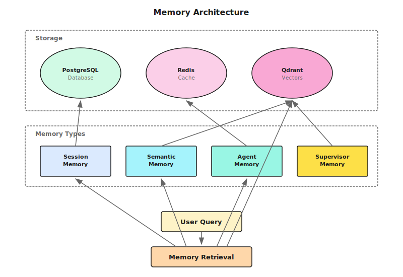

## Overview

Shannon's memory system provides intelligent context retention and retrieval across user sessions, enabling agents to maintain conversational continuity and leverage historical interactions for improved responses.

## Architecture



## Storage Layers

### PostgreSQL
- **Session Context**: Session-level state and metadata
- **Execution Persistence**: Agent and tool execution history
- **Task Tracking**: High-level task and workflow metadata

### Redis
- **Session Cache**: Fast access to active session data (TTL: 3600s)
- **Token Budgets**: Real-time token usage tracking
- **Compression State**: Tracks context compression status

### Qdrant (Vector Store)
- **Semantic Memory**: High-performance vector similarity search
- **Collection Organization**: task_embeddings, summaries, tool_results, document_chunks
- **Hybrid Search**: Combines recency and semantic relevance

## Memory Types

### Hierarchical Memory (Default)
Combines multiple retrieval strategies:
- **Recent Memory**: Last N interactions from current session
- **Semantic Memory**: Contextually relevant based on query similarity
- **Compressed Summaries**: Condensed representations of older conversations

### Session Memory
Chronological retrieval of recent interactions within a session.

### Agent Memory
Individual agent execution records including:
- Input queries and generated responses
- Token usage and model information
- Tool executions and results

### Supervisor Memory
Strategic memory for intelligent task decomposition:
- **Decomposition Patterns**: Successful task breakdowns for reuse
- **Strategy Performance**: Aggregated metrics per strategy type
- **Failure Patterns**: Known failures with mitigation strategies

## Configuration

### Environment Variables

| Variable | Default | Description |
|----------|---------|-------------|
| `QDRANT_HOST` | `qdrant` | Qdrant server hostname |
| `QDRANT_PORT` | `6333` | Qdrant server port |
| `REDIS_TTL_SECONDS` | `3600` | Session cache TTL |

### Embedding Requirements

<Warning>
Memory features require OpenAI API access for text embeddings.
</Warning>

- **Default Model**: `text-embedding-3-small` (1536 dimensions)
- **Fallback Behavior**: If OpenAI key is not configured, memory operations silently degrade - workflows continue without historical context

## Key Features

### Intelligent Chunking
- Splits long answers (>2000 tokens) into manageable chunks
- 200-token overlap for context preservation
- Batch embeddings for efficiency

### MMR (Maximal Marginal Relevance)
- Diversity-aware reranking balances relevance with information diversity
- Default lambda=0.7 optimizes for relevant yet diverse context
- Fetches 3x requested items, then reranks for diversity

### Context Compression
- Automatic triggers based on message count and token estimates
- Rate limiting prevents excessive compression
- Model-aware thresholds for different tiers

## Memory Retrieval Flow

<Steps>
  <Step title="Query Analysis">
    Incoming query is analyzed for semantic content
  </Step>
  <Step title="Recent Fetch">
    Retrieves last N messages from current session via Redis
  </Step>
  <Step title="Semantic Search">
    Performs vector similarity search in Qdrant
  </Step>
  <Step title="Merge & Deduplicate">
    Combines results and removes duplicates
  </Step>
  <Step title="Context Injection">
    Injects relevant memory into agent context
  </Step>
</Steps>

## Privacy & Data Governance

### PII Protection
- Data minimization: Store only essential fields
- Anonymization: UUIDs instead of real identities
- Automatic PII detection and redaction

### Data Retention
- **Conversation History**: 30-day default retention
- **Decomposition Patterns**: 90-day retention
- **User Preferences**: Session-based, 24-hour expiry

## Performance Optimizations

- **Batch Processing**: Single API call for multiple chunks (5x faster)
- **Smart Caching**: LRU (2048 entries) + Redis
- **Payload Indexes**: 50-90% faster filtering on session_id, tenant_id, user_id
- **Optimized HNSW**: m=16, ef_construct=100 for fast similarity search

## Limitations

- Memory retrieval adds latency (mitigated by caching)
- Vector similarity may miss exact keyword matches
- Compression is lossy (preserves key points only)
- Cross-session memory requires explicit session linking

## Enabling Semantic Memory

Follow the steps below to enable Shannon's semantic memory system backed by Qdrant.

### Prerequisites

<Note>
Before proceeding, ensure the following are in place:
- **Qdrant** is running (included by default in Shannon's `docker-compose.yaml`)
- **`OPENAI_API_KEY`** is set in your environment (required for the `text-embedding-3-small` embedding model)
</Note>

### Step-by-Step Setup

<Steps>
  <Step title="Enable vector memory in shannon.yaml">
    Add or update the `vector` block in your `shannon.yaml` configuration:

    ```yaml shannon.yaml
    vector:
      enabled: true                    # Must set to true (default: false)
      host: "qdrant"
      port: 6333
      top_k: 10
      threshold: 0.5
      default_model: "text-embedding-3-small"
      cache_ttl: "1h"
      use_redis_cache: true
      expected_embedding_dim: 1536
    ```

    <Warning>
    `vector.enabled` defaults to `false`. You must explicitly set it to `true` for semantic memory to function.
    </Warning>
  </Step>

  <Step title="Verify Qdrant collections">
    Shannon automatically creates 5 collections (all using 1536-dimensional vectors from `text-embedding-3-small`):

    | Collection | Purpose |
    |---|---|
    | `task_embeddings` | Task result embeddings for semantic search |
    | `tool_results` | Tool execution result embeddings |
    | `cases` | Case library for pattern matching |
    | `document_chunks` | Document chunk embeddings for RAG |
    | `summaries` | Summary embeddings |

    You can verify the collections are created by querying the Qdrant REST API:

    ```bash
    curl http://localhost:6333/collections
    ```
  </Step>

  <Step title="Configure MMR diversity reranking">
    MMR (Maximal Marginal Relevance) balances relevance and diversity in retrieval results. When enabled, Shannon fetches a larger candidate pool and reranks to reduce redundancy while preserving relevance.

    ```yaml shannon.yaml
    mmr_enabled: true
    mmr_lambda: 0.7           # 0 = pure diversity, 1 = pure relevance
    mmr_pool_multiplier: 3    # Fetch 3x candidates for reranking
    ```

    <Note>
    A `mmr_lambda` of `0.7` is a good default — it strongly favours relevance while still filtering out near-duplicate results.
    </Note>
  </Step>

  <Step title="Configure embeddings endpoint">
    If your LLM Service runs on a non-default address, or you want to tune caching behaviour, update the `embeddings` block:

    ```yaml shannon.yaml
    embeddings:
      base_url: "http://llm-service:8000"
      default_model: "text-embedding-3-small"
      timeout: "10s"
      cache_ttl: "1h"
      max_lru: 4096
    ```

    - `cache_ttl` controls how long embedding vectors are cached in Redis.
    - `max_lru` sets the maximum number of entries in the in-memory LRU cache.
  </Step>
</Steps>

## Next Steps

<CardGroup cols={2}>
  <Card title="Architecture Overview" icon="sitemap" href="/en/architecture/overview">
    System architecture
  </Card>
  <Card title="Sessions API" icon="messages" href="/en/api/rest/sessions">
    Session management
  </Card>
</CardGroup>
