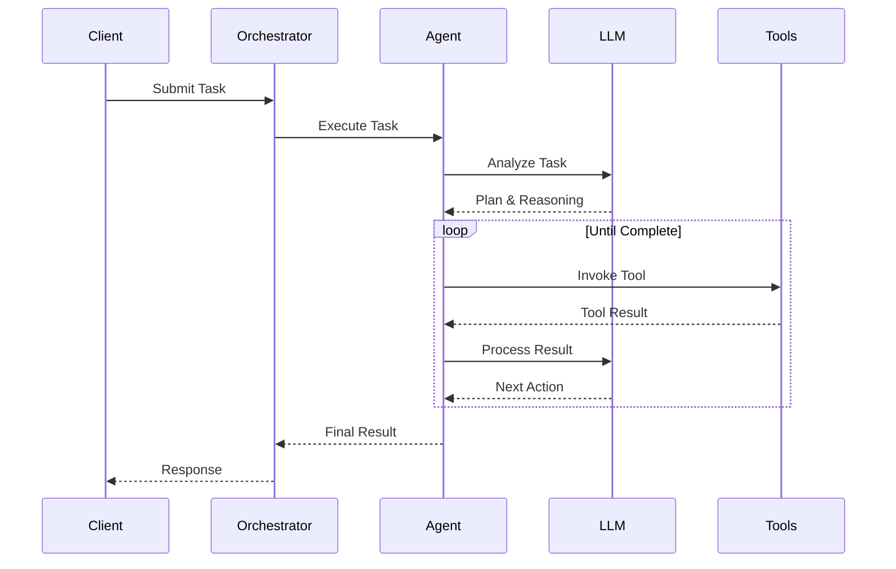

## Introduction

An **AI agent** is an autonomous system that can perceive its environment, make decisions, and take actions to achieve goals. In Shannon, agents are the fundamental execution units that process tasks using Large Language Models (LLMs) and tools.

## Agent Capabilities

Shannon agents can:

<CardGroup cols={2}>
  <Card title="Reason" icon="brain">
    Use LLMs to analyze tasks, plan solutions, and make decisions
  </Card>
  <Card title="Execute Tools" icon="wrench">
    Call functions, run code, search the web, and interact with APIs
  </Card>
  <Card title="Collaborate" icon="users">
    Work with other agents to solve complex multi-step problems
  </Card>
  <Card title="Learn" icon="graduation-cap">
    Improve over time through pattern learning and cached results
  </Card>
</CardGroup>

## Agent Lifecycle

Here's how an agent processes a task:



<Steps>
  <Step title="Task Analysis">
    Agent receives task and analyzes what needs to be done
  </Step>
  <Step title="Planning">
    LLM creates a plan, potentially breaking down into steps
  </Step>
  <Step title="Tool Selection">
    Agent identifies which tools are needed
  </Step>
  <Step title="Execution">
    Iteratively executes tools and processes results
  </Step>
  <Step title="Synthesis">
    Combines results into final answer
  </Step>
</Steps>

## Agent Types in Shannon

### Single Agent (Simple Mode)

A single agent handles the entire task without decomposition.

**Best for:**
- Simple queries
- Fact retrieval
- Basic calculations
- Quick responses

**Example:**
```python
client.submit_task(
    query="What is the capital of France?"
)
```

<Note>
Shannon automatically selects single-agent mode for simple queries.
</Note>

### Multi-Agent (Standard/Complex Mode)

Multiple specialized agents work together, coordinated by Shannon's orchestrator.

**Best for:**
- Complex research
- Multi-step workflows
- Tasks requiring different expertise
- Tasks needing parallel processing

**Example:**
```python
client.submit_task(
    query="Research top 5 AI trends, analyze market impact, and create summary"
)
```

<Note>
Shannon automatically decomposes complex queries into multi-agent workflows based on query complexity.
</Note>

## Agent Components

### 1. LLM Brain

The decision-making core powered by language models:

- **Model Selection**: Shannon auto-selects models based on task complexity
  - Small tasks → `gpt-4o-mini`, `claude-haiku`
  - Complex tasks → `gpt-4o`, `claude-opus`
- **Context Management**: Automatically manages context windows
- **Caching**: Reuses previous LLM responses when applicable

### 2. Tool System

Agents can execute various tools:

**Built-in Tools:**
- Python code execution (WASI sandboxed)
- Web search (Exa, Perplexity, Brave)
- Document retrieval
- Mathematical calculations

**MCP Tools:**
Shannon supports [Model Context Protocol](https://modelcontextprotocol.io) for external tool integration.

**Custom Tools:**
Add your own tools via OpenAPI specs or Python implementations.

### 3. Memory System

Agents maintain two types of memory:

**Session Memory:**
- Short-term context within a conversation
- Stored in Redis (3600s TTL)
- Enables multi-turn dialogues

**Vector Memory:**
- Long-term semantic memory in Qdrant
- Cross-session retrieval
- MMR diversity for relevant context

## Platform Configuration

Shannon's behavior is configured at the platform level via environment variables:

```bash
# In .env file
DEFAULT_MODEL_TIER=medium           # small, medium, large
MAX_TOKENS_PER_REQUEST=10000       # Token budget per task
MAX_COST_PER_REQUEST=0.50          # Cost limit per task (USD)
REQUEST_TIMEOUT_SECONDS=300        # Task timeout

# Restart services to apply changes
docker compose restart
```

### Model Tiers

Shannon automatically selects models based on the configured tier:

| Tier | Models | Use Case | Cost |
|------|--------|----------|------|
| **SMALL** | gpt-4o-mini, claude-haiku | Simple queries, high volume | $ |
| **MEDIUM** | gpt-4o, claude-sonnet | General purpose | $$ |
| **LARGE** | gpt-4, claude-opus | Complex reasoning, critical tasks | $$$ |

<Tip>
Shannon's intelligent router selects the most cost-effective model for each task, achieving 85-95% cost savings compared to always using premium models.
</Tip>

See [Configuration Guide](/en/quickstart/configuration) for all available environment variables.

## Agent Coordination Patterns

Shannon uses proven cognitive patterns for multi-agent coordination:

### Chain-of-Thought (CoT)

Sequential reasoning where each step builds on the previous:

```
Task: "Calculate compound interest"
Step 1: Identify formula
Step 2: Gather inputs
Step 3: Calculate result
Step 4: Format output
```

### Tree-of-Thoughts (ToT)

Exploration with backtracking for complex problem-solving:

```
Task: "Design system architecture"
Branch 1: Microservices approach
  ├─ Evaluate pros/cons
  └─ Estimate complexity
Branch 2: Monolithic approach
  ├─ Evaluate pros/cons
  └─ Estimate complexity
Select: Best option based on criteria
```

### ReAct (Reasoning + Acting)

Interleaved reasoning and action for dynamic tasks:

```
Think: "I need to find the latest stock price"
Act: Search web for "AAPL stock price"
Observe: "$150.25"
Think: "Now calculate 10% gain"
Act: Calculate 150.25 * 1.10
Result: "$165.28"
```

## Security and Isolation

Shannon agents run in secure environments:

<Card title="WASI Sandbox" icon="lock">
  All code execution happens in WebAssembly System Interface sandboxes with:
  - **No network access**
  - **Read-only filesystem**
  - **Memory limits**
  - **Execution timeouts**
</Card>

### OPA Policy Enforcement

Control what agents can do:

```rego
# Example policy: Restrict models by team
package shannon.teams.datascience

allow {
    input.team == "data-science"
    input.model in ["gpt-4o", "claude-sonnet"]
}

max_tokens = 50000 {
    input.team == "data-science"
}
```

## Best Practices

### 1. Choose the Right Mode

- **Simple**: Single-step tasks, fast responses
- **Standard**: Multi-step tasks, moderate complexity
- **Complex**: Research, analysis, advanced reasoning

### 2. Set Budget Limits

Configure token and cost limits at the platform level to prevent unexpected charges:

```bash
# In .env file
MAX_TOKENS_PER_REQUEST=5000
MAX_COST_PER_REQUEST=1.0
```

Monitor costs via task status:

```python
status = client.get_status(task_id, include_details=True)
if status.metrics:
    print(f"Cost: ${status.metrics.cost_usd:.4f}")
    print(f"Tokens: {status.metrics.tokens_used}")
```

### 3. Use Sessions for Context

For multi-turn conversations, use consistent `session_id`:

```python
session_id = "user-123-conversation"
client.submit_task(query="...", session_id=session_id)
```

### 4. Monitor Performance

Check metrics to optimize:

```python
# Wait for task to complete
status = client.wait(handle.task_id, timeout=300)
if status.metrics:
    print(f"Tokens used: {status.metrics.tokens_used}")
    print(f"Cost: ${status.metrics.cost_usd:.4f}")
    print(f"Duration: {status.metrics.duration_seconds:.2f}s")
```

## Next Steps

<CardGroup cols={2}>
  <Card title="Workflows" icon="diagram-project" href="/en/quickstart/concepts/workflows">
    Learn about workflow patterns
  </Card>
  <Card title="Cost Control" icon="dollar-sign" href="/en/quickstart/concepts/cost-control">
    Master budget management
  </Card>
  <Card title="API Reference" icon="code" href="/en/api/overview">
    Explore agent APIs
  </Card>
  <Card title="Python SDK" icon="python" href="/en/sdk/python/quickstart">
    Build with the SDK
  </Card>
</CardGroup>
