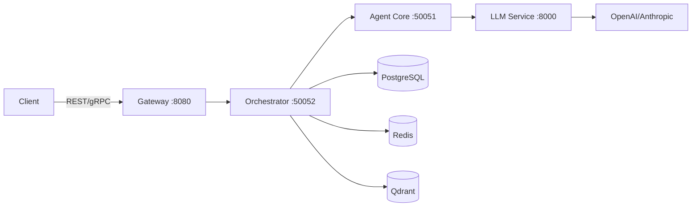

## What is Shannon?

Shannon is a production-grade AI agent orchestration platform designed to solve the critical challenges of deploying AI agents at scale:

<CardGroup cols={2}>
  <Card
    title="Cost Control"
    icon="dollar-sign"
  >
    Hard budget limits, token tracking, and intelligent model selection often delivering 60–90% cost savings (workload‑dependent)
  </Card>
  <Card
    title="Reliability"
    icon="shield-check"
  >
    Deterministic replay debugging, circuit breakers, and automatic degradation
  </Card>
  <Card
    title="Security"
    icon="lock"
  >
    WASI sandboxing for code execution, OPA policy enforcement, multi-tenant isolation
  </Card>
  <Card
    title="Scalability"
    icon="chart-line"
  >
    Temporal-backed distributed workflows, horizontal scaling, comprehensive observability
  </Card>
</CardGroup>

## Key Features

### Multi-Agent Orchestration
Shannon coordinates multiple AI agents using proven cognitive patterns like Chain-of-Thought (CoT), Tree-of-Thoughts (ToT), and ReAct, enabling complex task decomposition and parallel execution.

### Production-Ready
Built with production workloads in mind:
- **Temporal workflows** for durable, deterministic execution
- **WASI sandboxing** for secure Python code execution
- **Circuit breakers** and failure protection
- **Comprehensive observability** with Prometheus metrics and OpenTelemetry tracing

### Multi-Provider Support
Seamlessly switch between LLM providers:
- OpenAI (GPT-5 family)
- Anthropic (Claude 3 Opus/Sonnet/Haiku)
- Google Gemini
- Groq, Azure OpenAI, Ollama, and more

## Quick Start

Get Shannon running in under 10 minutes:

<Card
  title="Installation Guide"
  icon="rocket"
  href="/en/quickstart/installation"
>
  Set up Shannon with Docker Compose in one command
</Card>

## Architecture Overview

Shannon consists of four main components working together:

<CardGroup cols={2}>
  <Card title="Gateway" icon="door-open">
    REST API layer with authentication and rate limiting
  </Card>
  <Card title="Orchestrator" icon="diagram-project">
    Temporal-based workflow coordination and task routing
  </Card>
  <Card title="Agent Core" icon="robot">
    Secure execution layer with WASI sandboxing
  </Card>
  <Card title="LLM Service" icon="brain">
    Multi-provider LLM gateway with intelligent caching
  </Card>
</CardGroup>

## Use Cases

Shannon excels at:

- **Complex Task Automation**: Break down complex tasks into manageable subtasks with automatic orchestration
- **Research & Analysis**: Coordinate multiple agents for comprehensive research and synthesis
- **Code Generation**: Secure Python code execution in WASI sandbox
- **Multi-Step Workflows**: Durable workflows that survive failures and can be replayed for debugging

## Next Steps

<CardGroup cols={2}>
  <Card
    title="Quick Start Tutorial"
    icon="play"
    href="/en/quickstart/quickstart"
  >
    Submit your first task in 5 minutes
  </Card>
  <Card
    title="Core Concepts"
    icon="book"
    href="/en/quickstart/concepts/agents"
  >
    Learn about agents, workflows, and patterns
  </Card>
  <Card
    title="API Reference"
    icon="code"
    href="/en/api/overview"
  >
    Explore the REST and gRPC APIs
  </Card>
  <Card
    title="Python SDK"
    icon="python"
    href="/en/sdk/python/quickstart"
  >
    Use the Python SDK for easy integration
  </Card>
</CardGroup>
