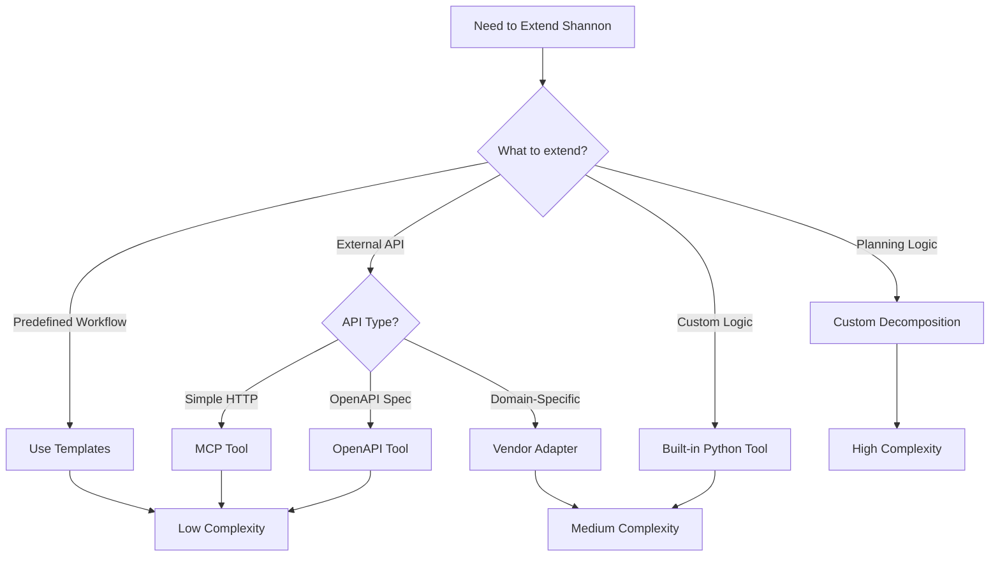

## Overview

This guide outlines extensible patterns for customizing Shannon while maintaining upgrade compatibility and clean separation of concerns.

<CardGroup cols={2}>
  <Card title="Templates" icon="file-code">
    System 1 - Pre-built workflows with low overhead
  </Card>
  <Card title="Tools" icon="wrench">
    Add capabilities via MCP, OpenAPI, or Python
  </Card>
  <Card title="Vendor Adapters" icon="plug">
    Domain-specific integrations without core changes
  </Card>
  <Card title="Decomposition" icon="diagram-project">
    System 2 - Custom planning and reasoning logic
  </Card>
</CardGroup>

## Extension Methods Comparison

| Extension Type | Complexity | Code Changes | Use Case |
|---------------|------------|--------------|----------|
| **Templates** | Low | YAML only | Repeatable workflows |
| **MCP/OpenAPI Tools** | Low | Config only | External APIs |
| **Built-in Tools** | Medium | Python only | Custom logic |
| **Vendor Adapters** | Medium | Python + Config | Domain-specific integrations |
| **Decomposition** | High | Go + Python | Custom planning logic |

<Tip>
For most use cases, **Templates** and **Vendor Adapters** provide the best balance of power and simplicity.
</Tip>

## Extend Decomposition (System 2)

**For custom planning and reasoning logic**

The orchestrator calls the LLM service endpoint `/agent/decompose` for planning.

### When to Use

- Custom task decomposition strategies
- Domain-specific planning heuristics
- Pre/post-processing of LLM requests
- Integration with external planning systems

### Implementation Options

<Tabs>
  <Tab title="Lightweight (Go)">
    **Best for:** Pre/post-processing LLM requests

Add heuristics to `go/orchestrator/internal/activities/decompose.go`:

```go
// Example: Pre-process query before decomposition
func PreprocessQuery(query string) string {
    // Add domain-specific context
    // Normalize input format
    // Inject additional constraints
    return enhancedQuery
}

// Example: Post-process decomposition response
func PostprocessDecomposition(resp *DecompositionResponse) {
    // Validate subtasks
    // Add fallback steps
    // Optimize execution order
}
```
  </Tab>

  <Tab title="Full Custom (Python)">
    **Best for:** Complete custom planning logic

Add new endpoint in `python/llm-service/llm_service/api/agent.py`:

```python
@router.post("/agent/decompose/custom")
async def custom_decompose(request: DecomposeRequest):
    """Custom decomposition logic for domain-specific tasks."""

    # Your custom planning logic
    subtasks = custom_planning_algorithm(request.query)

    # Return compatible response
    return DecompositionResponse(
        subtasks=subtasks,
        pattern="custom",
        complexity=calculate_complexity(subtasks)
    )
```

Route via feature flag or context key:

```go
// In orchestrator
if ctx.CustomDecomposition {
    endpoint = "/agent/decompose/custom"
} else {
    endpoint = "/agent/decompose"
}
```
  </Tab>
</Tabs>

<Warning>
Keep response schema compatible with `DecompositionResponse` to avoid breaking orchestrator workflows.
</Warning>

## Add/Customize Templates (System 1)

**For repeatable workflows with low overhead**

### When to Use

- Predefined workflows (data analysis, code review, etc.)
- Quick task execution without AI planning
- Common patterns used frequently
- Performance-critical paths

### Creating Templates

<Steps>
  <Step title="Create Template File">
    Place templates in your own directory:

```yaml
# templates/custom/research-workflow.yaml
name: "research_workflow"
description: "Multi-stage research and analysis workflow"
version: "1.0.0"

extends: []  # Optional: inherit from other templates

defaults:
  model_tier: "medium"
  budget_agent_max: 5000
  require_approval: false

nodes:
  - id: "search"
    type: "simple"
    strategy: "react"
    tools_allowlist: ["web_search", "calculator"]
    budget_max: 1000
    depends_on: []

  - id: "analyze"
    type: "cognitive"
    strategy: "chain_of_thought"
    tools_allowlist: ["python_executor", "calculator"]
    budget_max: 2000
    depends_on: ["search"]

  - id: "synthesize"
    type: "simple"
    strategy: "react"
    tools_allowlist: ["web_search"]
    budget_max: 1000
    depends_on: ["analyze"]

edges:
  - from: "search"
    to: "analyze"
  - from: "analyze"
    to: "synthesize"

metadata:
  category: "research"
  author: "your-team"
```
  </Step>

  <Step title="Register Template">
    Initialize registry with your template directory:

```go
// In orchestrator initialization
registry := templates.InitTemplateRegistry(
    "./templates/builtin",
    "./templates/custom",  // Your custom templates
)

// Validate all templates
if err := registry.Finalize(); err != nil {
    log.Fatal(err)
}
```
  </Step>

  <Step title="Use Template">
    Via gRPC API:

```bash
grpcurl -plaintext -d '{
  "query": "Perform research on AI trends",
  "context": {
    "template": "research_workflow",
    "template_version": "1.0.0",
    "disable_ai": true
  }
}' localhost:50052 shannon.orchestrator.OrchestratorService/SubmitTask
```

Via HTTP Gateway:

```bash
curl -X POST http://localhost:8080/api/v1/tasks \
  -H "Content-Type: application/json" \
  -d '{
    "query": "Perform research on AI trends",
    "context": {
      "template": "research_workflow",
      "template_version": "1.0.0"
    }
  }'
```
  </Step>

  <Step title="List Available Templates">
```bash
# Via gRPC
grpcurl -plaintext -d '{}' localhost:50052 \
  shannon.orchestrator.OrchestratorService/ListTemplates
```

Note: HTTP Gateway template listing endpoint may not be implemented yet. Use gRPC for template discovery.
  </Step>
</Steps>

### Template Best Practices

<AccordionGroup>
  <Accordion title="Use `extends` for Common Defaults">
```yaml
# Base template (base.yaml)
name: "base_research"
version: "1.0.0"
defaults:
  model_tier: "medium"
  budget_agent_max: 5000
  require_approval: false

# Child template (advanced_research.yaml)
name: "advanced_research"
version: "1.0.0"
extends: ["base_research"]  # Inherits all defaults
defaults:
  budget_agent_max: 10000  # Override specific values
```
  </Accordion>

  <Accordion title="Validate with `registry.Finalize()`">
```go
registry := templates.InitTemplateRegistry("./templates")

// Validates:
// - YAML syntax
// - Required fields
// - Parameter types
// - Tool references
if err := registry.Finalize(); err != nil {
    log.Fatalf("Template validation failed: %v", err)
}
```
  </Accordion>

  <Accordion title="Keep Tools Allowlisted">
```yaml
# Explicitly list allowed tools for security
tools_allowlist:
  - "web_search"
  - "calculator"
  - "python_executor"

# Don't use:
# tools_allowlist: ["*"]  # Too permissive
```
  </Accordion>
</AccordionGroup>

## Add Tools Safely

**For extending Shannon's capabilities**

Shannon supports three tool integration methods:

<CardGroup cols={3}>
  <Card title="MCP Tools" icon="cloud">
    External HTTP APIs with zero code changes
  </Card>
  <Card title="OpenAPI Tools" icon="file-code">
    Auto-generated from OpenAPI specs
  </Card>
  <Card title="Built-in Tools" icon="code">
    Python tools for complex logic
  </Card>
</CardGroup>

### Security Considerations

<Warning>
Always use `tools_allowlist` in templates to restrict which tools can be used.
</Warning>

**Good:**
```yaml
# Template with restricted tools
tools_allowlist:
  - "web_search"
  - "calculator"
  - "my_custom_tool"
```

**Bad:**
```yaml
# Don't allow all tools
tools_allowlist: ["*"]
```

### Keep Experimental Tools Behind Flags

```yaml
# config/features.yaml
experimental_tools:
  enabled: false  # Disabled by default

custom_analytics:
  enabled: ${ENABLE_CUSTOM_ANALYTICS}  # Env-based toggle
```

```python
# In tool registration
if config.get("experimental_tools.enabled"):
    registry.register(ExperimentalTool)
```

<Card title="Complete Tools Guide" icon="wrench" href="/en/tutorials/custom-tools">
  See the complete guide for adding MCP, OpenAPI, and built-in Python tools
</Card>

## Vendor Extensions

**For domain-specific agents and API integrations**

The vendor adapter pattern allows you to integrate proprietary APIs and specialized agents without modifying Shannon's core code.

### Architecture

```
Generic Shannon (Open Source)
├── python/llm-service/llm_service/tools/openapi_tool.py  # Generic loader
├── python/llm-service/llm_service/roles/presets.py       # Generic roles
├── go/orchestrator/internal/activities/agent.go          # Generic mirroring
└── config/shannon.yaml                                    # Base config

Vendor Extensions (Private)
├── config/overlays/shannon.vendor.yaml                    # Vendor configs
├── config/openapi_specs/vendor_api.yaml                   # API specs
├── python/llm-service/llm_service/tools/vendor_adapters/  # Transformations
│   ├── __init__.py                                        # Registry
│   └── vendor.py                                          # VendorAdapter
└── python/llm-service/llm_service/roles/vendor/           # Agent roles
    ├── __init__.py
    └── custom_agent.py                                    # System prompts
```

### When to Use Vendor Extensions

Use when you need:
- Domain-specific API integrations (analytics, CRM, e-commerce)
- Custom field name transformations
- Specialized agent roles with domain knowledge
- Session context injection (account IDs, tenant IDs)
- Private/proprietary tool configurations

### Quick Start

<Steps>
  <Step title="Create Vendor Adapter">
```python
# python/llm-service/llm_service/tools/vendor_adapters/myvendor.py
class MyVendorAdapter:
    def transform_body(self, body, operation_id, prompt_params):
        # Field aliasing
        if "metrics" in body:
            body["metrics"] = [m.replace("users", "mv:users") for m in body["metrics"]]

        # Inject session context
        if prompt_params:
            body.update(prompt_params)

        return body
```
  </Step>

  <Step title="Register Adapter">
```python
# python/llm-service/llm_service/tools/vendor_adapters/__init__.py
def get_vendor_adapter(name: str):
    if name.lower() == "myvendor":
        from .myvendor import MyVendorAdapter
        return MyVendorAdapter()
    return None
```
  </Step>

  <Step title="Create Config Overlay">
```yaml
# config/overlays/shannon.myvendor.yaml
openapi_tools:
  myvendor_api:
    enabled: true
    spec_url: file:///app/config/openapi_specs/myvendor_api.yaml
    auth_type: bearer
    auth_config:
      vendor: myvendor  # Triggers adapter loading
      token: "${MYVENDOR_API_TOKEN}"
    category: custom
```
  </Step>

  <Step title="(Optional) Create Specialized Agent">
```python
# python/llm-service/llm_service/roles/myvendor/custom_agent.py
CUSTOM_AGENT_PRESET = {
    "name": "myvendor_agent",
    "system_prompt": "You are a specialized agent for...",
    "allowed_tools": ["myvendor_query", "myvendor_analyze"],
    "temperature": 0.7,
}
```

Register with graceful fallback:
```python
# roles/presets.py
try:
    from .myvendor.custom_agent import CUSTOM_AGENT_PRESET
    _PRESETS["myvendor_agent"] = CUSTOM_AGENT_PRESET
except ImportError:
    pass  # Shannon works without vendor module
```
  </Step>

  <Step title="Use via Environment">
```bash
SHANNON_CONFIG_PATH=config/overlays/shannon.myvendor.yaml
MYVENDOR_API_TOKEN=your_token_here
```
  </Step>
</Steps>

### Benefits

- ✅ **Zero Shannon core changes** - All vendor logic isolated
- ✅ **Clean separation** - Generic infrastructure vs. vendor-specific
- ✅ **Conditional loading** - Graceful fallback if vendor module unavailable
- ✅ **Easy to maintain** - Vendor code in separate directories
- ✅ **Testable in isolation** - Unit test adapters independently

<Card title="Complete Vendor Adapters Guide" icon="plug" href="/en/tutorials/vendor-adapters">
  Comprehensive guide with examples, testing strategies, and best practices
</Card>

## Human Approval

**For gating sensitive operations**

Wire `require_approval` through the SubmitTask request for human-in-the-loop control.

### Configuration

```yaml
# config/features.yaml
approvals:
  enabled: true
  dangerous_tools:
    - "file_write"
    - "code_execution"
    - "database_query"
  complexity_threshold: 0.7  # Require approval for complex tasks
  timeout_seconds: 7200      # 2 hour approval window
```

### API Usage

```bash
curl -X POST http://localhost:8080/api/v1/tasks \
  -H "Content-Type: application/json" \
  -d '{
    "query": "Delete all records from users table",
    "require_approval": true
  }'
```

### Approval Flow

1. Task submitted with `require_approval: true`
2. Orchestrator pauses before execution
3. Approval request sent via webhook/UI
4. User approves/rejects via API
5. Workflow continues or terminates

**Approval gates are enforced in the router before execution.**

## Feature Flags & Config

**Runtime configuration without code changes**

Many behaviors are controlled via `config/features.yaml` and environment variables, loaded through `GetWorkflowConfig`.

### Common Feature Flags

```yaml
# config/features.yaml

# Template Fallback
template_fallback:
  enabled: true  # Fallback to AI if template fails

# Tool Selection
tool_selection:
  enabled: true  # Auto-select tools based on task
  max_tools: 5   # Maximum tools per task

# Cognitive Patterns
patterns:
  cot_enabled: true   # Chain-of-Thought
  tot_enabled: true   # Tree-of-Thoughts
  react_enabled: true # ReAct

# Budget Controls
budgets:
  enforce_token_limits: true
  enforce_cost_limits: true
  default_max_tokens: 10000
  default_max_cost_usd: 0.50

# Streaming
streaming:
  enabled: true
  buffer_size: 1000
  chunk_size: 512
```

### Environment Variable Override

```bash
# Override via environment
TEMPLATE_FALLBACK_ENABLED=1
TOOL_SELECTION_MAX_TOOLS=10
DEFAULT_MAX_TOKENS=20000

# Start services with overrides
docker compose up -d
```

### Dynamic Config Loading

```go
// In orchestrator
config := GetWorkflowConfig()

if config.TemplateFallbackEnabled {
    // Use AI fallback
}

if config.BudgetsEnforceTokenLimits {
    // Apply token budget
}
```

## Best Practices Summary

<AccordionGroup>
  <Accordion title="Separation of Concerns">
    - Generic infrastructure: Committed to open source
    - Vendor-specific code: Kept private in separate directories
    - Configuration overlays: Domain-specific settings isolated
    - Conditional imports: Graceful fallback for optional modules
  </Accordion>

  <Accordion title="Upgrade Compatibility">
    - Use stable interfaces (ToolRegistry, TemplateRegistry, etc.)
    - Avoid forking core subsystems
    - Keep customizations in separate directories
    - Use feature flags for experimental changes
  </Accordion>

  <Accordion title="Security First">
    - Allowlist tools in templates
    - Enable approvals for dangerous operations
    - Use domain allowlisting for external APIs
    - Keep secrets in environment variables
  </Accordion>

  <Accordion title="Testing">
    - Unit test vendor adapters in isolation
    - Integration test with Shannon services
    - Use replay testing for workflow determinism
    - Validate templates with `registry.Finalize()`
  </Accordion>
</AccordionGroup>

## Extension Decision Tree



## Next Steps

<CardGroup cols={2}>
  <Card title="Custom Tools" icon="wrench" href="/en/tutorials/custom-tools">
    Add MCP, OpenAPI, and built-in tools
  </Card>
  <Card title="Vendor Adapters" icon="plug" href="/en/tutorials/vendor-adapters">
    Build domain-specific integrations
  </Card>
  <Card title="Configuration" icon="gear" href="/en/quickstart/configuration">
    Complete configuration reference
  </Card>
  <Card title="Architecture" icon="sitemap" href="/en/architecture/overview">
    Understanding Shannon's architecture
  </Card>
</CardGroup>
