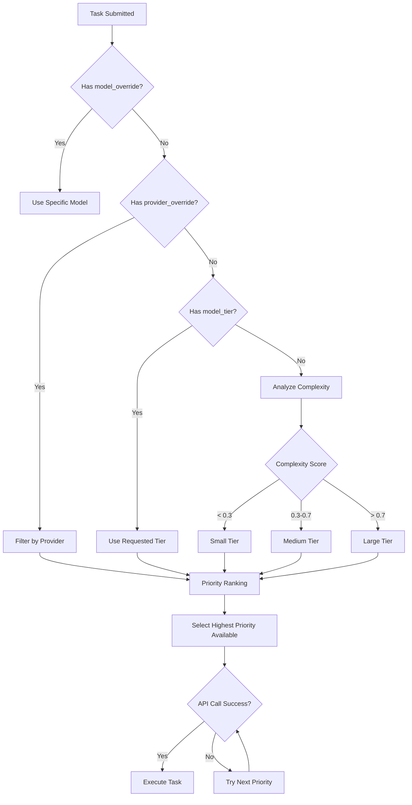

## Overview

Shannon automatically selects the optimal LLM model for each task based on:
1. **Task complexity** (analyzed during decomposition)
2. **Explicit tier requests** (`model_tier` parameter)
3. **Model/provider overrides** (`model_override`, `provider_override`)
4. **Priority rankings** (defined in `config/models.yaml`)
5. **Budget constraints** and token limits

This guide explains how model selection works and how to control it.

## Model Tiers

Shannon organizes models into three tiers:

| Tier | Target Usage | Characteristics | Cost Range |
|------|--------------|-----------------|------------|
| **Small** | 50% | Fast, cost-optimized, basic reasoning | $0.0001-0.0002/1K input |
| **Medium** | 40% | Balanced capability/cost | $0.002-0.006/1K input |
| **Large** | 10% | Heavy reasoning, complex tasks | $0.02-0.025/1K input |

**Note**: Percentages are target distributions, not enforced quotas. Actual usage depends on your workload.

## Selection Flow



## Priority Ranking

Within each tier, models are ranked by priority (lower number = higher priority). Shannon attempts models in priority order until one succeeds.

**Example from `config/models.yaml`**:
```yaml
model_tiers:
  small:
    providers:
      - provider: openai
        model: gpt-5-nano-2025-08-07
        priority: 1  # Try first
      - provider: anthropic
        model: claude-haiku-4-5-20251001
        priority: 2  # Fallback if OpenAI fails
      - provider: xai
        model: grok-4-fast-non-reasoning
        priority: 3  # Second fallback
```

**Fallback Behavior**:
- If priority 1 fails (rate limit, API error), Shannon tries priority 2
- Continues until a model succeeds or all options exhausted
- Failures are logged to orchestrator logs

## Parameter Precedence

When multiple parameters specify model selection, the precedence is:

1. **`model_override`** (highest priority) → Forces specific model
2. **`provider_override`** → Limits to one provider's models
3. **`model_tier`** → Uses requested tier
4. **Auto-detected complexity** (lowest priority) → Default behavior

### Top-Level vs Context Parameters

Top-level parameters **always override** context parameters:

```json
{
  "query": "Analyze data",
  "model_tier": "large",           // Top-level (WINS)
  "context": {
    "model_tier": "small"           // Context (IGNORED)
  }
}
```

## Usage Examples

### Auto-Selection (Default)

```bash
curl -X POST http://localhost:8080/api/v1/tasks \
  -H "X-API-Key: sk_test_123456" \
  -d '{"query": "What is 2+2?"}'
```

Shannon analyzes complexity → Selects small tier → Uses `gpt-5-nano-2025-08-07` (priority 1)

### Force Specific Tier

```bash
curl -X POST http://localhost:8080/api/v1/tasks \
  -H "X-API-Key: sk_test_123456" \
  -d '{
    "query": "Complex analysis task",
    "model_tier": "large"
  }'
```

Uses large tier → `gpt-4.1-2025-04-14` (priority 1 in large tier)

### Override to Specific Model

```bash
curl -X POST http://localhost:8080/api/v1/tasks \
  -H "X-API-Key: sk_test_123456" \
  -d '{
    "query": "Analysis",
    "model_override": "claude-sonnet-4-5-20250929"
  }'
```

Forces Anthropic Claude Sonnet, ignoring tier/priority.

### Force Provider

```bash
curl -X POST http://localhost:8080/api/v1/tasks \
  -H "X-API-Key: sk_test_123456" \
  -d '{
    "query": "Analysis",
    "model_tier": "medium",
    "provider_override": "anthropic"
  }'
```

Uses medium tier **but only Anthropic models** → `claude-sonnet-4-5-20250929`

### Python SDK Examples

```python
from shannon import Shannon

client = Shannon(api_key="sk_test_123456")

# Auto-selection
task = client.tasks.submit(query="Simple task")

# Force tier
task = client.tasks.submit(
    query="Complex analysis",
    model_tier="large"
)

# Force model
task = client.tasks.submit(
    query="Research task",
    model_override="gpt-5-2025-08-07"
)

# Force provider + tier
task = client.tasks.submit(
    query="Analysis",
    model_tier="medium",
    provider_override="openai"
)
```

## Cost Optimization Strategies

### 1. Start Small, Escalate if Needed

```python
# Try small tier first
task = client.tasks.submit(query="Analyze Q4 data", model_tier="small")
status = client.tasks.get(task.task_id)

# If result is insufficient, retry with large
if not_satisfactory(status.result):
    task = client.tasks.submit(query="Analyze Q4 data deeply", model_tier="large")
```

### 2. Provider-Specific Optimization

```python
# Use cheaper provider for bulk tasks
for item in bulk_data:
    client.tasks.submit(
        query=f"Summarize {item}",
        model_tier="small",
        provider_override="deepseek"  # Cheaper than OpenAI
    )
```

### 3. Session-Based Escalation

```python
session_id = "analysis-session-123"

# Start with small model
client.tasks.submit(
    query="Initial analysis",
    session_id=session_id,
    model_tier="small"
)

# Follow-up with larger model (inherits context)
client.tasks.submit(
    query="Deeper insights",
    session_id=session_id,
    model_tier="large"
)
```

## Complexity Analysis

Shannon analyzes task complexity using several factors:

- **Query length** and specificity
- **Number of sub-tasks** identified
- **Tool usage** requirements
- **Context depth** needed
- **Reasoning intensity** (keywords like "analyze", "compare", "synthesize")

**Complexity Thresholds** (configurable):
- `< 0.3` → Small tier (simple Q&A, basic tasks)
- `0.3 - 0.7` → Medium tier (multi-step, moderate reasoning)
- `> 0.7` → Large tier (complex research, heavy reasoning)

## Monitoring & Debugging

### Check Which Model Was Used

```bash
TASK_ID="task-abc123"
curl http://localhost:8080/api/v1/tasks/$TASK_ID \
  -H "X-API-Key: sk_test_123456" | jq '{model_used, provider, usage}'
```

Response:
```json
{
  "model_used": "gpt-5-nano-2025-08-07",
  "provider": "openai",
  "usage": {
    "total_tokens": 245,
    "input_tokens": 150,
    "output_tokens": 95,
    "estimated_cost": 0.000053
  }
}
```

### Prometheus Metrics

```bash
# Model usage by tier
shannon_llm_requests_total{tier="small"}
shannon_llm_requests_total{tier="medium"}
shannon_llm_requests_total{tier="large"}

# Provider distribution
shannon_llm_requests_total{provider="openai"}
shannon_llm_requests_total{provider="anthropic"}

# Tier drift (when requested tier unavailable)
shannon_tier_drift_total{requested="large", actual="medium"}
```

### Orchestrator Logs

```bash
docker compose -f deploy/compose/docker-compose.yml logs orchestrator | grep "Model selected"
```

Look for:
- `"Model selected: gpt-5-nano-2025-08-07 (small tier, priority 1)"`
- `"Falling back to priority 2: claude-haiku-4-5-20251001"`
- `"Tier override: user requested large → using gpt-4.1-2025-04-14"`

## Configuration

Model tiers and priorities are defined in `config/models.yaml`:

```yaml
model_tiers:
  small:
    providers:
      - provider: openai
        model: gpt-5-nano-2025-08-07
        priority: 1
      - provider: anthropic
        model: claude-haiku-4-5-20251001
        priority: 2

selection_strategy:
  mode: priority  # priority | round-robin | least-cost
  fallback_enabled: true
  max_retries: 3
```

**Selection Modes**:
- `priority` (default): Try models in priority order
- `round-robin`: Distribute load evenly across same-priority models
- `least-cost`: Always select cheapest model in tier

## Troubleshooting

### Issue: Wrong tier selected

**Symptoms**: Task uses medium tier when you expected small

**Solutions**:
1. Explicitly set `model_tier: "small"` in request
2. Check complexity score in orchestrator logs
3. Verify query isn't triggering complexity heuristics (avoid words like "analyze deeply")

### Issue: Specific model not used

**Symptoms**: Request `model_override: "gpt-5-pro"` but gets different model

**Solutions**:
1. Verify model is in `config/models.yaml` under `model_catalog`
2. Check API key for provider is set in `.env`
3. Verify model ID uses canonical name (not alias)
4. Check orchestrator logs for fallback messages

### Issue: High costs

**Symptoms**: Costs higher than expected

**Solutions**:
1. Check actual tier distribution via Prometheus
2. Add explicit `model_tier: "small"` to requests
3. Review `shannon_tier_drift_total` for unwanted escalations
4. Set `MAX_COST_PER_REQUEST` in `.env` to enforce budget

### Issue: Rate limiting

**Symptoms**: Frequent 429 errors, slow fallback cascade

**Solutions**:
1. Add more providers to tier priority list
2. Enable `round-robin` mode to distribute load
3. Increase `RATE_LIMIT_WINDOW` for affected providers
4. Consider cheaper providers (DeepSeek, Groq) as fallbacks

## Best Practices

1. **Default to Auto-Selection**: Let Shannon's complexity analysis work
2. **Override Sparingly**: Use `model_override` only when required
3. **Start Small**: Set `model_tier: "small"` for cost-sensitive workloads
4. **Monitor Distribution**: Track tier usage via metrics
5. **Configure Fallbacks**: Ensure each tier has 3+ providers
6. **Test Priority Order**: Verify your preferred models are priority 1
7. **Budget Enforcement**: Set `MAX_COST_PER_REQUEST` for safety

## Related Documentation

<CardGroup cols={2}>
  <Card title="Models API" icon="list" href="/en/api/models/overview">
    List available models and pricing
  </Card>
  <Card title="Submit Task" icon="paper-plane" href="/en/api/rest/submit-task">
    Task submission with model parameters
  </Card>
  <Card title="Configuration" icon="gear" href="/en/quickstart/configuration">
    Environment variables and YAML config
  </Card>
  <Card title="Cost Tracking" icon="dollar-sign" href="/en/api/rest/get-status">
    View model usage and costs
  </Card>
</CardGroup>
