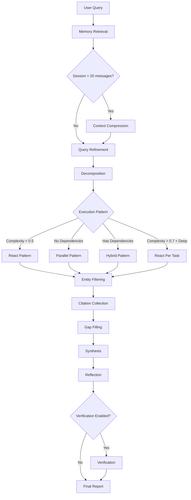

# Deep Research Agent

This tutorial shows how to use Shannon's **ResearchWorkflow** for comprehensive, citation-backed research reports.

## What You'll Learn

- **Multi-stage workflow**: Memory retrieval → Refine → Decompose → Execute → Citations → Gap Filling → Synthesis → Verification
- **Adaptive patterns**: React, Parallel, and Hybrid execution based on complexity
- **Advanced features**: Entity filtering, gap-filling, context compression, react-per-task mode
- **Quality controls**: Citation requirements, coverage enforcement, claim verification
- **Language matching**: Automatically responds in the user's query language

## Prerequisites

- Shannon stack running (Docker Compose)
- Gateway reachable at `http://localhost:8080`
- Auth defaults:
  - Docker Compose: authentication is disabled by default (`GATEWAY_SKIP_AUTH=1`).
  - Local builds: authentication is enabled by default. Set `GATEWAY_SKIP_AUTH=1` to disable auth, or include an API key header `-H "X-API-Key: $API_KEY"`.

## Workflow Architecture

The ResearchWorkflow combines multiple stages to produce high-quality, cited research:



**Key Features:**
- **Memory-aware**: Uses conversation history for contextual research
- **Entity-focused**: Filters results when entity is detected (e.g., specific company/product)
- **Self-correcting**: Gap filling ensures comprehensive coverage
- **Quality-enforced**: Per-area coverage validation (≥600 chars, ≥2 citations per section)

## Quick Start (HTTP)

```bash
# Submit a research task (default “standard” strategy)
curl -X POST http://localhost:8080/api/v1/tasks \
  -H "Content-Type: application/json" \
  -d '{
    "query": "Latest breakthroughs in quantum error correction",
    "context": { "force_research": true }
  }'

# Submit and get a ready-to-use SSE stream URL (recommended)
# Tip: include force_research to route to ResearchWorkflow (otherwise router may select Supervisor)
curl -s -X POST http://localhost:8080/api/v1/tasks/stream \
  -H "Content-Type: application/json" \
  -d '{
        "query": "What are the main transformer architecture trends in 2025?",
        "context": { "force_research": true }
      }' | jq
```

### Stream Events (SSE)

```bash
# After the /tasks/stream call, use "stream_url" from the response:
curl -N "http://localhost:8080/api/v1/stream/sse?workflow_id=task-..."
```

Watch for:
- `LLM_OUTPUT`: final synthesis text
- `DATA_PROCESSING`: progress/usage
- `WORKFLOW_COMPLETED`: completion

## Execution Patterns

Shannon selects the optimal execution pattern based on task complexity and dependencies:

### React Pattern (complexity < 0.5)
Iterative reason→act→observe loop for simpler research.

```bash
# Example: Basic conceptual query triggers React
curl -X POST http://localhost:8080/api/v1/tasks \
  -H "Content-Type: application/json" \
  -d '{
    "query": "What is quantum computing?",
    "context": { "force_research": true }
  }'
```

**Behavior**: Single agent performs iterative reasoning, web searches, and observation cycles (default 5 iterations).

---

### Parallel Pattern (no dependencies)
Concurrent subtask execution for multi-faceted research.

```bash
# Example: Multi-aspect comparison triggers Parallel
curl -X POST http://localhost:8080/api/v1/tasks \
  -H "Content-Type: application/json" \
  -d '{
    "query": "Compare LangChain and AutoGen frameworks: architecture, pricing, community, performance",
    "context": { "force_research": true }
  }'
```

**Behavior**: Decomposition creates independent subtasks (e.g., "Analyze LangChain architecture", "Analyze AutoGen pricing"), executed concurrently with web_search injection for citations.

---

### Hybrid Pattern (has dependencies)
Topological sort + fan-in/fan-out for sequential research with dependencies.

```bash
# Example: Query with logical dependencies triggers Hybrid
curl -X POST http://localhost:8080/api/v1/tasks \
  -H "Content-Type: application/json" \
  -d '{
    "query": "Analyze company X market strategy, then evaluate competitive response, then forecast next moves",
    "context": { "force_research": true }
  }'
```

**Behavior**: Executes subtasks in dependency order, passing previous results downstream.

---

### React Per Task (deep research mode)
Mini ReAct loops per subtask for high-complexity research.

**Trigger conditions:**
1. Manual: `context.react_per_task = true`
2. Auto-enable: complexity > 0.7 AND strategy in `{deep, academic}`

```bash
# Example: Enable react_per_task for iterative per-area research
curl -X POST http://localhost:8080/api/v1/tasks \
  -H "Content-Type: application/json" \
  -d '{
    "query": "Comprehensive analysis of transformer architecture evolution 2017-2025",
    "context": {
      "force_research": true,
      "react_per_task": true,
      "react_max_iterations": 6
    },
    "research_strategy": "deep"
  }'
```

**Behavior**: Each parallel subtask runs its own ReAct loop (reason→act→observe), enabling iterative exploration per research area. More thorough but higher token cost.

---

## Strategy Presets

Presets provide opinionated defaults for different research depths. The Gateway validates and maps these to workflow context.

```bash
# Quick strategy (minimal iterations)
curl -X POST http://localhost:8080/api/v1/tasks \
  -H "Content-Type: application/json" \
  -d '{
    "query": "What is quantum error correction?",
    "context": { "force_research": true },
    "research_strategy": "quick"
  }'

# Deep strategy with overrides
curl -X POST http://localhost:8080/api/v1/tasks \
  -H "Content-Type: application/json" \
  -d '{
    "query": "Compare LangChain and AutoGen frameworks",
    "context": {
      "force_research": true,
      "react_per_task": true,
      "react_max_iterations": 6
    },
    "research_strategy": "deep",
    "max_iterations": 12,
    "enable_verification": true
  }'

# Academic strategy (auto-enables react_per_task for complexity > 0.7)
curl -X POST http://localhost:8080/api/v1/tasks \
  -H "Content-Type: application/json" \
  -d '{
    "query": "Survey of attention mechanisms in modern NLP architectures",
    "context": { "force_research": true },
    "research_strategy": "academic"
  }'
```

**Available Presets**: `quick` | `standard` | `deep` | `academic`

| Strategy | react_max_iterations | max_concurrent_agents | verification | gap_filling |
|----------|---------------------|----------------------|--------------|-------------|
| quick | 2 | 3 | ✗ | ✗ |
| standard | 3 | 5 | ✓ | ✓ (max_gaps: 3) |
| deep | 4 | 6 | ✓ | ✓ (max_gaps: 5) |
| academic | 5 | 8 | ✓ | ✓ (max_gaps: 10) |

**Core Parameters**:
- `max_iterations` (1–50): Prerequisite parameter that enables `react_max_iterations` to take effect (must be set for react_max_iterations to work)
- `max_concurrent_agents` (1–20): Controls maximum concurrency for parallel subtasks (only applies when multiple subtasks are executed)
- `react_max_iterations` (2–8, default 5): Controls ReAct loop depth per task

**Advanced Flags**:
- `react_per_task` (bool): Enable mini ReAct loops per subtask (auto-enabled for complexity > 0.7 + deep/academic)
- `enable_verification` (bool): Enable claim verification against citations
- `budget_agent_max` (int): Optional per-agent token budget with enforcement

**Gap Filling Configuration**:
- `gap_filling_enabled` (bool): Enable/disable gap filling
- `gap_filling_max_gaps` (1–10): Maximum number of gaps to detect
- `gap_filling_max_iterations` (1–3): Maximum retry iterations per gap
- `gap_filling_check_citations` (bool): Check citation density as gap indicator

<Note>
**Default preset**: `standard` (if not specified). Presets seed flags only if not already set in context. The Gateway accepts top‑level `research_strategy` on both `/api/v1/tasks` and `/api/v1/tasks/stream` and maps it into context. Preset defaults are loaded from `config/research_strategies.yaml`.
</Note>

## Python SDK

### CLI

```bash
python -m shannon.cli --base-url http://localhost:8080 \
  submit "Latest quantum computing breakthroughs" \
  --force-research \
  --research-strategy deep --max-iterations 12 --enable-verification
```

### Programmatic

```python
from shannon import ShannonClient

client = ShannonClient(base_url="http://localhost:8080")
handle = client.submit_task(
    "Compare LangChain and AutoGen frameworks",
    context={
        "force_research": True,
        "research_strategy": "deep",
        "react_max_iterations": 6,
        "enable_verification": True,
    },
)
final = client.wait(handle.task_id)
print(final.result)
client.close()
```

## Response Format

Typical status payloads returned by `GET /api/v1/tasks/{id}` include the synthesized result, metadata (citations, verification), model/provider, and timestamps.

```json
{
  "task_id": "task-00000000-0000-0000-0000-000000000000",
  "status": "TASK_STATUS_COMPLETED",
  "result": "... final synthesis text ...",
  "metadata": {
    "citations": [
      {
        "url": "https://example.com/article",
        "title": "Source Title",
        "source": "example.com",
        "quality_score": 0.92,
        "credibility_score": 0.85
      }
    ],
    "verification": {
      "total_claims": 10,
      "overall_confidence": 0.78,
      "supported_claims": 7,
      "unsupported_claims": [
        "Claim text lacking sufficient evidence ..."
      ],
      "claim_details": [
        {
          "claim": "Concrete claim text ...",
          "confidence": 0.81,
          "supporting_citations": [1, 3],
          "conflicting_citations": []
        }
      ]
    }
  },
  "created_at": "2025-11-07T12:00:00Z",
  "updated_at": "2025-11-07T12:02:00Z",
  "usage": {
    "input_tokens": 1234,
    "output_tokens": 5678,
    "total_tokens": 6912
  },
  "model_used": "gpt-5-2025-08-07",
  "provider": "openai"
}
```

Notes:
- `result` is the final synthesized markdown/text.
- `metadata.citations` lists collected sources (all are included in the Sources section of the result).
- `metadata.verification` appears when verification is enabled and completed.
- In Gateway status responses, `created_at` / `updated_at` reflect response time; authoritative run timing and totals are persisted in the database (events/timeline).
- `usage` summarizes token usage and may include cost. Gateway status may expose `estimated_cost`; workflow metadata may include `cost_usd`.
- `model_used` and `provider` reflect the model/provider chosen during synthesis.

## Advanced Features

### Memory Retrieval

**Hierarchical Memory** (priority):

- Combines recent (last 5 messages) + semantic (top 5 relevant, similarity ≥ 0.75)
- Enables coherent multi-turn research with conversation context
- Fallback: Session memory (last 20 messages)

**Context Compression**:

- Auto-triggers for sessions >20 messages
- LLM summarizes conversation (target: 37.5% of window)
- Prevents context window overflow in long conversations

---

### Entity Filtering

When a specific entity is detected (e.g., company "Acme Analytics"):

**Query Refinement**:

- Detects canonical name, exact search queries, official domains, disambiguation terms
- Example: `canonical_name: "Acme Analytics"`, `official_domains: ["acme.com"]`

**Citation Filtering**:

- Scoring: domain match +0.6, alias in URL +0.4, text match +0.4
- Threshold: 0.3 (any single match passes)
- Safety floor: minKeep=8 (backfilled by quality × credibility)
- Official domains always preserved (bypass threshold)

**Result Pruning**:

- Filters off-entity tool results (e.g., removes "Mind Inc" when searching for "Acme Mind")
- Keeps reasoning-only outputs; prunes off-entity tool-driven results

---

### Gap Filling

**Auto-detection** (max 2 iterations):

- Missing section headings (`### Area Name`)
- Gap indicator phrases ("limited information", "insufficient data")
- Low citation density (< 2 inline citations per section)

**Resolution**:

1. Build targeted queries: `"Find detailed information about: <area>"`
2. Execute focused ReAct loops (max 3 iterations per gap)
3. Re-collect citations (global deduplication with original citations)
4. Re-synthesize with combined evidence using large tier

<Accordion title="Example Gap Scenario">
```text
Query: "Analyze company X market strategy, competitive landscape, and leadership"

Initial synthesis coverage:
- Market strategy: ✓ 800 chars, 3 citations
- Competitive landscape: ✓ 650 chars, 2 citations
- Leadership: ✗ 200 chars, 0 citations  ← Gap detected

Gap filling triggers:
1. Targeted query: "Find detailed information about: company X leadership"
2. ReAct loop executes focused search
3. Re-synthesize with combined evidence
```
</Accordion>

### Citations

**Collection**:

- Extracted from `web_search` and `web_fetch` tool outputs
- URL/DOI normalization and deduplication
- Scoring: quality (recency + completeness) × credibility (domain reputation)
- Diversity enforcement (max 3 per domain)

**Enforcement**:

- Minimum 6 inline citations per report (clamped by available, floor 3)
- Per-area requirement: ≥2 inline citations per section
- Sources section lists all collected citations:
  - "Used inline" (cited in text)
  - "Additional source" (collected but not cited)

---

### Synthesis Continuation

**Trigger**: Model stops early with incomplete output

**Detection** (`looksComplete` validation):

1. Must end with sentence punctuation (`.`, `!`, `?`, `。`)
2. No dangling conjunctions (`and, but, however, therefore...`)
3. Every research area has subsection with ≥600 chars and ≥2 citations

**Continuation**:

- Adaptive margin: min(25% of effective_max_completion, 300 tokens)
- Prompt: "Continue from last sentence; maintain headings and citation style"
- Uses large tier for quality (gpt-4.1/opus)

---

### Verification

**Claim Extraction**:

- Identifies factual assertions from synthesis
- Cross-references against collected citations

**Confidence Scoring**:

- Weighted by citation credibility
- Flags conflicts and unsupported claims
- Per-claim details: supporting/conflicting citations

**Example output**:

```json
{
  "verification": {
    "total_claims": 10,
    "overall_confidence": 0.78,
    "supported_claims": 7,
    "unsupported_claims": ["Claim lacking evidence..."],
    "claim_details": [
      {
        "claim": "Transformer architecture introduced in 2017",
        "confidence": 0.95,
        "supporting_citations": [1, 3],
        "conflicting_citations": []
      }
    ]
  }
}
```

**Enable**: Set `enable_verification: true` in context.

---

### Language Matching

- Detects user query language (heuristic)
- Synthesis responds in the same language
- Supports English, Chinese, Japanese, Korean, Arabic, Russian, Spanish, French, German (heuristic‑based)
- Generic instructions ensure robustness across languages

## Behavior Guarantees

<CardGroup cols={2}>
  <Card title="Memory" icon="database">
    Hierarchical memory (recent + semantic) injected when available
  </Card>
  <Card title="Compression" icon="compress">
    Automatic for sessions over 20 messages to prevent context overflow
  </Card>
  <Card title="Coverage" icon="check-circle">
    Each research area has dedicated subsection with minimum 600 chars and 2 citations
  </Card>
  <Card title="Gap Filling" icon="search">
    Auto-detects and re-searches undercovered areas (max 2 iterations)
  </Card>
  <Card title="Language" icon="globe">
    Response matches user query language
  </Card>
  <Card title="Cost" icon="dollar-sign">
    Token usage and cost are aggregated and persisted; per-agent budgets enforced when configured
  </Card>
  <Card title="Continuation" icon="refresh-cw">
    Triggers only when synthesis is incomplete and capacity nearly exhausted
  </Card>
  <Card title="Entity Focus" icon="filter">
    When entity detected, filters citations and prunes off-entity results
  </Card>
</CardGroup>

## Tips & Best Practices

<Tabs>
  <Tab title="Getting Started">

  - Set `context.force_research=true` to ensure routing to ResearchWorkflow
  - Start with `standard` preset, adjust based on results
  - Monitor SSE for progress and token usage

  </Tab>
  <Tab title="Optimization">

  - Use `quick` preset for simple queries (saves tokens)
  - Use `deep` or `academic` for comprehensive research (auto-enables react_per_task at high complexity)
  - Set `budget_agent_max` to enforce per-agent token limits
  - Enable `react_per_task` manually for iterative per-area exploration

  </Tab>
  <Tab title="Multi-turn Research">

  - Use sessions to enable memory retrieval
  - Context compression activates automatically for long conversations
  - Follow-up queries benefit from hierarchical memory (recent + semantic)

  </Tab>
</Tabs>

## Troubleshooting

<Warning>
**Common Issues**:
- **Language defaults to English**: Ensure the query clearly uses the target language
- **Missing citations**: Check if the `web_search` tool is available; research workflows auto‑inject `web_search`
- **Incomplete coverage**: Gap filling should auto‑trigger; ensure `gap_filling_v1` is enabled
- **High token usage**: Enable `budget_agent_max` or use `quick` preset; disable `react_per_task`
</Warning>

**Validation**:

- Invalid `web_search` `search_type`: Sanitized (falls back to `auto`)
- Duplicate citations: Handled via URL/DOI normalization
- Entity detection: Performed during refinement when present in the query

**Version Gates** (internal feature flags):

- Memory retrieval: `memory_retrieval_v1`
- Session memory fallback: `session_memory_v1`
- Context compression: `context_compress_v1`
- Gap filling: `gap_filling_v1`

## Next Steps

<CardGroup cols={3}>
  <Card title="API Reference" icon="book" href="/api/rest/tasks">
    REST API Documentation
  </Card>
  <Card title="Custom Tools" icon="wrench" href="/tutorials/custom-tools">
    Adding Custom Tools
  </Card>
  <Card title="Vendor Adapters" icon="plug" href="/tutorials/vendor-adapters">
    Vendor-specific Integrations
  </Card>
</CardGroup>

**Related Resources**:
- GitHub: https://github.com/Kocoro-lab/Shannon
- Discord: https://discord.gg/NB7C2fMcQR
- Company: https://kocoro.ai
