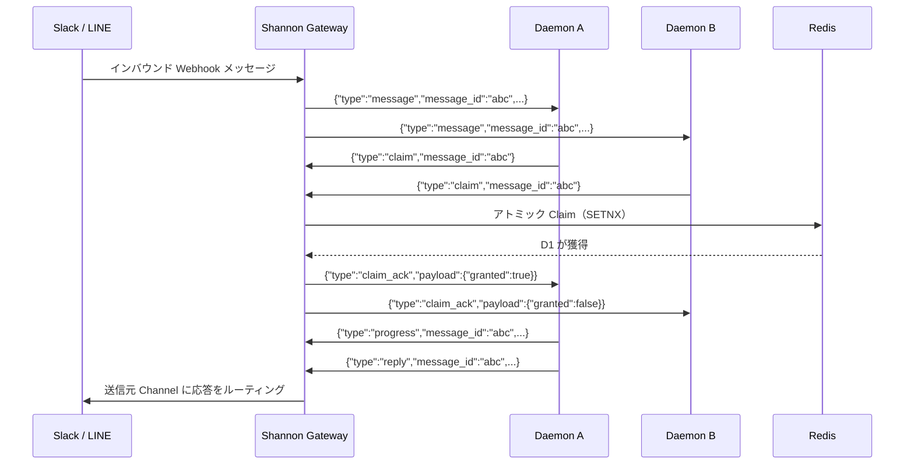

## 概要

Daemon WebSocket API は、Daemon クライアントがリアルタイムでメッセージを受信・処理するための永続的な双方向接続を提供します。クライアントがポーリングする REST API とは異なり、WebSocket 接続により Shannon は受信メッセージ（Slack、LINE、またはシステムイベントから）を接続済みの Daemon に直接プッシュできます。

このプロトコルの中核は **Claim ベースのメッセージディスパッチ**モデルです。Shannon は対象となるすべての接続にメッセージをブロードキャストし、Daemon が排他的処理権を競い合ってから応答します。

## エンドポイント

```
GET /v1/ws/messages
```

標準の認証 ヘッダー を使用して WebSocket にアップグレードします。

## 認証

認証は WebSocket アップグレードの**前に**、REST Endpoint と同じミドルウェアで実行されます。

| 方式 | ヘッダー |
|------|--------|
| JWT Bearer | `Authorization: Bearer <token>` |
| API Key | `X-API-Key: <key>` |

<CodeGroup>
```bash websocat
websocat "ws://localhost:8080/v1/ws/messages" \
  -H "Authorization: Bearer <token>"
```

```javascript JavaScript
const ws = new WebSocket("ws://localhost:8080/v1/ws/messages", {
  headers: {
    "Authorization": "Bearer <token>"
  }
});
```

```python Python
import websockets

async with websockets.connect(
    "ws://localhost:8080/v1/ws/messages",
    additional_headers={"Authorization": "Bearer <token>"}
) as ws:
    async for message in ws:
        print(message)
```
</CodeGroup>

## 接続ライフサイクル

<Steps>
  <Step title="HTTP アップグレード">
    クライアントが認証 ヘッダー 付きで `GET /v1/ws/messages` を送信します。サーバーは資格情報を検証してからアップグレードを行います。
  </Step>
  <Step title="WebSocket 確立">
    サーバーが WebSocket にアップグレードします（gorilla/websocket、4KB 読み書きバッファ、CheckOrigin はすべてのオリジンを許可）。
  </Step>
  <Step title="接続確認">
    サーバーが `connected` メッセージを送信して、接続の準備完了を確認します。
    ```json
    {"type": "connected"}
    ```
  </Step>
  <Step title="双方向メッセージング">
    双方が JSON メッセージを交換します。サーバーが受信メッセージをディスパッチし、クライアントが Claim、処理、応答を行います。
  </Step>
  <Step title="キープアライブ">
    サーバーは **20 秒**ごとに WebSocket Ping を送信します。クライアントは **60 秒**以内に Pong で応答する必要があり、応答がない場合は接続が切断されます。
  </Step>
</Steps>

### 接続パラメータ

| パラメータ | 値 |
|-----------|-----|
| Ping 間隔 | 20s |
| Pong タイムアウト | 60s |
| 最大メッセージサイズ | 64 KB |
| 書き込みタイムアウト | 10s |
| 読み書きバッファ | 4 KB |

## メッセージエンベロープ

すべてのメッセージ（双方向）は統一されたエンベロープ形式に従います：

```json
{
  "type": "<message_type>",
  "message_id": "<uuid>",
  "payload": {}
}
```

| フィールド | 型 | 説明 |
|-----------|------|------|
| `type` | string | メッセージタイプ識別子 |
| `message_id` | string (UUID) | 一意のメッセージ識別子（`connected` および `disconnect` では省略） |
| `payload` | object | タイプ固有のデータ |

## サーバーからクライアントへのメッセージ

### `connected`

WebSocket 接続の確立直後に一度だけ送信されます。

```json
{
  "type": "connected"
}
```

### `message`

処理のためにディスパッチされたインバウンドメッセージ。これは主要なメッセージタイプで、Channel Webhook（Slack、LINE）またはシステムイベントからのメッセージを伝達します。

```json
{
  "type": "message",
  "message_id": "a1b2c3d4-e5f6-7890-abcd-ef1234567890",
  "payload": {
    "channel": "slack",
    "thread_id": "C07ABCDEF-1234567890.123456",
    "sender": "user@example.com",
    "text": "Hello, can you help me?",
    "agent_name": "research-agent",
    "timestamp": "2026-03-10T10:00:00Z"
  }
}
```

#### MessagePayload フィールド

| フィールド | 型 | 説明 |
|-----------|------|------|
| `channel` | string | 送信元 Channel タイプ：`"slack"`、`"line"` など |
| `thread_id` | string | 会話のスレッド識別子 |
| `sender` | string | 送信者識別子（メール、ユーザー ID など） |
| `text` | string | メッセージ内容 |
| `agent_name` | string | 処理対象の Agent |
| `timestamp` | string (ISO 8601) | メッセージ受信時刻 |

### `system`

Shannon からのシステムレベル通知。

```json
{
  "type": "system",
  "message_id": "f7e8d9c0-b1a2-3456-7890-abcdef123456",
  "payload": {
    "text": "Agent research-agent is now available"
  }
}
```

### `claim_ack`

クライアントの `claim` リクエストへの応答。Claim が許可されたかどうかを示します。

```json
{
  "type": "claim_ack",
  "message_id": "a1b2c3d4-e5f6-7890-abcd-ef1234567890",
  "payload": {
    "granted": true
  }
}
```

| フィールド | 型 | 説明 |
|-----------|------|------|
| `granted` | boolean | `true` の場合、このクライアントに排他的処理権が付与された |

## クライアントからサーバーへのメッセージ

### `claim`

メッセージの排他的処理権を要求します。同一メッセージを Claim できるのは 1 つのクライアントのみです。

```json
{
  "type": "claim",
  "message_id": "a1b2c3d4-e5f6-7890-abcd-ef1234567890"
}
```

### `progress`

Claim 済みメッセージの処理中にハートビート/進捗更新を送信します。Claim のリースが延長され、タイムアウトを防ぎます。

```json
{
  "type": "progress",
  "message_id": "a1b2c3d4-e5f6-7890-abcd-ef1234567890",
  "payload": {
    "status": "processing",
    "percent": 50
  }
}
```

### `reply`

Claim 済みメッセージの処理結果を送信します。Shannon はこれを送信元 Channel（Slack、LINE など）にルーティングします。

```json
{
  "type": "reply",
  "message_id": "a1b2c3d4-e5f6-7890-abcd-ef1234567890",
  "payload": {
    "channel": "slack",
    "thread_id": "C07ABCDEF-1234567890.123456",
    "text": "Here is my response...",
    "format": "text"
  }
}
```

#### ReplyPayload フィールド

| フィールド | 型 | 説明 |
|-----------|------|------|
| `channel` | string | 送信先 Channel タイプ |
| `thread_id` | string | 返信先のスレッド |
| `text` | string | 応答内容 |
| `format` | string | 出力形式：`"text"` または `"markdown"` |

### `disconnect`

接続をグレースフルに閉じます。

```json
{
  "type": "disconnect"
}
```

## Claim フロー

Claim フローは分散メッセージ処理の中核プロトコルです。複数の Daemon が接続されていても、各メッセージが 1 つの Daemon のみで処理されることを保証します。



<Steps>
  <Step title="メッセージディスパッチ">
    メッセージが到着すると（Channel Webhook またはシステム経由）、Gateway は `tenant:user` でインデックスされた**すべての**対象 WebSocket 接続にメッセージをディスパッチします。
  </Step>
  <Step title="Claim 競争">
    メッセージを処理したい各 Daemon が `message_id` を含む `claim` リクエストを送信します。
  </Step>
  <Step title="アトミック解決">
    Gateway が Redis でアトミックに Claim を実行します（`SETNX`）。最初のクライアントが獲得し、他のクライアントは `{"granted": false}` を受信します。
  </Step>
  <Step title="メッセージ処理">
    獲得した Daemon がメッセージを処理します。オプションで `progress` メッセージを送信して Claim リースを延長し、処理状況を報告できます。
  </Step>
  <Step title="応答送信">
    Daemon が処理結果を含む `reply` を送信します。Shannon はこれを送信元 Channel にルーティングします。
  </Step>
</Steps>

### Claim メタデータ

メッセージが Claim されると、Gateway は Redis にメタデータを保存します（**TTL 60 秒**）：

| フィールド | 説明 |
|-----------|------|
| `conn_id` | WebSocket 接続識別子 |
| `channel_id` | 送信元 Channel ID |
| `channel_type` | Channel タイプ（`slack`、`line` など） |
| `thread_id` | 会話スレッド ID |
| `reply_token` | プラットフォーム固有の応答トークン（該当する場合） |
| `timestamp` | Claim タイムスタンプ |
| `workflow_id` | 関連する Temporal Workflow ID（該当する場合） |
| `workflow_run_id` | 関連する Temporal Workflow Run ID（該当する場合） |

<Note>
保留中メッセージのメタデータの **TTL は 90 秒**です。Claim 済みメッセージが 60 秒以内に応答されない場合、Claim は期限切れとなり、メッセージは再ディスパッチの対象となります。
</Note>

## Hub アーキテクチャ

WebSocket Hub はすべてのアクティブな接続を管理し、以下のルーティング戦略を採用しています：

- **Tenant-User インデックス** — 接続は `"tenant:user"` キーでインデックスされ、ターゲットディスパッチを実現
- **スレッドスティッキールーティング** — 同一スレッド（`"channel_type:thread_id"`）からのメッセージは可能な限り同じ接続にルーティング
- **Redis バックドの Claim** — 分散 Claim 解決により、複数の Gateway インスタンス間の一貫性を確保

## 応答ルーティング

Gateway が Daemon から `reply` を受信すると、Claim メタデータに基づいて応答をルーティングします：

1. **Workflow 応答** — Claim メタデータに `workflow_id` が存在する場合、Gateway は関連する Temporal Workflow に Signal で通知します
2. **Channel 応答** — それ以外の場合、応答は送信元 Channel にルーティングされます（Slack メッセージ、LINE Push メッセージなど）

## エラーハンドリング

| シナリオ | 動作 |
|---------|------|
| アップグレード時の認証失敗 | HTTP 401 を返却、WebSocket は確立されない |
| メッセージが 64 KB を超過 | 接続切断 |
| Pong タイムアウト（60s） | サーバーが接続を切断 |
| 書き込みタイムアウト（10s） | メッセージ破棄、接続が切断される可能性あり |
| Claim 期限切れ（60s TTL） | メッセージは再ディスパッチの対象 |
| 不正な JSON | メッセージ無視 |

## 次のステップ

<CardGroup cols={2}>
  <Card title="Channels API" icon="plug" href="/ja/api/rest/channels">
    Slack と LINE の Channel 統合を管理
  </Card>
  <Card title="ストリーミング" icon="wave-pulse" href="/ja/api/rest/streaming">
    Server-Sent Events によるタスクストリーミング
  </Card>
</CardGroup>
