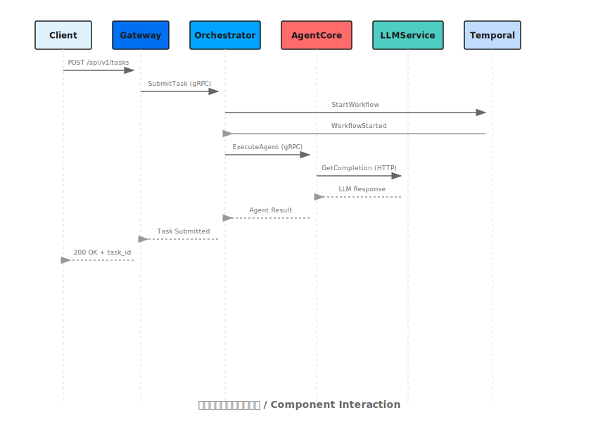

## システムコンポーネント

<Note>
このページは、フェーズ2のドキュメント拡張の一環として作成中です。
</Note>

Shannonは、複数の専門化されたコンポーネントを持つ分散システムとして構築されています。

## コアサービス

### Gateway (Go)
- **ポート**: 8080
- **役割**: REST APIゲートウェイ、認証、レート制限
- **技術**: Go, Chi router
- **スケーリング**: ステートレス、水平

### Orchestrator (Go)
- **ポート**: 50052 (gRPC), 8081 (admin)
- **役割**: タスク調整、ワークフロー管理
- **技術**: Go, Temporal, gRPC
- **スケーリング**: ステートフル、Temporalワークフローによる

### Agent Core (Rust)
- **ポート**: 50051 (gRPC)
- **役割**: エージェント実行、ツール呼び出し、WASIサンドボックス
- **技術**: Rust, Wasmtime, gRPC
- **スケーリング**: 水平

### LLM Service (Python)
- **ポート**: 8000
- **役割**: LLMプロバイダーゲートウェイ、プロンプト管理
- **技術**: Python, FastAPI, litellm
- **スケーリング**: 水平

<Note>
LLM Serviceの注意点:

- GPT‑5モデルはOpenAI Responses APIを介してルーティングされ、サーバーは`output_text`が存在する場合はそれを優先します。これにより、チャット応答が構造化されたコンテンツを返す際に空の結果を避けることができます。
- `/agent/query` HTTPエンドポイントは`allowed_tools`を期待します:
  - 省略/`null`: ロールプリセットがツールを有効にする可能性があります
  - `[]`: ツール無効
  - `["name", …]`: リストされたツールのみ利用可能（組み込み、OpenAPI、レジストリ名によるMCP）
</Note>

### Desktop App (Tauri + Next.js)
- **ポート**: — (ネイティブアプリ、Gateway :8080に接続)
- **役割**: リアルタイムモニタリングUI（タスク、実行、イベント）
- **技術**: Next.js, Tauri, SSE/WebSocket
- **スケーリング**: クライアントサイド; バックエンドサービスは独立してスケール

## データストア

### PostgreSQL
- **ポート**: 5432
- **目的**: タスクメタデータ、イベント、セッション、ユーザー
- **スキーマ**: 約15テーブル（task_executions, event_logs, sessionsなど）

### Redis
- **ポート**: 6379
- **目的**: セッションキャッシュ、pub/sub、レート制限
- **永続性**: オプション（RDB/AOF）

### Qdrant
- **ポート**: 6333
- **目的**: ベクトル埋め込み、セマンティックメモリ
- **コレクション**: テナントごとの分離

### Temporal
- **ポート**: 7233 (gRPC), 8088 (UI)
- **目的**: 耐久性のあるワークフロー実行
- **永続性**: PostgreSQLバックエンド

## コンポーネントの相互作用

## 近日公開

各コンポーネントの詳細なドキュメントには以下が含まれます:
- アーキテクチャ図
- APIインターフェース
- 設定オプション
- スケーリングガイドライン
- トラブルシューティングのヒント

高レベルのシステム設計については、[Architecture Overview](/ja/architecture/overview)を参照してください。
