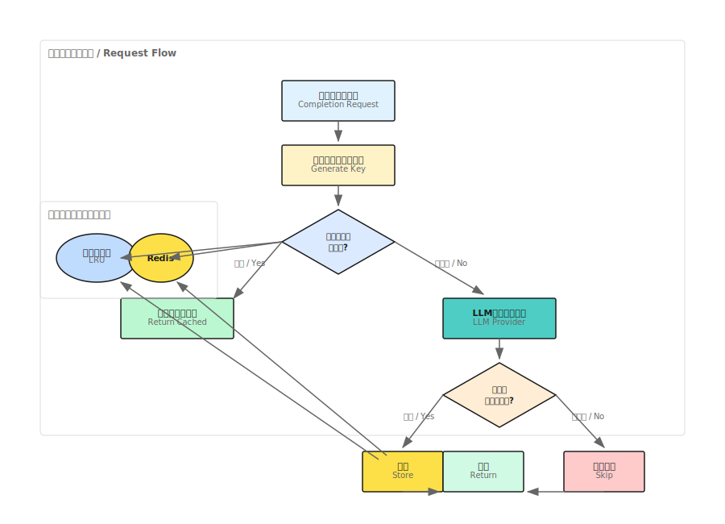

## 概要

ShannonはLLMレスポンス用のマルチレイヤーキャッシングシステムを実装しており、繰り返しまたは類似のクエリに対して大幅なコスト削減とレイテンシ削減を提供します。キャッシングシステムはインメモリとRedisの両方のバックエンドをサポートしています。

## アーキテクチャ



## キャッシュバックエンド

### インメモリキャッシュ（デフォルト）

デフォルトのキャッシングバックエンドは自動エビクション付きのLRU（Least Recently Used）ディクショナリを使用します。

**特徴：**
- 外部依存関係なし
- 高速ルックアップ（平均O(1)）
- 容量到達時に自動エビクション
- ヒット率トラッキング

**制限：**
- インスタンス間で共有されない
- サービス再起動時に消失

### Redisキャッシュ

本番環境のデプロイメントでは、Redisが複数インスタンス間で分散キャッシングを提供します。

**特徴：**
- すべてのLLMサービスインスタンス間で分散
- 永続ストレージ
- 自動TTL期限切れ
- Redis Sentinel/Clusterによる高可用性

**設定：**
```bash
# オプション1：完全なURL
export REDIS_URL="redis://localhost:6379"

# オプション2：個別コンポーネント
export REDIS_HOST="redis"
export REDIS_PORT="6379"
export REDIS_PASSWORD="your-password"  # オプション
```

## 設定

### グローバル設定

`config/models.yaml`でキャッシングを設定：

```yaml
prompt_cache:
  enabled: true
  ttl_seconds: 3600           # デフォルト1時間
  max_cache_size_mb: 2048     # メモリ制限
  similarity_threshold: 0.95   # セマンティック類似度閾値
```

| パラメータ | デフォルト | 説明 |
|-----------|---------|-------------|
| `enabled` | `true` | キャッシングマスタースイッチ |
| `ttl_seconds` | `3600` | デフォルトのキャッシュエントリ有効期間 |
| `max_cache_size_mb` | `2048` | 最大キャッシュサイズ（MB） |
| `similarity_threshold` | `0.95` | セマンティックマッチング閾値 |

### リクエストごとのオーバーライド

個別リクエストでキャッシュ動作をオーバーライド：

```python
from shannon import Client

client = Client()
response = client.complete(
    messages=[{"role": "user", "content": "量子コンピューティングを説明してください"}],
    cache_key="quantum-intro-ja",  # カスタムキャッシュキー
    cache_ttl=7200                  # このリクエストは2時間
)

# レスポンスがキャッシュからかチェック
if response.cached:
    print("キャッシュからレスポンスを提供")
```

## キャッシュキー生成

キャッシュキーはリクエストパラメータから決定論的に生成されます：

```python
key_data = {
    "messages": messages,
    "model_tier": model_tier,
    "model": model,
    "temperature": temperature,
    "max_tokens": max_tokens,
    "functions": functions,
    "seed": seed,
}
# ソート済みJSONのSHA-256ハッシュ
```

### 含まれるパラメータ
- メッセージコンテンツとロール
- モデルティアと特定モデル
- TemperatureとMax tokens
- 関数定義
- ランダムシード

### 除外されるパラメータ
- ストリーミングフラグ（ストリーミングはキャッシュされない）
- セッション/タスクID（キャッシュはリクエストベース）

## キャッシングルール

### レスポンスがキャッシュされる条件

以下の場合にレスポンスがキャッシュされます：
- グローバルでキャッシングが有効
- リクエストが非ストリーミング
- レスポンスに非空コンテンツまたはfunction_callがある
- 完了理由が"length"（切り詰め）や"content_filter"でない
- JSONモードの場合：コンテンツが有効なJSONオブジェクト

### レスポンスがキャッシュされない条件

<Warning>
品質を確保するため、以下のレスポンスは決してキャッシュされません：
- ストリーミングレスポンス
- 切り詰められたレスポンス（finish_reason: "length"）
- コンテンツフィルタされたレスポンス
- function callのない空のレスポンス
- 厳格なJSONモードでの無効なJSON
</Warning>

## キャッシュ検証

キャッシュされたレスポンスを返す前に、Shannonは以下を検証します：

1. **完了理由チェック**：切り詰めまたはフィルタされたレスポンスをスキップ
2. **JSONモード検証**：JSONモードで有効なJSONオブジェクトを確認
3. **コンテンツ存在確認**：非空コンテンツまたはfunction_callを要求

```python
def _should_cache_response(self, request, response) -> bool:
    # finish_reasonをチェック
    fr = (response.finish_reason or "").lower()
    if fr in {"length", "content_filter"}:
        return False

    # 厳格なJSONモード
    if is_strict_json_mode(request):
        try:
            obj = json.loads(response.content or "")
            if not isinstance(obj, dict):
                return False
        except:
            return False

    # コンテンツまたはfunction_callを要求
    if not response.content.strip() and not response.function_call:
        return False

    return True
```

## 環境変数

| 変数 | デフォルト | 説明 |
|----------|---------|-------------|
| `REDIS_URL` | - | 完全なRedis接続URL |
| `LLM_REDIS_URL` | - | 代替Redis URL |
| `REDIS_HOST` | `redis` | Redisホスト名 |
| `REDIS_PORT` | `6379` | Redisポート |
| `REDIS_PASSWORD` | - | オプションのRedisパスワード |

## パフォーマンス影響

### レイテンシ削減

| シナリオ | レイテンシ |
|----------|---------|
| キャッシュヒット | 1-5ms |
| キャッシュミス（小型モデル） | 500-2000ms |
| キャッシュミス（大型モデル） | 2000-10000ms |

### コスト削減

キャッシュヒットはLLMプロバイダーコストを完全に排除します：
- 典型的なヒット率：多様なワークロードで20-40%
- 高ヒット率：繰り返しクエリで60-80%
- 潜在的なコスト削減：ワークロードに応じて20-80%

## モニタリング

### キャッシュメトリクス

LLMサービスはキャッシュメトリクスを公開します：

```python
# ヒット率にアクセス
cache_hit_rate = manager.cache.hit_rate

# レスポンスにキャッシュステータスが含まれる
response = await manager.complete(...)
print(f"キャッシュ: {response.cached}")
```

### APIレスポンスフィールド

```json
{
  "content": "...",
  "cached": true,
  "finish_reason": "stop",
  "usage": {
    "prompt_tokens": 50,
    "completion_tokens": 100
  }
}
```

## ベストプラクティス

### キャッシュヒットを最大化

1. **プロンプトを正規化**：一貫したフォーマットでヒット率向上
2. **決定論的シードを使用**：再現可能な出力のために`seed`を設定
3. **温度を標準化**：一貫した温度値を使用
4. **システムプロンプトを再利用**：システムメッセージを一貫させる

### キャッシュキー戦略

```python
# 良い例：具体的で再利用可能なキャッシュキー
cache_key="product-summary-v1-{product_id}"

# 避けるべき例：衝突する可能性のある汎用キー
cache_key="summary"
```

### Redis設定

本番環境向け：
```yaml
# 永続化付きRedis
redis:
  appendonly: yes
  maxmemory: 2gb
  maxmemory-policy: allkeys-lru
```

## トラブルシューティング

### 低いヒット率

- プロンプトの正規化を確認
- 温度の一貫性を検証
- キャッシュTTL設定を確認
- キャッシュエビクション率を監視

### キャッシュが機能しない

1. 設定で`prompt_cache.enabled: true`を確認
2. Redis接続を確認（Redis使用時）
3. リクエストが非ストリーミングであることを確認
4. レスポンスがフィルタされていないことを確認

### メモリ問題

- `max_cache_size_mb`を削減
- 大規模デプロイメントではRedisを使用
- テナントごとにキャッシュパーティションを実装

## 次のステップ

<CardGroup cols={2}>
  <Card title="モデル選択" icon="microchip" href="/ja/tutorials/model-selection">
    モデルティアとルーティングを設定
  </Card>
  <Card title="コスト管理" icon="dollar-sign" href="/ja/quickstart/concepts/cost-control">
    予算管理を理解する
  </Card>
</CardGroup>
