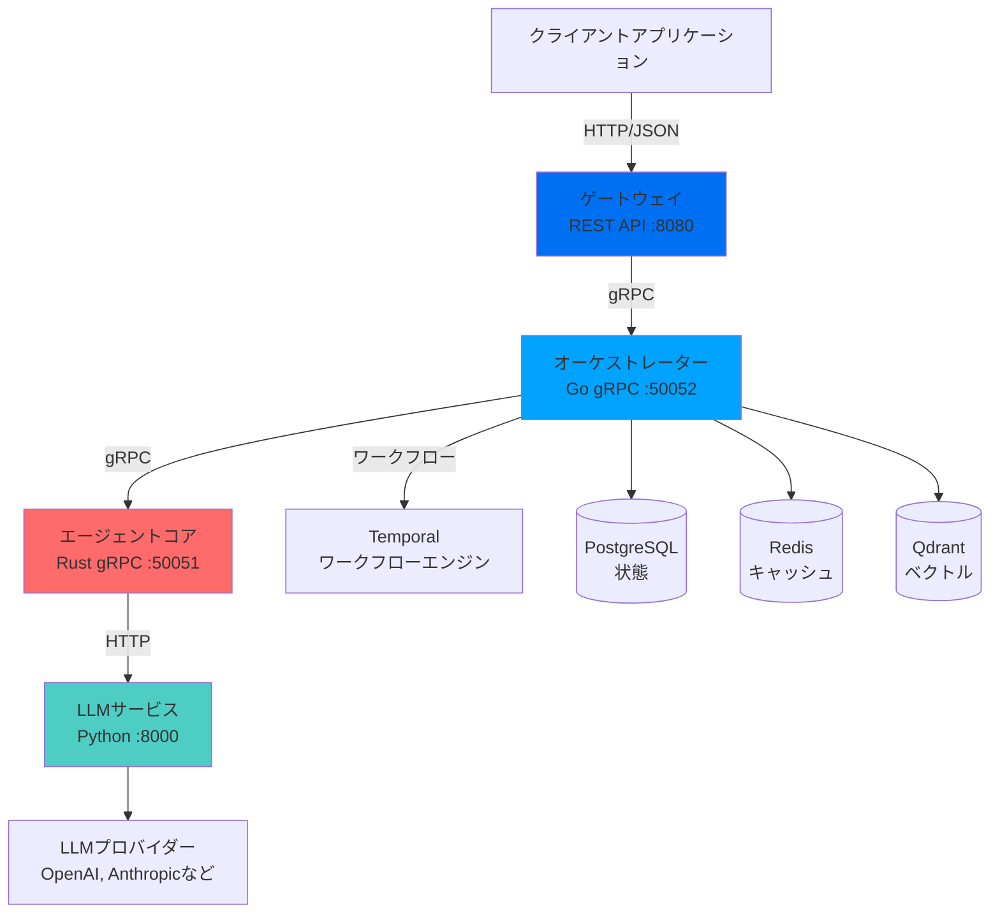

## システムアーキテクチャ

Shannonは、プロダクションAIエージェントオーケストレーションのために設計された分散マイクロサービスシステムです。

## コアコンポーネント

### ゲートウェイ (ポート 8080)

**技術**: Go  
**目的**: 外部クライアント用のREST APIレイヤー

ゲートウェイは以下を提供します：
- HTTP/JSON APIインターフェース
- 認証と認可（APIキー）
- ユーザーごとのレート制限
- 冪等性サポート
- SSEおよびWebSocketストリーミング
- OpenAPI仕様

<Card title="主な機能" icon="shield">
  認証は**デフォルトで無効**になっており、簡単に導入できます。プロダクションでは`GATEWAY_SKIP_AUTH=0`で有効にしてください。
</Card>

### オーケストレーター (ポート 50052)

**技術**: Go + Temporal  
**目的**: 中央ワークフロー調整

オーケストレーターは以下を処理します：
- タスクのルーティングと分解
- 認知パターンの選択（CoT, ToT, ReAct）
- 予算とトークン使用の強制
- セッション管理
- OPAポリシー評価
- マルチエージェント調整

**主要技術**: [Temporal](https://temporal.io) - デバッグ用に再生可能な耐久性のある決定論的ワークフローを提供します。

### エージェントコア (ポート 50051)

**技術**: Rust  
**目的**: セキュアな実行レイヤー

エージェントコアは以下を提供します：
- WASI（WebAssembly System Interface）サンドボックス
- セキュアなPythonコード実行（WASI内のCPython 3.11）
- ツールレジストリと実行
- 結果キャッシュ（TTL付きLRU）
- サーキットブレーカーとレート制限

<Card title="セキュリティファースト" icon="lock">
  すべてのコード実行は**ネットワークアクセスなし**で**読み取り専用ファイルシステム**のWASIサンドボックス内で行われます。
</Card>

### LLMサービス (ポート 8000)

**技術**: Python + FastAPI  
**目的**: マルチプロバイダーLLMゲートウェイ

LLMサービスは以下を処理します：
- マルチプロバイダー抽象化（OpenAI, Anthropic, Googleなど）
- SHA256ベースの重複排除によるインテリジェントキャッシング
- MCP（Model Context Protocol）ツール統合
- ウェブ検索統合（Exa, Perplexityなど）
- 埋め込みとドキュメントチャンク化

## データフロー

タスクがShannonを通過する流れは以下の通りです：

<Steps>
  <Step title="タスク提出">
    クライアントがREST APIを介してゲートウェイにタスクを提出
  </Step>
  <Step title="ワークフロー作成">
    ゲートウェイがオーケストレーターに転送し、Temporalワークフローを作成
  </Step>
  <Step title="パターン選択">
    オーケストレーターがタスクの複雑さを分析し、認知パターンを選択
  </Step>
  <Step title="タスク分解">
    複雑なタスクの場合、サブタスクに分解しDAG（有向非巡回グラフ）を作成
  </Step>
  <Step title="エージェント実行">
    オーケストレーターが各サブタスクのためにエージェントコアを呼び出す
  </Step>
  <Step title="LLM呼び出し">
    エージェントコアがLLMサービスを呼び出し、適切なプロバイダーにルーティング
  </Step>
  <Step title="ツール実行">
    必要に応じて、WASIサンドボックス内でツールを実行するか、外部APIを呼び出す
  </Step>
  <Step title="結果合成">
    オーケストレーターがすべてのエージェントからの結果を統合
  </Step>
  <Step title="レスポンス">
    最終結果がゲートウェイを介してクライアントに返される
  </Step>
</Steps>

## 永続化レイヤー

### PostgreSQL

以下を保存します：
- タスクメタデータと実行履歴
- セッション状態とコンテキスト
- ユーザーおよびAPIキーデータ
- ワークフロー履歴

**スキーマ**: ベクトル操作のためのpgvector拡張を含む

### Redis

以下を提供します：
- セッションキャッシング（TTL: 3600秒）
- LLM応答キャッシング
- レートリミターステート
- イベントのPub/Sub

### Qdrant

ベクトルデータベースで以下を処理します：
- セマンティックメモリの取得
- セッションスコープのベクトルコレクション
- 多様性のためのMMR（最大限の周辺関連性）

## 可観測性

Shannonは包括的な可観測性を含みます：

### メトリクス (Prometheus)

各サービスはメトリクスを公開します：
- **オーケストレーター**: `:2112/metrics`
- **エージェントコア**: `:2113/metrics`
- **LLMサービス**: `:8000/metrics`

メトリクスには以下が含まれます：
- リクエストレートとレイテンシ
- トークン使用量とコスト
- キャッシュヒット/ミス率
- エラー率（タイプ別）
- サーキットブレーカーの状態

### トレーシング (OpenTelemetry)

すべてのサービス間での分散トレーシングと`traceparent`ヘッダーによるコンテキスト伝播。

### デスクトップアプリケーション

ネイティブのTauri/Next.jsデスクトップクライアントが提供します：
- アクティブなタスクとワークフロー（実行ビュー）
- イベントストリーム（実行詳細）
- 基本的なシステムおよびタスクレベルのインサイト

### Temporal UI (ポート 8088)

ネイティブのTemporalインターフェースで以下を提供します：
- ワークフローの可視化
- 実行履歴
- リプレイデバッグ
- ワーカーの状態

## 設計原則

### 1. 信頼性

- **Temporal workflows** は耐久性を確保 - ワークフローはサービスの再起動を生き延びる
- **Circuit breakers** は連鎖的な障害を防ぐ
- サービスが利用できない場合の **Graceful degradation**

### 2. セキュリティ

- **WASI sandboxing** は信頼できないコードの実行を隔離
- **OPA policies** は細かいアクセス制御を強制
- テナントの隔離を伴う **Multi-tenancy**

### 3. コスト管理

- **Token budgets** はコストの暴走を防ぐ
- 適切な場合に安価なモデルへの **Intelligent routing**
- **Learning router** は時間と共にコスト効率を改善（85-95%の節約）

### 4. 可観測性

- **Prometheus metrics** による監視
- **OpenTelemetry tracing** によるデバッグ
- **Deterministic replay** は Temporal を介して

## スケーラビリティ

Shannon は水平スケールします：

- **Stateless services**: Gateway、Orchestrator、Agent Core は独立してスケール可能
- **Temporal workers**: スループットを増加させるためにワーカーを追加
- **Database**: 読み取りレプリカを持つ PostgreSQL、Redis クラスター、Qdrant 分散モード

## 次のステップ

<CardGroup cols={2}>
  <Card
    title="コアコンセプト"
    icon="book"
    href="/ja/quickstart/concepts/agents"
  >
    エージェントとワークフローの詳細
  </Card>
  <Card
    title="APIリファレンス"
    icon="terminal"
    href="/ja/api/overview"
  >
    完全なAPIを探る
  </Card>
  <Card
    title="コスト管理"
    icon="dollar"
    href="/ja/quickstart/concepts/cost-control"
  >
    コストを管理し最適化する
  </Card>
  <Card
    title="Python SDK"
    icon="code"
    href="/ja/sdk/python/quickstart"
  >
    SDKの使い始め
  </Card>
</CardGroup>
