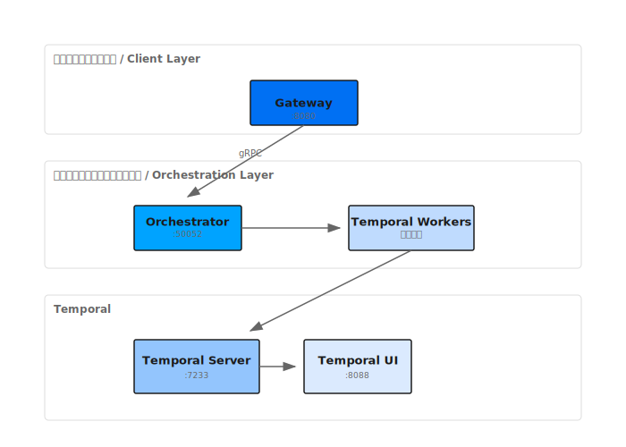

## 概要

Shannonは[Temporal](https://temporal.io)をWorkflowエンジンとして使用し、サービス再起動後も継続し、デバッグ用にリプレイ可能な耐久性のある決定論的実行を提供します。

## アーキテクチャ

## Workflowタイプ

Shannonは異なるユースケース向けに複数のWorkflowタイプを実装しています:

### OrchestratorWorkflow
複雑度分析に基づいてクエリを適切な戦略Workflowにルーティングするメインエントリポイント。

### 戦略Workflow

| Workflow | 適用場面 | 使用パターン |
|----------|----------|---------------|
| **DAGWorkflow** | 明確なサブタスクを持つマルチステップタスク | 並列/順次 + リフレクション |
| **ReactWorkflow** | ツール使用タスク、反復的解決 | Reason-Act-Observeループ |
| **ResearchWorkflow** | 情報収集、統合 | ReactまたはParallel + リフレクション |
| **ExploratoryWorkflow** | オープンエンドな発見 | Tree-of-Thoughts + Debate |
| **ScientificWorkflow** | 仮説検証 | CoT + Debate + ToT + リフレクション |

### SupervisorWorkflow
Agentの採用と退任を伴う動的チーム管理のための高度なWorkflow。

### ScheduledTaskWorkflow
cronスケジュールによる定期タスク実行用のラッパーWorkflow。

## Workflow選択ロジック

## 推論パターン

ShannonはWorkflow内でこれらのパターンを組み合わせます:

### Chain-of-Thought (CoT)
複雑な問題に対する信頼度追跡付きのステップバイステップ推論。

### Tree-of-Thoughts (ToT)
複数の解決パスを持つ問題に対する分岐と枝刈りを伴う体系的探索。

### ReAct
反復的問題解決のためのツール統合を伴うReason-Act-Observeループ。

### Debate
視点を探求し回答を強化するためのマルチAgentディベート。

### リフレクション
自己評価による反復的品質改善。

## 実行パターン

### 並列実行
- セマフォ制御による並行Agent実行
- 設定可能な並行性制限
- 結果集約

### 順次実行
- 結果を渡しながらのステップバイステップ実行
- ステップ間のコンテキスト蓄積

### ハイブリッド（DAG）実行
- トポロジカルソートによる依存関係グラフ実行
- 依存関係に基づく並列と順次の組み合わせ

## 設定

### 環境変数

| 変数 | デフォルト | 説明 |
|----------|---------|-------------|
| `TEMPORAL_HOST` | `temporal:7233` | Temporalサーバーアドレス |
| `AGENT_TIMEOUT_SECONDS` | `600` | Agent実行タイムアウト |
| `DECOMPOSE_TIMEOUT_SECONDS` | `30` | タスク分解タイムアウト |

## Temporal UI

`http://localhost:8088`でTemporal UIにアクセス:

- **Workflow可視化**: Workflow実行グラフの表示
- **実行履歴**: 各Workflowの完全なイベント履歴
- **リプレイデバッグ**: Workflow実行のステップスルー
- **Workerステータス**: Workerの健全性とタスクキューの監視

## 決定論的リプレイ

TemporalはWorkflowが決定論的であることを保証します:

<Note>
すべてのWorkflowコードは決定論的でなければなりません - Workflowコード内で直接乱数、現在時刻、外部呼び出しを使用しないでください。非決定論的操作にはActivityを使用してください。
</Note>

## トークン予算管理

すべてのWorkflowは以下を通じてトークン予算を遵守:
1. **ミドルウェア**: Workflowエントリでの予算強制
2. **パターンオプション**: `BudgetAgentMax`フィールドでAgent毎のトークンを制限
3. **Activity予算**: 予算追跡付きの制御された実行

## ベストプラクティス

### 各モードの使用時期

| モード | ユースケース | 例 |
|------|----------|---------|
| `simple` | 直接的な質問 | "2+2は？" |
| `standard` | マルチステップタスク | "この文書を要約して" |
| `complex` | 深い分析 | "フレームワークを比較" |
| `supervisor` | 動的チーム | "調査して実装" |

## モニタリング

### Prometheusメトリクス

- `shannon_workflow_duration_seconds` - Workflow実行時間
- `shannon_workflow_status` - 成功/失敗カウント
- `shannon_activity_duration_seconds` - Activity実行時間

### OpenTelemetryトレーシング

分散トレーシングは以下をカバー:
- Workflow実行
- Activity呼び出し
- Agent呼び出し
- LLMリクエスト

## 次のステップ

<CardGroup cols={2}>
  <Card title="Workflowコンセプト" icon="diagram-project" href="/ja/quickstart/concepts/workflows">
    認知パターンを学ぶ
  </Card>
  <Card title="アーキテクチャ概要" icon="sitemap" href="/ja/architecture/overview">
    システムアーキテクチャ
  </Card>
</CardGroup>
