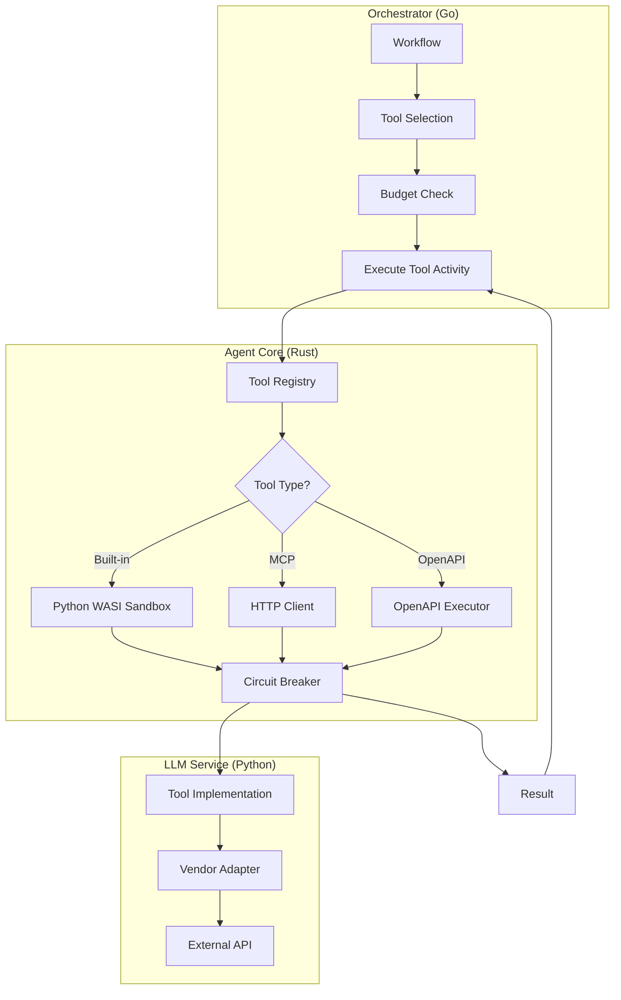
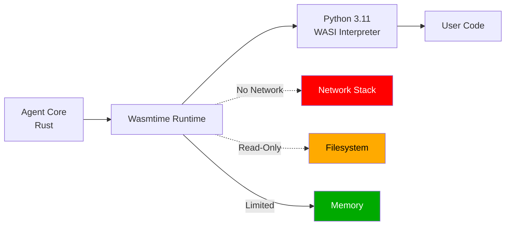
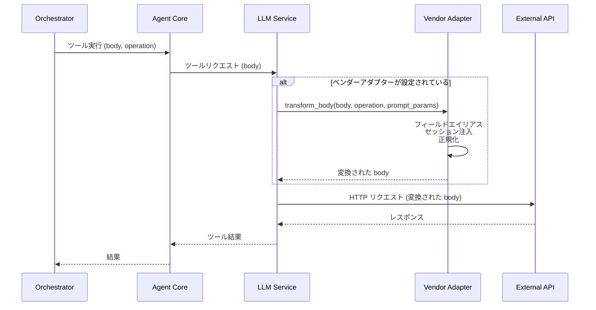
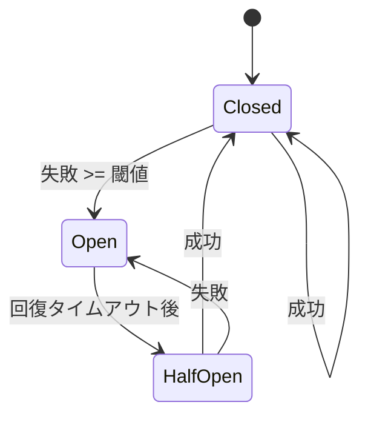

## 概要

Shannonのツール実行システムは、AIエージェントに外部機能を統合するための安全で拡張可能なフレームワークを提供します。このアーキテクチャは、統一された実行セマンティクスを持つ3つのツールタイプをサポートしています。

## ツールタイプ

<CardGroup cols={3}>
  <Card title="MCP Tools" icon="cloud">
    モデルコンテキストプロトコルに従った外部HTTP API
  </Card>
  <Card title="OpenAPI Tools" icon="file-code">
    OpenAPI 3.x仕様から自動生成
  </Card>
  <Card title="Built-in Tools" icon="code">
    サービスに直接アクセスするPythonツール
  </Card>
</CardGroup>

すべてのツールタイプは以下を共有します：
- パラメータのための統一されたJSONスキーマ
- 一貫したエラーハンドリング
- レート制限とサーキットブレーカー
- コスト追跡と予算の強制
- セキュリティ検証

## アーキテクチャレイヤー



## ツールレジストリ

### 登録

ツールはサービスの起動時にメタデータと共に登録されます：

```python
# python/llm-service/llm_service/tools/base.py
class ToolMetadata:
    name: str                    # 一意の識別子
    version: str                 # セマンティックバージョン
    description: str             # LLM可視の説明
    category: str                # 検索、データ、分析、コードなど
    parameters: List[ToolParameter]  # JSONスキーマ

    # 実行制約
    timeout_seconds: int = 30
    memory_limit_mb: int = 128
    rate_limit: int = 60        # 分あたりのリクエスト数
    cost_per_use: float = 0.0   # USD

    # セキュリティフラグ
    dangerous: bool = False      # ファイル書き込み、コード実行
    requires_auth: bool = False
    sandboxed: bool = False
    session_aware: bool = False
```

### 発見

ツールはランタイム発見のためにHTTP APIを介して公開されます：

```bash
# すべてのツールをリスト
GET /tools/list

# ツールスキーマを取得
GET /tools/{name}/schema

# ツールメタデータを取得
GET /tools/{name}/metadata

# カテゴリ別にリスト
GET /tools/list?category=data
```

## WASIサンドボックス

Pythonコードの実行は、セキュリティの隔離のためにWebAssembly System Interface (WASI) サンドボックス内で行われます。

### アーキテクチャ



### セキュリティ境界

<AccordionGroup>
  <Accordion title="ネットワークアクセスなし">
    WASIサンドボックスにはネットワークスタックがありません：

- ✅ 計算、解析、データ変換が可能
- ❌ HTTPリクエストを行うことはできません
- ❌ ソケットを開くことはできません
- ❌ 外部リソースにアクセスすることはできません

**ユースケース**: ユーザー提供のPythonコードの安全な実行
  </Accordion>

  <Accordion title="読み取り専用ファイルシステム">
    ファイルシステムは読み取り専用でマウントされています：

- ✅ Python標準ライブラリを読み取ることが可能
- ✅ 許可されたデータファイルを読み取ることが可能
- ❌ ファイルを書き込むことはできません
- ❌ システムファイルを変更することはできません

**ユースケース**: データの流出と改ざんを防ぐ
  </Accordion>

  <Accordion title="メモリ制限">
    実行ごとにメモリ使用量が制限されています：

```rust
// rust/agent-core/src/wasi_sandbox.rs
const DEFAULT_MEMORY_LIMIT_MB: usize = 512;
const DEFAULT_TABLE_LIMIT: u32 = 10000;  // Pythonに必要
```

**ユースケース**: リソース枯渇攻撃を防ぐ
  </Accordion>

  <Accordion title="実行タイムアウト">
    各実行には厳格な時間制限があります：

```yaml
# デフォルトのタイムアウト
timeout_seconds: 60

# ツールごとに設定可能
WASI_TIMEOUT_SECONDS=30
```

**ユースケース**: 無限ループやハングプロセスを防ぐ
  </Accordion>
</AccordionGroup>

### セットアップ

```bash
# Python WASIインタープリタをダウンロード (20MB)
./scripts/setup_python_wasi.sh

# インストールを確認
ls -lh wasm-interpreters/python-3.11.4.wasm

# 設定
PYTHON_WASI_WASM_PATH=./wasm-interpreters/python-3.11.4.wasm
WASI_MEMORY_LIMIT_MB=512
WASI_TIMEOUT_SECONDS=60
```

## OpenAPIツールローダー

ShannonはOpenAPI仕様からツールを動的に生成します。

### 仕様処理

<Steps>
  <Step title="仕様を取得">
    URLまたはインラインYAMLからOpenAPI仕様を取得：

```python
spec_url = "https://api.example.com/openapi.json"
spec = fetch_openapi_spec(spec_url)
```
  </Step>

  <Step title="検証と解析">
    OpenAPIのバージョンと構造を検証：

```python
# OpenAPI 3.0および3.1をサポート
assert spec["openapi"].startswith("3.")

# 操作を抽出
operations = extract_operations(spec)
```
  </Step>

  <Step title="ツールを生成">
    各操作のためにツールを作成：

```python
for operation in operations:
    tool = Tool(
        name=operation["operationId"],
        description=operation["summary"],
        parameters=convert_schema(operation["parameters"]),
        execute=lambda params: call_api(operation, params)
    )
    registry.register(tool)
```
  </Step>

  <Step title="ベンダーアダプタを適用">
    設定されている場合、ベンダー固有の変換をロード：

```python
if auth_config.get("vendor"):
    adapter = get_vendor_adapter(auth_config["vendor"])
    if adapter:
        body = adapter.transform_body(body, operation_id, prompt_params)
```
  </Step>
</Steps>

### スキーマ解決

```python
# ローカル $ref 参照を解決
# #/components/schemas/Pet → Pet スキーマ定義
def resolve_ref(ref: str, spec: dict) -> dict:
    path = ref.lstrip("#/").split("/")
    schema = spec
    for key in path:
        schema = schema[key]
    return schema
```

<Warning>
リモート `$ref` 解決（例: `https://example.com/schemas/Pet.json`）はサポートされていません。外部スキーマを単一の仕様ファイルに統合してください。
</Warning>

## ベンダーアダプター統合

ベンダーアダプターは、Shannonのコアを変更することなく、ドメイン固有のAPIのリクエスト/レスポンスを変換します。

### 実行フロー



### アダプターの読み込み

```python
# python/llm-service/llm_service/tools/vendor_adapters/__init__.py
def get_vendor_adapter(name: str):
    """名前によってアダプターインスタンスを返す。利用できない場合は None を返す。"""
    if not name:
        return None

    try:
        if name.lower() == "datainsight":
            from .datainsight import DataInsightAdapter
            return DataInsightAdapter()
        # ベンダーモジュールが欠落している場合の優雅なフォールバック
    except ImportError:
        logger.warning(f"ベンダーアダプター '{name}' は利用できません")
        return None
    except Exception as e:
        logger.error(f"ベンダーアダプター '{name}' の読み込みに失敗しました: {e}")
        return None

    return None
```

### 変換例

**フィールドエイリアス:**
```python
# 変換: "users" → "di:unique_users"
metric_aliases = {
    "users": "di:unique_users",
    "sessions": "di:total_sessions",
}
body["metrics"] = [metric_aliases.get(m, m) for m in body["metrics"]]
```

**セッションコンテキストの注入:**
```python
# prompt_params から account_id を注入
if prompt_params and "account_id" in prompt_params:
    body["account_id"] = prompt_params["account_id"]
```

**時間範囲の正規化:**
```python
# 変換: {start, end} → {startTime, endTime}
if "start" in body["timeRange"]:
    body["timeRange"]["startTime"] = body["timeRange"].pop("start")
if "end" in body["timeRange"]:
    body["timeRange"]["endTime"] = body["timeRange"].pop("end")
```

## レート制限

### ツールごとのレート制限

```python
class ToolMetadata:
    rate_limit: int = 60  # 分あたりのリクエスト数（デフォルト）
```

トークンバケットアルゴリズムで実装:

```python
class RateLimiter:
    def __init__(self, rate_limit: int):
        self.rate = rate_limit
        self.tokens = rate_limit
        self.last_update = time.time()

    def allow(self) -> bool:
        now = time.time()
        elapsed = now - self.last_update

        # トークンを補充
        self.tokens = min(
            self.rate,
            self.tokens + elapsed * (self.rate / 60.0)
        )
        self.last_update = now

        if self.tokens >= 1:
            self.tokens -= 1
            return True
        return False
```

### グローバルレート制限

```bash
# 環境変数
MCP_RATE_LIMIT_DEFAULT=60              # MCP ツールのデフォルト
WEB_SEARCH_RATE_LIMIT=120              # ウェブ検索特有
CALCULATOR_RATE_LIMIT=2000             # 計算機特有
PYTHON_EXECUTOR_RATE_LIMIT=60          # Python 実行
```

## サーキットブレーカー

外部サービスが利用できない場合の連鎖的な障害を防ぎます。

### 設定

```bash
# MCP サーキットブレーカー
MCP_CB_FAILURES=5                      # 5回の失敗後にオープン
MCP_CB_RECOVERY_SECONDS=60             # 60秒間オープンのまま

# Agent Core の強制
ENFORCE_CB_ERROR_THRESHOLD=0.5         # オープンするエラー率 (50%)
ENFORCE_CB_WINDOW_SECONDS=30           # スライディングウィンドウ
ENFORCE_CB_MIN_REQUESTS=20             # アクティベーション前の最小リクエスト数
```

### 状態



**Closed**: 通常の操作、すべてのリクエストが許可される

**Open**: サービスが利用できない、すべてのリクエストがファスト失敗

**Half-Open**: 回復をテスト中、制限されたリクエストが許可される

## コスト追跡

各ツールの実行は、予算の執行のためにコストを追跡します。

### ツールごとのコスト

```python
class ToolMetadata:
    cost_per_use: float = 0.001  # 呼び出しあたりの USD
```

### 予算の執行

```go
// go/orchestrator/internal/budget/manager.go
type BudgetManager struct {
    maxCostPerRequest float64
    maxTokensPerRequest int
}

func (bm *BudgetManager) CheckBudget(currentCost, currentTokens float64) error {
    if currentCost >= bm.maxCostPerRequest {
        return ErrBudgetExceeded
    }
    if currentTokens >= bm.maxTokensPerRequest {
        return ErrTokenLimitExceeded
    }
    return nil
}
```

### 設定

```bash
MAX_COST_PER_REQUEST=0.50              # USD
MAX_TOKENS_PER_REQUEST=10000
TOKEN_BUDGET_PER_AGENT=5000
TOKEN_BUDGET_PER_TASK=20000
```

## エラーハンドリング

### エラーカテゴリ

<Tabs>
  <Tab title="バリデーションエラー">
```python
class ValidationError(Exception):
    """パラメータのバリデーションに失敗しました。"""
    pass

# 必須パラメータが欠落
# 無効なパラメータタイプ
# 値が範囲外
# Enum制約違反
```
  </Tab>

  <Tab title="実行エラー">
```python
class ExecutionError(Exception):
    """ツールの実行に失敗しました。"""
    pass

# タイムアウト超過
# メモリ制限超過
# サンドボックス違反
# ツール固有のエラー
```
  </Tab>

  <Tab title="ネットワークエラー">
```python
class NetworkError(Exception):
    """外部API呼び出しに失敗しました。"""
    pass

# 接続タイムアウト
# DNS解決に失敗
# TLSハンドシェイクに失敗
# HTTPエラーコード (4xx, 5xx)
```
  </Tab>

  <Tab title="サーキットブレーカーエラー">
```python
class CircuitBreakerError(Exception):
    """サーキットブレーカーがオープンです。"""
    pass

# 失敗が多すぎる
# サービスが利用できない
# 自動再試行が防止されました
```
  </Tab>
</Tabs>

### リトライロジック

```python
# ジッターを伴う指数バックオフ
@retry(
    retries=3,
    backoff=exponential_backoff(base=1.0, max_delay=10.0),
    on_exception=(NetworkError, TimeoutError)
)
def execute_tool(tool_name, parameters):
    return registry.execute(tool_name, parameters)
```

## パフォーマンス最適化

### コネクションプーリング

```python
# 外部API用のHTTPコネクションプール
session = aiohttp.ClientSession(
    connector=aiohttp.TCPConnector(
        limit=100,              # 最大接続数
        limit_per_host=10,      # ホストごとの最大接続数
        ttl_dns_cache=300,      # DNSキャッシュのTTL
    )
)
```

### レスポンスキャッシング

```python
# OpenAPI仕様をキャッシュ
@lru_cache(maxsize=100)
def load_openapi_spec(spec_url: str) -> dict:
    return fetch_and_parse(spec_url)
```

### 並列実行

```go
// 複数のツールを並列に実行
func ExecuteToolsParallel(tools []Tool, parallelism int) []Result {
    sem := make(chan struct{}, parallelism)  // セマフォ
    results := make([]Result, len(tools))

    var wg sync.WaitGroup
    for i, tool := range tools {
        wg.Add(1)
        go func(idx int, t Tool) {
            defer wg.Done()
            sem <- struct{}{}        // 獲得
            defer func() { <-sem }() // 解放

            results[idx] = t.Execute()
        }(i, tool)
    }
    wg.Wait()
    return results
}
```

設定:
```bash
TOOL_PARALLELISM=5  # 最大5つのツールを同時に実行
```

## セキュリティ考慮事項

<Warning>
常にツールの入力を検証し、ユーザーの権限に基づいて実行を制限してください。
</Warning>

### ドメインホワイトリスト

```bash
# 外部APIアクセスを制限
MCP_ALLOWED_DOMAINS=api.example.com,api.partner.com
OPENAPI_ALLOWED_DOMAINS=api.github.com,api.stripe.com

# 開発専用
MCP_ALLOWED_DOMAINS=*  # すべてを許可 (⚠️ 本番環境では使用しない)
```

### ツールの権限

```python
class ToolMetadata:
    dangerous: bool = False      # ファイル書き込み、コード実行
    requires_auth: bool = False  # ユーザー認証が必要
```

OPAポリシーでアクセスを制御できます:
```rego
# config/opa/policies/tools.rego
package tools

deny[msg] {
    input.tool == "file_write"
    not is_admin(input.user)
    msg := "file_writeには管理者ロールが必要です"
}
```

### APIキー管理

<Tabs>
  <Tab title="環境変数">
```bash
# .env (gitにコミットしない)
WEATHER_API_KEY=sk-xxx
GITHUB_TOKEN=ghp_xxx
STRIPE_API_KEY=sk_live_xxx
```
  </Tab>

  <Tab title="Dockerシークレット">
```yaml
# docker-compose.yml
services:
  llm-service:
    secrets:
      - weather_api_key
      - github_token

secrets:
  weather_api_key:
    external: true
  github_token:
    external: true
```
  </Tab>

  <Tab title="Kubernetesシークレット">
```yaml
apiVersion: v1
kind: Secret
metadata:
  name: api-keys
type: Opaque
data:
  weather-api-key: <base64-encoded>
  github-token: <base64-encoded>
```
  </Tab>
</Tabs>

## モニタリング & 可観測性

### メトリクス

```prometheus
# ツール実行メトリクス
shannon_tool_executions_total{tool_name, status}
shannon_tool_execution_duration_seconds{tool_name}
shannon_tool_errors_total{tool_name, error_type}
shannon_tool_cost_usd{tool_name}

# サーキットブレーカーのメトリクス
shannon_circuit_breaker_state{base_url}
shannon_circuit_breaker_failures_total{base_url}

# レートリミッターのメトリクス
shannon_rate_limit_exceeded_total{tool_name}
shannon_rate_limit_tokens_available{tool_name}
```

### ロギング

```python
# ツール実行のための構造化ロギング
logger.info(
    "ツール実行が完了しました",
    extra={
        "tool_name": tool_name,
        "duration_ms": duration,
        "cost_usd": cost,
        "success": success,
        "error": error_message,
    }
)
```

### トレーシング

```python
# OpenTelemetryトレーシング
with tracer.start_as_current_span("tool_execution") as span:
    span.set_attribute("tool.name", tool_name)
    span.set_attribute("tool.category", category)

    result = execute_tool(tool_name, parameters)

    span.set_attribute("tool.success", result.success)
    span.set_attribute("tool.cost_usd", result.cost)
```

## 次のステップ

<CardGroup cols={2}>
  <Card title="カスタムツールの追加" icon="wrench" href="/ja/tutorials/custom-tools">
    MCP、OpenAPI、および組み込みツールの追加方法を学ぶ
  </Card>
  <Card title="ベンダーアダプター" icon="plug" href="/ja/tutorials/vendor-adapters">
    ドメイン特化型の統合を構築する
  </Card>
  <Card title="設定" icon="gear" href="/ja/quickstart/configuration">
    設定の完全なリファレンス
  </Card>
  <Card title="セキュリティのベストプラクティス" icon="shield-check" href="/ja/deployment/security">
    Shannonのデプロイメントを強化する
  </Card>
</CardGroup>
