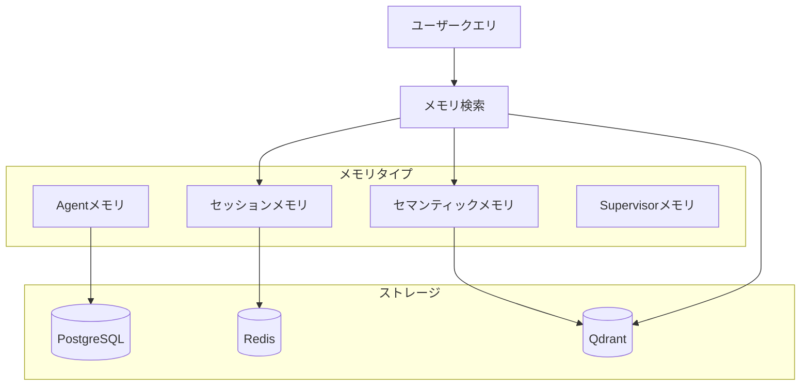

## 概要

Shannonのメモリシステムは、ユーザーセッション間でインテリジェントなコンテキスト保持と検索を提供し、Agentが会話の継続性を維持し、履歴インタラクションを活用して応答を改善できるようにします。

## アーキテクチャ

## ストレージレイヤー

### PostgreSQL
- **セッションコンテキスト**: セッションレベルの状態とメタデータ
- **実行永続化**: AgentとTool実行履歴
- **タスク追跡**: 高レベルのタスクとWorkflowメタデータ

### Redis
- **セッションキャッシュ**: アクティブセッションデータへの高速アクセス（TTL: 3600秒）
- **トークン予算**: リアルタイムトークン使用量追跡
- **圧縮状態**: コンテキスト圧縮状態の追跡

### Qdrant（ベクトルストア）
- **セマンティックメモリ**: 高性能ベクトル類似性検索
- **コレクション構成**: task_embeddings、summaries、tool_results、document_chunks
- **ハイブリッド検索**: 新しさとセマンティック関連性を組み合わせ

## メモリタイプ

### 階層メモリ（デフォルト）
複数の検索戦略を組み合わせ:
- **最近のメモリ**: 現在のセッションの最後のN回のインタラクション
- **セマンティックメモリ**: クエリ類似性に基づくコンテキスト関連コンテンツ
- **圧縮サマリー**: 古い会話の圧縮表現

### セッションメモリ
セッション内の最近のインタラクションの時系列検索。

### Agentメモリ
個別のAgent実行記録:
- 入力クエリと生成された応答
- トークン使用量とモデル情報
- Tool実行と結果

### Supervisorメモリ
インテリジェントなタスク分解のための戦略的メモリ:
- **分解パターン**: 再利用可能な成功したタスク分解
- **戦略パフォーマンス**: 戦略タイプごとの集計メトリクス
- **失敗パターン**: 既知の失敗と緩和戦略

## 設定

### 環境変数

| 変数 | デフォルト | 説明 |
|----------|---------|-------------|
| `QDRANT_HOST` | `qdrant` | Qdrantサーバーホスト名 |
| `QDRANT_PORT` | `6333` | Qdrantサーバーポート |
| `REDIS_TTL_SECONDS` | `3600` | セッションキャッシュTTL |

### 埋め込み要件

<Warning>
メモリ機能にはテキスト埋め込み用のOpenAI APIアクセスが必要です。
</Warning>

- **デフォルトモデル**: `text-embedding-3-small`（1536次元）
- **フォールバック動作**: OpenAIキーが設定されていない場合、メモリ操作は静かに劣化 - Workflowは履歴コンテキストなしで継続

## 主要機能

### インテリジェントチャンキング
- 長い回答（>2000トークン）を管理可能なチャンクに分割
- コンテキスト保持のための200トークンオーバーラップ
- 効率化のためのバッチ埋め込み

### MMR（最大限界関連性）
- 多様性を考慮したリランキングで関連性と情報の多様性をバランス
- デフォルトlambda=0.7で関連性が高く多様なコンテキスト選択を最適化
- 3倍のアイテムを取得し、多様性のためにリランク

### コンテキスト圧縮
- メッセージ数とトークン推定に基づく自動トリガー
- 過度な圧縮を防ぐレート制限
- 異なるティアのモデル対応閾値

## メモリ検索フロー

<Steps>
  <Step title="クエリ分析">
    受信クエリのセマンティックコンテンツを分析
  </Step>
  <Step title="最近の取得">
    Redis経由で現在のセッションから最後のNメッセージを取得
  </Step>
  <Step title="セマンティック検索">
    Qdrantでベクトル類似性検索を実行
  </Step>
  <Step title="マージ＆重複排除">
    結果を組み合わせて重複を削除
  </Step>
  <Step title="コンテキスト注入">
    関連メモリをAgentコンテキストに注入
  </Step>
</Steps>

## プライバシーとデータガバナンス

### PII保護
- データ最小化: 必要なフィールドのみ保存
- 匿名化: 実際のIDの代わりにUUIDを使用
- 自動PII検出とマスキング

### データ保持
- **会話履歴**: デフォルト30日保持
- **分解パターン**: 90日保持
- **ユーザー設定**: セッションベース、24時間有効期限

## パフォーマンス最適化

- **バッチ処理**: 複数チャンクに対する単一API呼び出し（5倍高速）
- **スマートキャッシング**: LRU（2048エントリ）+ Redis
- **ペイロードインデックス**: session_id、tenant_id、user_idでのフィルタリングが50-90%高速
- **最適化されたHNSW**: m=16、ef_construct=100で高速類似性検索

## 制限事項

- メモリ検索はレイテンシを追加（キャッシングで緩和）
- ベクトル類似性は完全なキーワードマッチを見逃す可能性
- 圧縮は非可逆（重要なポイントのみ保持）
- クロスセッションメモリには明示的なセッションリンクが必要

## 次のステップ

<CardGroup cols={2}>
  <Card title="アーキテクチャ概要" icon="sitemap" href="/ja/architecture/overview">
    システムアーキテクチャ
  </Card>
  <Card title="セッションAPI" icon="messages" href="/ja/api/rest/sessions">
    セッション管理
  </Card>
</CardGroup>
