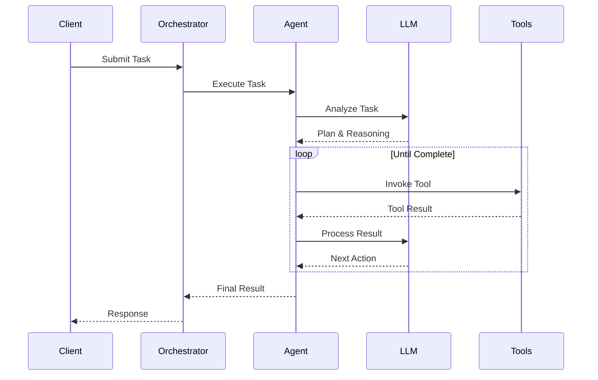

## はじめに

**AI Agent**は、環境を認識し、意思決定を行い、目標を達成するためのアクションを実行できる自律システムです。Shannonでは、AgentはLarge Language Models (LLM)とツールを使用してタスクを処理する基本的な実行単位です。

## Agentの機能

Shannon Agentができること：

<CardGroup cols={2}>
  <Card title="推論" icon="brain">
    LLMを使用してタスクを分析し、ソリューションを計画し、意思決定を行う
  </Card>
  <Card title="ツールの実行" icon="wrench">
    関数の呼び出し、コードの実行、Web検索、APIとの対話
  </Card>
  <Card title="協働" icon="users">
    他のAgentと協力して複雑なマルチステップ問題を解決
  </Card>
  <Card title="学習" icon="graduation-cap">
    パターン学習とキャッシュされた結果を通じて時間とともに改善
  </Card>
</CardGroup>

## Agentのライフサイクル

Agentがタスクを処理する方法：



<Steps>
  <Step title="タスク分析">
    Agentはタスクを受け取り、何をする必要があるかを分析
  </Step>
  <Step title="計画">
    LLMが計画を作成し、必要に応じてステップに分解
  </Step>
  <Step title="ツール選択">
    Agentは必要なツールを特定
  </Step>
  <Step title="実行">
    ツールを反復的に実行し、結果を処理
  </Step>
  <Step title="統合">
    結果を最終的な回答に統合
  </Step>
</Steps>

## ShannonにおけるAgentタイプ

### シングルAgent（シンプルモード）

単一のAgentが分解なしでタスク全体を処理します。

**最適な用途:**
- シンプルなクエリ
- 事実の取得
- 基本的な計算
- 迅速な応答

**例:**
```python
client.submit_task(
    query="What is the capital of France?"
)
```

<Note>
Shannonはシンプルなクエリに対して自動的にシングルAgentモードを選択します。
</Note>

### マルチAgent（標準/複雑モード）

複数の専門Agentが協力し、ShannonのOrchestratorによって調整されます。

**最適な用途:**
- 複雑なリサーチ
- マルチステップWorkflow
- 異なる専門知識を必要とするタスク
- 並列処理が必要なタスク

**例:**
```python
client.submit_task(
    query="Research top 5 AI trends, analyze market impact, and create summary"
)
```

<Note>
Shannonはクエリの複雑さに基づいて、複雑なクエリを自動的にマルチAgentワークフローに分解します。
</Note>

## Agentコンポーネント

### 1. LLM Brain

言語モデルによって駆動される意思決定コア：

- **モデル選択**: Shannonはタスクの複雑さに基づいてモデルを自動選択
  - 小規模タスク → `gpt-5-mini`、`claude-haiku`
  - 複雑なタスク → `gpt-5`、`claude-opus`
- **コンテキスト管理**: コンテキストウィンドウを自動管理
- **キャッシング**: 該当する場合、以前のLLMレスポンスを再利用

### 2. ツールシステム

Agentは様々なツールを実行できます：

**組み込みツール:**
- Pythonコード実行（WASIサンドボックス）
- Web検索（Google/Serper/Bing/Exa/Firecrawl）
- ドキュメント取得
- 数学的計算

**MCPツール:**
Shannonは外部ツール統合のための[Model Context Protocol](https://modelcontextprotocol.io)をサポートしています。

**カスタムツール:**
OpenAPI仕様またはPython実装を介して独自のツールを追加できます。

### 3. メモリシステム

Agentは2種類のメモリを維持します：

**セッションメモリ:**
- 会話内の短期コンテキスト
- 設定可能なTTL（デフォルト30日）でRedisに保存
- マルチターン対話を可能にする

**ベクトルメモリ:**
- Qdrantの長期セマンティックメモリ
- セッション間の取得
- 関連コンテキストのためのMMR多様性

## プラットフォーム設定

Shannonの動作は環境変数で設定されます。一般的な例：

```bash
# .env内（例）
DEFAULT_MODEL_TIER=small           # small | medium | large
MAX_TOKENS_PER_REQUEST=10000       # リクエストごとのトークン予算（LLMサービス）
MAX_COST_PER_REQUEST=0.50          # リクエストごとのコスト制限（USD、LLMサービス）
AGENT_TIMEOUT_SECONDS=600          # Agent実行タイムアウト（Orchestrator）

# 変更を適用
docker compose restart
```

### モデルティア

Shannonは設定されたティアに基づいてモデルを自動選択します：

| ティア | モデル | ユースケース | コスト |
|------|--------|----------|------|
| **SMALL** | gpt-5-nano、claude-haiku | シンプルなクエリ、大量処理 | $ |
| **MEDIUM** | gpt-5-mini、claude-sonnet | 汎用目的 | $$ |
| **LARGE** | gpt-5.1、claude-opus | 複雑な推論、重要なタスク | $$$ |

<Tip>
Shannonのインテリジェントルーターは各タスクに最もコスト効率の良いモデルを選択し、常にプレミアムモデルを使用する場合と比較して60～90%の節約を実現します（ワークロード依存）。
</Tip>

[Configuration Guide](/ja/quickstart/configuration)で利用可能なすべての環境変数を参照してください。

## Agent調整パターン

ShannonはマルチAgent調整のために実証済みの認知パターンを使用します：

### Chain-of-Thought (CoT)

各ステップが前のステップに基づいて構築される順次推論：

```
タスク: "複利を計算"
ステップ1: 公式を特定
ステップ2: 入力を収集
ステップ3: 結果を計算
ステップ4: 出力をフォーマット
```

### Tree-of-Thoughts (ToT)

複雑な問題解決のためのバックトラッキングを伴う探索：

```
タスク: "システムアーキテクチャを設計"
ブランチ1: マイクロサービスアプローチ
  ├─ 長所/短所を評価
  └─ 複雑さを見積もり
ブランチ2: モノリシックアプローチ
  ├─ 長所/短所を評価
  └─ 複雑さを見積もり
選択: 基準に基づいて最良のオプション
```

### ReAct（推論 + 行動）

動的タスクのための推論と行動の交互実行：

```
Think: "最新の株価を見つける必要がある"
Act: "AAPL stock price"をWeb検索
Observe: "$150.25"
Think: "10%の利益を計算"
Act: 150.25 * 1.10を計算
Result: "$165.28"
```

## セキュリティと分離

Shannon Agentはセキュアな環境で実行されます：

<Card title="WASIサンドボックス" icon="lock">
  すべてのコード実行はWebAssembly System Interfaceサンドボックス内で行われ、以下を備えています：
  - **ネットワークアクセスなし**
  - **読み取り専用ファイルシステム**
  - **メモリ制限**
  - **実行タイムアウト**
</Card>

### OPAポリシー適用

Agentができることを制御：

```rego
# 例ポリシー: チームごとにモデルを制限
package shannon.teams.datascience

allow {
    input.team == "data-science"
    input.model in ["gpt-5", "claude-sonnet"]
}

max_tokens = 50000 {
    input.team == "data-science"
}
```

## ベストプラクティス

### 1. 適切なモードを選択

- **Simple**: 単一ステップタスク、高速レスポンス
- **Standard**: マルチステップタスク、中程度の複雑さ
- **Complex**: リサーチ、分析、高度な推論

### 2. 予算制限を設定

予期しない料金を防ぐために、プラットフォームレベルでトークンとコストの制限を設定：

```bash
# .envファイル内
MAX_TOKENS_PER_REQUEST=5000
MAX_COST_PER_REQUEST=1.0
```

タスクステータスを介してコストを監視：

```python
status = client.get_status(task_id, include_details=True)
if status.token_usage:
    print(f"Cost: ${status.token_usage.cost_usd:.4f}")
    print(f"Tokens: {status.token_usage.total_tokens}")
```

### 3. コンテキストにセッションを使用

マルチターン会話には、一貫した`session_id`を使用：

```python
session_id = "user-123-conversation"
client.submit_task(query="...", session_id=session_id)
```

### 4. パフォーマンスを監視

最適化のためにメトリクスを確認：

```python
# タスクの完了を待機
status = client.wait(handle.task_id, timeout=300)
if status.token_usage:
    print(f"Tokens used: {status.token_usage.total_tokens}")
    print(f"Cost: ${status.token_usage.cost_usd:.4f}")
```

## 次のステップ

<CardGroup cols={2}>
  <Card title="Workflow" icon="diagram-project" href="/ja/quickstart/concepts/workflows">
    Workflowパターンについて学ぶ
  </Card>
  <Card title="コスト管理" icon="dollar-sign" href="/ja/quickstart/concepts/cost-control">
    予算管理をマスター
  </Card>
  <Card title="APIリファレンス" icon="code" href="/ja/api/overview">
    Agent APIを探索
  </Card>
  <Card title="Python SDK" icon="python" href="/ja/sdk/python/quickstart">
    SDKで構築
  </Card>
</CardGroup>
