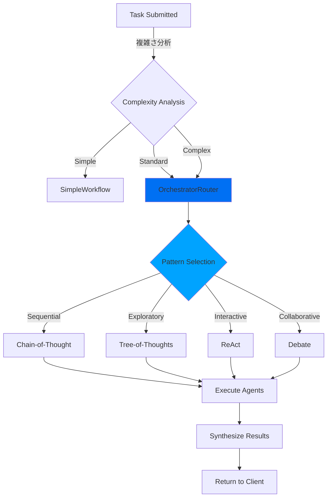
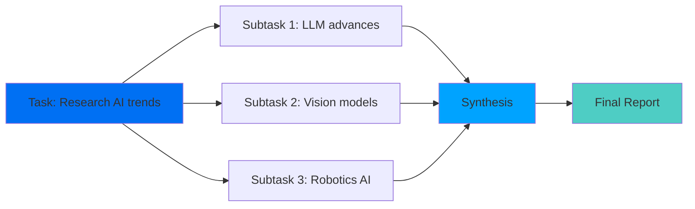

## Workflowとは？

ShannonのWorkflowは、AI Agentを調整して複雑なタスクを完了する、耐久性のあるステートフルなプロセスです。[Temporal](https://temporal.io)上に構築され、以下を提供します：

- **耐久性**: Workflowはサービスの再起動と障害を乗り越える
- **決定論**: デバッグのためにリプレイ可能
- **可視性**: 完全な実行履歴と状態検査
- **信頼性**: 自動リトライとエラーハンドリング

## Workflowアーキテクチャ



## 認知パターン

Shannonは異なるタスクタイプに対して実証済みの認知パターンを実装しています：

### Chain-of-Thought (CoT)

各ステップが前のステップに論理的に基づいて構築される順次推論。

**最適な用途:**
- 数学的問題
- ステップバイステップ分析
- 線形Workflow

**例:**
```python
client.submit_task(
    query="Calculate the ROI of a $100k investment with 8% annual return over 5 years"
)
```

<Note>
Shannonは順次的な数学的および分析的タスクに対してChain-of-Thought推論を自動的に適用します。
</Note>

**実行:**
```
ステップ1: 公式を特定（ROI = (最終値 - 初期値) / 初期値）
ステップ2: 年ごとの成長を計算
ステップ3: 最終値を計算（$146,933）
ステップ4: ROIを計算（46.93%）
```

### Tree-of-Thoughts (ToT)

複数のソリューションパスを同時に探索し、評価して最良のものを選択します。

**最適な用途:**
- 設計上の決定
- 戦略的計画
- 複数のアプローチを持つ問題

**例:**
```python
client.submit_task(
    query="Design a scalable message queue system. Evaluate multiple architectures and recommend the best approach."
)
```

<Note>
Shannonは複数のソリューションパスを持つ設計および計画タスクに対してTree-of-Thoughts探索を自動的に適用します。
</Note>

**実行:**
```
ブランチ1: Redisベースのソリューション
  ├─ 長所: 高速、シンプル、馴染みがある
  ├─ 短所: 限定的な永続性、メモリ制約
  └─ スコア: 7/10

ブランチ2: Kafkaベースのソリューション
  ├─ 長所: 高スループット、耐久性、実証済み
  ├─ 短所: 運用の複雑さ、リソース消費
  └─ スコア: 9/10

ブランチ3: RabbitMQベースのソリューション
  ├─ 長所: 機能豊富、良好なバランス
  ├─ 短所: Kafkaより低いスループット
  └─ スコア: 8/10

選択: Kafka（要件に対して最高スコア）
```

### ReAct（推論 + 行動）

動的な問題解決に最適な、思考と行動をループで交互に実行。

**最適な用途:**
- リサーチタスク
- デバッグ問題
- 適応型Workflow

**例:**
```python
client.submit_task(
    query="Find the latest Rust async runtime benchmarks"
)
```

<Note>
Shannonはリサーチおよび反復的発見タスクに対してReAct（推論 + 行動）を自動的に適用します。
</Note>

**実行:**
```
Think: "最近のベンチマークを検索する必要がある"
Act: web_search("Rust async runtime benchmarks 2024")
Observe: 2024年の3つの記事を発見
Think: "詳細な比較データを取得しよう"
Act: web_search("tokio vs async-std vs smol benchmark comparison")
Observe: パフォーマンスデータを発見
Think: "調査結果をまとめられる"
Act: 結果をレポートに統合
```

### Debateパターン

複数のAgentが異なる視点を議論し、コンセンサスを統合します。

**最適な用途:**
- 意思決定
- トレードオフの評価
- バランスの取れた分析

**例:**
```python
client.submit_task(
    query="Should we migrate our monolith to microservices? Provide arguments for and against, then recommend."
)
```

<Note>
Shannonは複数の視点を必要とする意思決定タスクに対してDebateパターンを自動的に適用します。
</Note>

**実行:**
```
Agent 1（マイクロサービス賛成）:
  - より良いスケーラビリティ
  - 独立したデプロイ
  - 技術の柔軟性

Agent 2（モノリス賛成）:
  - よりシンプルな運用
  - より簡単なデバッグ
  - より低いレイテンシ

Agent 3（統合者）:
  - 両方の議論を評価
  - コンテキストを考慮
  - 推奨事項を提供
```

## タスク分解

複雑なタスクに対して、Shannonは自動的にサブタスクに分解します：

### DAG（有向非巡回グラフ）実行



**並列実行:**
依存関係のないサブタスクは並列に実行され、レイテンシを削減します。

**例:**
```python
# このクエリは自動的に3つの並列サブタスクに分解されます
client.submit_task(
    query="Research: 1) GPT-5 capabilities, 2) Claude 3 features, 3) Gemini updates"
)
```

### 分解戦略

Shannonはタスクを分析し、内部的に実行計画を作成します。分解構造はSDKレスポンスで直接公開されませんが、イベントを通じてWorkflow実行を観察できます：

```python
# イベントをストリーミングしてWorkflow実行を確認
for event in client.stream(workflow_id):
    if event.type == "PROGRESS":
        print(f"Progress: {event.message}")
    elif event.type == "AGENT_STARTED":
        print(f"Agent started: {event.agent_id} - {event.message}")
    elif event.type == "AGENT_COMPLETED":
        print(f"Agent completed: {event.agent_id}")
```

**内部構造**（理解のため、直接アクセス不可）:
- サブタスクは依存関係がない場合に並列実行
- 統合タスクはすべてのサブタスクの完了を待機
- 各サブタスクは専門Agentに割り当て

## Workflowアクティビティ

Temporal Workflowはアクティビティ（個別の作業単位）で構成されます：

| アクティビティ | 目的 |
|----------|---------| 
| **DecomposeTask** | タスクを分析してサブタスクを作成 |
| **ExecuteAgent** | 単一のAgentタスクを実行 |
| **SynthesizeResults** | 複数のAgentからの出力を統合 |
| **UpdateSessionResult** | セッション状態を永続化し、アシスタントメッセージをセッション履歴に追加（2025-11-05修正） |
| **RecordQuery** | ベクトルメモリに保存 |
| **FetchSessionMemory** | 関連コンテキストを取得 |

## Workflowの監視

### Python SDK経由

```python
# タスクステータスを取得
status = client.get_status(task_id)

print(f"Status: {status.status}")
print(f"Progress: {status.progress}")
if status.result:
    print(f"Result: {status.result}")
```

<Note>
タスク分解はShannon内部で行われます。イベントストリーミングを使用してWorkflow実行をリアルタイムで観察してください。
</Note>

### Temporal UI経由

http://localhost:8088 にアクセスして以下を確認：
- Workflow実行タイムライン
- アクティビティステータス
- 入出力ペイロード
- エラートレース
- リプレイ履歴

## 決定論的リプレイ

Shannon Workflowは決定論的です - 同じ入力でリプレイすると同じ結果を生成します。

**ユースケース:**
- **デバッグ**: 失敗したWorkflowをリプレイしてバグを見つける
- **テスト**: コード変更が既存のWorkflowを壊さないことを検証
- **監査**: 正確に何が起こったかを理解

**例:**
```bash
# Workflow履歴をエクスポート
make replay-export WORKFLOW_ID=task-123 OUT=history.json

# 現在のコードに対してリプレイ
make replay HISTORY=history.json

# コードが非決定論的に変更された場合、リプレイは失敗
```

## Workflow設定

Workflowの動作は環境変数で設定されます（例）：

```bash
# .env内
MAX_AGENTS_PER_TASK=5          # 最大並列Agent数（有効な場合）
MAX_TOKENS_PER_REQUEST=50000   # リクエストごとのLLMトークン予算（LLMサービス）
MAX_COST_PER_REQUEST=5.0       # リクエストごとのLLMコスト制限（USD）
AGENT_TIMEOUT_SECONDS=600      # Agent実行タイムアウト（Orchestrator）
```

ストリーミングイベントを介してWorkflow実行を監視：

```python
handle = client.submit_task(query="Complex analysis task")

# Workflowイベントをストリーミング
for event in client.stream(handle.workflow_id):
    print(f"[{event.type}] {event.message}")
```

すべての環境変数については[Configuration Guide](/ja/quickstart/configuration)を参照してください。

## エラーハンドリング

Workflowは自動的に障害を処理します：

<AccordionGroup>
  <Accordion title="リトライ">
    アクティビティは指数バックオフで自動的にリトライ：
    ```
    試行1: 即座
    試行2: 1秒後
    試行3: 2秒後
    試行4: 4秒後
    ...
    最大: 5回の試行
    ```
  </Accordion>

  <Accordion title="サーキットブレーカー">
    LLMプロバイダーが失敗している場合、サーキットブレーカーが開いてフォールバックにルーティング：
    ```
    プライマリ: OpenAI（失敗中）
    フォールバック: Anthropic（正常）
    ```
  </Accordion>

  <Accordion title="グレースフルデグラデーション">
    複雑モードが失敗した場合、自動的によりシンプルな実行にフォールバック。
  </Accordion>

  <Accordion title="予算超過">
    予算制限に達すると、タスクは即座に停止し、コスト超過を防止。
  </Accordion>
</AccordionGroup>

## ベストプラクティス

### 1. 適切な戦略を選択

タスクに認知戦略を合わせる：

| タスクタイプ | 推奨戦略 |
|-----------|---------------------|
| シンプルQ&A | DIRECT（シングルAgent） |
| リサーチ | REACT（Web検索 + 統合） |
| 分析 | DECOMPOSE（パーツに分解） |
| 設計 | EXPLORATORY（ToT評価） |

### 2. 適切なモードを使用

- **simple**: 直接実行、オーバーヘッドなし
- **standard**: タスク分解、マルチAgent
- **complex**: 完全な認知パターン（CoT、ToTなど）

### 3. 進捗を監視

イベントをストリーミングしてWorkflow実行を追跡：

```python
for event in client.stream(workflow_id):
    if event.type == "LLM_PROMPT":
        print(f"Prompt: {event.message}")
    elif event.type == "AGENT_COMPLETED":
        print(f"Agent done: {event.agent_id}")
```

### 4. タイムアウトを設定

環境変数を介してWorkflowが無期限に実行されるのを防ぐ：

```bash
# .envファイル内
AGENT_TIMEOUT_SECONDS=300  # Agentごとの5分実行制限
```

## 次のステップ

<CardGroup cols={2}>
  <Card title="コスト管理" icon="dollar-sign" href="/ja/quickstart/concepts/cost-control">
    予算管理を学ぶ
  </Card>
  <Card title="ストリーミング" icon="stream" href="/ja/quickstart/concepts/streaming">
    リアルタイムイベントストリーミング
  </Card>
  <Card title="アーキテクチャ" icon="boxes" href="/ja/architecture/overview">
    システムアーキテクチャ概要
  </Card>
  <Card title="Python SDK" icon="code" href="/ja/sdk/python/quickstart">
    SDKを始める
  </Card>
</CardGroup>
