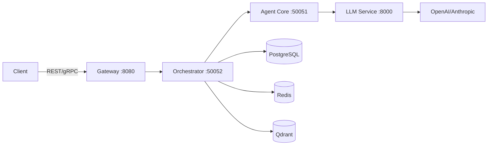

## Shannonとは？

Shannonは、AI Agentを大規模に展開する際の重要な課題を解決するために設計された、本番環境対応のAI Agentオーケストレーションプラットフォームです：

<CardGroup cols={2}>
  <Card
    title="コスト管理"
    icon="dollar-sign"
  >
    厳格な予算制限、トークン追跡、インテリジェントなモデル選択により、ワークロードに応じて60～90%のコスト削減を実現
  </Card>
  <Card
    title="信頼性"
    icon="shield-check"
  >
    決定論的なリプレイデバッグ、サーキットブレーカー、自動劣化機能
  </Card>
  <Card
    title="セキュリティ"
    icon="lock"
  >
    コード実行のためのWASIサンドボックス、OPAポリシー適用、マルチテナント分離
  </Card>
  <Card
    title="スケーラビリティ"
    icon="chart-line"
  >
    Temporalベースの分散Workflow、水平スケーリング、包括的な可観測性
  </Card>
</CardGroup>

## 主な機能

### マルチAgentオーケストレーション
ShannonはChain-of-Thought (CoT)、Tree-of-Thoughts (ToT)、ReActなどの実証済みの認知パターンを使用して複数のAI Agentを調整し、複雑なタスクの分解と並列実行を可能にします。

### 本番環境対応
本番環境のワークロードを念頭に構築：
- **Temporal Workflow** による耐久性のある決定論的な実行
- **WASIサンドボックス** によるセキュアなPythonコード実行
- **サーキットブレーカー** と障害保護
- **包括的な可観測性** PrometheusメトリクスとOpenTelemetryトレーシング

### マルチプロバイダーサポート
LLMプロバイダー間のシームレスな切り替え：
- OpenAI (GPT-5ファミリー)
- Anthropic (Claude 3 Opus/Sonnet/Haiku)
- Google Gemini
- Groq、Azure OpenAI、Ollama、その他

## クイックスタート

10分以内にShannonを起動：

<Card
  title="インストールガイド"
  icon="rocket"
  href="/ja/quickstart/installation"
>
  Docker Composeで1コマンドでShannonをセットアップ
</Card>

## アーキテクチャ概要

Shannonは4つの主要コンポーネントで構成されています：

<CardGroup cols={2}>
  <Card title="Gateway" icon="door-open">
    認証とレート制限を備えたREST APIレイヤー
  </Card>
  <Card title="Orchestrator" icon="diagram-project">
    TemporalベースのWorkflow調整とタスクルーティング
  </Card>
  <Card title="Agent Core" icon="robot">
    WASIサンドボックスを備えたセキュアな実行レイヤー
  </Card>
  <Card title="LLM Service" icon="brain">
    インテリジェントキャッシングを備えたマルチプロバイダーLLM Gateway
  </Card>
</CardGroup>

## ユースケース

Shannonが得意とする分野：

- **複雑なタスク自動化**: 複雑なタスクを管理可能なサブタスクに分解し、自動オーケストレーション
- **リサーチ & 分析**: 包括的な調査と統合のために複数のAgentを調整
- **コード生成**: WASIサンドボックス内でのセキュアなPythonコード実行
- **マルチステップWorkflow**: 障害に耐え、デバッグのためにリプレイ可能な耐久性のあるWorkflow

## 次のステップ

<CardGroup cols={2}>
  <Card
    title="クイックスタートチュートリアル"
    icon="play"
    href="/ja/quickstart/quickstart"
  >
    5分で最初のタスクを送信
  </Card>
  <Card
    title="コアコンセプト"
    icon="book"
    href="/ja/quickstart/concepts/agents"
  >
    Agent、Workflow、パターンについて学ぶ
  </Card>
  <Card
    title="APIリファレンス"
    icon="code"
    href="/ja/api/overview"
  >
    RESTとgRPC APIを探索
  </Card>
  <Card
    title="Python SDK"
    icon="python"
    href="/ja/sdk/python/quickstart"
  >
    簡単な統合のためのPython SDKを使用
  </Card>
</CardGroup>
