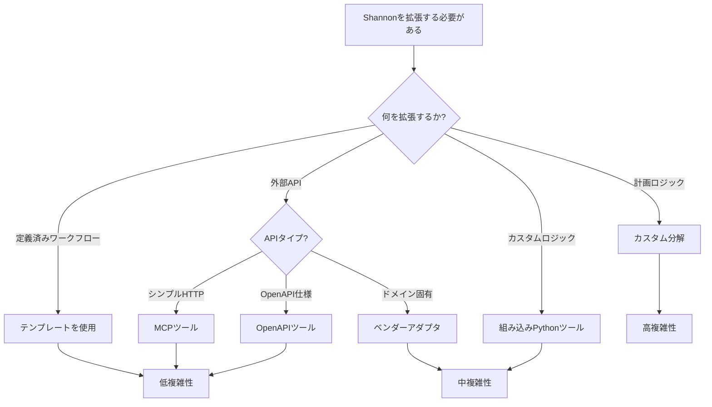

## 概要

このガイドでは、Shannonをカスタマイズするための拡張可能なパターンを示し、アップグレードの互換性と関心の分離を維持します。

<CardGroup cols={2}>
  <Card title="テンプレート" icon="file-code">
    システム 1 - 低オーバーヘッドのプリビルトワークフロー
  </Card>
  <Card title="ツール" icon="wrench">
    MCP、OpenAPI、またはPythonを介して機能を追加
  </Card>
  <Card title="ベンダーアダプター" icon="plug">
    コアの変更なしでのドメイン特化型統合
  </Card>
  <Card title="合成テンプレート" icon="file-lines">
    研究出力のフォーマットをカスタマイズ
  </Card>
</CardGroup>

## 拡張メソッドの比較

| 拡張タイプ | 複雑さ | コード変更 | 使用例 |
|------------|--------|------------|--------|
| **テンプレート** | 低 | YAMLのみ | 繰り返し可能なワークフロー |
| **MCP/OpenAPIツール** | 低 | 設定のみ | 外部API |
| **組み込みツール** | 中 | Pythonのみ | カスタムロジック |
| **ベンダーアダプター** | 中 | Python + 設定 | ドメイン特化型統合 |
| **分解** | 高 | Go + Python | カスタムプランニングロジック |

<Tip>
ほとんどの使用例では、**テンプレート**と**ベンダーアダプター**がパワーとシンプルさの最適なバランスを提供します。
</Tip>

## 分解の拡張 (システム 2)

**カスタムプランニングおよび推論ロジック用**

オーケストレーターは、プランニングのためにLLMサービスエンドポイント`/agent/decompose`を呼び出します。

### 使用するタイミング

- カスタムタスク分解戦略
- ドメイン特化型プランニングヒューリスティック
- LLMリクエストの前処理/後処理
- 外部プランニングシステムとの統合

### 実装オプション

<Tabs>
  <Tab title="軽量 (Go)">
    **最適:** LLMリクエストの前処理/後処理

`go/orchestrator/internal/activities/decompose.go`にヒューリスティックを追加：

```go
// 例: 分解前にクエリを前処理
func PreprocessQuery(query string) string {
    // ドメイン特化型のコンテキストを追加
    // 入力フォーマットを正規化
    // 追加の制約を注入
    return enhancedQuery
}

// 例: 分解レスポンスを後処理
func PostprocessDecomposition(resp *DecompositionResponse) {
    // サブタスクを検証
    // フォールバックステップを追加
    // 実行順序を最適化
}
```
  </Tab>

  <Tab title="フルカスタム (Python)">
    **最適:** 完全なカスタムプランニングロジック

`python/llm-service/llm_service/api/agent.py`に新しいエンドポイントを追加：

```python
@router.post("/agent/decompose/custom")
async def custom_decompose(request: DecomposeRequest):
    """ドメイン特化型タスクのためのカスタム分解ロジック。"""

    # あなたのカスタムプランニングロジック
    subtasks = custom_planning_algorithm(request.query)

    # 互換性のあるレスポンスを返す
    return DecompositionResponse(
        subtasks=subtasks,
        pattern="custom",
        complexity=calculate_complexity(subtasks)
    )
```

フィーチャーフラグまたはコンテキストキーを介してルーティング：

```go
// オーケストレーター内
if ctx.CustomDecomposition {
    endpoint = "/agent/decompose/custom"
} else {
    endpoint = "/agent/decompose"
}
```
  </Tab>
</Tabs>

<Warning>
オーケストレーターのワークフローが壊れないように、レスポンススキーマは`DecompositionResponse`と互換性を保ってください。
</Warning>

## テンプレートの追加/カスタマイズ (システム 1)

**低オーバーヘッドの繰り返し可能なワークフロー用**

### 使用するタイミング

- 事前定義されたワークフロー（データ分析、コードレビューなど）
- AIプランニングなしでの迅速なタスク実行
- 頻繁に使用される一般的なパターン
- パフォーマンスが重要なパス

### テンプレートの作成

<Steps>
  <Step title="テンプレートファイルの作成">
    テンプレートを独自のディレクトリに配置：

```yaml
# templates/custom/research-workflow.yaml
name: "research_workflow"
description: "マルチステージの研究および分析ワークフロー"
version: "1.0.0"

extends: []  # オプション: 他のテンプレートから継承

defaults:
  model_tier: "medium"
  budget_agent_max: 5000
  require_approval: false

nodes:
  - id: "search"
    type: "simple"
    strategy: "react"
    tools_allowlist: ["web_search", "calculator"]
    budget_max: 1000
    depends_on: []

  - id: "analyze"
    type: "cognitive"
    strategy: "chain_of_thought"
    tools_allowlist: ["python_executor", "calculator"]
    budget_max: 2000
    depends_on: ["search"]

  - id: "synthesize"
    type: "simple"
    strategy: "react"
    tools_allowlist: ["web_search"]
    budget_max: 1000
    depends_on: ["analyze"]

edges:
  - from: "search"
    to: "analyze"
  - from: "analyze"
    to: "synthesize"

metadata:
  category: "research"
  author: "your-team"
```
  </Step>

  <Step title="テンプレートの登録">
    テンプレートディレクトリでレジストリを初期化：

```go
// オーケストレーターの初期化内
registry := templates.InitTemplateRegistry(
    "./templates/builtin",
    "./templates/custom",  // あなたのカスタムテンプレート
)

// すべてのテンプレートを検証
if err := registry.Finalize(); err != nil {
    log.Fatal(err)
}
```
  </Step>

  <Step title="テンプレートの使用">
    gRPC APIを介して：

```bash
grpcurl -plaintext -d '{
  "query": "AIトレンドに関する研究を行う",
  "context": {
    "template": "research_workflow",
    "template_version": "1.0.0",
    "disable_ai": true
  }
}' localhost:50052 shannon.orchestrator.OrchestratorService/SubmitTask
```

HTTPゲートウェイを介して：

```bash
curl -X POST http://localhost:8080/api/v1/tasks \
  -H "Content-Type: application/json" \
  -d '{
    "query": "AIトレンドに関する研究を行う",
    "context": {
      "template": "research_workflow",
      "template_version": "1.0.0"
    }
  }'
```
  </Step>

  <Step title="利用可能なテンプレートの一覧表示">
```bash
# gRPCを介して
grpcurl -plaintext -d '{}' localhost:50052 \
  shannon.orchestrator.OrchestratorService/ListTemplates
```

注意: HTTPゲートウェイのテンプレート一覧表示エンドポイントはまだ実装されていない可能性があります。テンプレートの発見にはgRPCを使用してください。
  </Step>
</Steps>

### テンプレートのベストプラクティス

<AccordionGroup>
  <Accordion title="共通のデフォルトに `extends` を使用">
```yaml
# ベーステンプレート (base.yaml)
name: "base_research"
version: "1.0.0"
defaults:
  model_tier: "medium"
  budget_agent_max: 5000
  require_approval: false

# 子テンプレート (advanced_research.yaml)
name: "advanced_research"
version: "1.0.0"
extends: ["base_research"]  # すべてのデフォルトを継承
defaults:
  budget_agent_max: 10000  # 特定の値をオーバーライド
```
  </Accordion>

  <Accordion title="`registry.Finalize()` で検証">
```go
registry := templates.InitTemplateRegistry("./templates")

// 検証内容:
// - YAML 構文
// - 必須フィールド
// - パラメータの型
// - ツールの参照
if err := registry.Finalize(); err != nil {
    log.Fatalf("テンプレートの検証に失敗しました: %v", err)
}
```
  </Accordion>

  <Accordion title="ツールを許可リストに保持">
```yaml
# セキュリティのために許可されたツールを明示的にリスト
tools_allowlist:
  - "web_search"
  - "calculator"
  - "python_executor"

# 使用しないこと:
# tools_allowlist: ["*"]  # 許可が広すぎる
```
  </Accordion>
</AccordionGroup>

## ツールを安全に追加

**Shannonの機能を拡張するために**

Shannonは3つのツール統合方法をサポートしています：

<CardGroup cols={3}>
  <Card title="MCP Tools" icon="cloud">
    コード変更なしで外部HTTP APIを使用
  </Card>
  <Card title="OpenAPI Tools" icon="file-code">
    OpenAPI仕様から自動生成
  </Card>
  <Card title="Built-in Tools" icon="code">
    複雑なロジックのためのPythonツール
  </Card>
</CardGroup>

### セキュリティの考慮事項

<Warning>
テンプレート内で `tools_allowlist` を常に使用して、使用できるツールを制限してください。
</Warning>

**良い例:**
```yaml
# 制限されたツールを持つテンプレート
tools_allowlist:
  - "web_search"
  - "calculator"
  - "my_custom_tool"
```

**悪い例:**
```yaml
# すべてのツールを許可しない
tools_allowlist: ["*"]
```

### 実験的なツールはフラグの背後に保持

```yaml
# config/features.yaml
experimental_tools:
  enabled: false  # デフォルトで無効

custom_analytics:
  enabled: ${ENABLE_CUSTOM_ANALYTICS}  # 環境ベースのトグル
```

```python
# ツール登録時
if config.get("experimental_tools.enabled"):
    registry.register(ExperimentalTool)
```

<Card title="完全なツールガイド" icon="wrench" href="/en/tutorials/custom-tools">
  MCP、OpenAPI、および組み込みPythonツールを追加するための完全なガイドを参照してください
</Card>

## ベンダー拡張

**ドメイン特化型エージェントおよびAPI統合のために**

ベンダーアダプターパターンを使用すると、Shannonのコアコードを変更することなく、独自のAPIや専門的なエージェントを統合できます。

### アーキテクチャ

```
Generic Shannon (オープンソース)
├── python/llm-service/llm_service/tools/openapi_tool.py  # 一般的なローダー
├── python/llm-service/llm_service/roles/presets.py       # 一般的なロール
├── go/orchestrator/internal/activities/agent.go          # 一般的なミラーリング
└── config/shannon.yaml                                    # ベース設定

Vendor Extensions (プライベート)
├── config/overlays/shannon.vendor.yaml                    # ベンダー設定
├── config/openapi_specs/vendor_api.yaml                   # API仕様
├── python/llm-service/llm_service/tools/vendor_adapters/  # 変換
│   ├── __init__.py                                        # レジストリ
│   └── vendor.py                                          # VendorAdapter
└── python/llm-service/llm_service/roles/vendor/           # エージェントロール
    ├── __init__.py
    └── custom_agent.py                                    # システムプロンプト
```

### ベンダー拡張を使用するタイミング

次のような場合に使用します：
- ドメイン特化型API統合（分析、CRM、eコマース）
- カスタムフィールド名変換
- ドメイン知識を持つ専門的なエージェントロール
- セッションコンテキストの注入（アカウントID、テナントID）
- プライベート/独自のツール設定

### クイックスタート

<Steps>
  <Step title="ベンダーアダプタを作成">
```python
# python/llm-service/llm_service/tools/vendor_adapters/myvendor.py
class MyVendorAdapter:
    def transform_body(self, body, operation_id, prompt_params):
        # フィールドエイリアス
        if "metrics" in body:
            body["metrics"] = [m.replace("users", "mv:users") for m in body["metrics"]]

        # セッションコンテキストを注入
        if prompt_params:
            body.update(prompt_params)

        return body
```
  </Step>

  <Step title="アダプタを登録">
```python
# python/llm-service/llm_service/tools/vendor_adapters/__init__.py
def get_vendor_adapter(name: str):
    if name.lower() == "myvendor":
        from .myvendor import MyVendorAdapter
        return MyVendorAdapter()
    return None
```
  </Step>

  <Step title="設定オーバーレイを作成">
```yaml
# config/overlays/shannon.myvendor.yaml
openapi_tools:
  myvendor_api:
    enabled: true
    spec_url: file:///app/config/openapi_specs/myvendor_api.yaml
    auth_type: bearer
    auth_config:
      vendor: myvendor  # アダプタの読み込みをトリガー
      token: "${MYVENDOR_API_TOKEN}"
    category: custom
```
  </Step>

  <Step title="（オプション）専門的なエージェントを作成">
```python
# python/llm-service/llm_service/roles/myvendor/custom_agent.py
CUSTOM_AGENT_PRESET = {
    "name": "myvendor_agent",
    "system_prompt": "あなたは専門的なエージェントです...",
    "allowed_tools": ["myvendor_query", "myvendor_analyze"],
    "temperature": 0.7,
}
```

優雅なフォールバックで登録：
```python
# roles/presets.py
try:
    from .myvendor.custom_agent import CUSTOM_AGENT_PRESET
    _PRESETS["myvendor_agent"] = CUSTOM_AGENT_PRESET
except ImportError:
    pass  # Shannonはベンダーモジュールなしで動作します
```
  </Step>

  <Step title="環境を介して使用">
```bash
SHANNON_CONFIG_PATH=config/overlays/shannon.myvendor.yaml
MYVENDOR_API_TOKEN=your_token_here
```
  </Step>
</Steps>

### 利点

- ✅ **ゼロShannonコア変更** - すべてのベンダーロジックが分離
- ✅ **クリーンな分離** - 一般的なインフラストラクチャとベンダー固有のもの
- ✅ **条件付きロード** - ベンダーモジュールが利用できない場合の優雅なフォールバック
- ✅ **メンテナンスが容易** - ベンダーコードが別のディレクトリに
- ✅ **独立してテスト可能** - アダプターを単体テスト

<Card title="完全なベンダーアダプターガイド" icon="plug" href="/en/tutorials/vendor-adapters">
  例、テスト戦略、ベストプラクティスを含む包括的なガイド
</Card>

## 人間の承認

**センシティブな操作のゲーティング用**

SubmitTaskリクエストを通じて`require_approval`をワイヤリングし、人間の介入を制御します。

### 設定

```yaml
# config/features.yaml
approvals:
  enabled: true
  dangerous_tools:
    - "file_write"
    - "code_execution"
    - "database_query"
  complexity_threshold: 0.7  # 複雑なタスクには承認が必要
  timeout_seconds: 7200      # 2時間の承認ウィンドウ
```

### APIの使用

```bash
curl -X POST http://localhost:8080/api/v1/tasks \
  -H "Content-Type: application/json" \
  -d '{
    "query": "ユーザーテーブルからすべてのレコードを削除",
    "require_approval": true
  }'
```

### 承認フロー

1. `require_approval: true`でタスクが提出される
2. オーケストレーターが実行前に一時停止
3. ウェブフック/UIを介して承認リクエストが送信される
4. ユーザーがAPIを介して承認/拒否
5. ワークフローが続行または終了

**ゲートウェイエンドポイント（推奨）:**

```bash
curl -X POST "http://localhost:8080/api/v1/approvals/decision"   -H "X-API-Key: YOUR_API_KEY"   -H "Content-Type: application/json"   -d '{
    "workflow_id": "<workflow-id>",
    "approval_id": "<approval-id>",
    "approved": true,
    "feedback": "実行の承認"
  }'
```

<Note>
レガシー管理エンドポイント`http://localhost:8081/approvals/decision`は非推奨です。代わりにゲートウェイエンドポイントを使用してください。
</Note>

**承認ゲートは実行前にルーターで強制されます。**

## フィーチャーフラグと設定

**コード変更なしでのランタイム設定**

多くの動作は`config/features.yaml`と環境変数を介して制御され、`GetWorkflowConfig`を通じて読み込まれます。

### 一般的なフィーチャーフラグ

```yaml
# config/features.yaml

# テンプレートフォールバック
template_fallback:
  enabled: true  # テンプレートが失敗した場合はAIにフォールバック

# ツール選択
tool_selection:
  enabled: true  # タスクに基づいてツールを自動選択
  max_tools: 5   # タスクごとの最大ツール数

# 認知パターン
patterns:
  cot_enabled: true   # Chain-of-Thought
  tot_enabled: true   # Tree-of-Thoughts
  react_enabled: true # ReAct

# 予算管理
budgets:
  enforce_token_limits: true
  enforce_cost_limits: true
  default_max_tokens: 10000
  default_max_cost_usd: 0.50

# ストリーミング
streaming:
  enabled: true
  buffer_size: 1000
  chunk_size: 512
```

### 環境変数のオーバーライド

```bash
# 環境を介してオーバーライド
TEMPLATE_FALLBACK_ENABLED=1
TOOL_SELECTION_MAX_TOOLS=10
DEFAULT_MAX_TOKENS=20000

# オーバーライドでサービスを開始
docker compose up -d
```

### 動的設定の読み込み

```go
// オーケストレーター内
config := GetWorkflowConfig()

if config.TemplateFallbackEnabled {
    // AIフォールバックを使用
}

if config.BudgetsEnforceTokenLimits {
    // トークン予算を適用
}
```

## 合成テンプレート（出力カスタマイズ）

**Shannonが最終的な研究回答をフォーマットする方法をカスタマイズするために**

合成テンプレートは、マルチエージェントの研究結果がどのようにフォーマットされ、提示されるかを制御します。特にDeep Researchワークフローに役立ちます。

### 使用するタイミング

- 特定のドメイン（市場調査、学術、エグゼクティブサマリー）向けに出力フォーマットをカスタマイズ
- 引用スタイルを強制
- 回答の構造と長さを制御
- ドメイン固有のフォーマットルールを注入

### テンプレートメソッド

| メソッド | コンテキストパラメータ | 使用例 |
|----------|------------------------|--------|
| 名前付きテンプレート | `synthesis_template: "name"` | 再利用可能な`.tmpl`ファイル |
| 逐語的オーバーライド | `synthesis_template_override: "..."` | 一度限りのカスタムフォーマット |
| 最小長 | `synthesis_min_length: N` | 最小文字数を強制 |

### 名前付きテンプレートの使用

`config/templates/synthesis/`にテンプレートを作成:

```go
{{/* config/templates/synthesis/market_research.tmpl */}}
{{template "_base.tmpl"}}

## エグゼクティブサマリー
主要な発見の2-3文の要約を提供してください。

## 市場分析
- 主要なトレンド
- 競争環境
- 機会とリスク

## データソース
すべての主張に[n]引用形式を使用。

## 推奨事項
分析に基づく実行可能なインサイト。
```

API経由で使用:

```bash
curl -X POST http://localhost:8080/api/v1/tasks \
  -H "Content-Type: application/json" \
  -d '{
    "query": "2025年の電気自動車市場を分析",
    "context": {
      "force_research": true,
      "synthesis_template": "market_research"
    }
  }'
```

### 逐語的オーバーライド

テンプレートファイルを作成せずに一度限りのカスタムフォーマットを行うため:

```bash
curl -X POST http://localhost:8080/api/v1/tasks \
  -H "Content-Type: application/json" \
  -d '{
    "query": "主要なクラウドプロバイダーを比較",
    "context": {
      "force_research": true,
      "synthesis_template_override": "あなたはクラウドインフラストラクチャアナリストです。\n\n## 分析フォーマット\n- 比較表から始める\n- [n]引用を使用\n- コスト分析セクションを含める\n- 推奨事項で終了"
    }
  }'
```

<Warning>
`synthesis_template_override`を使用する際は、ベーステンプレートの引用契約をバイパスします。オーバーライドテキストに引用ルール（`[n]`形式）を含める必要があります。
</Warning>

### 最小出力長制御

最小出力長を強制する:

```bash
curl -X POST http://localhost:8080/api/v1/tasks \
  -H "Content-Type: application/json" \
  -d '{
    "query": "AIガバナンスの包括的分析",
    "context": {
      "force_research": true,
      "synthesis_min_length": 5000
    }
  }'
```

### テンプレート選択ロジック

選択はコンテキストとワークフロー信号に基づく:

1. `context.synthesis_template` が設定されている場合 → その名前のテンプレートを使用。
2. それ以外の場合、以下のいずれかが真であれば:
   - `context.workflow_type == "research"`
   - `context.force_research == true`
   - `context.synthesis_style == "comprehensive"`
   - `context.research_areas` が空でない
   → `research_comprehensive.tmpl` を使用。
3. それ以外で `context.synthesis_style == "concise"` の場合 → `research_concise.tmpl` を使用。
4. それ以外の場合 → `normal_default.tmpl` を使用。

### 利用可能なテンプレート

| テンプレート | 説明 |
|--------------|------|
| `_base.tmpl` | 引用ルールを持つ保護されたベース |
| `normal_default.tmpl` | デフォルトの非研究合成（最小構造） |
| `research_comprehensive.tmpl` | 強いカバレッジ要件を持つ詳細な研究フォーマット |
| `research_concise.tmpl` | 軽い単語要件の短い研究合成 |
| `research_with_facts.tmpl` | 事実抽出メタデータに最適化された研究フォーマット |
| `test_bullet_summary.tmpl` | 箇条書き要約テンプレートの例 |

### ベストプラクティス

1. **常に `_base.tmpl` を拡張する** - 引用契約が維持されることを保証
2. **繰り返し使用するフォーマットには名前付きテンプレートを使用**
3. **一回限りのカスタマイズにはオーバーライドを使用**
4. **本番使用前にサンプルクエリでテンプレートをテスト**

<Card title="テンプレートディレクトリ" icon="folder">
  テンプレートは `config/templates/synthesis/` にあります。そのディレクトリの `README.md` でテンプレート作成ガイドラインを確認してください。
</Card>

## ベストプラクティスの要約

<AccordionGroup>
  <Accordion title="関心の分離">
    - 一般的なインフラストラクチャ: オープンソースにコミット
    - ベンダー固有のコード: 別のディレクトリにプライベートに保持
    - 設定オーバーレイ: ドメイン固有の設定を分離
    - 条件付きインポート: オプションモジュールのための優雅なフォールバック
  </Accordion>

  <Accordion title="アップグレード互換性">
    - 安定したインターフェースを使用 (ToolRegistry, TemplateRegistry など)
    - コアサブシステムのフォークを避ける
    - カスタマイズは別のディレクトリに保持
    - 実験的な変更にはフィーチャーフラグを使用
  </Accordion>

  <Accordion title="セキュリティファースト">
    - テンプレート内でツールをホワイトリスト化
    - 危険な操作には承認を有効に
    - 外部APIにはドメインホワイトリストを使用
    - 秘密情報は環境変数に保持
  </Accordion>

  <Accordion title="テスト">
    - ベンダーアダプタを単体テストで孤立させる
    - Shannonサービスとの統合テスト
    - ワークフローの決定論のためにリプレイテストを使用
    - `registry.Finalize()` でテンプレートを検証
  </Accordion>
</AccordionGroup>

## 拡張決定ツリー



## 次のステップ

<CardGroup cols={2}>
  <Card title="カスタムツール" icon="wrench" href="/en/tutorials/custom-tools">
    MCP、OpenAPI、および組み込みツールを追加
  </Card>
  <Card title="ベンダーアダプタ" icon="plug" href="/en/tutorials/vendor-adapters">
    ドメイン固有の統合を構築
  </Card>
  <Card title="設定" icon="gear" href="/en/quickstart/configuration">
    完全な設定リファレンス
  </Card>
  <Card title="アーキテクチャ" icon="sitemap" href="/en/architecture/overview">
    Shannonのアーキテクチャを理解する
  </Card>
</CardGroup>
