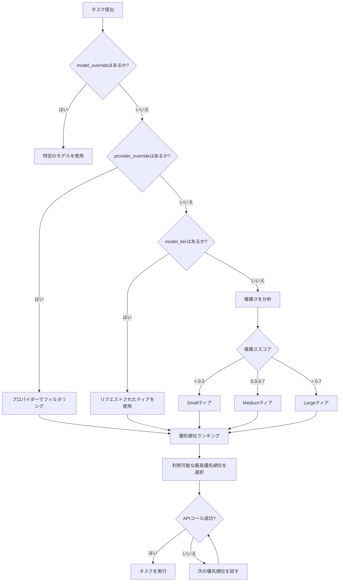

## 概要

Shannonは、以下に基づいて各タスクに最適なLLMモデルを自動的に選択します：
1. **タスクの複雑さ**（分解中に分析）
2. **明示的なティアリクエスト**（`model_tier`パラメータ）
3. **モデル/プロバイダーのオーバーライド**（`model_override`、`provider_override`）
4. **優先順位ランキング**（`config/models.yaml`で定義）
5. **予算制約**およびトークン制限

このガイドでは、モデル選択の仕組みとその制御方法について説明します。

## モデルティア

Shannonはモデルを3つのティアに整理します：

| ティア | 対象使用 | 特徴 | コスト範囲 |
|------|--------------|-----------------|------------|
| **Small** | 50% | 高速、コスト最適化、基本的な推論 | $0.0001-0.0002/1K入力 |
| **Medium** | 40% | バランスの取れた能力/コスト | $0.002-0.006/1K入力 |
| **Large** | 10% | 重い推論、複雑なタスク | $0.02-0.025/1K入力 |

**注意**：パーセンテージは目標分布であり、強制的なクォータではありません。実際の使用はワークロードに依存します。

## 選択フロー



## 優先順位ランキング

各ティア内で、モデルは優先順位によってランク付けされます（数字が小さいほど優先度が高い）。Shannonは、成功するまで優先順位順にモデルを試みます。

**`config/models.yaml`からの例**：
```yaml
model_tiers:
  small:
    providers:
      - provider: openai
        model: gpt-5-nano-2025-08-07
        priority: 1  # 最初に試す
      - provider: anthropic
        model: claude-haiku-4-5-20251001
        priority: 2  # OpenAIが失敗した場合のフォールバック
      - provider: xai
        model: grok-3-mini
        priority: 3  # xAIのデフォルトのSmallティアモデル
      - provider: xai
        model: grok-4-fast-non-reasoning
        priority: 4  # 代替の高速モデル
```

**フォールバック動作**：
- 優先順位1が失敗した場合（レート制限、APIエラー）、Shannonは優先順位2を試みます
- モデルが成功するまで続けるか、すべてのオプションが尽きるまで
- 失敗はオーケストレーターのログに記録されます

## パラメータの優先順位

複数のパラメータがモデル選択を指定する場合、優先順位は次の通りです：

1. **`model_override`**（最高優先度）→ 特定のモデルを強制
2. **`provider_override`** → 1つのプロバイダーのモデルに制限
3. **`model_tier`** → リクエストされたティアを使用
4. **自動検出された複雑さ**（最低優先度）→ デフォルトの動作

### トップレベルとコンテキストパラメータ

トップレベルのパラメータは**常に**コンテキストパラメータを上書きします：

```json
{
  "query": "データを分析",
  "model_tier": "large",           // トップレベル（勝つ）
  "context": {
    "model_tier": "small"           // コンテキスト（無視される）
  }
}
```

## 使用例

### 自動選択（デフォルト）

```bash
curl -X POST http://localhost:8080/api/v1/tasks \
  -H "X-API-Key: sk_test_123456" \
  -d '{"query": "2+2は何ですか?"}'
```

Shannonは複雑さを分析 → Smallティアを選択 → `gpt-5-nano-2025-08-07`を使用（Smallティアの優先順位1）

### 特定のティアを強制

```bash
curl -X POST http://localhost:8080/api/v1/tasks \
  -H "X-API-Key: sk_test_123456" \
  -d '{
    "query": "複雑な分析タスク",
    "model_tier": "large"
  }'
```

Largeティアを使用 → `gpt-5.1-2025-11-01`（Largeティアの優先順位1）

### 特定のモデルにオーバーライド

```bash
curl -X POST http://localhost:8080/api/v1/tasks \
  -H "X-API-Key: sk_test_123456" \
  -d '{
    "query": "分析",
    "model_override": "claude-sonnet-4-5-20250929"
  }'
```

Anthropic Claude Sonnetを強制し、ティア/優先順位を無視します。

### プロバイダーを強制

```bash
curl -X POST http://localhost:8080/api/v1/tasks \
  -H "X-API-Key: sk_test_123456" \
  -d '{
    "query": "分析",
    "model_tier": "medium",
    "provider_override": "anthropic"
  }'
```

Mediumティアを使用 **ただしAnthropicモデルのみ** → `claude-sonnet-4-5-20250929`

### Python SDKの例

```python
from shannon import Shannon

client = Shannon(api_key="sk_test_123456")

# 自動選択
task = client.tasks.submit(query="シンプルなタスク")

# ティアを強制
task = client.tasks.submit(
    query="複雑な分析",
    model_tier="large"
)

# モデルを強制
task = client.tasks.submit(
    query="研究タスク",
    model_override="gpt-5.1-2025-11-01"
)

# プロバイダー + ティアを強制
task = client.tasks.submit(
    query="分析",
    model_tier="medium",
    provider_override="openai"
)
```

## コスト最適化戦略

### 1. 小さく始め、必要に応じてエスカレート

```python
# まずSmallティアを試す
task = client.tasks.submit(query="Q4データを分析", model_tier="small")
status = client.tasks.get(task.task_id)

# 結果が不十分な場合、Largeで再試行
if not_satisfactory(status.result):
    task = client.tasks.submit(query="Q4データを深く分析", model_tier="large")
```

### 2. プロバイダー特有の最適化

```python
# バルクタスクには安価なプロバイダーを使用
for item in bulk_data:
    client.tasks.submit(
        query=f"Summarize {item}",
        model_tier="small",
        provider_override="deepseek"  # OpenAIより安価
    )
```

### 3. セッションベースのエスカレーション

```python
session_id = "analysis-session-123"

# 小さなモデルから開始
client.tasks.submit(
    query="Initial analysis",
    session_id=session_id,
    model_tier="small"
)

# より大きなモデルでフォローアップ（コンテキストを引き継ぐ）
client.tasks.submit(
    query="Deeper insights",
    session_id=session_id,
    model_tier="large"
)
```

## 複雑性分析

Shannonはタスクの複雑性をいくつかの要因を用いて分析します：

- **クエリの長さ**と特異性
- **特定されたサブタスクの数**
- **ツール使用**の要件
- **必要なコンテキストの深さ**
- **推論の強度**（「分析する」、「比較する」、「合成する」などのキーワード）

**複雑性の閾値**（設定可能）：
- `< 0.3` → 小さなティア（簡単なQ&A、基本的なタスク）
- `0.3 - 0.7` → 中程度のティア（複数ステップ、中程度の推論）
- `> 0.7` → 大きなティア（複雑な研究、重い推論）

## 監視とデバッグ

### 使用されたモデルの確認

```bash
TASK_ID="task-abc123"
curl http://localhost:8080/api/v1/tasks/$TASK_ID \
  -H "X-API-Key: sk_test_123456" | jq '{model_used, provider, usage}'
```

レスポンス:
```json
{
  "model_used": "gpt-5-nano-2025-08-07",
  "provider": "openai",
  "usage": {
    "total_tokens": 245,
    "input_tokens": 150,
    "output_tokens": 95,
    "estimated_cost": 0.000053
  }
}
```

### Prometheusメトリクス

```bash
# ティアごとのモデル使用
shannon_llm_requests_total{tier="small"}
shannon_llm_requests_total{tier="medium"}
shannon_llm_requests_total{tier="large"}

# プロバイダーの分布
shannon_llm_requests_total{provider="openai"}
shannon_llm_requests_total{provider="anthropic"}

# ティアのドリフト（要求されたティアが利用できない場合）
shannon_tier_drift_total{requested="large", actual="medium"}
```

### オーケストレーターのログ

```bash
docker compose -f deploy/compose/docker-compose.yml logs orchestrator | grep "Model selected"
```

探すべき内容：
- `"Model selected: gpt-5-nano-2025-08-07 (small tier, priority 1)"`
- `"Falling back to priority 2: claude-haiku-4-5-20251001"`
- `"Falling back to priority 3: grok-3-mini (xAI)"`
- `"Tier override: user requested large → using gpt-5.1-2025-11-01"`

## 設定

モデルのティアと優先順位は `config/models.yaml` に定義されています：

```yaml
model_tiers:
  small:
    providers:
      - provider: openai
        model: gpt-5-nano-2025-08-07
        priority: 1
      - provider: anthropic
        model: claude-haiku-4-5-20251001
        priority: 2

selection_strategy:
  mode: priority  # priority | round-robin | least-cost
  fallback_enabled: true
  max_retries: 3
```

**選択モード**:
- `priority`（デフォルト）：優先順位順にモデルを試す
- `round-robin`：同じ優先順位のモデルに均等に負荷を分配
- `least-cost`：ティア内で常に最も安価なモデルを選択

## トラブルシューティング

### 問題: 誤ったティアが選択された

**症状**: 中程度のティアが使用されているが、小さなティアを期待していた

**解決策**:
1. リクエストで `model_tier: "small"` を明示的に設定
2. オーケストレーターのログで複雑性スコアを確認
3. クエリが複雑性のヒューリスティックを引き起こしていないか確認（「深く分析する」などの言葉を避ける）

### 問題: 特定のモデルが使用されない

**症状**: `model_override: "gpt-5.1-2025-11-01"` をリクエストしたが、異なるモデルが返される

**解決策**:
1. モデルが `config/models.yaml` の `model_catalog` にあることを確認
2. プロバイダーのAPIキーが `.env` に設定されているか確認（例: `OPENAI_API_KEY`, `XAI_API_KEY`）
3. モデルIDが標準名を使用しているか確認（エイリアスではなく）
4. フォールバックメッセージのためにオーケストレーターのログを確認
5. モデルがAPIプランで利用可能であることを確認（例: GPT-5.1は適切なティアが必要）

### 問題: 高コスト

**症状**: 予想以上のコスト

**解決策**:
1. Prometheusを通じて実際のティア分布を確認
2. リクエストに明示的に `model_tier: "small"` を追加
3. 不要なエスカレーションのために `shannon_tier_drift_total` をレビュー
4. 予算を強制するために `.env` に `MAX_COST_PER_REQUEST` を設定

### 問題: レート制限

**症状**: 頻繁に429エラー、遅いフォールバックカスケード

**解決策**:
1. ティア優先リストにプロバイダーを追加
2. 負荷を分散するために `round-robin` モードを有効にする
3. 影響を受けるプロバイダーの `RATE_LIMIT_WINDOW` を増加
4. フォールバックとして安価なプロバイダー（DeepSeek、Groq）を検討

## ベストプラクティス

1. **自動選択をデフォルトに**: Shannonの複雑性分析を活用
2. **オーバーライドは控えめに**: 必要な場合のみ `model_override` を使用
3. **小さく始める**: コストに敏感なワークロードには `model_tier: "small"` を設定
4. **分布を監視**: メトリクスを通じてティア使用を追跡
5. **フォールバックを設定**: 各ティアに3つ以上のプロバイダーを確保
6. **優先順位の順序をテスト**: お気に入りのモデルが優先順位1であることを確認
7. **予算の強制**: 安全のために `MAX_COST_PER_REQUEST` を設定

## 関連ドキュメント

<CardGroup cols={2}>
  <Card title="Models API" icon="list" href="/en/api/models/overview">
    利用可能なモデルと価格の一覧
  </Card>
  <Card title="Submit Task" icon="paper-plane" href="/en/api/rest/submit-task">
    モデルパラメータを使用したタスクの提出
  </Card>
  <Card title="Configuration" icon="gear" href="/en/quickstart/configuration">
    環境変数とYAML設定
  </Card>
  <Card title="Cost Tracking" icon="dollar-sign" href="/en/api/rest/get-status">
    モデルの使用状況とコストを表示
  </Card>
</CardGroup>
