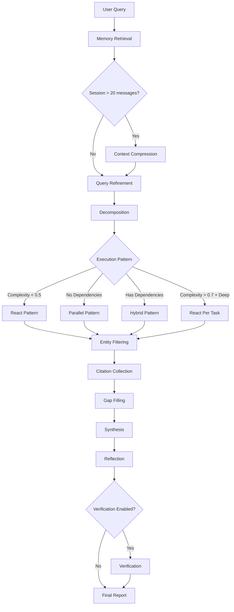

# Deep Research Agent

このチュートリアルでは、Shannonの**ResearchWorkflow**を使用して、包括的で引用に基づいた研究レポートを作成する方法を示します。

## 学べること

- **マルチステージワークフロー**: メモリ取得 → 精練 → 分解 → 実行 → 引用 → ギャップ埋め → 合成 → 検証
- **適応パターン**: 複雑さに基づくReact、Parallel、Hybrid実行
- **高度な機能**: エンティティフィルタリング、ギャップ埋め、コンテキスト圧縮、タスクごとの反応モード
- **品質管理**: 引用要件、カバレッジ強制、主張検証
- **言語マッチング**: ユーザーのクエリ言語で自動応答

## 前提条件

- Shannonスタックが稼働中（Docker Compose）
- `http://localhost:8080`でゲートウェイにアクセス可能
- 認証のデフォルト:
  - Docker Compose: 認証はデフォルトで無効（`GATEWAY_SKIP_AUTH=1`）。
  - ローカルビルド: 認証はデフォルトで有効。認証を無効にするには`GATEWAY_SKIP_AUTH=1`を設定するか、APIキーヘッダー`-H "X-API-Key: $API_KEY"`を含めます。

## ワークフローアーキテクチャ

ResearchWorkflowは、複数のステージを組み合わせて高品質で引用された研究を生成します。



**主な機能:**
- **メモリ対応**: 会話履歴を使用して文脈に基づいた研究を行う
- **エンティティ重視**: エンティティが検出された場合に結果をフィルタリング（例: 特定の企業/製品）
- **自己修正**: ギャップ埋めにより包括的なカバレッジを確保
- **品質強制**: エリアごとのカバレッジ検証（≥600文字、セクションごとに≥2引用）

## クイックスタート (HTTP)

```bash
# 研究タスクを提出（デフォルトの“standard”戦略）
curl -X POST http://localhost:8080/api/v1/tasks \
  -H "Content-Type: application/json" \
  -d '{
    "query": "Latest breakthroughs in quantum error correction",
    "context": { "force_research": true }
  }'

# 使用可能なSSEストリームURLを取得して提出（推奨）
# ヒント: force_researchを含めてResearchWorkflowにルーティング（さもなければルーターがSupervisorを選択する可能性あり）
curl -s -X POST http://localhost:8080/api/v1/tasks/stream \
  -H "Content-Type: application/json" \
  -d '{
        "query": "What are the main transformer architecture trends in 2025?",
        "context": { "force_research": true }
      }' | jq
```

### ストリームイベント (SSE)

```bash
# /tasks/stream呼び出しの後、レスポンスから"stream_url"を使用:
curl -N "http://localhost:8080/api/v1/stream/sse?workflow_id=task-..."
```

監視する項目:
- `LLM_OUTPUT`: 最終合成テキスト
- `DATA_PROCESSING`: 進捗/使用状況
- `WORKFLOW_COMPLETED`: 完了

## 実行パターン

Shannonは、タスクの複雑さと依存関係に基づいて最適な実行パターンを選択します。

### React Pattern (複雑さ < 0.5)
シンプルな研究のための反復的な理由→行動→観察ループ。

```bash
# 例: 基本的な概念クエリがReactをトリガー
curl -X POST http://localhost:8080/api/v1/tasks \
  -H "Content-Type: application/json" \
  -d '{
    "query": "What is quantum computing?",
    "context": { "force_research": true }
  }'
```

**動作**: 単一のエージェントが反復的な推論、ウェブ検索、観察サイクルを実行（デフォルトで5回の反復）。

---

### Parallel Pattern (依存関係なし)
多面的な研究のための同時サブタスク実行。

```bash
# 例: 複数の側面比較がParallelをトリガー
curl -X POST http://localhost:8080/api/v1/tasks \
  -H "Content-Type: application/json" \
  -d '{
    "query": "Compare LangChain and AutoGen frameworks: architecture, pricing, community, performance",
    "context": { "force_research": true }
  }'
```

**動作**: 分解により独立したサブタスクが作成され（例: "Analyze LangChain architecture", "Analyze AutoGen pricing"）、引用のためにウェブ検索が同時に実行される。

---

### Hybrid Pattern (依存関係あり)
トポロジカルソート + ファンイン/ファンアウトによる依存関係のある逐次研究。

```bash
# 例: 論理的依存関係のあるクエリがHybridをトリガー
curl -X POST http://localhost:8080/api/v1/tasks \
  -H "Content-Type: application/json" \
  -d '{
    "query": "Analyze company X market strategy, then evaluate competitive response, then forecast next moves",
    "context": { "force_research": true }
  }'
```

**動作**: 依存関係の順序でサブタスクを実行し、前の結果を下流に渡す。

---

### React Per Task (深い研究モード)
高複雑度の研究のためのサブタスクごとのミニReActループ。

**トリガー条件:**
1. 手動: `context.react_per_task = true`
2. 自動有効化: 複雑さ > 0.7 AND 戦略が`{deep, academic}`に含まれる

```bash
# 例: エリアごとの反復研究のためにreact_per_taskを有効化
curl -X POST http://localhost:8080/api/v1/tasks \
  -H "Content-Type: application/json" \
  -d '{
    "query": "Comprehensive analysis of transformer architecture evolution 2017-2025",
    "context": {
      "force_research": true,
      "react_per_task": true,
      "react_max_iterations": 6
    },
    "research_strategy": "deep"
  }'
```

**動作**: 各並列サブタスクが独自のReActループ（理由→行動→観察）を実行し、研究エリアごとの反復的な探索を可能にします。より徹底的ですが、トークンコストは高くなります。

---

## ストラテジープリセット

プリセットは、異なる研究の深さに対する意見を反映したデフォルト設定を提供します。Gatewayはこれを検証し、ワークフローコンテキストにマッピングします。

```bash
# クイックストラテジー（最小限の反復）
curl -X POST http://localhost:8080/api/v1/tasks \
  -H "Content-Type: application/json" \
  -d '{
    "query": "量子誤り訂正とは何ですか？",
    "context": { "force_research": true },
    "research_strategy": "quick"
  }'

# オーバーライド付きのディープストラテジー
curl -X POST http://localhost:8080/api/v1/tasks \
  -H "Content-Type: application/json" \
  -d '{
    "query": "LangChainとAutoGenフレームワークの比較",
    "context": {
      "force_research": true,
      "react_per_task": true,
      "react_max_iterations": 6
    },
    "research_strategy": "deep",
    "enable_verification": true
  }'

# アカデミックストラテジー（複雑さが0.7を超えると自動的にreact_per_taskを有効化）
curl -X POST http://localhost:8080/api/v1/tasks \
  -H "Content-Type: application/json" \
  -d '{
    "query": "現代NLPアーキテクチャにおける注意メカニズムの調査",
    "context": { "force_research": true },
    "research_strategy": "academic"
  }'
```

**クイックストラテジーの動作**: 軽量な `quick_research_agent` プロンプトを使用し、常に並列実行パスを取り、反復カバレッジループとギャップフィリングステージをスキップします。これは深さを必要としない高速なサマリーに最適化されています。

**利用可能なプリセット**: `quick` | `standard` | `deep` | `academic`

| ストラテジー | react_max_iterations | max_concurrent_agents | verification | gap_filling |
|--------------|---------------------|----------------------|--------------|-------------|
| quick        | 2                   | 3                    | ✗            | ✗           |
| standard     | 3                   | 5                    | ✓            | ✓ (max_gaps: 3, max_iterations: 2) |
| deep         | 4                   | 6                    | ✓            | ✓ (max_gaps: 2, max_iterations: 2) |
| academic     | 5                   | 8                    | ✓            | ✓ (max_gaps: 3, max_iterations: 2) |

**コアパラメータ**:
- `max_concurrent_agents` (1–20): 並列サブタスクの最大同時実行数を制御します（複数のサブタスクが実行される場合のみ適用）。
- `react_max_iterations` (2–8, デフォルト5): タスクごとのReActループの深さを制御します（独立したパラメータで、前提条件はありません）。

**高度なフラグ**:
- `react_per_task` (bool): サブタスクごとにミニReActループを有効化します（複雑さが0.7を超える場合は自動的に有効化）。
- `enable_verification` (bool): 引用に対する主張の検証を有効化します。
- `budget_agent_max` (int): エージェントごとのトークン予算（強制適用）をオプションで設定します。

**ギャップフィリング設定**:
- `gap_filling_enabled` (bool): ギャップフィリングを有効/無効にします。
- `gap_filling_max_gaps` (1–20): 検出するギャップの最大数。
- `gap_filling_max_iterations` (1–5): ギャップごとの最大再試行回数。
- `gap_filling_check_citations` (bool): ギャップの指標として引用密度をチェックします。

<Note>
**デフォルトプリセット**: `standard`（指定がない場合）。プリセットは、コンテキストに既に設定されていない場合にのみフラグを設定します。Gatewayは、`/api/v1/tasks`および`/api/v1/tasks/stream`の両方でトップレベルの`research_strategy`を受け入れ、コンテキストにマッピングします。プリセットのデフォルトは`config/research_strategies.yaml`から読み込まれます。クイックストラテジーは反復カバレッジループとギャップフィリングステージをスキップします。
</Note>

## Python SDK

### CLI

```bash
python -m shannon.cli --base-url http://localhost:8080 \
  submit "最新の量子コンピューティングのブレークスルー" \
  --force-research \
  --research-strategy deep --enable-verification
```

### プログラムによる利用

```python
from shannon import ShannonClient

client = ShannonClient(base_url="http://localhost:8080")
handle = client.submit_task(
    "LangChainとAutoGenフレームワークの比較",
    context={
        "force_research": True,
        "research_strategy": "deep",
        "react_max_iterations": 6,
        "enable_verification": True,
    },
)
final = client.wait(handle.task_id)
print(final.result)
client.close()
```

## レスポンスフォーマット

`GET /api/v1/tasks/{id}`によって返される典型的なステータスペイロードには、合成された結果、メタデータ（引用、検証）、モデル/プロバイダー、およびタイムスタンプが含まれます。

```json
{
  "task_id": "task-00000000-0000-0000-0000-000000000000",
  "status": "TASK_STATUS_COMPLETED",
  "result": "... 最終合成テキスト ...",
  "metadata": {
    "citations": [
      {
        "url": "https://example.com/article",
        "title": "ソースタイトル",
        "source": "example.com",
        "quality_score": 0.92,
        "credibility_score": 0.85
      }
    ],
    "verification": {
      "total_claims": 10,
      "overall_confidence": 0.78,
      "supported_claims": 7,
      "unsupported_claims": [
        "十分な証拠がない主張テキスト ..."
      ],
      "claim_details": [
        {
          "claim": "具体的な主張テキスト ...",
          "confidence": 0.81,
          "supporting_citations": [1, 3],
          "conflicting_citations": []
        }
      ]
    }
  },
  "created_at": "2025-11-07T12:00:00Z",
  "updated_at": "2025-11-07T12:02:00Z",
  "usage": {
    "input_tokens": 1234,
    "output_tokens": 5678,
    "total_tokens": 6912,
    "estimated_cost": 0.0234
  },
  "model_used": "gpt-5-mini-2025-08-07",
  "provider": "openai"
}
```

注意:
- `result`は最終的に合成されたMarkdown/テキストです。
- `metadata.citations`は収集されたソースをリストします（すべてが結果のソースセクションに含まれます）。
- `metadata.verification`は、検証が有効化され、完了した場合に表示されます。
- Gatewayのステータスレスポンスでは、`created_at` / `updated_at`はレスポンスタイムを反映します。権威ある実行時間と合計はデータベースに保存されます（events/timeline）。
- `usage`はトークン使用量を要約し、コストを含む場合があります。Gatewayのステータスは`estimated_cost`を公開する場合があり、ワークフローメタデータには`cost_usd`が含まれることがあります。
- `model_used`と`provider`は、合成中に選択されたモデル/プロバイダーを反映します。

## 高度な機能

### メモリ取得

**階層メモリ**（優先度）:

- 最近のメッセージ（最後の5件）+ セマンティック（関連性の高い5件、類似度 ≥ 0.75）を組み合わせ
- 会話の文脈を持つ一貫したマルチターンのリサーチを可能に
- フォールバック: セッションメモリ（最後の20件のメッセージ）

**コンテキスト圧縮**:

- メッセージ数が20を超えるセッションで自動トリガー
- LLMが会話を要約（目標: ウィンドウの37.5%）
- 長い会話でのコンテキストウィンドウのオーバーフローを防止

---

### エンティティフィルタリング

特定のエンティティが検出された場合（例: 会社「Acme Analytics」）:

**クエリの洗練**:

- 標準名、正確な検索クエリ、公式ドメイン、曖昧さ解消用語を検出
- 例: `canonical_name: "Acme Analytics"`, `official_domains: ["acme.com"]`

**引用フィルタリング**:

- スコアリング: ドメイン一致 +0.6、URL内のエイリアス +0.4、テキスト一致 +0.4
- 閾値: 0.3（任意の単一一致で通過）
- 安全フロア: minKeep=8（品質 × 信頼性でバックフィル）
- 公式ドメインは常に保持（閾値をバイパス）

**結果のプルーニング**:

- エンティティ外のツール結果をフィルタリング（例: 「Acme Mind」を検索する際に「Mind Inc」を削除）
- 理由付けのみの出力を保持し、エンティティ外のツール駆動の結果をプルーニング

---

### ギャップ埋め

**自動検出**（最大2回の反復）:

- 欠落しているセクション見出し（`### エリア名`）
- ギャップ指標フレーズ（「限られた情報」、「不十分なデータ」）
- 引用密度が低い（セクションあたりのインライン引用が2未満）

**解決策**:

1. ターゲットクエリを構築: `"Find detailed information about: <area>"`
2. 集中したReActループを実行（ギャップごとに最大3回の反復）
3. 引用を再収集（元の引用とのグローバルな重複排除）
4. 大規模なティアを使用して結合証拠で再合成

<Accordion title="ギャップシナリオの例">
```text
クエリ: "Analyze company X market strategy, competitive landscape, and leadership"

初期合成カバレッジ:
- 市場戦略: ✓ 800文字、3引用
- 競争環境: ✓ 650文字、2引用
- リーダーシップ: ✗ 200文字、0引用  ← ギャップ検出

ギャップ埋めトリガー:
1. ターゲットクエリ: "Find detailed information about: company X leadership"
2. ReActループが集中検索を実行
3. 結合証拠で再合成
```
</Accordion>

### 引用

**収集**:

- `web_search`および`web_fetch`ツールの出力から抽出
- URL/DOIの正規化と重複排除
- スコアリング: 品質（新しさ + 完全性）× 信頼性（ドメインの評判）
- 多様性の強制（ドメインごとに最大3）

**強制**:

- レポートごとに最低6つのインライン引用（利用可能なもので制限、フロア3）
- エリアごとの要件: セクションあたり≥2のインライン引用
- ソースセクションには収集したすべての引用がリストされる:
  - "Used inline"（テキスト内で引用）
  - "Additional source"（収集されたが引用されていない）

---

### 合成の継続

**トリガー**: モデルが不完全な出力で早期に停止

**検出**（`looksComplete`検証）:

1. 文の句読点（`.`、`!`、`?`、`。`）で終わる必要がある
2. ぶら下がった接続詞がない（`and, but, however, therefore...`）
3. すべての研究エリアに≥600文字および≥2引用のサブセクションがある

**継続**:

- 適応マージン: min(25% of effective_max_completion, 300 tokens)
- プロンプト: "Continue from last sentence; maintain headings and citation style"
- 品質のために大規模なティアを使用（gpt-4.1/opus）

---

### 検証

**主張抽出**:

- 合成から事実の主張を特定
- 収集した引用と照合

**信頼度スコアリング**:

- 引用の信頼性によって重み付け
- 矛盾や裏付けのない主張にフラグを付ける
- 主張ごとの詳細: 補強/矛盾する引用

**出力例**:

```json
{
  "verification": {
    "total_claims": 10,
    "overall_confidence": 0.78,
    "supported_claims": 7,
    "unsupported_claims": ["Claim lacking evidence..."],
    "claim_details": [
      {
        "claim": "Transformer architecture introduced in 2017",
        "confidence": 0.95,
        "supporting_citations": [1, 3],
        "conflicting_citations": []
      }
    ]
  }
}
```

**有効化**: コンテキスト内で`enable_verification: true`を設定。

---

### 言語マッチング

- ユーザーのクエリ言語を検出（ヒューリスティック）
- 合成は同じ言語で応答
- 英語、中国語、日本語、韓国語、アラビア語、ロシア語、スペイン語、フランス語、ドイツ語をサポート（ヒューリスティックベース）
- 一般的な指示は言語を超えた堅牢性を確保

## 行動保証

<CardGroup cols={2}>
  <Card title="メモリ" icon="database">
    利用可能な場合、階層メモリ（最近 + セマンティック）が注入される
  </Card>
  <Card title="圧縮" icon="compress">
    コンテキストのオーバーフローを防ぐために20メッセージを超えるセッションで自動的に行われる
  </Card>
  <Card title="カバレッジ" icon="check-circle">
    各研究エリアには最低600文字および2引用の専用サブセクションがある
  </Card>
  <Card title="ギャップ埋め" icon="search">
    自動で未カバーのエリアを検出し再検索（最大2回の反復）
  </Card>
  <Card title="言語" icon="globe">
    応答はユーザーのクエリ言語に一致する
  </Card>
  <Card title="コスト" icon="dollar-sign">
    トークン使用量とコストは集約され、保持される; 設定された場合、エージェントごとの予算が強制される
  </Card>
  <Card title="継続" icon="refresh-cw">
    合成が不完全で容量がほぼ尽きたときのみトリガーされる
  </Card>
  <Card title="エンティティフォーカス" icon="filter">
    エンティティが検出された場合、引用をフィルタリングし、エンティティ外の結果をプルーニングする
  </Card>
</CardGroup>

## ヒントとベストプラクティス

<Tabs>
  <Tab title="はじめに">

  - `context.force_research=true`を設定してResearchWorkflowへのルーティングを確実にする
  - `standard`プリセットから始め、結果に基づいて調整する
  - 進捗とトークン使用量をSSEで監視する

  </Tab>
  <Tab title="最適化">

  - 簡単なクエリには`quick`プリセットを使用（トークンを節約）
  - 包括的な研究には`deep`または`academic`を使用（高い複雑さでreact_per_taskが自動的に有効）
  - エージェントごとのトークン制限を強制するために`budget_agent_max`を設定
  - エリアごとの反復探索のために`react_per_task`を手動で有効にする

  </Tab>
  <Tab title="マルチターン研究">

  - メモリ取得を有効にするためにセッションを使用
  - 長い会話の場合、コンテキスト圧縮が自動的に有効化
  - フォローアップクエリは階層的メモリ（最近のもの + セマンティック）から恩恵を受ける

  </Tab>
</Tabs>

## トラブルシューティング

<Warning>
**一般的な問題**:
- **言語が英語にデフォルト**: クエリが明確にターゲット言語を使用していることを確認
- **引用が欠落**: `web_search`ツールが利用可能か確認; 研究ワークフローは自動的に`web_search`を注入
- **カバレッジが不完全**: ギャップフィリングは自動的にトリガーされるはず; `gap_filling_v1`が有効であることを確認
- **トークン使用量が高い**: `budget_agent_max`を有効にするか`quick`プリセットを使用; `react_per_task`を無効にする
</Warning>

**検証**:

- 無効な`web_search` `search_type`: サニタイズ（`auto`にフォールバック）
- 重複引用: URL/DOIの正規化によって処理
- エンティティ検出: クエリに存在する場合、リファインメント中に実施

**バージョンゲート**（内部機能フラグ）:

- メモリ取得: `memory_retrieval_v1`
- セッションメモリフォールバック: `session_memory_v1`
- コンテキスト圧縮: `context_compress_v1`
- ギャップフィリング: `gap_filling_v1`

## 次のステップ

<CardGroup cols={3}>
  <Card title="APIリファレンス" icon="book" href="/api/rest/tasks">
    REST APIドキュメント
  </Card>
  <Card title="カスタムツール" icon="wrench" href="/tutorials/custom-tools">
    カスタムツールの追加
  </Card>
  <Card title="ベンダーアダプター" icon="plug" href="/tutorials/vendor-adapters">
    ベンダー特有の統合
  </Card>
</CardGroup>

**関連リソース**:
- GitHub: https://github.com/Kocoro-lab/Shannon
- 会社: https://kocoro.ai
